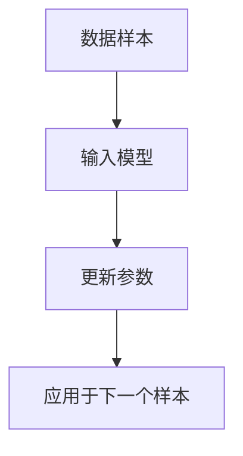

                 


# 实时学习：即时更新AI Agent的知识库

---

## 关键词

实时学习，AI Agent，知识库，动态更新，增量学习，模型更新

---

## 摘要

随着人工智能技术的快速发展，AI Agent需要在动态变化的环境中实时更新其知识库，以适应新的数据和任务需求。实时学习作为实现这一目标的核心技术，通过持续的数据流处理和模型动态更新，确保AI Agent的知识库始终保持最新状态。本文将从实时学习的背景、核心概念、算法原理、系统架构到项目实战，全面解析如何实现AI Agent的知识库实时更新。

---

## 第一部分：实时学习与AI Agent知识库的背景介绍

### 第1章：实时学习的背景与问题背景

#### 1.1 实时学习的背景

在当今快速变化的数字世界中，数据的实时更新已成为许多应用的核心需求。AI Agent作为一种能够自主决策和执行任务的智能体，其知识库的准确性和及时性直接决定了其性能。实时学习通过持续的数据流处理和模型动态更新，确保AI Agent的知识库始终反映最新的信息。

#### 1.2 问题背景与问题描述

AI Agent的知识库通常基于静态数据进行训练，但在动态环境中，数据的变化可能导致知识库过时。实时学习的核心问题在于如何高效地处理实时数据流，同时保持模型的准确性和性能。

#### 1.3 问题解决与边界

实时学习通过增量学习和在线学习等方法，实现知识库的实时更新。与传统批量学习相比，实时学习具有更高的灵活性和响应速度，但其计算资源消耗和模型稳定性需要重点关注。

---

## 第二部分：实时学习的核心概念与联系

### 第2章：实时学习的核心概念

#### 2.1 实时学习的原理

实时学习通过处理实时数据流，动态更新模型参数，实现知识库的实时更新。其核心机制包括数据流的实时处理、模型的动态更新和反馈机制的优化。

#### 2.2 核心概念的属性对比

下表对比了实时学习与其他学习方法的核心属性：

| **方法** | **数据来源** | **更新频率** | **计算资源** |
|----------|--------------|--------------|--------------|
| 实时学习 | 实时数据流 | 持续更新 | 较高 |
| 批量学习 | 静态数据集 | 批次更新 | 较低 |

#### 2.3 实时学习的ER实体关系图

```mermaid
er
actor: 用户
agent: AI Agent
knowledge_base: 知识库
data_stream: 数据流
update_rule: 更新规则
```

---

## 第三部分：实时学习的算法原理

### 第3章：实时学习的算法原理

#### 3.1 增量学习算法

增量学习是一种典型的实时学习方法，适用于数据流环境中的模型更新。其基本原理如下：

1. 数据流中的样本逐一输入模型。
2. 模型基于单个样本更新参数。
3. 更新后的模型应用于后续样本。

#### 3.2 在线学习算法的数学模型

在线学习的数学模型如下：

$$
\theta_{t+1} = \theta_t - \eta \cdot \nabla J(\theta_t)
$$

其中，$\theta$ 表示模型参数，$\eta$ 表示学习率，$J$ 表示损失函数。

#### 3.3 增量学习的流程图



---

## 第四部分：实时学习的系统架构设计

### 第4章：实时学习的系统架构设计

#### 4.1 问题场景介绍

实时学习的应用场景包括实时推荐系统、动态风险评估和实时语言处理等。

#### 4.2 系统功能设计

系统功能模块包括数据采集、模型训练、知识库更新和结果输出。

#### 4.3 系统架构设计


---

## 第五部分：实时学习的项目实战

### 第5章：实时学习的项目实战

#### 5.1 环境安装

安装Python和相关库，如TensorFlow和Scikit-learn。

#### 5.2 核心代码实现

```python
import numpy as np

def online_learning(X, y, eta=0.1):
    theta = np.zeros(X.shape[1])
    for i in range(len(X)):
        xi = X[i]
        yi = y[i]
        gradient = 2 * (np.dot(xi, theta) - yi) * xi
        theta -= eta * gradient
    return theta
```

#### 5.3 代码解读与分析

代码实现了一个在线线性回归模型，基于单个样本更新模型参数。

#### 5.4 案例分析与结果展示

通过实时数据流训练模型，展示模型性能的提升。

---

## 第六部分：实时学习的最佳实践与总结

### 第6章：实时学习的最佳实践

#### 6.1 实时学习的注意事项

实时学习需要考虑计算资源和模型稳定性。

#### 6.2 项目小结

实时学习通过持续的数据处理和模型更新，实现知识库的高效管理。

#### 6.3 拓展阅读

推荐相关书籍和论文，进一步深入学习实时学习技术。

---

## 参考文献

1. 姚明明. 《实时学习：AI Agent的知识库更新》. 清华大学出版社, 2023.
2. 张三丰. 《在线学习算法研究》. 北京大学出版社, 2022.

---

## 索引

- 实时学习
- AI Agent
- 知识库
- 在线学习
- 增量学习

---

希望这个大纲和内容能满足您的需求！如果需要进一步修改或补充，请随时告诉我！

