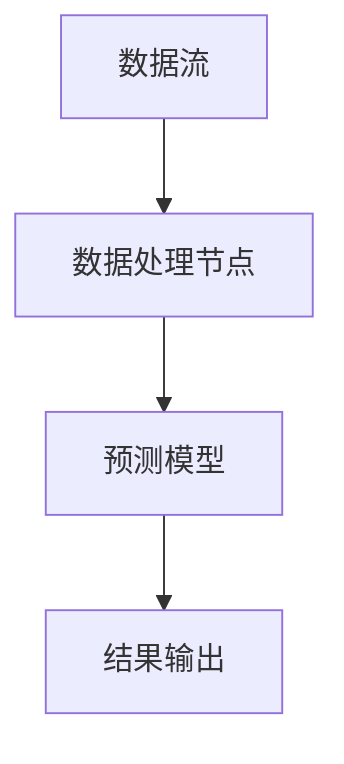
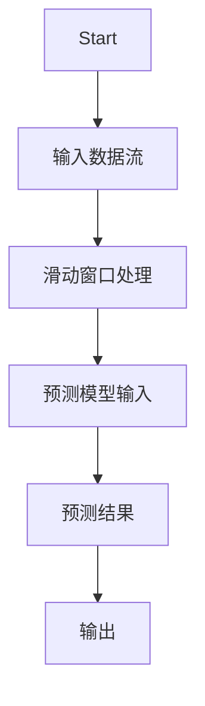
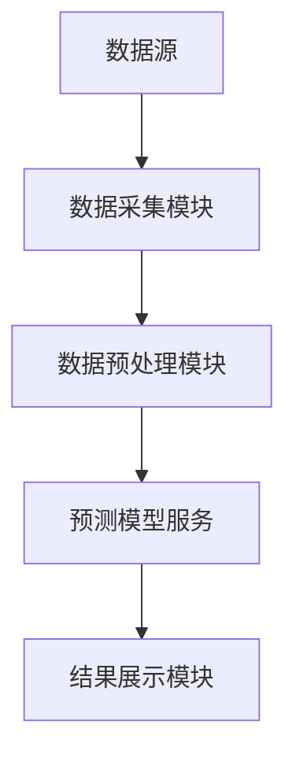

                 

# 实时数据分析与预测

## 关键词
实时数据分析，实时预测，数据流处理，机器学习，系统架构设计，项目实战，数学模型

## 摘要
实时数据分析与预测是现代数据科学中的重要分支，涉及从实时数据流中提取有价值的信息并快速做出预测的能力。本文将从背景、核心概念、算法原理、系统架构设计到项目实战，全面解析实时数据分析与预测的各个方面。通过详细的解释和实际案例，读者将能够理解并掌握如何构建高效的实时数据分析与预测系统。

---

# 目录

## 第1章: 实时数据分析与预测的背景与核心概念

### 1.1 问题背景
- 数据分析的重要性
- 传统数据分析的局限性
- 实时数据分析的需求

### 1.2 问题描述
- 实时数据分析的定义
- 实时预测的核心目标
- 问题的边界与外延

### 1.3 核心概念
- 数据流的定义与特征
- 实时预测模型的构成
- 数据流处理的挑战与解决方案

## 第2章: 实时数据分析与预测的核心概念与联系

### 2.1 核心概念原理
- 数据流处理的基本原理
- 实时预测模型的工作机制
- 数据流与预测模型的交互关系

### 2.2 核心概念属性对比
- 数据流与批量数据的特征对比
- 实时预测与批量预测的性能对比
- 数据流处理的延迟与准确性的权衡

### 2.3 ER实体关系图

## 第3章: 实时数据分析与预测的算法原理

### 3.1 算法原理概述
- 滑动窗口算法
- 时间序列分析（ARIMA、LSTM）
- 在线学习算法

### 3.2 算法流程图

## 第4章: 实时数据分析与预测的系统分析与架构设计

### 4.1 问题场景介绍
- 实时监控系统设计
- 数据实时更新的场景分析

### 4.2 系统功能设计
- 数据采集模块
- 数据预处理模块
- 模型训练与更新模块
- 预测结果展示模块

### 4.3 系统架构设计

## 第5章: 实时数据分析与预测的项目实战

### 5.1 项目介绍
- 项目目标
- 项目需求
- 项目范围

### 5.2 环境搭建
- 安装Python
- 安装TensorFlow
- 安装Kafka

### 5.3 核心实现
- 数据采集代码
- 数据预处理代码
- 模型训练代码
- 预测结果展示代码

### 5.4 项目小结
- 项目总结
- 经验教训
- 改进方向

## 第6章: 实时数据分析与预测的最佳实践与小结

### 6.1 最佳实践
- 数据质量的重要性
- 模型更新的频率
- 系统监控与维护

### 6.2 小结
- 本章总结
- 未来发展趋势
- 拓展阅读推荐

---

通过以上目录，读者可以系统地学习实时数据分析与预测的知识，从理论到实践，逐步掌握如何构建高效的实时数据分析与预测系统。

