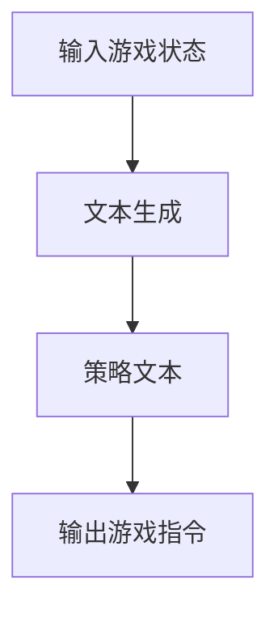
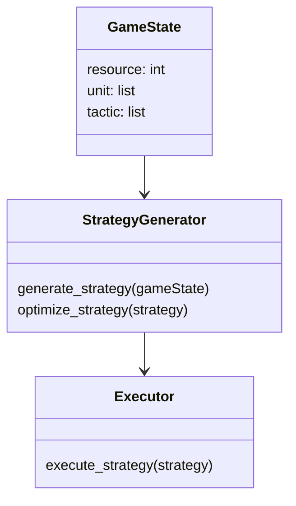
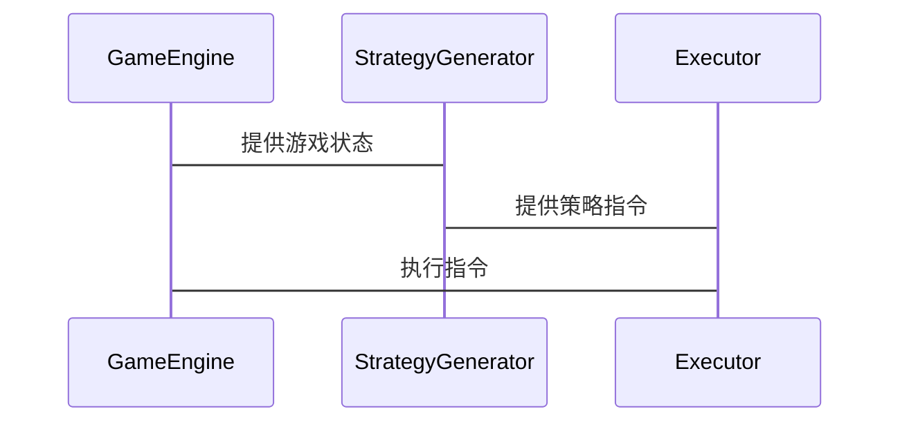

                 


# 实时策略AI Agent：LLM在游戏AI中的应用

---

## 关键词：
- 实时策略游戏
- AI Agent
- 大语言模型
- 游戏AI
- 人工智能
- 机器学习

---

## 摘要：
本文深入探讨了实时策略AI Agent在游戏AI中的应用，重点分析了基于大语言模型（LLM）的实时策略AI Agent的设计与实现。文章从实时策略游戏的发展背景入手，详细介绍了AI Agent的核心概念、技术基础、关键算法、系统架构，并通过项目实战展示了如何利用LLM构建实时策略AI Agent。最后，文章总结了实时策略AI Agent的优势与挑战，并展望了未来的发展方向。

---

# 第1章: 实时策略游戏与AI概述

## 1.1 实时策略游戏的发展历程

### 1.1.1 实时策略游戏的定义与特点
实时策略游戏（Real-Time Strategy, RTS）是一种以实时操作为基础的策略类游戏，玩家需要在有限的时间内做出决策，控制资源、单位和战略点，最终达成游戏目标。其特点包括：
- **实时性**：游戏状态不断变化，玩家需要快速反应。
- **策略性**：决策需要考虑全局，涉及资源管理、战术规划和团队协作。
- **复杂性**：游戏环境和规则复杂，AI实现难度高。

### 1.1.2 实时策略游戏的经典案例分析
- **《命令与征服》系列**：奠定了RTS游戏的基础，强调资源采集和单位控制。
- **《帝国时代》系列**：结合历史背景，注重资源管理和军事策略。
- **《英雄联盟》（LoL）**：MOBA类RTS游戏，强调英雄培养和团队协作。
- **《星际争霸》系列**：被誉为RTS游戏的鼻祖，强调种族差异和战术深度。

### 1.1.3 游戏AI在实时策略中的作用
游戏AI是实时策略游戏中不可或缺的一部分，负责实现以下功能：
- **对手AI**：模拟玩家行为，提供挑战。
- **NPC控制**：管理游戏中的非玩家角色。
- **游戏平衡**：通过AI调整游戏难度和规则。

---

## 1.2 AI在游戏中的应用背景

### 1.2.1 游戏AI的基本概念与分类
- **游戏AI**：模拟人类玩家行为的计算机程序，分为简单脚本AI和复杂算法AI。
- **简单AI**：基于规则的脚本，如巡逻、攻击逻辑。
- **复杂AI**：基于机器学习的算法，如深度学习、强化学习。

### 1.2.2 大语言模型（LLM）的崛起与应用
- **LLM**：基于Transformer架构的大规模语言模型，具有强大的文本生成和理解能力。
- **LLM在游戏中的应用**：对话生成、任务描述、策略规划。

### 1.2.3 实时策略AI Agent的定义与目标
- **实时策略AI Agent**：能够在实时策略游戏中做出决策的智能体，基于LLM实现。
- **目标**：通过分析游戏状态，生成策略指令，控制游戏单位或资源。

---

# 第2章: 实时策略AI Agent的核心概念

## 2.1 实时策略AI Agent的功能模块

### 2.1.1 状态感知模块
- **输入**：游戏画面、单位状态、资源数据。
- **输出**：当前游戏状态的语义表示。

### 2.1.2 战术决策模块
- **输入**：游戏状态、任务目标。
- **输出**：策略指令，如“攻击敌方资源点”、“采集资源”。

### 2.1.3 行为执行模块
- **输入**：策略指令。
- **输出**：游戏单位的行动，如移动、攻击。

## 2.2 LLM在实时策略AI Agent中的应用

### 2.2.1 LLM的基本原理与特点
- **基于Transformer的模型**：自注意力机制，能够处理长序列。
- **大规模训练**：利用大量文本数据，学习语言模式。
- **生成式AI**：能够根据输入生成文本，适用于策略规划。

### 2.2.2 LLM在实时策略中的优势
- **语义理解**：能够理解复杂的游戏场景描述。
- **策略生成**：能够生成多样化的策略指令。
- **灵活性**：适用于多种游戏类型和规则。

### 2.2.3 LLM与传统游戏AI的区别
| 特性 | LLM | 传统AI |
|------|------|--------|
| 决策方式 | 基于文本生成 | 基于规则或脚本 |
| 灵活性 | 高 | 低 |
| 复杂性 | 高 | 中 |

---

# 第3章: 实时策略AI Agent的技术基础

## 3.1 大语言模型（LLM）的工作原理

### 3.1.1 LLM的模型结构与训练过程
- **模型结构**：Transformer编码器-解码器架构。
- **训练过程**：
  1. **预处理**：将文本数据转化为Token序列。
  2. **编码器**：生成上下文表示。
  3. **解码器**：根据编码器输出生成目标文本。

### 3.1.2 LLM的推理机制与输出方式
- **推理机制**：基于生成概率，选择最可能的Token。
- **输出方式**：全概率分布输出或基于温度的采样。

## 3.2 自然语言处理（NLP）基础

### 3.2.1 词向量与语义理解
- **词向量**：通过Word2Vec等模型，将词语映射为向量。
- **语义理解**：通过上下文分析词语含义。

### 3.2.2 序列模型与文本生成
- **序列模型**：RNN、LSTM、Transformer。
- **文本生成**：基于序列模型生成连续的文本。

## 3.3 游戏AI中的自然语言交互

### 3.3.1 自然语言理解在游戏中的应用
- **理解玩家指令**：将玩家输入的自然语言转化为游戏指令。
- **理解游戏描述**：解析游戏任务和规则。

### 3.3.2 自然语言生成在游戏中的应用
- **生成对话**：与玩家进行自然语言交流。
- **生成任务说明**：解释游戏任务和目标。

---

# 第4章: 实时策略AI Agent的关键算法

## 4.1 文本生成算法

### 4.1.1 基于LLM的文本生成流程
1. **输入处理**：将游戏状态转化为文本描述。
2. **生成策略**：LLM生成策略文本。
3. **输出执行**：将策略文本转化为游戏指令。

### 4.1.2 算法流程图


### 4.1.3 算法实现
```python
def generate_strategy(game_state):
    # 将游戏状态转化为文本描述
    game_desc = str(game_state)
    # 使用LLM生成策略文本
    response = llm.generate(game_desc)
    strategy = response.choices[0].message.content
    # 将策略文本转化为游戏指令
    return parse_strategy(strategy)
```

### 4.1.4 算法优势
- **灵活性**：能够适应多种游戏规则和场景。
- **创造性**：生成多样化的策略指令。

---

## 4.2 策略优化算法

### 4.2.1 策略优化的目标
- **最大化资源利用**：优先采集资源。
- **最大化单位产出**：优先生产关键单位。
- **最大化战略优势**：优先占领关键点。

### 4.2.2 策略优化的实现
```python
def optimize_strategy(strategy):
    # 分析策略文本
    steps = strategy.split('\n')
    # 优化策略步骤
    optimized_steps = []
    for step in steps:
        if step.type == 'resource':
            optimized_steps.append('采集资源')
        elif step.type == 'unit':
            optimized_steps.append('生产关键单位')
        elif step.type == 'tactic':
            optimized_steps.append('执行关键战术')
    return optimized_steps
```

---

## 4.3 强化学习算法

### 4.3.1 强化学习的基本原理
- **奖励机制**：通过奖励函数定义策略的好坏。
- **动作空间**：游戏中的可能动作。
- **状态空间**：游戏中的可能状态。

### 4.3.2 强化学习在实时策略中的应用
- **训练AI Agent**：通过强化学习训练AI Agent在实时策略游戏中的决策能力。
- **策略改进**：通过不断试错，优化策略。

---

# 第5章: 实时策略AI Agent的系统设计

## 5.1 系统功能设计

### 5.1.1 领域模型


### 5.1.2 系统架构


### 5.1.3 系统接口设计
- **输入接口**：接收游戏状态数据。
- **输出接口**：输出策略指令。
- **控制接口**：控制AI Agent的行为。

---

## 5.2 系统实现

### 5.2.1 环境搭建
- **工具安装**：安装Python、TensorFlow、Hugging Face库。
- **模型加载**：加载预训练的LLM模型。

### 5.2.2 核心实现
```python
class AI-Agent:
    def __init__(self):
        self.llm = load_LLM()
    
    def perceive(self, game_state):
        # 将游戏状态转化为文本描述
        return self.llm.generate(game_state)
    
    def decide(self, game_desc):
        # 根据描述生成策略
        return parse_strategy(self.llm.generate(game_desc))
    
    def execute(self, strategy):
        # 执行策略
        pass
```

---

## 5.3 项目实战

### 5.3.1 环境搭建
- **安装工具**：安装Python、TensorFlow、Hugging Face库。
- **模型加载**：加载预训练的LLM模型。

### 5.3.2 核心实现
```python
def main():
    agent = AI-Agent()
    game_state = get_game_state()
    strategy = agent.perceive(game_state)
    execute_strategy(strategy)
```

### 5.3.3 测试与优化
- **测试策略生成**：测试不同游戏状态下的策略生成。
- **优化性能**：优化LLM生成速度和策略质量。

---

# 第6章: 总结与展望

## 6.1 总结
本文详细介绍了实时策略AI Agent的设计与实现，基于LLM的强大能力，实现了游戏AI的自然语言交互和策略生成。通过项目实战，验证了实时策略AI Agent的可行性。

## 6.2 展望
未来，实时策略AI Agent将更加智能化，能够处理更复杂的游戏场景和规则。同时，结合多智能体协作和强化学习，实时策略AI Agent将具备更强的决策能力和更高的游戏水平。

---

# 结语
实时策略AI Agent的实现是人工智能技术在游戏领域的应用之一，通过不断的技术进步和创新，实时策略AI Agent将为玩家带来更加丰富和有趣的游戏体验。

