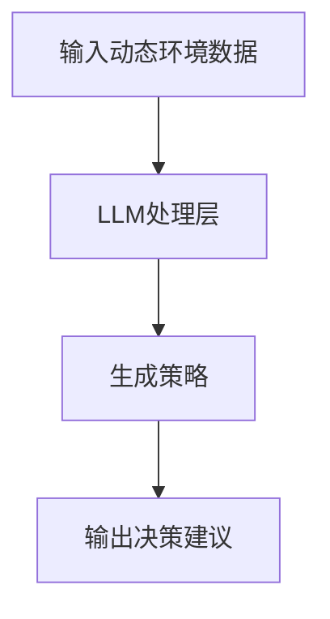
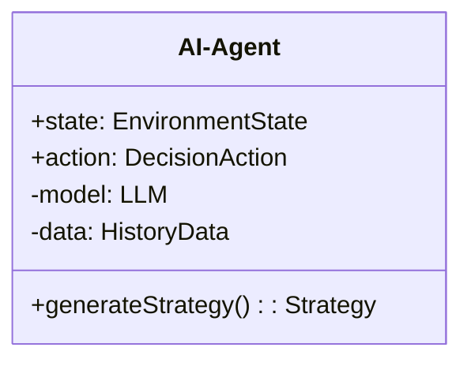
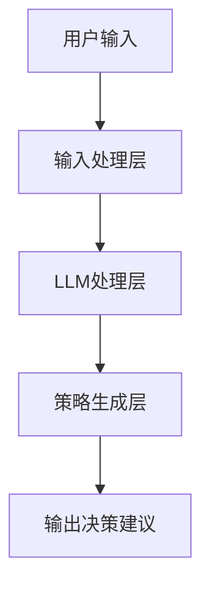
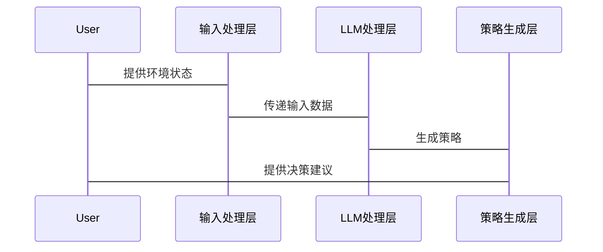

                 


# 实时策略生成AI Agent：LLM在动态决策中的应用

## 关键词
实时策略生成, AI Agent, 大语言模型, 动态决策, 机器学习

## 摘要
本文探讨了实时策略生成AI Agent在动态决策中的应用，重点分析了大语言模型（LLM）在其中的关键作用。文章从背景介绍、核心概念、算法原理、系统架构到项目实战，全面解析了实时策略生成的技术细节和实现方法。通过实际案例和系统设计，展示了如何利用LLM构建高效的动态决策系统，并提出了相关的最佳实践建议。

---

# 第一部分: 实时策略生成AI Agent概述

## 第1章: 实时策略生成AI Agent的背景与概念

### 1.1 问题背景
#### 1.1.1 动态决策问题的复杂性
在现代商业和社会活动中，决策环境往往具有高度的动态性和不确定性。例如，在金融交易、游戏AI、自动驾驶等领域，系统需要实时做出决策以应对快速变化的环境。传统的基于规则的决策系统难以适应这些动态变化，因此需要更加灵活和智能的决策机制。

#### 1.1.2 实时策略生成的需求
在动态环境中，决策系统需要能够实时生成适应当前状态的策略。这意味着系统不仅需要处理当前输入，还需要根据历史数据和上下文信息生成最佳的下一步行动方案。这种实时性要求决策系统具备高效的计算能力和快速的响应速度。

#### 1.1.3 AI Agent在动态决策中的作用
AI Agent（智能体）是一种能够感知环境并采取行动以实现目标的实体。在动态决策中，AI Agent能够通过实时感知环境变化并调整策略，从而提高决策的准确性和效率。AI Agent的核心在于其自主性和适应性，能够在复杂环境中做出最优决策。

### 1.2 问题描述
#### 1.2.1 动态环境中的决策挑战
动态环境中的决策问题具有以下特点：
- 环境状态不断变化，决策需要实时更新。
- 信息不完全，需要基于有限的数据做出最优决策。
- 多目标优化，需要在多个目标之间找到平衡点。

#### 1.2.2 实时策略生成的定义
实时策略生成是指在动态环境中，系统能够根据当前状态和历史信息，快速生成适应当前环境的决策策略。这个过程需要结合实时数据和模型预测，确保决策的准确性和及时性。

#### 1.2.3 LLM在实时策略生成中的应用
大语言模型（LLM）具有强大的自然语言处理能力和生成能力，能够在实时决策中提供多样化的策略生成方案。LLM通过对大量数据的学习，能够理解上下文并生成符合语境的决策建议。

### 1.3 问题解决
#### 1.3.1 AI Agent的基本原理
AI Agent通过感知环境、分析信息、生成策略和执行行动来实现动态决策。其核心在于信息处理能力和策略生成能力。

#### 1.3.2 LLM在策略生成中的优势
相比传统规则引擎，LLM能够生成更加灵活和多样化的策略，适应复杂多变的环境。LLM的学习能力和生成能力使其在实时策略生成中具有显著优势。

#### 1.3.3 实时策略生成的关键技术
实时策略生成的关键技术包括：
- 高效的数据处理技术，确保决策的实时性。
- 强大的模型预测能力，支持快速生成策略。
- 灵活的策略调整机制，适应环境变化。

### 1.4 边界与外延
#### 1.4.1 动态决策的边界条件
动态决策的边界条件包括：
- 决策的实时性要求。
- 数据的完整性和准确性。
- 系统的计算能力和资源限制。

#### 1.4.2 实时策略生成的适用范围
实时策略生成适用于需要快速决策的领域，如金融交易、自动驾驶、游戏AI等。

#### 1.4.3 LLM在动态决策中的局限性
尽管LLM在策略生成中表现出色，但其在实时性、数据依赖性和模型解释性方面存在一定的局限性。

### 1.5 概念结构与核心要素
实时策略生成AI Agent的核心要素包括：
- 感知模块：实时感知环境状态。
- 分析模块：分析当前状态并生成策略。
- 执行模块：根据生成的策略执行行动。
- 学习模块：通过反馈优化模型。

---

## 第二章: LLM的核心原理与特性

### 2.1 LLM的基本原理
#### 2.1.1 大语言模型的训练机制
大语言模型通过监督学习和强化学习进行训练，利用大量的文本数据优化模型参数。

#### 2.1.2 概率生成模型的工作原理
LLM基于概率生成模型，通过计算每个可能的下一个词的概率分布，生成最可能的文本序列。

#### 2.1.3 注意力机制与序列生成
注意力机制帮助模型关注输入序列中重要的部分，从而生成更准确的上下文相关的文本。

### 2.2 LLM的关键特性
#### 2.2.1 多模态交互能力
LLM能够处理多种数据类型，如文本、图像等，提供多样化的交互方式。

#### 2.2.2 实时生成能力
LLM能够在短时间内生成高质量的文本，满足实时决策的需求。

#### 2.2.3 知识更新与适应性
通过持续学习和模型优化，LLM能够适应新的数据和环境变化。

### 2.3 LLM与其他生成模型的对比
#### 2.3.1 GAN与LLM的对比
- GAN（生成对抗网络）通过生成器和判别器的对抗训练生成数据。
- LLM基于概率生成模型，生成质量更高且更可控。

#### 2.3.2 Transformer与RNN的对比
- Transformer模型基于自注意力机制，计算效率高且并行性好。
- RNN模型通过序列处理，适合处理长序列但计算效率较低。

#### 2.3.3 LLM的独特优势
- 强大的上下文理解和生成能力。
- 高效的计算能力和实时响应能力。

---

## 第三章: 实时策略生成的算法原理

### 3.1 基于LLM的实时策略生成算法
#### 3.1.1 模型输入与输出的处理流程
- 输入：当前环境状态和历史数据。
- 处理：通过LLM生成策略。
- 输出：生成的策略和行动建议。

#### 3.1.2 实时生成的数学模型
实时策略生成的数学模型如下：
$$ P(y|x) = \text{argmax}_y P(y|x, \theta) $$
其中，$x$表示输入，$y$表示输出，$\theta$表示模型参数。

#### 3.1.3 策略优化的反馈机制
通过实时反馈优化策略生成模型，确保生成策略的有效性。

### 3.2 算法流程图


---

## 第四章: 系统分析与架构设计

### 4.1 问题场景介绍
实时策略生成AI Agent的应用场景包括金融交易、游戏AI、自动驾驶等领域。

### 4.2 系统功能设计
#### 4.2.1 领域模型类图


### 4.3 系统架构设计
#### 4.3.1 系统架构图


### 4.4 系统接口设计
- 输入接口：接受当前环境状态和历史数据。
- 输出接口：输出生成的策略和决策建议。

### 4.5 系统交互流程


---

## 第五章: 项目实战

### 5.1 环境安装
安装必要的库和工具，如TensorFlow、PyTorch等。

### 5.2 核心代码实现
#### 5.2.1 策略生成模块
```python
def generate_strategy(model, input_data):
    with torch.no_grad():
        output = model(input_data)
        strategy = output.argmax(dim=1).item()
    return strategy
```

### 5.2.2 系统交互模块
```python
def main():
    while True:
        input = input("请输入环境状态：")
        strategy = generate_strategy(model, input)
        print(f"生成的策略是：{strategy}")
```

### 5.3 代码解读与分析
通过上述代码，我们可以看到实时策略生成的核心在于模型的调用和策略的生成过程。

### 5.4 案例分析与详细讲解
以金融交易为例，系统能够实时根据市场数据生成交易策略，帮助投资者做出决策。

### 5.5 项目小结
通过本项目，我们了解了实时策略生成AI Agent的实现过程和关键步骤。

---

## 第六章: 最佳实践

### 6.1 小结
实时策略生成AI Agent的核心在于高效的数据处理和强大的模型生成能力。

### 6.2 注意事项
- 确保系统的实时性和响应速度。
- 定期更新模型以适应环境变化。
- 注意模型的解释性和可维护性。

### 6.3 拓展阅读
推荐阅读相关领域的书籍和论文，深入理解实时策略生成的技术细节。

---

# 结语
实时策略生成AI Agent在动态决策中的应用前景广阔，随着技术的不断发展，LLM将为实时策略生成提供更强大的支持，推动决策系统向更加智能化和高效化方向发展。

--- 

# 参考文献
[此处列出相关参考文献]

