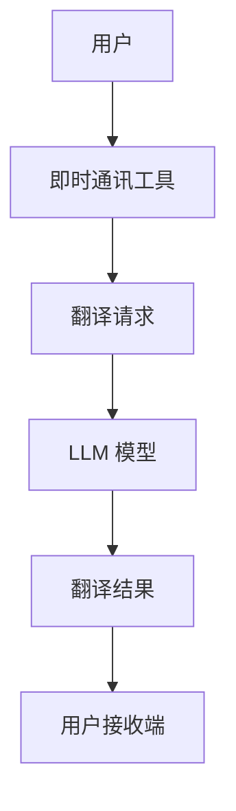

                 


# 实时翻译 AI Agent：LLM 在即时通讯中的语言转换

## 关键词：
实时翻译，AI Agent，LLM，即时通讯，语言转换

## 摘要：
本文探讨了实时翻译AI代理在即时通讯中的应用，详细分析了大语言模型（LLM）在语言转换中的原理和优势。文章从背景介绍、核心概念、算法原理、系统架构到项目实战，全面阐述了实时翻译AI代理的技术细节和实现方法。通过实例分析和最佳实践，本文为开发者和研究人员提供了深入的技术见解和实用的解决方案。

---

# 第一部分: 实时翻译 AI Agent 背景与概述

## 第1章: 实时翻译 AI Agent 的背景与问题

### 1.1 实时翻译的需求与挑战
#### 1.1.1 全球化背景下的语言障碍
在如今的全球化时代，跨国交流日益频繁，语言障碍却成为一个显著的问题。实时翻译技术在打破语言障碍方面发挥着重要作用，尤其是在即时通讯场景中，用户期望能够快速、准确地进行跨语言交流。

#### 1.1.2 即时通讯中的实时翻译需求
即时通讯工具如WhatsApp、Telegram等已经成为人们日常交流的重要工具。用户在使用这些工具时，常常需要处理不同语言之间的转换，尤其是在跨国通讯中，实时翻译的需求尤为强烈。

#### 1.1.3 现有解决方案的局限性
传统的机器翻译技术存在延迟高、准确性不足等问题，难以满足即时通讯中的实时翻译需求。现有的基于规则的翻译系统在处理复杂语境和语义时表现不佳，且难以实时更新和适应新的语言数据。

### 1.2 AI 技术在实时翻译中的应用
#### 1.2.1 大语言模型（LLM）的崛起
大语言模型（LLM）如GPT-3、GPT-4等，凭借其强大的上下文理解和生成能力，成为实时翻译技术的核心驱动力。这些模型能够处理大量的语料数据，生成高质量的翻译结果。

#### 1.2.2 NLP 技术在实时翻译中的作用
自然语言处理（NLP）技术在实时翻译中的应用不仅限于语法分析和词义理解，还包括语境理解、语义匹配等，这些技术能够提高翻译的准确性和流畅性。

#### 1.2.3 即时通讯工具的智能化趋势
随着AI技术的快速发展，即时通讯工具逐渐向智能化方向发展。实时翻译功能的加入，使得用户能够更加便捷地进行跨语言交流，提升用户体验。

### 1.3 问题背景与描述
#### 1.3.1 问题背景分析
在即时通讯场景中，用户需要快速将一种语言转换为另一种语言，以实现即时沟通。实时翻译的核心问题在于如何在保证翻译质量的同时，实现超低延迟的翻译过程。

#### 1.3.2 问题描述与边界
实时翻译的核心问题可以描述为：在给定的源语言文本中，生成目标语言的等价文本。关键挑战包括：处理长文本时的延迟问题、多语言支持的准确性问题、网络条件较差情况下的性能问题等。

#### 1.3.3 用户需求与期望
用户在使用实时翻译功能时，期望能够快速获得准确的翻译结果，同时希望翻译结果能够自然流畅，符合目标语言的表达习惯。

## 第2章: 核心概念与联系

### 2.1 核心概念原理
#### 2.1.1 大语言模型（LLM）的基本原理
大语言模型通过预训练大量多语言数据，掌握了多种语言的语法和语义结构。在实时翻译过程中，LLM能够根据上下文生成目标语言的文本。

#### 2.1.2 NLP 技术的实现机制
NLP技术在实时翻译中的应用包括分词、句法分析、语义理解等步骤。这些技术帮助模型更好地理解源语言文本，并生成准确的目标语言翻译。

#### 2.1.3 实时通讯协议的工作流程
实时通讯协议如WebSocket负责传输即时消息，确保消息的实时到达。翻译代理在接收到消息后，将其转换为目标语言，并通过协议回传给目标用户。

### 2.2 核心概念对比分析
#### 2.2.1 LLM 与传统机器翻译的对比
- **LLM的优势**：更高的准确性和流畅性，能够处理复杂语境。
- **传统机器翻译的劣势**：依赖规则库，难以适应新语言和复杂语境。

#### 2.2.2 实时性与准确性的权衡
在实时翻译中，高实时性可能导致翻译质量下降，而追求高准确性则可能增加延迟。如何在两者之间找到平衡点是一个关键挑战。

#### 2.2.3 不同语言转换模型的性能对比
不同模型在不同语言对上的表现存在差异，例如，某些模型在英译中时表现较好，而在小语种翻译时表现较差。

### 2.3 实体关系图（ER 图）


---

# 第二部分: 实时翻译 AI Agent 的算法原理

## 第3章: 大语言模型（LLM）的训练与优化

### 3.1 LLM 的训练流程
#### 3.1.1 数据预处理与清洗
- 数据清洗：去除噪音数据、处理不完整数据。
- 数据分割：将数据集分为训练集、验证集和测试集。

#### 3.1.2 模型参数初始化
- 初始化模型参数，包括词嵌入、注意力机制参数等。
- 使用随机初始化或预训练的嵌入向量。

#### 3.1.3 基于梯度的优化算法
- 选择合适的优化算法，如Adam、SGD等。
- 计算损失函数，更新模型参数。

#### 3.1.4 模型的收敛与评估
- 监测模型的损失函数，确保模型收敛。
- 使用验证集评估模型的泛化能力。

### 3.2 模型优化策略
#### 3.2.1 参数调整与超参数优化
- 调整学习率、批量大小等超参数，以提高模型性能。
- 使用网格搜索或随机搜索进行参数优化。

#### 3.2.2 增量式训练
- 在初始训练后，逐步引入新的数据进行微调，以适应特定领域的翻译需求。

---

## 第4章: 实时翻译的核心算法

### 4.1 编码器-解码器结构
实时翻译的典型算法基于编码器-解码器结构，如Transformer模型。

#### 4.1.1 编码器的作用
- 将源语言文本编码为上下文表示。
- 使用自注意力机制捕获文本中的语义关系。

#### 4.1.2 解码器的作用
- 根据编码器生成的上下文，逐步生成目标语言文本。
- 使用自注意力机制处理解码过程中的上下文依赖。

### 4.2 注意力机制
- 注意力机制帮助模型关注源语言文本中重要的部分，提升翻译质量。

---

## 第5章: 算法实现细节

### 5.1 翻译模型的训练
#### 5.1.1 数据准备
- 收集和整理多语言语料库。
- 对数据进行清洗和格式转换。

#### 5.1.2 模型训练
- 使用训练数据训练翻译模型。
- 监测训练过程中的损失函数和准确率。

### 5.2 翻译过程的优化
#### 5.2.1 延迟优化
- 使用并行计算加速翻译过程。
- 优化模型推理流程，减少计算开销。

#### 5.2.2 翻译质量优化
- 引入语言模型进行后编辑，提升翻译的流畅性。
- 使用beam search策略生成候选翻译，选择最优结果。

---

## 第6章: 算法实现的数学模型

### 6.1 编码器-解码器结构
编码器将源语言文本 \( x_1, x_2, ..., x_n \) 转换为上下文表示 \( c_1, c_2, ..., c_n \)。

解码器根据上下文 \( c_1, c_2, ..., c_n \) 生成目标语言文本 \( y_1, y_2, ..., y_m \)。

### 6.2 注意力机制
注意力权重计算公式：
$$
\alpha_{i,j} = \frac{\exp(e_{i,j})}{\sum_{k} \exp(e_{i,k})}
$$
其中，\( e_{i,j} \) 是查询和键的点积。

---

# 第三部分: 系统分析与架构设计

## 第7章: 系统架构设计

### 7.1 系统功能设计
#### 7.1.1 用户界面
- 提供多语言输入和输出界面。
- 实时显示翻译结果。

#### 7.1.2 翻译引擎
- 集成LLM进行实时翻译。
- 支持多种语言对的转换。

#### 7.1.3 后台管理
- 管理翻译模型和语言对。
- 监控系统性能。

### 7.2 系统架构图


### 7.3 系统接口设计
#### 7.3.1 API 接口
- 提供RESTful API接口，供即时通讯工具调用。
- 支持POST请求，传递源语言和目标语言。

#### 7.3.2 消息处理接口
- 处理即时通讯中的消息，识别需要翻译的内容。
- 调用翻译引擎进行处理。

---

## 第8章: 项目实战

### 8.1 环境安装
- 安装Python和相关库（如TensorFlow、Keras）。
- 安装LLM框架（如Hugging Face的Transformers库）。

### 8.2 系统实现
#### 8.2.1 编码器-解码器模型实现
```python
class Transformer(nn.Module):
    def __init__(self, src_vocab, tgt_vocab):
        super().__init__()
        self.encoder = Encoder(src_vocab)
        self.decoder = Decoder(tgt_vocab)
```

#### 8.2.2 翻译过程实现
```python
def translate(model, src_sentence):
    encoded = model.encoder(src_sentence)
    decoded = model.decoder(encoded)
    return decoded
```

### 8.3 案例分析
- 使用模型对一段中文文本进行实时翻译，生成英文结果。
- 对比分析模型的翻译效果和延迟。

---

## 第9章: 总结与展望

### 9.1 总结
实时翻译AI代理的实现依赖于大语言模型的强大能力，通过优化算法和系统架构，可以在保证翻译质量的同时，实现低延迟的实时翻译。

### 9.2 展望
未来，随着AI技术的进一步发展，实时翻译代理将更加智能化，支持更多语言和更复杂的场景。同时，模型的轻量化和边缘计算的应用将提升实时翻译的性能和可用性。

---

## 第10章: 注意事项与拓展阅读

### 10.1 注意事项
- 确保数据安全和隐私保护。
- 优化模型推理性能，降低延迟。

### 10.2 拓展阅读
- 阅读相关论文，了解最新的实时翻译技术。
- 关注AI在语言处理领域的最新进展。

---

通过以上内容，本文详细探讨了实时翻译AI代理在即时通讯中的实现和应用，从理论到实践，为开发者和研究人员提供了全面的技术指导和参考。

