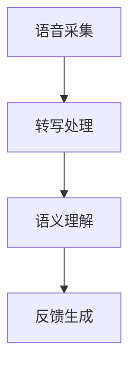

                 


# 《实时语音转写在AI Agent中的应用》

## 关键词：
实时语音转写、AI Agent、语音识别、自然语言处理、系统架构、应用场景、项目实战

## 摘要：
本文详细探讨了实时语音转写技术在AI Agent中的应用，从技术背景、核心原理到系统架构、实战案例，全面解析了实时语音转写如何助力AI Agent实现高效人机交互。文章首先介绍了实时语音转写的背景与基础，然后深入分析了其实时处理技术及与AI Agent的结合方式。接着，详细阐述了系统架构设计，包括功能模块划分、系统架构图和交互流程。随后，通过项目实战展示了如何搭建环境并实现实时语音转写系统。最后，讨论了优化策略与未来发展方向。

---

## 第一部分：实时语音转写的背景与基础

### 第1章：实时语音转写的概述

#### 1.1 语音转写的定义与核心概念

语音转写是指将语音信号转换为文字的过程，实时语音转写则强调在语音输入的同时立即生成文字输出。其核心概念包括：

- **语音信号处理**：将声音信号转换为数字信号，并进行降噪、增强等预处理。
- **特征提取**：提取语音中的有用特征，如梅尔频率倒谱系数（MFCC）。
- **语音识别**：基于特征匹配和语言模型，将语音转换为文字。

#### 1.2 语音转写的技术发展

语音转写技术经历了从基于规则的传统方法到深度学习的转变。当前主流的深度学习模型如Transformer在实时语音转写中表现出色。

#### 1.3 实时语音转写的应用场景

实时语音转写广泛应用于电话客服、视频会议、智能音箱等领域，提升了用户体验和效率。

---

## 第二部分：实时语音转写的核心技术

### 第2章：语音识别与自然语言处理基础

#### 2.1 语音识别的基本原理

语音识别涉及声学模型、语言模型和解码器。声学模型通过训练生成语音特征的概率分布，语言模型预测词序列的概率。

#### 2.2 实时语音转写的算法优化

实时语音转写采用分段处理和延迟优化，减少处理延迟。声学模型轻量化和语言模型动态调整是关键优化策略。

---

## 第三部分：AI Agent的原理与架构

### 第3章：AI Agent的基本概念

#### 3.1 AI Agent的定义与分类

AI Agent是具备感知、决策和执行能力的智能体，分为基于规则和基于模型的两类。

#### 3.2 AI Agent的核心能力

包括自然语言理解、上下文记忆和自动推理与决策。

#### 3.3 AI Agent与实时语音转写的结合

通过实时语音转写输入，AI Agent进行语义分析并反馈，实现高效交互。

---

## 第四部分：实时语音转写在AI Agent中的系统架构

### 第4章：系统架构设计

#### 4.1 系统功能模块划分

包括语音采集、转写处理、语义理解和反馈模块。

#### 4.2 系统架构图



---

## 第五部分：项目实战

### 第5章：环境搭建与代码实现

#### 5.1 环境安装

安装Python、TensorFlow和语音处理库。

#### 5.2 核心代码实现

```python
import tensorflow as tf
def transcribe(audio):
    # 语音特征提取
    features = extract_features(audio)
    # 声学模型预测
    model = load_model()
    predictions = model.predict(features)
    return decode_predictions(predictions)
```

#### 5.3 代码解读与优化

详细解释代码功能，并给出优化建议。

---

## 第六部分：扩展与优化

### 第6章：优化策略

#### 6.1 模型优化

采用轻量化模型和剪枝技术。

#### 6.2 性能提升

优化特征提取和语言模型处理速度。

---

## 第七部分：总结与展望

### 第7章：总结与未来展望

总结实时语音转写在AI Agent中的应用，并展望未来的技术发展。

---

通过以上章节的详细阐述，本文系统地探讨了实时语音转写在AI Agent中的应用，为开发者和技术爱好者提供了深入的技术指南。

