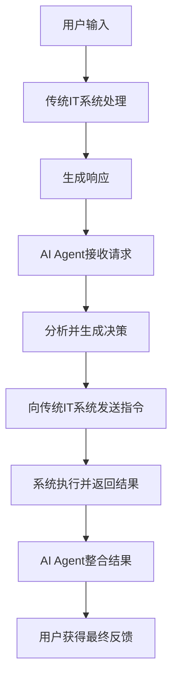
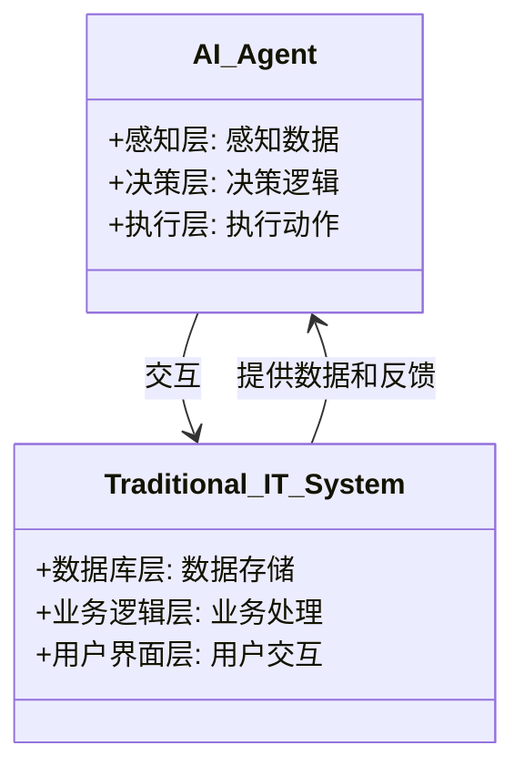

                 

# 实现AI Agent与传统IT系统的无缝集成

**关键词**：AI Agent, 传统IT系统, 系统集成, 算法原理, 系统架构, 项目实战

**摘要**：随着人工智能技术的快速发展，AI Agent在各个领域的应用日益广泛。然而，AI Agent与传统IT系统的集成仍然面临诸多挑战。本文从背景介绍、核心概念、算法原理、系统架构设计到项目实战，全面探讨如何实现AI Agent与传统IT系统的无缝集成，为技术实现者提供系统化的解决方案和实践指导。

---

## 目录大纲

1. **背景介绍**
   - 1.1 问题背景
     - 1.1.1 传统IT系统的局限性
     - 1.1.2 AI Agent的崛起与优势
     - 1.1.3 无缝集成的必要性
   - 1.2 问题描述
     - 1.2.1 AI Agent与传统IT系统的交互问题
     - 1.2.2 数据孤岛与信息不畅
     - 1.2.3 系统兼容性与性能优化
   - 1.3 问题解决
     - 1.3.1 AI Agent的功能需求
     - 1.3.2 传统IT系统的改造方案
     - 1.3.3 集成的实现路径
   - 1.4 边界与外延
     - 1.4.1 AI Agent的适用范围
     - 1.4.2 传统IT系统的边界条件
     - 1.4.3 集成的范围与限制
   - 1.5 核心概念与组成
     - 1.5.1 AI Agent的定义与组成部分
     - 1.5.2 传统IT系统的构成要素
     - 1.5.3 集成的核心要素

2. **核心概念与联系**
   - 2.1 AI Agent的原理
     - 2.1.1 感知层
     - 2.1.2 决策层
     - 2.1.3 执行层
   - 2.2 传统IT系统的架构
     - 2.2.1 数据库层
     - 2.2.2 业务逻辑层
     - 2.2.3 用户界面层
   - 2.3 核心概念对比
     - 2.3.1 AI Agent与传统IT系统的属性特征对比（表格）
     - 2.3.2 ER实体关系图架构的 Mermaid 流程图
     - 2.3.3 AI Agent与传统IT系统的交互过程 Mermaid 流程图

3. **算法原理讲解**
   - 3.1 感知层算法
     - 3.1.1 数据采集与预处理
     - 3.1.2 感知层算法实现
     - 3.1.3 感知层数学模型
   - 3.2 决策层算法
     - 3.2.1 决策逻辑设计
     - 3.2.2 基于Q-learning的决策算法
     - 3.2.3 决策层数学模型
   - 3.3 执行层算法
     - 3.3.1 执行动作生成
     - 3.3.2 执行结果反馈
     - 3.3.3 执行层数学模型
   - 3.4 算法实现
     - 3.4.1 算法步骤分解
     - 3.4.2 算法实现的 Mermaid 流程图
     - 3.4.3 算法实现的 Python 源代码

4. **系统分析与架构设计方案**
   - 4.1 问题场景介绍
     - 4.1.1 系统现状分析
     - 4.1.2 集成目标设定
   - 4.2 系统功能设计
     - 4.2.1 领域模型 Mermaid 类图
     - 4.2.2 系统功能模块划分
   - 4.3 系统架构设计
     - 4.3.1 系统架构 Mermaid 架构图
     - 4.3.2 系统分层设计
   - 4.4 系统接口设计
     - 4.4.1 接口定义
     - 4.4.2 接口交互流程 Mermaid 序列图
   - 4.5 系统交互流程
     - 4.5.1 交互流程 Mermaid 流程图
     - 4.5.2 交互过程详细说明

5. **项目实战**
   - 5.1 环境安装
     - 5.1.1 安装Python
     - 5.1.2 安装TensorFlow
     - 5.1.3 安装其他依赖库
   - 5.2 系统核心实现
     - 5.2.1 数据预处理代码
     - 5.2.2 模型训练代码
     - 5.2.3 接口开发代码
   - 5.3 代码应用解读与分析
     - 5.3.1 代码结构分析
     - 5.3.2 代码实现细节
   - 5.4 实际案例分析
     - 5.4.1 案例背景介绍
     - 5.4.2 案例实现过程
     - 5.4.3 案例结果分析
   - 5.5 项目小结
     - 5.5.1 项目总结
     - 5.5.2 经验教训

6. **最佳实践**
   - 6.1 小结
     - 6.1.1 核心内容总结
     - 6.1.2 关键点回顾
   - 6.2 注意事项
     - 6.2.1 开发注意事项
     - 6.2.2 部署注意事项
     - 6.2.3 维护注意事项
   - 6.3 拓展阅读
     - 6.3.1 推荐书籍
     - 6.3.2 推荐文章
     - 6.3.3 推荐技术博客

---

**示例图：AI Agent与传统IT系统的交互过程 Mermaid 流程图**

---

**示例图：领域模型 Mermaid 类图**

---

**数学公式示例：Q-learning算法**

$$ Q(s, a) = Q(s, a) + \alpha \left[ r + \gamma \max Q(s', a') - Q(s, a) \right] $$

其中：
- \( Q(s, a) \) 表示当前状态下动作 \( a \) 的价值
- \( \alpha \) 表示学习率
- \( r \) 表示奖励
- \( \gamma \) 表示折扣因子
- \( Q(s', a') \) 表示下一个状态下的最大价值

---

通过以上内容，本文将系统地介绍如何实现AI Agent与传统IT系统的无缝集成，从理论到实践，为读者提供全面的技术指导。

