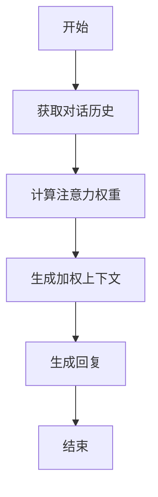

                 


# 实现AI Agent的上下文管理：保持对话连贯性

> 关键词：AI Agent, 上下文管理, 对话连贯性, 记忆机制, 注意力机制, 系统架构, 项目实战

> 摘要：本文深入探讨了AI Agent上下文管理的核心概念、算法原理、系统架构和项目实现。通过详细的理论分析和实际案例，展示了如何设计和实现一个高效的上下文管理系统，以保持对话的连贯性和一致性。从记忆机制到注意力机制，从系统架构到项目实战，全面解析上下文管理的实现细节。

---

## 第一部分: AI Agent上下文管理背景与核心概念

### 第1章: 问题背景与描述

#### 1.1 对话连贯性的重要性
- **1.1.1 为什么对话连贯性重要？**
  - 在AI Agent与用户的交互中，连贯性是建立信任和提供良好用户体验的关键。
  - 如果对话不连贯，用户会感到困惑，甚至怀疑AI的智能性。

- **1.1.2 上下文管理的核心问题**
  - 如何存储和管理对话历史？
  - 如何根据上下文生成相关的回复？
  - 如何处理上下文中的噪声和不相关信息？

- **1.1.3 问题解决的必要性**
  - 通过有效的上下文管理，AI Agent可以提供更智能、更自然的交互体验。
  - 上下文管理是实现智能对话系统的基础。

#### 1.2 上下文管理的边界与外延

- **1.2.1 定义上下文管理的范围**
  - 上下文管理仅关注对话历史和当前对话的关系。
  - 不包括实时环境感知和外部知识库的调用。

- **1.2.2 与其他概念的区分**
  - 与记忆机制的区别：上下文管理是记忆机制的一种应用。
  - 与自然语言处理（NLP）的区别：上下文管理是NLP中的一个模块。

- **1.2.3 核心要素与组成结构**
  - 对话历史记录。
  - 上下文解析与生成。
  - 上下文关联性计算。

### 第2章: 核心概念与联系

#### 2.1 核心概念原理

- **2.1.1 上下文管理的定义**
  - 上下文管理是指在对话过程中，AI Agent对历史对话信息的存储、解析和应用的过程。

- **2.1.2 核心概念的属性特征**
  - 时间性：对话历史按时间顺序排列。
  - 相关性：上下文信息的相关性影响回复的质量。
  - 动态性：上下文信息随对话进展动态更新。

- **2.1.3 相关概念的对比分析**
  - 对比记忆机制和上下文管理：记忆机制是存储信息，而上下文管理是基于存储的信息进行推理和生成。
  - 对比上下文管理和知识库：知识库是静态的外部知识，而上下文管理是动态的对话信息。

#### 2.2 概念属性特征对比表格

| 概念         | 时间性 | 相关性 | 动态性 |
|--------------|--------|--------|--------|
| 上下文管理   | 高     | 高     | 高     |
| 记忆机制     | 中     | 中     | 中     |
| 知识库       | 无     | 低     | 低     |

#### 2.3 ER实体关系图

```mermaid
er
    actor(Agent)
    actor(上下文)
    actor(对话历史)
    actor(用户输入)
    actor(系统输出)
    relationship(Agent, 上下文, 管理)
    relationship(上下文, 对话历史, 包含)
    relationship(用户输入, 对话历史, 影响)
    relationship(系统输出, 对话历史, 影响)
```

---

## 第二部分: 上下文管理的算法原理

### 第3章: 上下文管理算法原理

#### 3.1 记忆机制

- **3.1.1 基于序列的记忆机制**
  - 使用循环神经网络（RNN）存储对话历史。
  - 示例：
    ```python
    class ContextMemory:
        def __init__(self):
            self.history = []
        def add_context(self, utterance):
            self.history.append(utterance)
        def get_context(self):
            return self.history
    ```

- **3.1.2 基于向量的记忆机制**
  - 使用向量表示法压缩对话历史。
  - 示例：
    ```python
    import numpy as np
    class VectorMemory:
        def __init__(self, size):
            self.vector = np.zeros(size)
        def update_vector(self, utterance):
            # 更新向量，基于utterance的内容
            self.vector += utterance_vector
        def get_vector(self):
            return self.vector
    ```

- **3.1.3 记忆机制的比较与选择**
  - 序列机制适合长对话，但计算量大。
  - 向量机制适合实时性要求高的场景，但信息压缩可能导致信息丢失。

#### 3.2 注意力机制

- **3.2.1 注意力机制的基本原理**
  - 通过计算对话历史中每个部分的重要性，生成加权后的上下文表示。
  - 数学公式：
    $$\alpha_i = \frac{\exp(e_i)}{\sum_{j=1}^{n}\exp(e_j)}$$
    其中，$e_i$ 是第i个对话历史的权重。

- **3.2.2 基于上下文的注意力计算**
  - 示例：
    ```python
    import torch
    class AttentionMechanism:
        def __init__(self, embed_dim):
            self.W = torch.randn(embed_dim, embed_dim)
        def compute_attention(self, context_embeddings):
            # context_embeddings: [n, embed_dim]
            weights = torch.matmul(context_embeddings, self.W)
            weights = torch.softmax(weights, dim=1)
            return weights
    ```

- **3.2.3 注意力机制的优化方法**
  - 使用位置编码（Positional Encoding）增强位置信息。
  - 引入多头注意力（Multi-Head Attention）捕捉不同层次的上下文关系。

#### 3.3 算法流程图



---

## 第三部分: 上下文管理的系统设计与架构

### 第4章: 系统分析与架构设计方案

#### 4.1 系统功能设计

- **4.1.1 领域模型**
  ```mermaid
  classDiagram
      class Agent {
          <属性>
          - context: Context
          <方法>
          + add_context(utterance: str)
          + get_context(): List[str]
          + generate_response(): str
      }
      class Context {
          <属性>
          - history: List[str]
          - attention_weights: List[float]
          <方法>
          + update_context(new_utterance: str)
          + get_context_vector(): List[float]
      }
      Agent --> Context
  ```

- **4.1.2 系统架构图**
  ```mermaid
  architecture
      Client --> Agent: 发送用户输入
      Agent --> Context: 获取上下文
      Agent --> NLP模块: 生成回复
      NLP模块 --> Context: 更新上下文
  ```

- **4.1.3 系统交互流程**
  ```mermaid
  sequenceDiagram
      Client -> Agent: 用户输入
      Agent -> Context: 获取上下文
      Agent -> NLP模块: 生成回复
      NLP模块 -> Context: 更新上下文
      Agent -> Client: 返回回复
  ```

---

## 第四部分: 项目实战

### 第5章: 项目实现与分析

#### 5.1 环境安装

- 安装Python和必要的库：
  ```bash
  pip install numpy torch transformers
  ```

#### 5.2 系统核心实现

- 上下文管理器的实现：
  ```python
  import torch
  import torch.nn as nn

  class ContextManager:
      def __init__(self, embed_dim):
          self.embed_dim = embed_dim
          self.context_vector = torch.zeros(embed_dim)
          self.attention_weights = torch.zeros(embed_dim)

      def update_context(self, utterance_embedding):
          # 更新上下文向量
          self.context_vector = torch.add(self.context_vector, utterance_embedding)
          # 计算注意力权重
          attention_scores = torch.matmul(self.context_vector.unsqueeze(1), self.attention_weights.unsqueeze(0))
          attention_weights = torch.softmax(attention_scores, dim=1)
          self.attention_weights = attention_weights
  ```

- 注意力机制的实现：
  ```python
  class AttentionLayer(nn.Module):
      def __init__(self, embed_dim):
          super(AttentionLayer, self).__init__()
          self.W = nn.Linear(embed_dim, embed_dim)

      def forward(self, context_embeddings):
          attention_weights = torch.softmax(self.W(context_embeddings), dim=1)
          return attention_weights
  ```

#### 5.3 代码应用解读与分析

- 对话历史的存储与更新：
  ```python
  context = ContextManager(100)
  utterance_embeddings = torch.randn(5, 100)  # 5条对话历史
  for i in range(5):
      context.update_context(utterance_embeddings[i])
  ```

- 注意力权重的计算：
  ```python
  attention_layer = AttentionLayer(100)
  context_embeddings = torch.randn(5, 100)
  attention_weights = attention_layer(context_embeddings)
  print(attention_weights)  # 输出形状：[5, 1]
  ```

#### 5.4 实际案例分析

- 案例：用户与AI Agent的对话
  ```plaintext
  用户：今天天气怎么样？
  Agent：很抱歉，我无法获取实时天气信息。但您可以告诉我您所在的城市，我可以告诉您今天的天气情况。
  用户：北京
  Agent：北京今天天气晴朗，气温在20℃左右。
  ```

- 上下文管理的应用：
  - 用户输入“北京”后，AI Agent根据上下文（用户询问天气）生成相关回复。

---

## 第五部分: 总结与展望

### 第6章: 最佳实践与小结

#### 6.1 最佳实践

- 定期清理不相关的上下文信息，避免信息过载。
- 在实时对话中，优先使用基于向量的上下文管理方法，以提高计算效率。
- 结合知识库和上下文管理，提供更丰富和准确的回复。

#### 6.2 小结

- 上下文管理是实现AI Agent智能对话的核心技术。
- 通过记忆机制和注意力机制，可以有效管理对话历史和生成连贯的回复。
- 系统设计与架构的选择直接影响上下文管理的性能和用户体验。

#### 6.3 注意事项

- 注意信息的安全性，避免敏感信息泄露。
- 定期优化上下文管理算法，提高对话的连贯性和响应速度。
- 在实际应用中，结合具体场景选择合适的上下文管理方法。

#### 6.4 拓展阅读

- 推荐阅读《神经网络与深度学习》（Ian Goodfellow著）中关于序列模型的内容。
- 关注最新的NLP技术，如Transformer和大语言模型（如GPT-3、GPT-4）在上下文管理中的应用。

---

## 附录: 术语表

- **上下文管理（Context Management）**：指在对话过程中，AI Agent对历史对话信息的存储、解析和应用的过程。
- **记忆机制（Memory Mechanism）**：一种用于存储和检索信息的机制，常用于处理长序列数据。
- **注意力机制（Attention Mechanism）**：一种用于计算序列中每个元素重要性的机制，常用于NLP任务中。

---

通过以上目录结构，我们可以系统地学习和实现AI Agent的上下文管理，从理论到实践，逐步掌握如何保持对话的连贯性和一致性。

