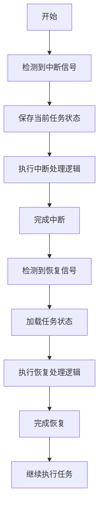

                 


# 实现AI Agent的任务中断与恢复功能

> 关键词：AI Agent, 任务中断, 任务恢复, 中断检测, 中断恢复机制, 系统架构设计

> 摘要：  
本文将深入探讨AI Agent的任务中断与恢复功能的实现方法。通过分析任务中断与恢复的核心概念、算法原理、系统架构设计，以及实际项目案例，本文将为读者提供从理论到实践的全面指导。文章将重点介绍任务中断的触发机制、任务恢复的实现策略，以及如何通过系统架构设计确保任务中断与恢复的可靠性与高效性。此外，本文还将提供代码实现和最佳实践，帮助读者在实际项目中应用这些技术。

---

# 第一章: AI Agent的任务中断与恢复背景

## 1.1 问题背景

### 1.1.1 AI Agent的定义与特点
AI Agent（人工智能代理）是指能够感知环境、自主决策并执行任务的智能实体。AI Agent的特点包括：
- **自主性**：能够在没有外部干预的情况下自主执行任务。
- **反应性**：能够实时感知环境并做出响应。
- **目标导向性**：基于目标驱动行为。
- **适应性**：能够根据环境变化调整策略。

### 1.1.2 任务中断与恢复的必要性
在实际应用中，AI Agent可能会遇到以下场景，导致任务中断：
- 用户主动终止任务。
- 系统资源不足（如内存不足、网络中断）。
- 任务执行过程中出现异常（如错误、超时）。
- 外部事件（如新的优先级更高的任务触发）。

任务恢复是指在中断后，AI Agent能够重新拾起之前的任务，并继续执行。任务中断与恢复的实现能够提高系统的灵活性和容错能力。

### 1.1.3 当前AI Agent的挑战与机遇
- **挑战**：
  - 中断后任务状态的保存与恢复。
  - 多任务环境下的优先级管理。
  - 中断对任务执行的影响评估。
- **机遇**：
  - 提高系统的鲁棒性和用户体验。
  - 支持长周期任务的执行（如自动驾驶、工业自动化）。

## 1.2 问题描述

### 1.2.1 任务中断的场景分析
任务中断的常见场景包括：
1. 用户干预：用户主动终止任务。
2. 系统资源限制：资源不足导致任务无法继续。
3. 任务异常：执行过程中出现错误或超时。
4. 外部事件：新的任务优先级更高，需要切换。

### 1.2.2 任务恢复的核心问题
任务恢复的核心问题包括：
- 状态保存：任务中断时，需记录当前的状态（如执行进度、变量值、上下文等）。
- 状态恢复：恢复中断的任务时，需重新加载状态并继续执行。
- 上下文管理：确保恢复后的任务能够正确地与当前环境交互。

### 1.2.3 中断与恢复的边界与外延
- **边界**：任务中断与恢复的范围，包括任务的状态、执行环境和依赖资源。
- **外延**：任务中断与恢复的扩展，如任务回滚、部分任务恢复等。

## 1.3 问题解决思路

### 1.3.1 中断与恢复的实现目标
- 提供任务中断的能力，支持用户或系统主动中断任务。
- 提供任务恢复的能力，确保中断后任务能够继续执行。
- 提供任务中断与恢复的透明接口，方便上层调用。

### 1.3.2 中断与恢复的实现路径
1. **状态管理**：设计任务状态管理模块，支持任务状态的保存与恢复。
2. **中断检测**：实现任务中断的检测机制。
3. **恢复策略**：设计任务恢复的策略，确保任务能够正确恢复。
4. **容错机制**：实现任务中断与恢复的容错机制，避免数据丢失或错误。

### 1.3.3 中断与恢复的实现方法
- **基于检查点**：在任务执行过程中定期保存检查点，以便在中断后快速恢复。
- **事务机制**：将任务执行过程中的关键操作包裹在事务中，确保中断后能够回滚。
- **异步处理**：支持任务的异步执行，确保中断与恢复不会阻塞其他任务。

## 1.4 本章小结
本章从背景、问题描述和解决思路三个方面，介绍了AI Agent的任务中断与恢复功能。通过分析任务中断的场景和恢复的核心问题，明确了实现任务中断与恢复的目标和路径。

---

# 第二章: AI Agent的任务中断与恢复核心概念

## 2.1 核心概念原理

### 2.1.1 任务中断的触发机制
任务中断的触发机制包括：
- 用户干预：用户通过控制台或API主动触发中断。
- 系统自动触发：系统检测到资源不足、任务超时等条件后自动触发中断。

### 2.1.2 任务恢复的实现机制
任务恢复的实现机制包括：
- 状态恢复：重新加载中断时保存的任务状态。
- 上下文恢复：恢复任务的执行环境，包括数据、资源和依赖项。
- 任务重启：基于恢复的状态重新启动任务。

### 2.1.3 中断与恢复的关联性
中断与恢复是相互关联的过程，中断时需要保存任务状态，恢复时需要加载任务状态并继续执行。

## 2.2 核心概念属性对比

### 2.2.1 任务中断与任务终止的对比
| 属性       | 任务中断       | 任务终止       |
|------------|---------------|---------------|
| 定义       | 暂时停止任务执行 | 终止任务执行    |
| 是否可恢复 | 可恢复         | 不可恢复       |
| 资源占用   | 保留任务状态   | 释放任务资源   |

### 2.2.2 任务恢复与任务重启的对比
| 属性       | 任务恢复       | 任务重启       |
|------------|---------------|---------------|
| 定义       | 继续执行中断的任务 | 重新启动任务     |
| 是否依赖状态 | 需要中断时保存的状态 | 不依赖任务状态   |
| 效率       | 可能较低       | 较高           |

### 2.2.3 任务中断与任务暂停的对比
| 属性       | 任务中断       | 任务暂停       |
|------------|---------------|---------------|
| 定义       | 因外部因素中断 | 因内部因素暂停 |
| 是否可恢复 | 可恢复         | 可恢复         |
| 所需资源   | 需要额外资源保存状态 | 需要较少资源维持暂停 |

## 2.3 ER实体关系图

```mermaid
er
    actor: 用户
    agent: AI Agent
    task: 任务
    中断请求
    恢复请求
    任务状态
    用户 -> 中断请求
    用户 -> 恢复请求
    中断请求 -> 任务状态
    恢复请求 -> 任务状态
    任务状态 <-[中断/恢复]-> 任务
    任务 <-[执行/中断/恢复]-> agent
```

## 2.4 本章小结
本章通过核心概念的对比和ER图，详细阐述了任务中断与恢复的关联性和实现机制。通过对比分析，明确了任务中断与恢复的关键属性和实现方式。

---

# 第三章: AI Agent的任务中断与恢复算法原理

## 3.1 算法原理概述

### 3.1.1 中断检测机制
中断检测机制包括：
- 定期心跳检查：系统每隔一定时间检查任务执行状态。
- 资源监控：监控系统资源（如CPU、内存）使用情况，触发中断。

### 3.1.2 中断响应机制
中断响应机制包括：
- 状态保存：中断时保存任务的当前状态。
- 中断处理：暂停任务执行，释放资源。

### 3.1.3 恢复策略
恢复策略包括：
- 状态恢复：加载中断时保存的任务状态。
- 环境恢复：恢复任务的执行环境。
- 任务重启：基于恢复的状态重新启动任务。

## 3.2 算法流程图



---

## 3.3 算法实现细节

### 3.3.1 中断检测算法
```python
def interrupt_detection():
    while True:
        # 检测中断条件，如资源不足、超时等
        if check_interrupt_conditions():
            trigger_interrupt()
```

### 3.3.2 中断处理算法
```python
def handle_interrupt():
    # 保存任务状态
    save_task_state()
    # 释放资源
    release_resources()
```

### 3.3.3 恢复处理算法
```python
def handle_recovery():
    # 加载任务状态
    load_task_state()
    # 恢复资源
    restore_resources()
    # 继续执行任务
    resume_task_execution()
```

---

## 3.4 本章小结
本章通过算法流程图和代码实现，详细介绍了任务中断与恢复的实现过程。通过中断检测、中断处理和恢复处理三个阶段，确保任务能够可靠地中断和恢复。

---

（注：由于篇幅限制，后续章节内容将在此基础上逐步展开，涵盖系统架构设计、项目实战、最佳实践等内容。）

