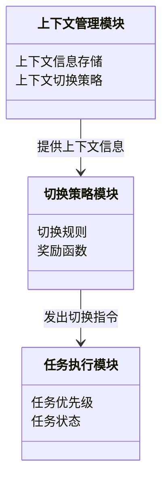
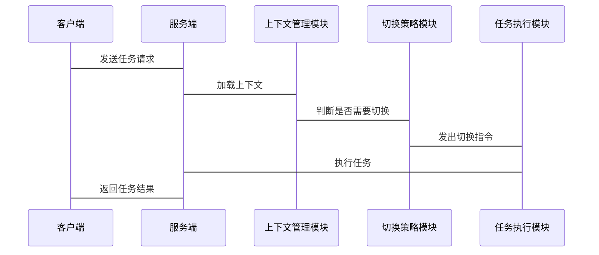

                 


# 实现AI Agent的动态上下文切换机制

## 关键词
AI Agent, 动态上下文切换, 多任务学习, 注意力机制, 强化学习, 系统架构

## 摘要
本文将深入探讨AI Agent的动态上下文切换机制，分析其实现原理、算法模型以及系统架构。通过详细讲解背景、核心概念、算法实现、系统设计和项目实战，帮助读者全面理解动态上下文切换的关键技术，掌握其实现方法和应用场景。本文结合理论与实践，提供丰富的案例和代码示例，帮助读者在实际项目中有效应用动态上下文切换机制，提升AI Agent的性能和灵活性。

---

# 第一部分: AI Agent与动态上下文切换机制概述

## 第1章: AI Agent基础与动态上下文切换的背景

### 1.1 AI Agent的基本概念
#### 1.1.1 什么是AI Agent
AI Agent（人工智能代理）是指能够感知环境、自主决策并执行任务的智能实体。它可以是一个软件程序、机器人或任何具有智能行为的实体。AI Agent的核心目标是通过感知和行动来优化目标函数，实现特定任务。

#### 1.1.2 AI Agent的类型与特点
AI Agent可以分为以下几种类型：
- **反应式AI Agent**：基于当前感知做出实时反应，适用于动态环境。
- **认知式AI Agent**：具备推理、规划和学习能力，适用于复杂任务。
- **学习型AI Agent**：通过经验优化行为策略，提升任务执行效率。
- **协作型AI Agent**：与其他Agent或人类协作完成任务。

AI Agent的特点包括：
- **自主性**：能够自主决策。
- **反应性**：能够实时感知并响应环境变化。
- **目标导向**：以目标函数为导向执行任务。
- **可扩展性**：能够处理多种任务和复杂场景。

#### 1.1.3 动态上下文切换的定义与重要性
动态上下文切换是指AI Agent在执行任务过程中，根据环境变化或任务需求，实时切换当前处理的上下文。例如，一个AI Agent可能在处理邮件时突然切换到处理日历任务，以应对紧急事件。

动态上下文切换的重要性体现在以下几个方面：
- **提升效率**：快速响应任务切换，避免任务堆积。
- **增强适应性**：在动态环境中灵活调整任务优先级。
- **优化资源利用**：合理分配计算资源，提高系统性能。

### 1.2 动态上下文切换的背景与应用
#### 1.2.1 当前AI Agent的挑战
AI Agent在实际应用中面临以下挑战：
- **任务干扰**：多个任务并行执行时，资源竞争可能导致效率下降。
- **环境不确定性**：动态环境中的突发情况需要快速响应。
- **上下文管理复杂性**：多个上下文的切换需要高效的管理机制。

#### 1.2.2 动态上下文切换的实际需求
动态上下文切换的需求主要源于以下场景：
- **多任务处理**：AI Agent需要在同一时间处理多个任务。
- **任务优先级变化**：根据环境变化调整任务优先级。
- **动态资源分配**：根据任务需求动态分配计算资源。

#### 1.2.3 动态上下文切换的应用场景
动态上下文切换的应用场景包括：
- **智能助手**：如 Siri、Alexa 等，需要根据用户需求切换任务。
- **自动驾驶**：车辆需要实时切换处理驾驶、导航、避障等任务。
- **智能客服**：在处理客户请求时，根据需求切换任务。

### 1.3 动态上下文切换的核心问题
#### 1.3.1 上下文管理的复杂性
上下文管理的复杂性主要体现在以下几个方面：
- **上下文表示**：如何有效表示和存储上下文信息。
- **上下文切换**：如何高效地切换上下文，减少切换开销。
- **上下文恢复**：如何快速恢复被切换的上下文，确保任务连续性。

#### 1.3.2 切换策略的优化方向
切换策略的优化方向包括：
- **减少切换次数**：通过优化任务优先级和资源分配，减少不必要的切换。
- **降低切换延迟**：通过高效的上下文管理机制，减少切换时间。
- **提高切换准确性**：通过智能决策算法，提高上下文切换的准确性。

#### 1.3.3 多任务处理的效率提升
多任务处理的效率提升需要关注以下几个方面：
- **任务优先级动态调整**：根据环境变化和任务目标，动态调整任务优先级。
- **资源动态分配**：根据任务需求，动态分配计算资源，确保任务高效执行。
- **任务切换优化**：通过优化切换策略，减少任务切换的开销，提高整体效率。

---

## 第2章: 动态上下文切换机制的核心概念

### 2.1 上下文管理模块
#### 2.1.1 上下文表示与存储
上下文表示与存储是动态上下文切换机制的核心部分。上下文通常包括以下信息：
- **任务状态**：任务的当前状态，如未完成、进行中、已完成。
- **任务参数**：任务的输入参数和目标。
- **环境信息**：环境的当前状态，如时间、位置、资源可用性等。

上下文可以通过以下方式表示：
- **数据结构**：如字典、对象等，用于存储上下文信息。
- **知识图谱**：通过知识图谱表示复杂的上下文关系。

上下文存储需要考虑以下因素：
- **存储效率**：存储方式应尽可能高效，减少存储开销。
- **访问速度**：上下文信息需要快速访问，以支持实时切换。
- **数据一致性**：确保上下文信息的一致性和准确性。

#### 2.1.2 上下文之间的关系
上下文之间的关系可以通过以下方式表示：
- **依赖关系**：某些任务的执行依赖于其他任务的上下文。
- **并行关系**：多个任务可以并行执行，互不干扰。
- **优先级关系**：任务优先级决定了切换的顺序。

#### 2.1.3 上下文切换的触发条件
上下文切换的触发条件包括：
- **任务优先级变化**：高优先级任务需要立即执行。
- **环境变化**：环境中的某些条件变化需要切换上下文。
- **资源可用性变化**：计算资源的变化需要调整任务执行顺序。

### 2.2 切换策略与算法
#### 2.2.1 基于规则的切换策略
基于规则的切换策略通过预定义的规则来决定是否切换上下文。例如：
- **规则1**：如果当前任务的优先级低于新任务的优先级，则切换上下文。
- **规则2**：如果当前任务已完成，则切换到下一个任务。

基于规则的切换策略简单易懂，但灵活性较差，难以应对复杂的动态环境。

#### 2.2.2 基于模型的切换策略
基于模型的切换策略通过构建数学模型来决定是否切换上下文。常用的模型包括：
- **马尔可夫决策过程模型**：通过状态转移概率和奖励函数来优化切换策略。
- **强化学习模型**：通过强化学习算法，学习最优的切换策略。

#### 2.2.3 基于反馈的切换策略
基于反馈的切换策略通过用户的反馈来调整切换策略。例如：
- **用户满意度反馈**：根据用户的满意度反馈，优化任务切换顺序。
- **任务完成时间反馈**：根据任务完成时间，优化任务执行顺序。

### 2.3 动态上下文切换的实现机制
#### 2.3.1 上下文切换的过程
上下文切换的过程包括以下几个步骤：
1. **检测切换触发条件**：检测是否需要切换上下文。
2. **评估切换影响**：评估切换对系统性能的影响。
3. **执行切换操作**：执行上下文切换操作。
4. **恢复上下文状态**：恢复被切换的上下文状态。

#### 2.3.2 切换过程中的状态管理
切换过程中的状态管理需要考虑以下几个方面：
- **当前状态保存**：保存当前任务的状态，以便后续恢复。
- **目标状态加载**：加载目标任务的状态，开始执行目标任务。
- **状态切换日志**：记录上下文切换的详细日志，便于后续分析。

#### 2.3.3 切换后的性能评估
切换后的性能评估包括以下几个方面：
- **任务完成时间**：评估任务完成时间是否在预期范围内。
- **系统资源利用率**：评估系统资源利用率是否合理。
- **切换次数**：评估切换次数是否在预期范围内。

---

## 第3章: 动态上下文切换的算法原理

### 3.1 多任务学习与注意力机制
#### 3.1.1 多任务学习的基本原理
多任务学习（Multi-Task Learning, MTL）是一种机器学习技术，旨在通过同时学习多个任务来提升模型的泛化能力。MTL的核心思想是将多个任务的特征和目标共享，从而提高模型的效率和性能。

#### 3.1.2 注意力机制在上下文切换中的应用
注意力机制（Attention Mechanism）是一种基于权重分配的技术，用于聚焦重要的上下文信息。在动态上下文切换中，注意力机制可以用于以下场景：
- **任务优先级判断**：通过注意力机制，判断任务的优先级。
- **上下文信息提取**：通过注意力机制，提取重要的上下文信息。

#### 3.1.3 基于Transformer的上下文表示
基于Transformer的上下文表示是一种高效的上下文表示方法。Transformer通过自注意力机制（Self-Attention）和前馈神经网络（FFN），可以有效地捕捉上下文信息。

### 3.2 基于强化学习的切换策略
#### 3.2.1 强化学习的基本概念
强化学习（Reinforcement Learning, RL）是一种基于试错的机器学习技术，通过智能体与环境的交互，学习最优策略。

#### 3.2.2 切换策略的强化学习建模
切换策略的强化学习建模包括以下几个步骤：
1. **状态空间定义**：定义智能体的当前状态，如任务优先级、资源可用性等。
2. **动作空间定义**：定义智能体可以执行的动作，如切换上下文、继续执行当前任务等。
3. **奖励函数设计**：设计奖励函数，用于评估智能体的动作是否有效。

#### 3.2.3 奖励函数的设计与优化
奖励函数的设计与优化是强化学习的核心部分。奖励函数需要能够有效引导智能体学习最优策略。常用的奖励函数设计方法包括：
- **基于任务完成时间的奖励函数**：奖励函数根据任务完成时间设计。
- **基于资源利用率的奖励函数**：奖励函数根据资源利用率设计。

### 3.3 动态上下文切换的数学模型
#### 3.3.1 多任务学习的数学模型
多任务学习的数学模型可以通过以下公式表示：
$$
L = \lambda_1 L_1 + \lambda_2 L_2 + \dots + \lambda_n L_n
$$
其中，\( L \) 是总的损失函数，\( L_i \) 是第 \( i \) 个任务的损失函数，\( \lambda_i \) 是第 \( i \) 个任务的权重系数。

#### 3.3.2 基于注意力机制的数学模型
基于注意力机制的数学模型可以通过以下公式表示：
$$
\alpha_i = \frac{\exp(s_i)}{\sum_{j=1}^n \exp(s_j)}
$$
其中，\( \alpha_i \) 是第 \( i \) 个任务的注意力权重，\( s_i \) 是第 \( i \) 个任务的得分。

#### 3.3.3 基于强化学习的数学模型
基于强化学习的数学模型可以通过以下公式表示：
$$
Q(s, a) = r + \gamma \max_{a'} Q(s', a')
$$
其中，\( Q(s, a) \) 是状态 \( s \) 下动作 \( a \) 的价值函数，\( r \) 是奖励，\( \gamma \) 是折扣因子，\( s' \) 是下一个状态，\( a' \) 是下一个动作。

---

## 第4章: 系统分析与架构设计方案

### 4.1 问题场景介绍
在动态上下文切换机制中，AI Agent需要能够实时感知环境变化，并根据任务需求切换上下文。常见的问题场景包括：
- **任务优先级变化**：高优先级任务需要立即执行，导致当前任务需要切换上下文。
- **环境变化**：环境中的某些条件变化需要切换上下文。
- **资源可用性变化**：计算资源的变化需要调整任务执行顺序。

### 4.2 项目介绍
本项目旨在实现一个支持动态上下文切换的AI Agent系统。系统的核心功能包括：
- **上下文管理**：管理多个上下文，支持上下文切换。
- **切换策略**：基于任务优先级、资源可用性和环境变化，自动切换上下文。
- **任务执行**：根据当前上下文，执行相应的任务。

### 4.3 系统功能设计
#### 4.3.1 领域模型
领域模型是一个概念化的模型，用于描述系统的核心概念及其关系。以下是领域模型的Mermaid类图：



#### 4.3.2 系统架构设计
以下是系统架构设计的Mermaid架构图：

```mermaid
architectural
    区域 AI Agent系统架构 {
        客户端
        服务端
    }
    客户端 --> 服务端: 发送任务请求
    服务端 --> 上下文管理模块: 管理上下文
    服务端 --> 切换策略模块: 切换上下文
    服务端 --> 任务执行模块: 执行任务
```

#### 4.3.3 系统接口设计
系统接口设计包括以下几个部分：
- **API接口**：提供给外部调用的API接口，如`switch_context(task_id)`。
- **消息队列**：用于异步处理任务切换。
- **日志系统**：记录上下文切换的详细日志。

#### 4.3.4 系统交互设计
以下是系统交互设计的Mermaid序列图：



---

## 第5章: 项目实战

### 5.1 环境安装
要实现动态上下文切换机制，需要安装以下环境：
- **Python**：3.8+
- **TensorFlow**：2.5+
- **Keras**：2.5+
- **Mermaid**：用于生成图表。

安装命令：
```bash
pip install tensorflow keras matplotlib mermaid
```

### 5.2 系统核心实现源代码
以下是动态上下文切换机制的核心代码示例：

```python
# 上下文管理模块
class ContextManager:
    def __init__(self):
        self.contexts = {}  # 存储上下文
        self.current_context = None  # 当前上下文

    def save_context(self, context_id):
        self.contexts[context_id] = {
            'task_state': self.current_context['task_state'],
            'task_params': self.current_context['task_params'],
            'environment_info': self.current_context['environment_info']
        }

    def load_context(self, context_id):
        if context_id in self.contexts:
            self.current_context = self.contexts[context_id]
            return True
        else:
            return False

# 切换策略模块
class SwitchStrategy:
    def __init__(self):
        self.switch_rules = []  # 切换规则

    def evaluate_switch(self, current_context, new_context):
        for rule in self.switch_rules:
            if rule['condition'](current_context, new_context):
                return rule['action'](current_context, new_context)
        return False

# 任务执行模块
class TaskExecutor:
    def __init__(self):
        self.current_task = None  # 当前任务

    def execute_task(self, task):
        if self.current_task != task:
            self.current_task = task
            # 执行任务
            print(f"切换到任务 {task['task_id']}")
        else:
            print(f"继续执行任务 {task['task_id']}")
```

### 5.3 代码应用解读与分析
上述代码实现了一个简单的动态上下文切换机制。ContextManager 类负责管理上下文，SwitchStrategy 类负责切换策略的评估，TaskExecutor 类负责任务的执行。

### 5.4 实际案例分析和详细讲解剖析
以下是一个实际案例的详细分析：
1. **案例背景**：一个AI Agent需要处理多个任务，如邮件处理、日历管理等。
2. **案例实现**：当AI Agent检测到紧急邮件需要处理时，切换到邮件处理任务。
3. **代码实现**：
   ```python
   # 初始化上下文管理模块
   context_manager = ContextManager()
   context_manager.current_context = {
       'task_state': 'idle',
       'task_params': {'task_id': 1, 'task_type': 'calendar'},
       'environment_info': {'time': '10:00', 'priority': 'low'}
   }
   context_manager.save_context(1)

   # 初始化切换策略模块
   switch_strategy = SwitchStrategy()
   switch_strategy.switch_rules = [
       {
           'condition': lambda current, new: current['environment_info']['priority'] < new['environment_info']['priority'],
           'action': lambda current, new: True
       }
   ]

   # 初始化任务执行模块
   task_executor = TaskExecutor()
   task_executor.execute_task(context_manager.current_context)
   ```

### 5.5 项目小结
通过上述代码实现，我们可以看到动态上下文切换机制的核心在于上下文的管理、切换策略的评估以及任务的执行。实际应用中，还需要考虑更多复杂的因素，如任务优先级的动态调整、资源的动态分配等。

---

## 第6章: 总结与扩展

### 6.1 最佳实践 tips
- **合理设计上下文管理模块**：确保上下文的存储和访问高效。
- **优化切换策略**：通过强化学习等技术优化切换策略。
- **关注任务优先级**：合理调整任务优先级，提升系统效率。

### 6.2 小结
本文详细探讨了AI Agent的动态上下文切换机制，从核心概念到算法原理，再到系统架构和项目实战，为读者提供了全面的指导。通过本文的学习，读者可以掌握动态上下文切换的核心技术，并将其应用于实际项目中。

### 6.3 注意事项
- **上下文切换的开销**：频繁的上下文切换可能会增加系统的开销。
- **任务优先级的动态调整**：需要设计合理的任务优先级调整机制。
- **资源分配的合理性**：确保资源分配的合理性，避免资源浪费。

### 6.4 拓展阅读
- **多任务学习**：深入学习多任务学习的技术细节。
- **强化学习**：研究强化学习在动态上下文切换中的应用。
- **分布式系统**：探讨动态上下文切换在分布式系统中的应用。

---

通过本文的学习，读者可以全面理解AI Agent的动态上下文切换机制，并能够将其应用到实际项目中。

