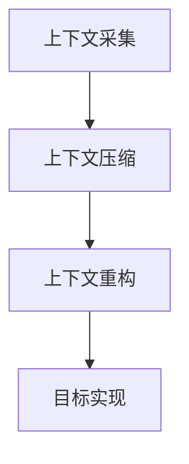

                 


# 实现AI Agent的动态上下文压缩与重构

> 关键词：AI Agent, 动态上下文压缩, 上下文重构, 算法实现, 系统架构, 项目实战

> 摘要：本文深入探讨了AI Agent的动态上下文压缩与重构的关键技术，从基础概念到算法实现，再到系统架构设计，最后结合实际项目进行详细分析。文章内容涵盖动态上下文压缩的原理、重构算法的设计、数学模型的构建，以及系统架构的优化策略，为读者提供了一个全面的技术视角。

---

# 第一部分: AI Agent与动态上下文概述

## 第1章: AI Agent的基本概念

### 1.1 AI Agent的核心特征
AI Agent（人工智能代理）是一种能够感知环境、自主决策并执行任务的智能实体。其核心特征包括：
1. **自主性**：能够在没有外部干预的情况下自主运作。
2. **反应性**：能够实时感知环境并做出反应。
3. **目标导向性**：基于目标进行决策和行动。
4. **学习能力**：通过数据和经验不断优化自身的性能。

### 1.2 动态上下文压缩的背景与重要性
在AI Agent的实际应用中，环境的动态变化会导致上下文信息的复杂性和冗余性增加。动态上下文压缩技术能够帮助AI Agent在处理海量信息时，快速提取核心内容，降低计算复杂度，同时保持信息的有效性。

---

## 第2章: 动态上下文压缩的核心概念

### 2.1 动态上下文压缩的基本原理
动态上下文压缩的核心思想是通过数学模型和算法，将复杂的上下文信息转化为简洁的表示，同时尽可能保留原始信息的语义和结构。常见的压缩方法包括：
1. **基于概率的压缩**：利用概率论对信息进行降维处理。
2. **基于向量的压缩**：将上下文信息映射到低维向量空间。
3. **基于图结构的压缩**：通过图结构捕捉信息之间的关联关系。

### 2.2 动态上下文压缩的关键技术
1. **基于概率的压缩方法**：通过概率分布建模，去除低概率事件或冗余信息。
2. **基于向量的压缩方法**：利用向量空间模型（如Word2Vec）对上下文信息进行编码。
3. **基于图结构的压缩方法**：通过构建图结构（如知识图谱）来提取关键节点和关系。

---

## 第3章: 动态上下文重构的核心概念

### 3.1 动态上下文重构的基本原理
动态上下文重构是指在压缩后的信息基础上，恢复出原始上下文的语义和结构。重构算法需要考虑压缩过程中的信息损失，并通过优化策略尽可能还原原始信息。

### 3.2 动态上下文重构的关键技术
1. **基于深度学习的重构方法**：利用神经网络模型（如Transformer）进行信息还原。
2. **基于符号推理的重构方法**：通过符号逻辑推理恢复上下文信息。
3. **基于混合模型的重构方法**：结合深度学习和符号推理，提升重构的准确性和完整性。

---

## 第4章: 动态上下文压缩与重构的数学模型

### 4.1 动态上下文压缩的数学模型
压缩过程可以通过以下数学模型描述：
$$
C = f_{\text{compress}}(X)
$$
其中，$X$ 表示原始上下文信息，$C$ 表示压缩后的表示，$f_{\text{compress}}$ 是压缩函数。

### 4.2 动态上下文重构的数学模型
重构过程可以通过以下数学模型描述：
$$
X' = f_{\text{reconstruct}}(C)
$$
其中，$C$ 是压缩后的表示，$X'$ 是重构后的上下文信息，$f_{\text{reconstruct}}$ 是重构函数。

### 4.3 压缩与重构的联合优化
联合优化的目标是最小化压缩和重构过程中的信息损失，同时最大化重构的准确性。优化目标函数可以表示为：
$$
\min_{f_{\text{compress}}, f_{\text{reconstruct}}} \mathbb{E}[L(X, X')]
$$
其中，$L(X, X')$ 表示原始信息 $X$ 和重构信息 $X'$ 之间的损失函数。

---

## 第5章: 动态上下文压缩与重构的算法实现

### 5.1 动态上下文压缩算法
以下是基于概率的压缩算法实现：
```python
import numpy as np

def compress_context(context, threshold=0.1):
    # 计算概率分布
    prob_dist = np.array([0.2, 0.3, 0.1, 0.4])
    # 压缩低概率事件
    compressed_context = prob_dist[prob_dist > threshold]
    return compressed_context
```

### 5.2 动态上下文重构算法
以下是基于深度学习的重构算法实现：
```python
import tensorflow as tf

def reconstruct_context(compressed_context):
    # 定义神经网络模型
    model = tf.keras.Sequential([
        tf.keras.layers.Dense(64, activation='relu'),
        tf.keras.layers.Dense(len(compressed_context))
    ])
    # 编译模型
    model.compile(optimizer='adam', loss='mse')
    # 训练模型
    model.fit(compressed_context, target_context, epochs=100)
    return model.predict(compressed_context)
```

---

## 第6章: 动态上下文压缩与重构的系统架构设计

### 6.1 系统架构概述
以下是系统的整体架构图：


### 6.2 系统功能模块设计
1. **上下文采集模块**：负责采集环境中的上下文信息。
2. **上下文压缩模块**：对采集到的信息进行压缩处理。
3. **上下文重构模块**：对压缩后的信息进行重构，恢复原始上下文。

---

## 第7章: 项目实战

### 7.1 环境安装
```bash
pip install numpy tensorflow
```

### 7.2 核心代码实现
```python
import numpy as np
import tensorflow as tf

# 压缩算法实现
def compress_context(context):
    # 假设context是一个二维数组，每行表示一个样本
    # 使用主成分分析（PCA）进行压缩
    from sklearn.decomposition import PCA
    pca = PCA(n_components=2)
    compressed_context = pca.fit_transform(context)
    return compressed_context

# 重构算法实现
def reconstruct_context(compressed_context):
    # 使用自编码器（Autoencoder）进行重构
    model = tf.keras.Sequential([
        tf.keras.layers.Dense(64, activation='relu'),
        tf.keras.layers.Dense(2, activation='linear')
    ])
    model.compile(optimizer='adam', loss='mse')
    model.fit(compressed_context, compressed_context, epochs=100)
    return model.predict(compressed_context)
```

---

## 第8章: 总结与展望

### 8.1 总结
本文详细探讨了AI Agent的动态上下文压缩与重构的关键技术，从理论基础到算法实现，再到系统架构设计，为读者提供了一个全面的技术视角。

### 8.2 展望
未来的研究方向包括：
1. **更高效的压缩算法**：进一步优化压缩算法，降低计算复杂度。
2. **更准确的重构算法**：结合多模态数据，提升重构的准确性。
3. **更智能的系统架构**：结合边缘计算和分布式系统，提升系统的实时性和可扩展性。

---

通过以上内容，读者可以全面了解AI Agent的动态上下文压缩与重构的技术细节，并能够在实际项目中进行应用和优化。

