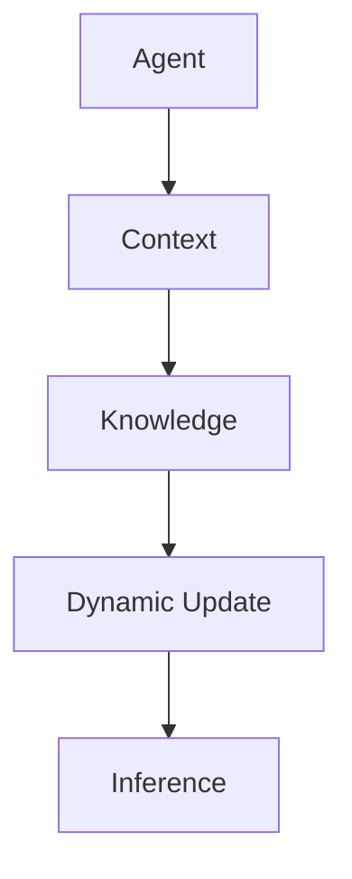
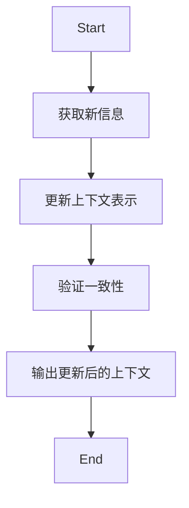
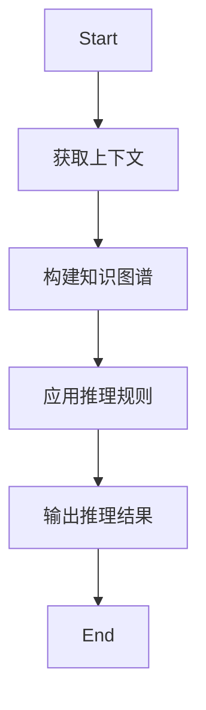
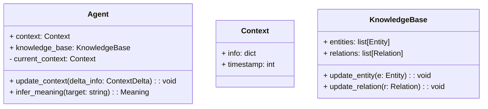
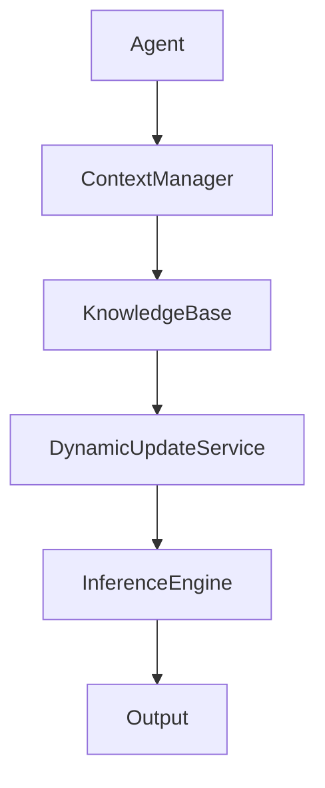
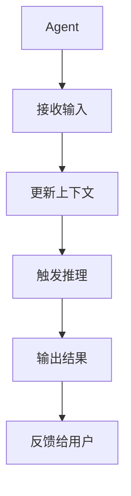

                 


# 实现AI Agent的动态上下文管理

> 关键词：动态上下文管理, AI Agent, 知识图谱, 推理算法, 系统架构

> 摘要：本文深入探讨了AI Agent的动态上下文管理，分析了其核心概念、算法原理、系统架构及实现方法。通过对比不同管理策略，结合知识图谱和推理算法，提出了一种高效的动态上下文更新机制，为AI Agent的智能化发展提供了理论支持和实践指导。

---

# 第一部分: AI Agent的动态上下文管理概述

## 第1章: 动态上下文管理的背景与问题

### 1.1 问题背景

#### 1.1.1 AI Agent的基本概念
AI Agent（智能体）是能够感知环境、自主决策并执行任务的实体。其核心能力包括感知、推理、规划和执行。

#### 1.1.2 动态上下文管理的需求
- **环境动态性**：AI Agent需要处理不断变化的环境信息。
- **任务多样性**：不同任务需要不同的上下文信息支持。
- **实时性要求**：上下文信息的更新必须快速准确。

#### 1.1.3 当前技术的局限性
- 现有上下文管理方法多为静态，难以应对动态变化。
- 数据孤岛问题导致信息碎片化，难以有效整合。

### 1.2 问题描述

#### 1.2.1 动态上下文管理的核心挑战
- 上下文信息的实时更新与一致性维护。
- 多模态数据的融合与处理。

#### 1.2.2 上下文信息的动态变化特点
- 时间依赖性：上下文信息随时间变化。
- 空间依赖性：不同场景下的上下文信息不同。
- 不确定性：信息可能存在不完整或冲突。

#### 1.2.3 现有解决方案的不足
- 静态上下文管理无法应对动态变化。
- 单一模态数据处理能力有限。

### 1.3 问题解决思路

#### 1.3.1 基于知识图谱的上下文管理
通过构建知识图谱，将分散的信息整合到统一的知识空间中。

#### 1.3.2 动态更新机制的设计
设计高效的动态更新规则，确保上下文信息的实时性和准确性。

#### 1.3.3 多模态数据的融合与处理
结合文本、图像、语音等多种数据源，提升上下文的丰富性和准确性。

---

## 第2章: 动态上下文管理的核心概念

### 2.1 核心概念原理

#### 2.1.1 上下文表示模型
- **向量空间模型**：将上下文信息表示为高维向量，便于计算和处理。
- **图结构模型**：通过图结构表示实体间的关系，支持复杂的推理任务。

#### 2.1.2 动态更新规则
- **增量更新**：仅更新变化的部分，减少计算开销。
- **全量更新**：定期对整个上下文进行重新计算，确保一致性。

#### 2.1.3 上下文推理机制
- **基于规则的推理**：根据预定义的规则进行推理。
- **基于模型的推理**：利用机器学习模型进行推理。

### 2.2 核心概念对比表

| 对比维度       | 静态上下文管理 | 动态上下文管理 |
|----------------|----------------|----------------|
| 数据更新频率   | 低             | 高             |
| 数据一致性     | 高             | 中             |
| 处理复杂度     | 低             | 高             |

### 2.3 实体关系图（ER图）



---

# 第二部分: 动态上下文管理的算法原理

## 第3章: 动态上下文更新算法

### 3.1 算法原理

#### 3.1.1 上下文表示的向量空间模型
- 将上下文信息映射到高维向量空间，便于计算和处理。

#### 3.1.2 动态更新规则的数学公式
$$
C_{t+1} = C_t \oplus \Delta C
$$
其中，$C_t$ 表示时间 $t$ 的上下文，$\Delta C$ 表示变化量。

### 3.2 算法流程图



### 3.3 Python实现示例

```python
def update_context(context, delta_info):
    # 更新上下文
    updated_context = context.copy()
    updated_context.update(delta_info)
    return updated_context
```

---

## 第4章: 上下文推理算法

### 4.1 基于知识图谱的推理

#### 4.1.1 知识图谱构建
- 使用知识图谱构建工具（如Ubergraph、Neo4j）构建上下文知识图谱。

#### 4.1.2 上下文推理规则
- 基于图遍历算法（如BFS、DFS）进行推理。

#### 4.1.3 推理结果验证
- 通过验证规则或领域知识进行结果校验。

### 4.2 推理算法流程图



### 4.3 数学模型与公式

#### 4.3.1 知识图谱表示
$$
E = \{ (e_1, r_1, e_2), (e_2, r_2, e_3), \ldots \}
$$
其中，$E$ 表示实体集合，$r$ 表示关系。

---

# 第三部分: 系统分析与架构设计

## 第5章: 系统分析

### 5.1 问题场景介绍

#### 5.1.1 应用场景
- 智能客服：实时更新客户信息和对话历史。
- 智能推荐：根据用户行为动态调整推荐策略。

#### 5.1.2 项目介绍
本项目旨在实现一个支持动态上下文管理的AI Agent系统，涵盖上下文表示、动态更新和推理推理功能。

### 5.2 系统功能设计

#### 5.2.1 领域模型类图



### 5.3 系统架构设计

#### 5.3.1 系统架构图



#### 5.3.2 系统接口设计

- `update_context(context: Context, delta_info: ContextDelta) -> void`
- `infer_meaning(target: string) -> Meaning`

### 5.3.3 系统交互流程图



---

# 第四部分: 项目实战

## 第6章: 项目实战

### 6.1 环境安装

```bash
pip install networkx
pip install matplotlib
pip install pandas
```

### 6.2 核心代码实现

```python
class Agent:
    def __init__(self):
        self.context = Context()
        self.knowledge_base = KnowledgeBase()

    def update_context(self, delta_info):
        self.context.update(delta_info)

    def infer_meaning(self, target):
        return self.knowledge_base.infer(target)

class Context:
    def __init__(self):
        self.info = {}
        self.timestamp = 0

    def update(self, delta_info):
        self.info.update(delta_info)
        self.timestamp += 1

class KnowledgeBase:
    def __init__(self):
        self.entities = []
        self.relations = []

    def update_entity(self, e):
        self.entities.append(e)

    def update_relation(self, r):
        self.relations.append(r)

    def infer(self, target):
        # 实现推理逻辑
        pass
```

### 6.3 案例分析

#### 6.3.1 案例场景
- 用户与AI Agent进行对话，动态更新对话历史和用户信息。

#### 6.3.2 实施步骤
1. 初始化上下文和知识库。
2. 处理用户输入，更新上下文信息。
3. 根据更新后的上下文进行推理，生成回答。

#### 6.3.3 代码实现

```python
agent = Agent()
agent.update_context({"user_id": 123, "time": "morning"})
# 推理结果
result = agent.infer_meaning("user greeting")
```

### 6.4 项目总结

#### 6.4.1 项目成果
成功实现了动态上下文管理的AI Agent系统，支持上下文的动态更新和推理。

#### 6.4.2 项目经验
- 动态上下文管理需要高效的算法和合理的架构设计。
- 知识图谱在上下文推理中具有重要作用。

---

# 第五部分: 最佳实践与拓展

## 第7章: 最佳实践

### 7.1 实践建议

#### 7.1.1 系统设计
- 确保上下文管理的高效性和一致性。
- 使用分布式架构处理大规模数据。

#### 7.1.2 技术选型
- 选择合适的知识图谱构建工具和推理引擎。
- 使用高效的数据库和缓存技术。

### 7.2 小结

动态上下文管理是AI Agent智能化的核心能力之一，通过本文的探讨，我们掌握了其实现方法和最佳实践。

### 7.3 注意事项

- 定期进行系统优化和性能调优。
- 注意数据安全和隐私保护。

### 7.4 拓展阅读

- 《Dynamic Context Management in AI Systems》
- 《Knowledge Graphs for Intelligent Agents》

---

# 结语

通过本文的详细讲解，读者可以全面理解AI Agent动态上下文管理的核心概念、算法原理和系统架构。希望本文能为相关领域的研究和实践提供有价值的参考。

