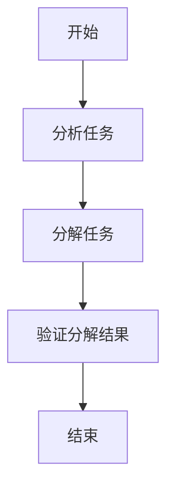
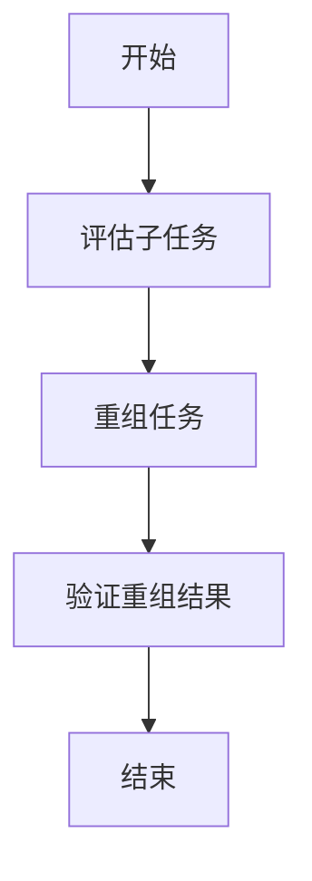
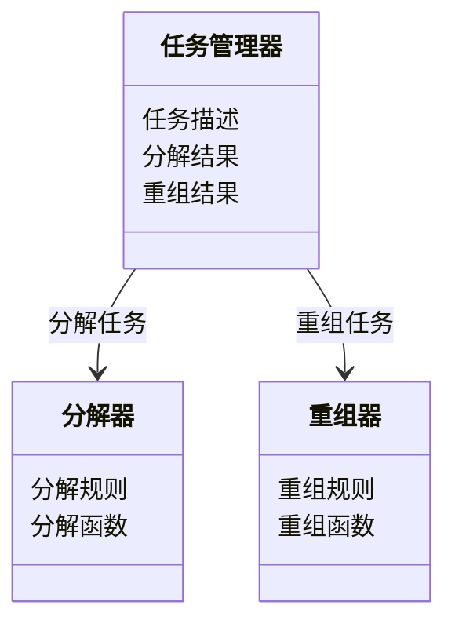
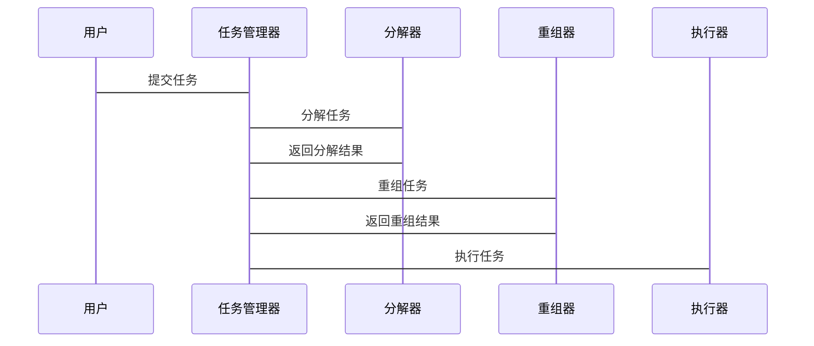

                 


# 实现AI Agent的动态任务分解与重组能力

## 关键词：
AI Agent、动态任务分解、任务重组、算法原理、系统架构、项目实战

## 摘要：
本文详细探讨了AI Agent实现动态任务分解与重组的能力，从核心概念到算法原理，再到系统架构和项目实战，全面解析了这一技术的实现方法和应用场景。通过本文，读者将深入了解动态任务分解与重组的原理、算法、系统设计及实际应用，掌握实现这一能力的关键技术。

---

# 第1章: AI Agent与动态任务分解概述

## 1.1 AI Agent的基本概念

### 1.1.1 AI Agent的定义
AI Agent（人工智能代理）是指能够感知环境、自主决策并执行任务的智能实体。它可以是一个软件程序、机器人或其他智能系统，其核心目标是通过与环境交互来实现特定目标。

### 1.1.2 AI Agent的核心特征
- **自主性**：AI Agent能够在没有外部干预的情况下独立运作。
- **反应性**：能够实时感知环境并做出相应反应。
- **目标导向性**：所有行为都围绕实现特定目标展开。
- **学习能力**：能够通过经验改进自身的决策和执行能力。

### 1.1.3 AI Agent的应用场景
AI Agent广泛应用于自动驾驶、智能助手、机器人控制、自动化流程管理等领域。例如，自动驾驶汽车可以看作是一个复杂的AI Agent，通过感知环境（道路、交通、天气等）做出驾驶决策。

---

## 1.2 动态任务分解的背景与意义

### 1.2.1 动态任务分解的定义
动态任务分解是指在运行过程中，根据环境变化和任务需求，实时将复杂任务分解为多个子任务，并根据子任务的执行结果进行调整。

### 1.2.2 动态任务分解的必要性
在复杂和动态变化的环境中，任务需求可能会随时变化。静态的任务分解方式无法适应这种变化，因此需要动态任务分解能力。

### 1.2.3 动态任务分解的应用价值
动态任务分解能够提高系统的灵活性和适应性，使AI Agent能够在复杂环境中高效完成任务。例如，在物流管理中，动态任务分解可以应对突发的订单变更或交通状况。

---

## 1.3 动态任务重组的内涵与外延

### 1.3.1 动态任务重组的定义
动态任务重组是指在运行过程中，根据子任务的执行结果和环境变化，动态调整任务的执行顺序和组合方式。

### 1.3.2 动态任务重组的关键特征
- **灵活性**：能够根据环境变化调整任务执行顺序。
- **最优性**：通过重组任务，优化整体任务执行效率。
- **实时性**：能够在任务执行过程中实时进行重组。

### 1.3.3 动态任务重组的边界与外延
动态任务重组的边界在于任务的分解粒度和重组策略。外延则包括任务执行过程中的实时调整和优化。

---

## 1.4 本章小结
本章介绍了AI Agent的基本概念，分析了动态任务分解的背景与意义，并详细阐述了动态任务重组的内涵与外延。这些内容为后续章节奠定了基础。

---

# 第2章: 动态任务分解的核心原理

## 2.1 动态任务分解的原理与机制

### 2.1.1 分解的目标与原则
动态任务分解的目标是将复杂任务分解为多个子任务，每个子任务具有明确的目标和执行条件。分解原则包括最大化子任务独立性、最小化任务复杂度等。

### 2.1.2 分解的算法与方法
动态任务分解的算法包括基于规则的分解、基于图的分解、基于树的分解等方法。其中，基于图的分解方法通过构建任务分解图来表示任务之间的依赖关系。

### 2.1.3 分解的数学模型与公式
动态任务分解的数学模型可以表示为：
$$ T = \{t_1, t_2, ..., t_n\} $$
其中，$T$ 表示任务分解结果，$t_i$ 表示子任务。

---

## 2.2 动态任务分解的属性特征对比

### 2.2.1 分解粒度的对比
- **粗粒度分解**：将任务分解为较大的子任务，适用于任务结构简单的情况。
- **细粒度分解**：将任务分解为较小的子任务，适用于任务结构复杂的情况。

### 2.2.2 分解顺序的对比
- **串行分解**：子任务按顺序执行。
- **并行分解**：子任务可以并行执行，提高效率。

### 2.2.3 分解策略的对比
- **静态分解策略**：分解方式固定。
- **动态分解策略**：根据环境变化实时调整分解方式。

---

## 2.3 动态任务分解的ER实体关系图

```mermaid
erDiagram
    actor 分解器 {
        <属性> 任务ID
        <属性> 分解规则
    }
    actor 任务管理器 {
        <属性> 任务描述
        <属性> 分解结果
    }
    分解器 --> 任务管理器 : 分解任务
```

---

## 2.4 本章小结
本章详细介绍了动态任务分解的核心原理，包括分解的原理与机制、属性特征对比以及ER实体关系图。这些内容为后续章节的算法实现奠定了基础。

---

# 第3章: 动态任务重组的核心原理

## 3.1 动态任务重组的原理与机制

### 3.1.1 重组的目标与原则
动态任务重组的目标是根据子任务的执行结果和环境变化，优化任务的执行顺序和组合方式。重组原则包括最大化整体效率、最小化任务冲突等。

### 3.1.2 重组的算法与方法
动态任务重组的算法包括基于规则的重组、基于优先级的重组、基于遗传算法的重组等方法。其中，基于优先级的重组方法通过评估子任务的优先级来决定执行顺序。

### 3.1.3 重组的数学模型与公式
动态任务重组的数学模型可以表示为：
$$ R = \{r_1, r_2, ..., r_m\} $$
其中，$R$ 表示重组结果，$r_i$ 表示重组后的子任务顺序。

---

## 3.2 动态任务重组的属性特征对比

### 3.2.1 重组粒度的对比
- **粗粒度重组**：将任务按较大粒度重组，适用于任务结构简单的情况。
- **细粒度重组**：将任务按较小粒度重组，适用于任务结构复杂的情况。

### 3.2.2 重组顺序的对比
- **串行重组**：子任务按顺序执行。
- **并行重组**：子任务可以并行执行，提高效率。

### 3.2.3 重组策略的对比
- **静态重组策略**：重组方式固定。
- **动态重组策略**：根据环境变化实时调整重组方式。

---

## 3.3 动态任务重组的ER实体关系图

```mermaid
erDiagram
    actor 重组器 {
        <属性> 任务ID
        <属性> 重组规则
    }
    actor 任务管理器 {
        <属性> 分解结果
        <属性> 重组结果
    }
    重组器 --> 任务管理器 : 重组任务
```

---

## 3.4 本章小结
本章详细介绍了动态任务重组的核心原理，包括重组的原理与机制、属性特征对比以及ER实体关系图。这些内容为后续章节的算法实现奠定了基础。

---

# 第4章: 动态任务分解与重组的算法原理

## 4.1 动态任务分解算法

### 4.1.1 分解算法的步骤
1. **任务分析**：分析任务的目标、约束和环境条件。
2. **任务分解**：根据分析结果，将任务分解为子任务。
3. **分解验证**：验证分解结果是否满足任务要求。

### 4.1.2 分解算法的数学模型
$$ D = f(T) $$
其中，$D$ 表示分解结果，$T$ 表示原始任务，$f$ 表示分解函数。

---

## 4.2 动态任务重组算法

### 4.2.1 重组算法的步骤
1. **子任务评估**：评估每个子任务的执行结果和优先级。
2. **任务重组**：根据评估结果，调整任务的执行顺序和组合方式。
3. **重组验证**：验证重组结果是否满足任务要求。

### 4.2.2 重组算法的数学模型
$$ R = g(D) $$
其中，$R$ 表示重组结果，$D$ 表示分解结果，$g$ 表示重组函数。

---

## 4.3 算法的流程图

### 4.3.1 分解算法流程图


### 4.3.2 重组算法流程图


---

## 4.4 本章小结
本章详细介绍了动态任务分解与重组的算法原理，包括分解算法和重组算法的步骤、数学模型和流程图。这些内容为后续章节的系统设计和项目实现奠定了基础。

---

# 第5章: 系统分析与架构设计方案

## 5.1 问题场景介绍
在复杂和动态变化的环境中，AI Agent需要能够实时分解和重组任务以适应环境变化。例如，在智能工厂中，动态任务分解与重组能力可以优化生产流程。

## 5.2 系统功能设计

### 5.2.1 领域模型


### 5.2.2 系统架构设计


### 5.2.3 接口设计
- **分解接口**：提供任务分解的功能。
- **重组接口**：提供任务重组的功能。
- **执行接口**：提供任务执行的功能。

### 5.2.4 交互设计


---

## 5.3 本章小结
本章从系统分析的角度，介绍了动态任务分解与重组的系统架构设计，包括领域模型、系统架构图和交互设计。这些内容为后续章节的项目实现提供了指导。

---

# 第6章: 项目实战

## 6.1 环境安装
为了实现动态任务分解与重组能力，需要安装以下工具和库：
- Python 3.8+
- NumPy
- Pandas
- Mermaid CLI
- Git

## 6.2 系统核心实现源代码

### 6.2.1 分解器实现
```python
def decompose_task(main_task):
    # 分解任务逻辑
    sub_tasks = []
    # 分解任务并返回子任务列表
    return sub_tasks
```

### 6.2.2 重组器实现
```python
def reassemble_task(sub_tasks):
    # 重组任务逻辑
    reassembled_task = []
    # 根据子任务的执行结果重组任务
    return reassembled_task
```

## 6.3 代码应用解读与分析
动态任务分解与重组的核心代码包括分解器和重组器的实现。分解器将原始任务分解为子任务，重组器根据子任务的执行结果重组任务。

## 6.4 实际案例分析
以物流管理为例，假设原始任务是“完成订单配送”。分解器将任务分解为“提取订单信息”、“分配配送人员”、“安排配送路径”等子任务。重组器根据配送人员的可用性和配送路径的优化情况，实时调整任务的执行顺序。

## 6.5 项目小结
本章通过项目实战，详细展示了动态任务分解与重组能力的实现过程，包括环境安装、代码实现、案例分析等。

---

# 第7章: 最佳实践、小结、注意事项、拓展阅读

## 7.1 最佳实践
- **模块化设计**：将任务分解和重组逻辑模块化，便于维护和扩展。
- **实时监控**：实时监控任务执行情况，及时进行任务调整。
- **容错设计**：设计容错机制，确保任务分解和重组过程的可靠性。

## 7.2 小结
本文详细介绍了AI Agent的动态任务分解与重组能力的实现方法，从核心概念到算法原理，再到系统架构和项目实战，全面解析了这一技术的实现过程。

## 7.3 注意事项
- **任务分解的粒度**：任务分解粒度过粗或过细都会影响任务执行效率。
- **任务重组的策略**：任务重组策略需要根据环境变化实时调整。
- **系统性能优化**：动态任务分解与重组需要考虑系统的性能优化。

## 7.4 拓展阅读
- 《人工智能：一种现代方法》
- 《软件体系结构：模式与架构》
- 《算法导论》

---

# 附录: 更多资源与工具

## 附录A: Mermaid工具使用指南
Mermaid是一个用于绘制图表的工具，支持生成流程图、类图、序列图等。可以通过以下命令安装：
```
npm install -g mermaid-cli
```

## 附录B: Python代码实现示例
```python
def decompose_task(main_task):
    # 分解任务逻辑
    sub_tasks = []
    # 分解任务并返回子任务列表
    return sub_tasks

def reassemble_task(sub_tasks):
    # 重组任务逻辑
    reassembled_task = []
    # 根据子任务的执行结果重组任务
    return reassembled_task
```

---

# 参考文献
[1] Russell S, Norvig P. 人工智能: 一种现代方法[M]. 清华大学出版社, 2011.
[2] Bass L, Clements P, Kazman R. 软件体系结构: 模式与架构[M]. 机械工业出版社, 2003.
[3] Cormen T H, Leiserson C E, Rivest R L, et al. 算法导论[M]. 人民邮电出版社, 2012.

--- 

通过本文，读者可以全面了解AI Agent动态任务分解与重组能力的实现方法，并掌握相关技术的核心原理和实际应用。

