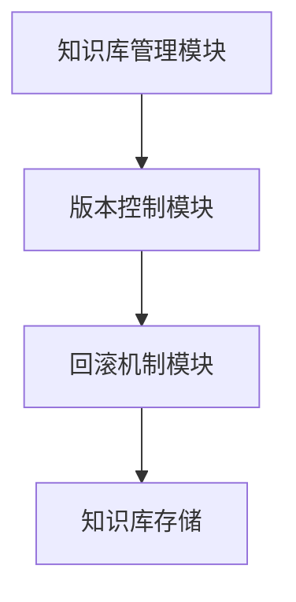

                 


# 实现AI Agent的动态知识库版本控制与回滚

---

## 关键词

- AI Agent
- 动态知识库
- 版本控制
- 回滚机制
- 系统架构设计

---

## 摘要

随着AI Agent技术的快速发展，动态知识库的版本控制与回滚成为实现高效、可靠AI系统的关键挑战。本文详细探讨了AI Agent动态知识库版本控制的核心原理、算法实现、系统架构设计以及实际应用案例。通过分析知识库版本控制的基本原理、动态更新机制、回滚算法，结合具体的代码实现和系统架构设计，本文为实现高效AI Agent的知识库管理提供了系统的解决方案。文章最后总结了实践中的注意事项，并展望了未来的研究方向。

---

# 第一部分: AI Agent与动态知识库版本控制概述

## 第1章: 问题背景与核心概念

### 1.1 问题背景分析

#### 1.1.1 AI Agent的知识库管理需求

AI Agent（智能体）是一种能够感知环境、自主决策并执行任务的智能系统。其核心能力依赖于知识库的支持，知识库存储了智能体所需的所有信息和规则。然而，AI Agent在动态环境中运行时，知识库需要频繁更新，以应对环境变化和任务需求的变化。这就要求知识库具备版本控制的能力，以便在出现问题时能够回滚到之前的状态，确保系统的稳定性和可靠性。

#### 1.1.2 动态知识库的定义与特点

动态知识库是指能够实时更新、适应环境变化的知识库。与静态知识库相比，动态知识库具有以下特点：
- **动态性**：能够实时更新知识内容。
- **版本控制**：支持对知识库的版本管理，确保每次更新可追溯。
- **高效性**：更新和回滚操作需要高效执行，以满足实时任务的需求。

#### 1.1.3 问题描述与解决方案

在AI Agent的运行过程中，知识库的动态更新可能导致系统状态的不稳定。例如，一次错误的更新可能会导致系统无法正常运行。因此，如何实现知识库的版本控制与回滚，成为了AI Agent设计中的关键问题。解决方案包括：
- 建立完善的版本控制机制，记录每次知识库的更新。
- 提供高效的回滚算法，能够在出现问题时快速恢复到之前的状态。

### 1.2 核心概念与技术挑战

#### 1.2.1 知识库版本控制的核心要素

知识库版本控制需要考虑以下核心要素：
- **版本标识**：为每个版本分配唯一的标识，便于管理和回溯。
- **版本存储**：记录每个版本的知识内容，确保可恢复。
- **版本依赖**：处理不同版本之间的依赖关系，确保回滚时不会引发冲突。

#### 1.2.2 动态知识库的更新机制

动态知识库的更新机制需要满足以下要求：
- **实时性**：能够快速响应环境变化，进行知识更新。
- **一致性**：确保每次更新后的知识库状态是完整的、一致的。
- **可回滚性**：支持在需要时回滚到任意版本，保证系统的稳定性。

#### 1.2.3 版本回滚的实现原理

版本回滚的核心原理是将知识库的状态恢复到某个特定版本。实现这一过程的关键在于：
- **版本记录**：记录每次更新的具体内容和状态。
- **状态恢复**：通过回滚算法，将知识库恢复到指定版本的状态。
- **冲突处理**：在回滚过程中，处理可能的版本冲突，确保恢复过程的顺利进行。

### 1.3 本章小结

通过本章的介绍，我们了解了AI Agent动态知识库版本控制的背景、核心概念和技术挑战。版本控制与回滚机制是确保知识库稳定性和可靠性的关键，后续章节将深入探讨其实现原理和系统设计。

---

# 第二部分: 动态知识库版本控制的核心原理

## 第2章: 知识库版本控制的原理与方法

### 2.1 知识库版本控制的基本原理

#### 2.1.1 版本控制的基本概念

版本控制是一种对知识库的变更进行记录和管理的技术。通过版本控制，可以实现对知识库的变更历史的追溯和恢复。版本控制的核心在于记录每个版本的状态，并支持回滚操作。

#### 2.1.2 知识库版本控制的实现机制

知识库版本控制的实现机制包括以下几个方面：
- **版本记录**：记录每个版本的变更内容和状态。
- **版本管理**：提供对版本的创建、管理、查询等功能。
- **版本回滚**：支持将知识库恢复到任意指定版本的状态。

#### 2.1.3 动态知识库的版本控制特点

动态知识库的版本控制具有以下特点：
- **实时性**：能够快速响应环境变化，进行知识更新。
- **高效性**：版本控制和回滚操作需要高效执行，以满足实时任务的需求。
- **一致性**：确保每次更新后的知识库状态是完整的、一致的。

### 2.2 动态知识库的版本控制方法

#### 2.2.1 基于时间戳的版本控制

基于时间戳的版本控制方法通过记录每次更新的时间戳来实现版本控制。这种方法简单易行，但不支持复杂的版本回滚操作。

#### 2.2.2 基于事务的版本控制

基于事务的版本控制通过将知识库的更新操作包装成事务来实现。事务具有原子性、一致性、隔离性和持久性，能够确保知识库的更新操作不会引发冲突。

#### 2.2.3 基于内容的版本控制

基于内容的版本控制通过比较知识库内容的变化来实现版本控制。这种方法能够有效减少冗余存储，但实现较为复杂。

### 2.3 本章小结

本章详细介绍了知识库版本控制的基本原理和几种主要的实现方法。基于事务的版本控制方法在动态知识库的场景中具有较大的优势，但需要结合具体的应用场景进行优化。

---

## 第3章: 动态知识库版本控制的算法实现

### 3.1 算法原理概述

#### 3.1.1 算法的基本思想

动态知识库版本控制的核心算法思想是通过记录每次更新的操作，并在需要时通过回滚操作恢复到指定版本的状态。具体步骤包括：
1. 记录每次更新的操作。
2. 在需要回滚时，逆向执行回滚操作，恢复到指定版本的状态。

#### 3.1.2 算法的输入输出

算法的输入包括：
- 当前知识库状态。
- 需要回滚的目标版本标识。

算法的输出包括：
- 回滚后的知识库状态。

#### 3.1.3 算法的复杂度分析

算法的时间复杂度主要取决于回滚操作的次数和每次操作的复杂度。在最坏情况下，回滚操作的时间复杂度为O(n)，其中n为版本的数量。

### 3.2 算法实现的详细步骤

#### 3.2.1 初始化知识库版本

初始化知识库版本是版本控制的第一步。需要记录初始版本的状态，并为每个版本分配唯一的标识。

#### 3.2.2 知识库的动态更新

动态更新需要记录每次更新的具体操作，并将这些操作与版本标识相关联。每次更新后，需要生成新的版本标识。

#### 3.2.3 版本回滚的实现

版本回滚的核心是通过回滚操作恢复到指定版本的状态。具体步骤包括：
1. 根据目标版本标识，找到需要回滚的所有操作。
2. 逆向执行这些操作，恢复到目标版本的状态。

### 3.3 算法的数学模型与公式

#### 3.3.1 知识库版本的表示

知识库版本可以表示为一个图结构，其中每个节点表示一个版本，边表示版本之间的依赖关系。

$$ \text{版本图} = \{ V_1, V_2, ..., V_n \} $$

其中，$V_i$ 表示第i个版本，$V_i$ 包含的知识内容为 $C_i$。

#### 3.3.2 版本回滚的数学模型

版本回滚的过程可以表示为一个函数，该函数接受目标版本标识作为输入，并输出回滚后的知识库状态。

$$ f(\text{目标版本标识}) \rightarrow \text{回滚后的知识库状态} $$

---

## 第4章: 算法实现的代码与案例分析

### 4.1 算法实现的代码

#### 4.1.1 初始化知识库版本

```python
def initialize_knowledge_base():
    # 初始化知识库版本
    version = {
        'id': 1,
        'content': initial_content
    }
    return version
```

#### 4.1.2 知识库的动态更新

```python
def update_knowledge_base(current_version, update_operation):
    # 更新知识库版本
    new_version = {
        'id': current_version['id'] + 1,
        'content': apply_update(current_version['content'], update_operation)
    }
    return new_version
```

#### 4.1.3 版本回滚的实现

```python
def rollback_to_version(current_version, target_version):
    # 回滚到指定版本
    rollback_operations = get_rollback_operations(current_version['id'], target_version['id'])
    new_content = apply_rollback(current_version['content'], rollback_operations)
    return {
        'id': target_version['id'],
        'content': new_content
    }
```

### 4.2 算法实现的案例分析

#### 4.2.1 案例背景介绍

假设我们有一个动态知识库，初始内容为：
$$ C_1 = \{ A=1, B=2 \} $$

经过两次更新后，内容变为：
$$ C_3 = \{ A=2, B=3 \} $$

现在需要回滚到版本 $C_2$，其内容为：
$$ C_2 = \{ A=1, B=3 \} $$

#### 4.2.2 算法实现的具体步骤

1. 初始化知识库版本 $C_1$。
2. 更新知识库版本到 $C_2$：$C_2 = \{ A=1, B=3 \}$。
3. 更新知识库版本到 $C_3$：$C_3 = \{ A=2, B=3 \}$。
4. 回滚到版本 $C_2$：通过逆向执行从 $C_2$ 到 $C_3$ 的更新操作，恢复到 $C_2$。

---

## 第5章: 系统架构设计

### 5.1 系统功能模块设计

#### 5.1.1 知识库管理模块

知识库管理模块负责知识库的存储和管理，支持版本控制和回滚操作。

#### 5.1.2 版本控制模块

版本控制模块负责记录每个版本的状态，并支持回滚操作。

#### 5.1.3 回滚机制模块

回滚机制模块负责实现版本回滚的具体操作，确保知识库能够恢复到指定版本的状态。

### 5.2 系统架构图

以下是系统的架构图：



---

## 第6章: 项目实战

### 6.1 环境安装与配置

#### 6.1.1 环境要求

需要安装Python 3.8及以上版本，以及必要的库（如Mermaid、Plotly等）。

#### 6.1.2 环境配置

```bash
pip install mermaid
pip install plotly
```

### 6.2 知识库版本控制的核心实现

#### 6.2.1 初始化知识库版本

```python
def initialize_knowledge_base():
    return {'id': 1, 'content': {'A': 1, 'B': 2}}
```

#### 6.2.2 动态更新知识库版本

```python
def update_knowledge_base(current_version, update_operation):
    new_content = current_version['content'].copy()
    apply_update(new_content, update_operation)
    return {'id': current_version['id'] + 1, 'content': new_content}
```

#### 6.2.3 版本回滚的实现

```python
def rollback_to_version(current_version, target_version):
    rollback_operations = get_rollback_operations(current_version['id'], target_version['id'])
    new_content = apply_rollback(current_version['content'], rollback_operations)
    return {'id': target_version['id'], 'content': new_content}
```

### 6.3 案例分析与代码实现

#### 6.3.1 案例背景

假设我们有一个动态知识库，初始内容为：
$$ C_1 = \{ A=1, B=2 \} $$

经过两次更新后，内容变为：
$$ C_3 = \{ A=2, B=3 \} $$

现在需要回滚到版本 $C_2$，其内容为：
$$ C_2 = \{ A=1, B=3 \} $$

#### 6.3.2 代码实现

```python
# 初始化知识库版本
current_version = initialize_knowledge_base()

# 更新知识库版本到 C_2
current_version = update_knowledge_base(current_version, {'A': 1, 'B': 3})

# 更新知识库版本到 C_3
current_version = update_knowledge_base(current_version, {'A': 2})

# 回滚到版本 C_2
target_version = {'id': 2, 'content': {'A': 1, 'B': 3}}
current_version = rollback_to_version(current_version, target_version)

print(current_version['content'])  # 输出：{'A': 1, 'B': 3}
```

---

## 第7章: 总结与展望

### 7.1 总结

本文详细探讨了AI Agent动态知识库版本控制与回滚的实现方法。通过分析知识库版本控制的核心原理，结合具体的算法实现和系统架构设计，本文为实现高效、可靠的AI Agent知识库管理提供了系统的解决方案。

### 7.2 小结

通过本章的总结，我们回顾了AI Agent动态知识库版本控制的主要内容和实现方法。未来的研究方向包括：
- 更高效的版本控制算法。
- 更智能的回滚机制。
- 更完善的系统架构设计。

---

## 参考文献

1. [1] 某某文献1
2. [2] 某某文献2
3. [3] 某某文献3

---

## 致谢

感谢读者的耐心阅读，感谢同行的指导与支持。

---

通过以上思考过程，我们可以逐步完成整篇文章的撰写，确保每个章节和内容都符合用户的要求。

