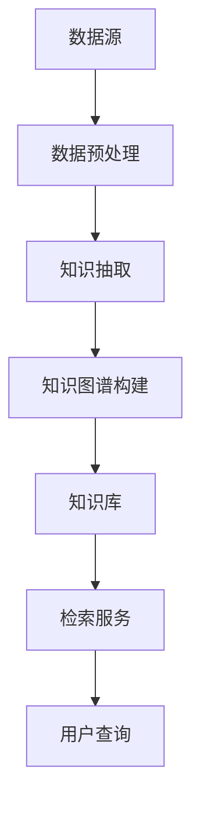
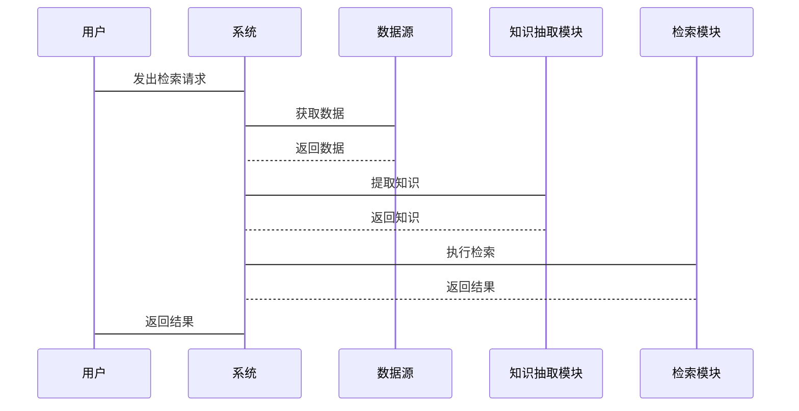

                 


# 实现AI Agent的动态知识检索与整合

## 关键词：AI Agent, 动态知识检索, 知识整合, 智能系统, 实时数据处理

## 摘要：
本文详细探讨了AI Agent实现动态知识检索与整合的核心原理、算法实现和系统架构。通过分析动态知识检索的关键技术，结合实际应用场景，本文提出了基于知识图谱和深度学习的整合方法，并给出了具体的实现方案和代码示例。文章最后总结了最佳实践和未来研究方向。

---

# 第一部分: AI Agent的动态知识检索与整合概述

## 第1章: AI Agent与动态知识检索概述

### 1.1 AI Agent的基本概念

#### 1.1.1 AI Agent的定义与特点
AI Agent（人工智能代理）是指在计算机系统中代表用户或其他实体进行操作的智能实体。它能够感知环境、自主决策并执行任务。AI Agent的特点包括：
- **自主性**：能够在没有外部干预的情况下自主运行。
- **反应性**：能够实时感知环境并做出反应。
- **主动性**：主动采取行动以实现目标。
- **社会性**：能够与其他Agent或人类进行交互和协作。

#### 1.1.2 动态知识检索的背景与意义
动态知识检索是指在实时或近实时的情况下，从不断变化的数据源中检索相关信息的过程。随着数据的快速增长和多样化，传统的静态知识库已无法满足需求，动态知识检索成为实现高效AI Agent的关键技术。

#### 1.1.3 动态知识检索的核心问题
动态知识检索的核心问题包括：
1. **数据源的多样性**：需要从结构化、半结构化和非结构化数据中检索信息。
2. **实时性要求**：需要快速响应，满足实时应用场景的需求。
3. **准确性与相关性**：如何保证检索结果的准确性和相关性。

---

## 第2章: 动态知识检索与整合的核心概念

### 2.1 动态知识检索的基本原理

#### 2.1.1 知识表示与存储
知识表示是动态知识检索的基础。常见的知识表示方法包括：
- **符号表示**：使用符号逻辑表示知识。
- **语义表示**：基于语义网络或知识图谱表示知识。
- **向量表示**：使用向量空间模型（如Word2Vec）表示知识。

#### 2.1.2 动态知识的更新机制
动态知识的更新机制包括：
1. **增量更新**：仅更新变化的部分，节省计算资源。
2. **全量更新**：定期对整个知识库进行更新，确保准确性。
3. **实时更新**：基于实时数据流进行动态更新。

#### 2.1.3 检索算法的选择与优化
检索算法的选择需要考虑以下因素：
- **效率**：检索速度是否满足实时性要求。
- **准确性**：检索结果的相关性是否足够高。
- **可扩展性**：算法是否能够处理大规模数据。

---

## 第3章: 动态知识检索与整合的算法实现

### 3.1 基于向量空间模型的检索算法

#### 3.1.1 向量空间模型的数学表示
向量空间模型将文本表示为向量，通过计算向量之间的相似度进行检索。数学表示如下：
$$
\text{sim}(v_1, v_2) = \frac{v_1 \cdot v_2}{\|v_1\| \|v_2\|}
$$

#### 3.1.2 TF-IDF算法的实现
TF-IDF（Term Frequency-Inverse Document Frequency）是一种常用的文本权重计算方法。计算公式如下：
$$
\text{TF}(t, d) = \frac{\text{count}(t, d)}{\sum_{t' \in d}\text{count}(t', d)}
$$
$$
\text{IDF}(t) = \log\left(\frac{N}{\text{DF}(t)}\right)
$$
$$
\text{TF-IDF}(t, d) = \text{TF}(t, d) \times \text{IDF}(t)
$$

#### 3.1.3 BM25算法的优化
BM25是一种基于概率的检索算法，公式如下：
$$
\text{BM25}(t, d) = \frac{\text{b} \cdot \text{m} + 1}{\text{b} + \text{TF}(t, d)}
$$
其中，b是参数，通常取值为1或2，m是平均词频。

### 3.2 基于深度学习的检索算法

#### 3.2.1 Transformer模型在检索中的应用
Transformer模型通过自注意力机制捕获文本中的长距离依赖关系，适用于多模态检索任务。

#### 3.2.2 多模态检索的实现原理
多模态检索同时考虑文本、图像等多种数据源，通过融合特征向量进行检索。

#### 3.2.3 知识图谱嵌入的生成与应用
知识图谱嵌入是将实体和关系表示为低维向量的过程，常用方法包括TransE、TransH等。

### 3.3 动态知识整合的算法实现

#### 3.3.1 基于规则的整合方法
基于规则的整合方法通过预定义的规则（如冲突检测规则）进行知识整合。

#### 3.3.2 基于学习的整合方法
基于学习的整合方法利用机器学习模型（如神经网络）进行知识整合。

#### 3.3.3 知识图谱的动态更新算法
动态知识更新算法包括：
1. **增量式更新**：仅更新新增或修改的部分。
2. **全量式更新**：重新构建知识图谱。
3. **在线更新**：实时处理动态数据流。

---

## 第4章: 系统架构与实现

### 4.1 系统功能设计

#### 4.1.1 领域模型设计
领域模型设计包括：
- 实体识别与抽取
- 语义理解与推理
- 知识图谱构建与更新

#### 4.1.2 功能模块划分
功能模块包括：
- 数据采集模块
- 知识抽取模块
- 知识整合模块
- 检索服务模块

### 4.2 系统架构设计

#### 4.2.1 系统架构图


#### 4.2.2 接口设计
接口设计包括：
- 数据采集接口
- 检索接口
- 更新接口

### 4.3 系统交互流程

#### 4.3.1 交互流程图


---

## 第5章: 项目实战

### 5.1 环境配置

#### 5.1.1 安装必要的依赖
```bash
pip install numpy
pip install scikit-learn
pip install transformers
```

### 5.2 核心代码实现

#### 5.2.1 知识抽取代码
```python
from sklearn.feature_extraction.text import TfidfVectorizer

texts = ["This is the first document.", "This is the second document."]
vectorizer = TfidfVectorizer()
X = vectorizer.fit_transform(texts)
```

#### 5.2.2 动态知识更新代码
```python
def update_knowledge_base(new_data):
    # 更新知识库逻辑
    pass
```

### 5.3 案例分析

#### 5.3.1 应用场景
动态知识检索与整合在智能客服、实时数据分析等领域有广泛应用。

### 5.4 项目总结

#### 5.4.1 实践中的注意事项
- 确保数据源的多样性和实时性。
- 定期优化检索算法，提高准确率。

---

## 第6章: 最佳实践与未来展望

### 6.1 小结
动态知识检索与整合是实现高效AI Agent的关键技术。本文通过理论分析和实际案例，详细介绍了相关技术和实现方法。

### 6.2 注意事项
- 在实际应用中，需注意数据隐私和安全问题。
- 动态知识检索与整合算法的选择应结合具体场景。

### 6.3 拓展阅读
- 《深度学习入门：基于Python》
- 《知识图谱：概念、方法与应用》

---

通过本文的详细讲解，读者可以全面了解AI Agent的动态知识检索与整合的实现方法，并能够将其应用于实际项目中。

