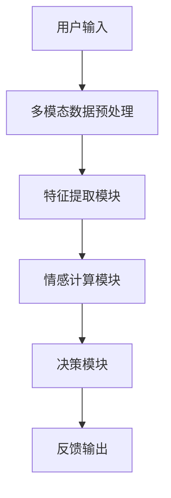
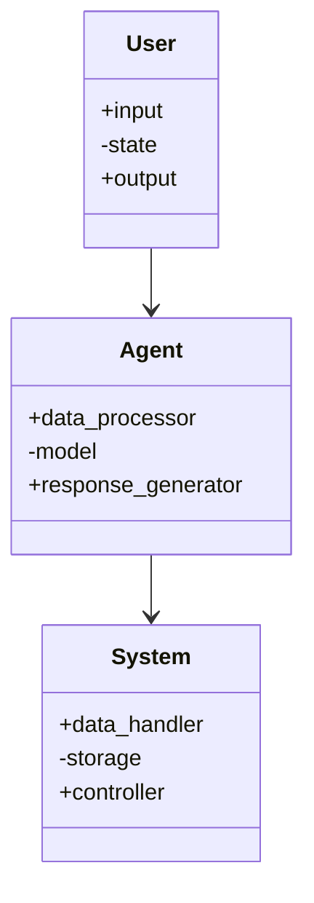

                 


# 实现AI Agent的多模态情感识别

> 关键词：AI Agent，多模态情感识别，文本特征提取，图像特征提取，语音特征提取，情感计算，系统架构设计

> 摘要：本文详细探讨了实现AI Agent的多模态情感识别技术，从背景介绍、核心概念、算法原理到系统设计和项目实战，层层深入，结合实际案例分析，帮助读者全面理解并掌握这一技术。

---

## 第1章：多模态情感识别的背景与问题背景

### 1.1 问题背景

#### 1.1.1 多模态数据的定义与特征
多模态数据指的是整合多种数据形式（如文本、图像、语音等）来提供更全面信息的策略。每种模态都有其独特的特征：
- **文本**：包含词汇、句法和语义信息。
- **图像**：涉及颜色、形状和纹理等视觉特征。
- **语音**：包括音调、语速和节奏等听觉特征。

#### 1.1.2 情感识别的定义与目标
情感识别旨在通过分析多模态数据来识别和理解人类的情感状态。其目标是准确捕捉用户的情感，如快乐、悲伤、愤怒等。

#### 1.1.3 AI Agent的定义与应用场景
AI Agent是智能代理，能够感知环境并执行任务。在情感识别中的应用包括智能客服、情感陪护和个性化推荐。

### 1.2 问题描述

#### 1.2.1 多模态情感识别的核心问题
如何有效融合多模态数据以提高情感识别的准确性。

#### 1.2.2 AI Agent在情感识别中的角色
作为中介，AI Agent通过处理多模态数据来理解用户情感，并提供相应的反馈。

#### 1.2.3 当前技术的局限性与挑战
- 数据异构性：不同模态的数据格式和特征差异大，难以直接融合。
- 语境依赖性：情感识别需要考虑上下文，增加了复杂性。
- 计算资源需求：处理多模态数据需要高性能计算。

### 1.3 问题解决思路

#### 1.3.1 多模态数据融合的必要性
通过融合多模态数据，可以互补信息，提高识别准确率。

#### 1.3.2 AI Agent在情感识别中的优势
AI Agent能够实时处理多模态数据，提供动态反馈。

#### 1.3.3 解决方案的技术路线
- 数据采集与预处理
- 特征提取与融合
- 情感计算与模型训练
- 结果反馈与优化

### 1.4 边界与外延

#### 1.4.1 情感识别的边界条件
限定在特定情感类别和场景下进行识别。

#### 1.4.2 多模态数据的适用范围
适用于需要高精度情感分析的领域。

#### 1.4.3 AI Agent的适用场景与限制
适用于实时交互场景，但需考虑计算资源和数据隐私。

### 1.5 核心要素与概念结构

#### 1.5.1 情感识别的核心要素
- 数据采集：获取多模态数据。
- 特征提取：提取有用特征。
- 模型训练：建立情感分类模型。

#### 1.5.2 AI Agent的关键组成
- 感知模块：处理多模态输入。
- 决策模块：分析情感并生成反馈。

#### 1.5.3 多模态数据的关联性分析
通过关联分析，确定各模态之间的相互作用。

---

## 第2章：多模态数据的特征分析

### 2.1 文本数据的特征提取

#### 2.1.1 词语情感分析
使用词典或模型对词语进行情感标注。

#### 2.1.2 句法结构分析
分析句子的结构，理解其语法关系。

#### 2.1.3 上下文语境的影响
考虑上下文对情感的影响，如“ sarcasm”识别。

### 2.2 图像数据的特征提取

#### 2.2.1 颜色特征
提取颜色分布，分析其与情感的相关性。

#### 2.2.2 形状特征
分析图像中的形状特征，如面部表情。

#### 2.2.3 纹理特征
提取纹理特征，用于识别表情细节。

### 2.3 语音数据的特征提取

#### 2.3.1 音调特征
分析音调变化，识别情感状态。

#### 2.3.2 语速特征
通过语速变化判断情感倾向。

#### 2.3.3 音节特征
分析音节的清晰度和连贯性。

---

## 第3章：情感计算的核心算法与实现

### 3.1 情感计算的数学模型

#### 3.1.1 概率论模型
使用贝叶斯定理进行分类。

公式：
$$ P(c|x) = \frac{P(x|c)P(c)}{P(x)} $$

#### 3.1.2 深度学习模型
使用神经网络进行特征学习。

### 3.2 算法实现

#### 3.2.1 文本特征提取代码

```python
import nltk
from sklearn.feature_extraction.text import TfidfVectorizer

# 示例文本
text = "I love this product"
# 词干提取
stemmed_text = nltk.PorterStemmer().stem(text)
# TF-IDF特征提取
vectorizer = TfidfVectorizer()
tfidf_matrix = vectorizer.fit_transform([text])
```

#### 3.2.2 图像特征提取代码

```python
import cv2

# 加载图像
img = cv2.imread('face.jpg')
# 转换为灰度图
gray = cv2.cvtColor(img, cv2.COLOR_BGR2GRAY)
# 使用HOG特征提取
hog = cv2.HOGDescriptor()
hog_features = hog.compute(gray)
```

#### 3.2.3 多模态融合算法

```python
import numpy as np

# 文本特征和图像特征的融合
text_features = tfidf_matrix.toarray()[0]
image_features = hog_features.T
# 拼接特征
merged_features = np.concatenate([text_features, image_features])
```

---

## 第4章：AI Agent的系统架构与设计

### 4.1 系统架构设计



### 4.2 功能设计

#### 4.2.1 领域模型



---

## 第5章：项目实战与实现

### 5.1 环境安装

```bash
pip install numpy scikit-learn tensorflow
```

### 5.2 核心代码实现

#### 5.2.1 数据预处理

```python
import pandas as pd

# 加载数据
data = pd.read_csv('data.csv')
# 分割文本、图像和语音数据
texts = data['text']
images = data['image_path']
audios = data['audio_path']
```

#### 5.2.2 模型训练

```python
from tensorflow.keras import layers, Model

# 构建多模态融合模型
input_text = layers.Input(shape=(max_length,))
input_image = layers.Input(shape=(height, width, channels,))
# 文本分支
x_text = layers.Embedding(vocab_size, embedding_dim)(input_text)
x_text = layers.GlobalAveragePooling1D()(x_text)
# 图像分支
x_image = layers.Conv2D(32, (3,3), activation='relu')(input_image)
x_image = layers.MaxPooling2D((2,2))(x_image)
x_image = layers.Flatten()(x_image)
# 合并分支
merged = layers.Concatenate()([x_text, x_image])
dense = layers.Dense(64, activation='relu')(merged)
output = layers.Dense(num_classes, activation='softmax')(dense)

model = Model(inputs=[input_text, input_image], outputs=output)
model.compile(optimizer='adam', loss='sparse_categorical_crossentropy', metrics=['accuracy'])
```

---

## 第6章：总结与展望

### 6.1 总结

本文详细探讨了实现AI Agent的多模态情感识别技术，涵盖了从背景介绍到项目实战的全过程。通过融合多模态数据，AI Agent能够更准确地识别用户情感，提供个性化的服务。

### 6.2 注意事项

- 数据质量：确保多模态数据的准确性和完整性。
- 模型优化：持续改进模型以提高识别精度。
- 隐私保护：妥善处理用户数据，确保隐私安全。

### 6.3 拓展阅读

- 深入研究多模态数据融合的方法。
- 探索更先进的深度学习模型，如Transformer和Graph Neural Networks。

---

通过本文的学习，读者可以掌握AI Agent的多模态情感识别的核心技术，并将其应用于实际场景中。

