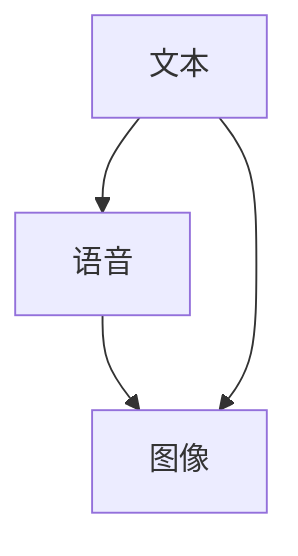
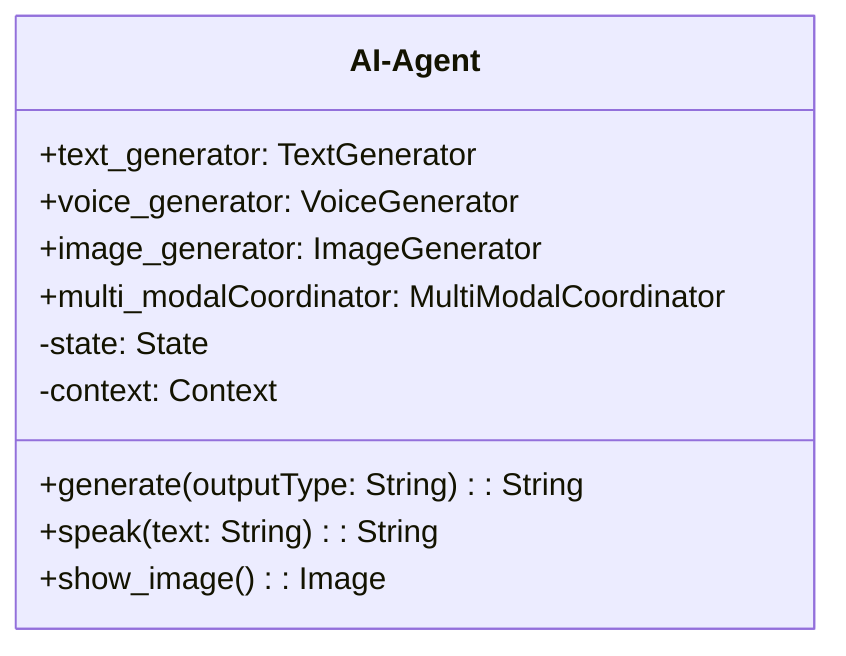
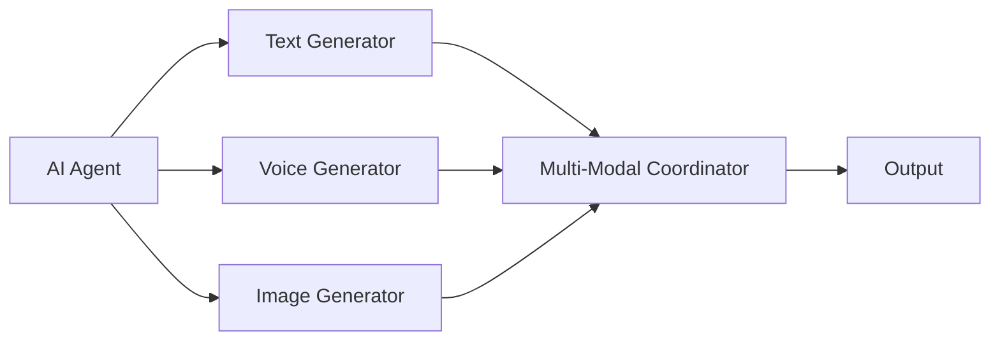
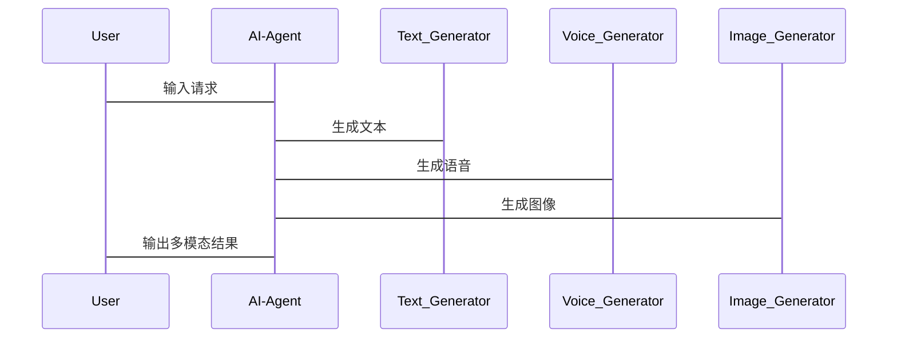

                 


# 实现AI Agent的多模态输出：文本、语音、图像协同

## 关键词：AI Agent，多模态输出，文本，语音，图像，协同，生成式模型，系统架构，项目实战

## 摘要

本文详细探讨实现AI Agent多模态输出的技术与方法，涵盖文本、语音和图像的协同处理。从核心概念到算法原理，再到系统架构设计和项目实战，全面解析多模态协同的技术细节，提供深入的技术分析和实际应用案例，帮助读者掌握AI Agent多模态输出的实现方法。

---

## 第1章：AI Agent与多模态输出的背景介绍

### 1.1 AI Agent的基本概念

AI Agent（人工智能代理）是指能够感知环境、自主决策并执行任务的智能实体。它可以理解输入信息、处理数据并生成输出，以完成特定目标。AI Agent广泛应用于对话系统、智能助手、自动驾驶等领域。

#### 1.1.1 AI Agent的定义
AI Agent是一种能够通过感知环境、理解输入、处理信息并生成输出的智能系统。它可以与用户交互，执行复杂任务，并根据反馈进行学习和优化。

#### 1.1.2 AI Agent的功能与特点
AI Agent的功能包括感知环境、理解输入、决策与规划、执行任务等。其特点在于自主性、反应性、目标导向性和学习能力。

#### 1.1.3 多模态输出的必要性
传统的AI Agent通常仅支持单一模态输出（如文本或语音），而多模态输出能够提供更丰富的交互体验，提升用户体验和任务完成效率。

### 1.2 多模态输出的背景与意义

#### 1.2.1 多模态技术的发展历程
多模态技术最初应用于计算机视觉和自然语言处理领域，近年来随着生成式模型的发展，多模态协同处理能力显著提升。

#### 1.2.2 多模态输出在AI Agent中的应用
多模态输出使AI Agent能够同时生成文本、语音和图像，适用于智能助手、教育工具、虚拟助手等领域。

#### 1.2.3 多模态协同的优势与挑战
优势：提升用户体验，提供多样化的交互方式。挑战：数据融合、模型训练和实时协同的复杂性。

### 1.3 问题背景与目标

#### 1.3.1 当前AI Agent输出的局限性
传统AI Agent输出单一，无法满足多样化的交互需求。

#### 1.3.2 多模态输出的目标与应用场景
目标：实现AI Agent的多模态协同输出。应用场景：智能助手、教育工具、虚拟助手等。

#### 1.3.3 问题解决的思路与方法
通过多模态模型的协同设计和算法优化，实现AI Agent的多模态输出能力。

---

## 第2章：多模态协同的核心概念与联系

### 2.1 多模态协同的基本原理

#### 2.1.1 多模态数据的定义与分类
多模态数据包括文本、语音、图像等多种类型，每种类型都有其独特的特点和处理方式。

#### 2.1.2 多模态数据的处理流程
处理流程包括数据采集、预处理、特征提取、模型训练和协同生成。

#### 2.1.3 多模态协同的核心要素
核心要素包括数据融合、模型协同和结果优化。

### 2.2 文本、语音、图像的协同机制

#### 2.2.1 文本与语音的协同
文本转语音（TTS）技术实现文本到语音的转换，确保两者信息一致。

#### 2.2.2 语音与图像的协同
语音识别和图像生成协同工作，生成与语音内容匹配的图像。

#### 2.2.3 文本与图像的协同
文本生成图像（Text-to-Image）技术实现文本描述与图像的生成。

### 2.3 多模态协同的实体关系图



---

## 第3章：生成式AI模型与多模态处理

### 3.1 生成式AI模型的基本原理

#### 3.1.1 变量的生成过程
生成式模型通过生成潜在变量，逐步生成目标输出。

#### 3.1.2 概率分布的计算
计算输入与输出之间的条件概率分布，指导生成过程。

#### 3.1.3 损失函数的定义
使用交叉熵损失函数优化模型参数。

### 3.2 多模态模型的算法流程

#### 3.2.1 文本生成
使用文本生成模型（如GPT）生成文本内容。

#### 3.2.2 语音生成
基于语音生成模型（如Whisper）生成语音信号。

#### 3.2.3 图像生成
利用图像生成模型（如DALL-E）生成图像。

### 3.3 多模态模型的协同机制

#### 3.3.1 文本与语音的协同
文本转语音（TTS）技术实现文本到语音的转换。

#### 3.3.2 语音与图像的协同
语音识别与图像生成协同工作，生成与语音内容匹配的图像。

#### 3.3.3 文本与图像的协同
文本生成图像（Text-to-Image）技术实现文本描述与图像的生成。

---

## 第4章：多模态协同的系统架构设计

### 4.1 系统功能设计

#### 4.1.1 系统架构图


#### 4.1.2 交互流程
AI Agent接收输入，通过协调模块处理后生成多模态输出。

### 4.2 系统架构设计

#### 4.2.1 系统架构图


#### 4.2.2 接口设计
定义API接口，实现文本、语音和图像的生成与协同。

### 4.3 系统交互流程

#### 4.3.1 交互流程图


---

## 第5章：项目实战

### 5.1 环境安装与配置

#### 5.1.1 环境配置
安装Python、TensorFlow、Keras等依赖库。

#### 5.1.2 安装工具
安装图像生成库（如Pillow）、语音生成库（如pyTTS）和文本生成库（如transformers）。

### 5.2 核心代码实现

#### 5.2.1 文本生成代码
```python
from transformers import GPT2LMHeadModel, GPT2Tokenizer

tokenizer = GPT2Tokenizer.from_pretrained('gpt2')
model = GPT2LMHeadModel.from_pretrained('gpt2')

def generate_text(prompt):
    inputs = tokenizer.encode(prompt, return_tensors='pt')
    outputs = model.generate(inputs, max_length=50, do_sample=True)
    return tokenizer.decode(outputs[0])
```

#### 5.2.2 语音生成代码
```python
import pyttsx3

def text_to_speech(text):
    engine = pyttsx3.init()
    engine.save_to_file(text, 'output.mp3')
    engine.runAndWait()
```

#### 5.2.3 图像生成代码
```python
from PIL import Image
import numpy as np

def generate_image(description):
    # 这里可以使用生成式模型如DALL-E生成图像
    pass
```

### 5.3 案例分析与实现

#### 5.3.1 案例分析
分析多模态协同的实际案例，如生成与文本匹配的图像和语音。

#### 5.3.2 代码实现
实现一个完整的AI Agent多模态输出系统，包含文本、语音和图像的生成与协同。

---

## 第6章：总结与展望

### 6.1 最佳实践

#### 6.1.1 设计建议
模块化设计，便于维护和扩展。

#### 6.1.2 开发注意事项
注意数据安全和隐私保护。

#### 6.1.3 接口规范
制定统一的接口规范，确保各模块协同工作。

### 6.2 小结

本文详细探讨了实现AI Agent多模态输出的技术与方法，从背景到实现，全面解析了多模态协同的技术细节。

### 6.3 注意事项

- 数据安全和隐私保护
- 模型训练的计算资源需求
- 多模态协同的实时性挑战

### 6.4 拓展阅读

推荐相关书籍和论文，进一步深入学习多模态协同技术。

---

## 结束语

通过本文的深入探讨，读者可以掌握AI Agent多模态输出的实现方法，应用于实际项目中，推动人工智能技术的发展。

