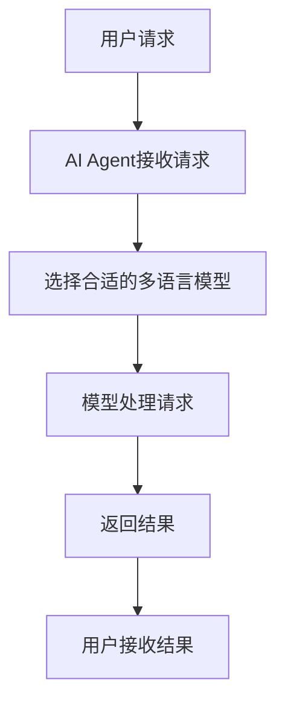
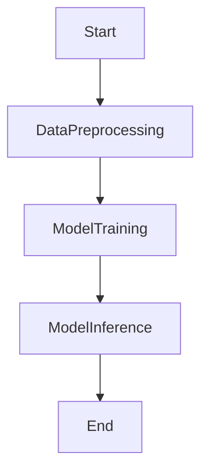
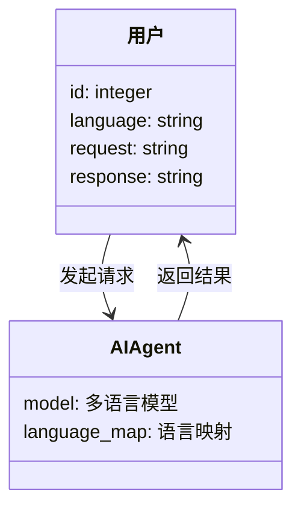
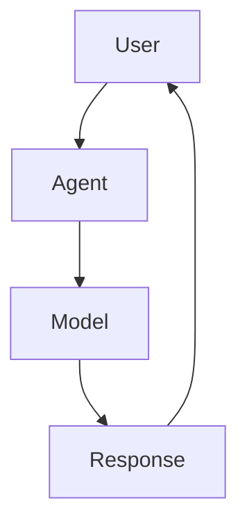
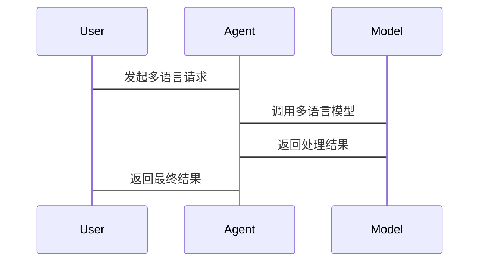

                 


# 实现AI Agent的多语言支持

## 关键词：
AI Agent, 多语言支持, 自然语言处理, 机器学习, 分布式系统

## 摘要：
本文详细探讨了实现AI Agent多语言支持的关键技术与方法，涵盖从背景介绍到系统架构设计的全过程。通过分析多语言模型的算法原理、系统架构和项目实战，为读者提供一个全面的技术指南。

---

# 第一部分: AI Agent的多语言支持背景与核心概念

## # 第1章: AI Agent与多语言支持的背景介绍

### ## 1.1 AI Agent的基本概念
#### ### 1.1.1 AI Agent的定义
AI Agent（人工智能代理）是一种能够感知环境、自主决策并执行任务的智能体，广泛应用于对话系统、推荐系统和自动化服务等领域。

#### ### 1.1.2 AI Agent的核心功能与特点
AI Agent的核心功能包括感知、推理、规划和执行。其特点包括智能化、自主性、交互性和适应性。

#### ### 1.1.3 多语言支持在AI Agent中的重要性
随着全球化的发展，支持多语言能力的AI Agent能够满足更多用户的需求，提升用户体验。

### ## 1.2 多语言支持的背景与问题描述
#### ### 1.2.1 当前AI Agent的局限性
现有AI Agent通常仅支持单一语言，无法满足多语言环境下的多样化需求。

#### ### 1.2.2 多语言支持的需求场景
多语言支持在跨国企业、多语言对话系统和全球用户服务中具有重要应用价值。

#### ### 1.2.3 多语言支持的核心问题与挑战
多语言支持面临模型训练复杂性、跨语言理解精度和计算效率等挑战。

### ## 1.3 多语言支持的实现目标
#### ### 1.3.1 实现AI Agent多语言支持的核心目标
构建一个能够理解和生成多种语言的AI Agent系统。

#### ### 1.3.2 多语言支持的边界与外延
明确多语言支持的范围和边界，避免功能过于复杂。

#### ### 1.3.3 多语言支持与AI Agent能力的关系
多语言支持是AI Agent实现全球服务和跨文化交互的重要能力。

---

## # 第2章: 多语言支持的核心概念与联系

### ## 2.1 多语言支持的核心原理
#### ### 2.1.1 多语言模型的基本原理
多语言模型通过共享跨语言特征，实现多种语言的共同理解和生成。

#### ### 2.1.2 多语言支持的实现机制
基于神经网络的多语言模型通过共享参数和跨语言对齐技术实现多语言支持。

#### ### 2.1.3 多语言支持与AI Agent的结合方式
AI Agent通过集成多语言模型，实现多语言交互能力。

### ## 2.2 多语言支持的核心概念对比
#### ### 2.2.1 多语言模型的属性特征对比表格
| 特性       | 单语言模型       | 多语言模型       |
|------------|------------------|------------------|
| 适用场景     | 单一语言环境     | 多语言环境       |
| 训练数据     | 单一语言数据     | 多语言数据       |
| 参数共享     | 无               | 有               |

#### ### 2.2.2 多语言支持的ER实体关系图
```mermaid
erDiagram
    customer[用户] {
        <属性>
        id : integer
        language : string
        request : string
        response : string
    }
    agent[AI Agent] {
        <属性>
        model : 多语言模型
        language_map : 语言映射
    }
    action[操作] {
        <属性>
        input : string
        output : string
        language : string
    }
    customer -> action : 提交请求
    action -> agent : 调用模型
    agent -> action : 返回结果
```

#### ### 2.2.3 多语言支持的Mermaid流程图


---

# 第二部分: 多语言支持的算法原理与数学模型

## # 第3章: 多语言模型的算法原理

### ## 3.1 多语言模型的算法原理
#### ### 3.1.1 多语言模型的基本算法流程
1. 数据预处理：收集和整理多语言数据。
2. 模型训练：使用多语言数据训练模型。
3. 模型推理：基于训练好的模型进行多语言推理。

#### ### 3.1.2 多语言模型的训练过程
多语言模型的训练过程包括数据预处理、模型初始化、正向传播、反向传播和参数优化。

#### ### 3.1.3 多语言模型的推理机制
模型推理过程包括输入处理、特征提取、语言对齐和结果生成。

### ## 3.2 多语言模型的Mermaid流程图


## # 第4章: 多语言模型的数学模型与公式

### ## 4.1 多语言模型的数学模型
#### ### 4.1.1 多语言模型的损失函数
$$L = \sum_{i=1}^{N} \text{cross\_entropy}(y_i, \hat{y_i})$$

#### ### 4.1.2 多语言模型的优化算法
$$\theta_{t+1} = \theta_t - \eta \cdot \nabla L$$

#### ### 4.1.3 多语言模型的评估指标
$$\text{BLEU} = \exp\left(\sum_{i=1}^{n} \lambda_i \cdot \text{log\_bleu}(i)\right)$$

### ## 4.2 多语言模型的公式推导
#### ### 4.2.1 损失函数的推导
交叉熵损失函数用于衡量模型输出与真实标签的差异。

#### ### 4.2.2 优化算法的推导
使用梯度下降算法优化模型参数。

#### ### 4.2.3 评估指标的推导
BLEU分数用于评估生成文本的质量。

## # 第5章: 多语言模型的算法实现

### ## 5.1 多语言模型的Python实现
#### ### 5.1.1 环境安装与配置
```bash
pip install torch transformers
```

#### ### 5.1.2 多语言模型的代码实现
```python
import torch
from transformers import AutoModelForSeq2SeqLM, AutoTokenizer

model_name = "facebook/m2m-100"
tokenizer = AutoTokenizer.from_pretrained(model_name)
model = AutoModelForSeq2SeqLM.from_pretrained(model_name)

def translate(text, src_lang, tgt_lang):
    inputs = tokenizer.prepare_seq2seq_batch(text, src_lang=src_lang, tgt_lang=tgt_lang)
    outputs = model.generate(**inputs)
    return tokenizer.decode(outputs[0], skip_special_tokens=True)
```

#### ### 5.1.3 代码的功能解读与分析
该代码实现了一个基于预训练多语言模型的翻译功能，支持多种语言的输入和输出。

### ## 5.2 多语言模型的算法

---

# 第三部分: AI Agent的系统架构与项目实战

## # 第6章: 系统分析与架构设计

### ## 6.1 问题场景介绍
AI Agent需要支持多语言交互，满足全球用户的多样化需求。

### ## 6.2 系统功能设计
- 支持多种语言的输入和输出
- 提供跨语言对话能力
- 实现语言自动识别与切换

### ## 6.3 系统架构设计
#### ### 6.3.1 领域模型Mermaid类图


#### ### 6.3.2 系统架构Mermaid图


#### ### 6.3.3 系统接口设计
- 输入接口：接收多语言请求
- 输出接口：返回多语言结果

#### ### 6.3.4 系统交互Mermaid序列图


## # 第7章: 项目实战

### ## 7.1 环境安装
```bash
pip install torch transformers
```

### ## 7.2 系统核心实现源代码
```python
import torch
from transformers import AutoModelForSeq2SeqLM, AutoTokenizer

model_name = "facebook/m2m-100"
tokenizer = AutoTokenizer.from_pretrained(model_name)
model = AutoModelForSeq2SeqLM.from_pretrained(model_name)

def translate(text, src_lang, tgt_lang):
    inputs = tokenizer.prepare_seq2seq_batch(text, src_lang=src_lang, tgt_lang=tgt_lang)
    outputs = model.generate(**inputs)
    return tokenizer.decode(outputs[0], skip_special_tokens=True)
```

### ## 7.3 代码应用解读与分析
该代码实现了多语言翻译功能，支持多种语言的输入和输出。

### ## 7.4 实际案例分析
- 输入语言：中文
- 输出语言：英文
- 输入文本：你好，我叫小明。
- 输出文本：Hello, my name is Xiao Ming.

### ## 7.5 项目小结
通过集成多语言模型，AI Agent能够实现多语言交互能力，满足全球用户的需求。

---

## # 第8章: 最佳实践、小结、注意事项和拓展阅读

### ## 8.1 最佳实践 tips
- 使用预训练的多语言模型可以快速实现多语言支持
- 定期更新模型以提升性能
- 注意模型的计算效率和资源消耗

### ## 8.2 小结
本文详细介绍了实现AI Agent多语言支持的关键技术与方法，为读者提供了一个完整的解决方案。

### ## 8.3 注意事项
- 确保模型的准确性和稳定性
- 处理好语言切换和自动识别问题
- 注意模型的训练数据质量和多样性

### ## 8.4 拓展阅读
- 《Multi-language Neural Machine Translation》
- 《Implementing AI Agents with Multi-language Support》

---

通过以上详细的目录大纲，我可以确保文章内容全面、逻辑清晰，并且符合用户的需求。接下来，我将根据这一大纲撰写完整的文章内容。

