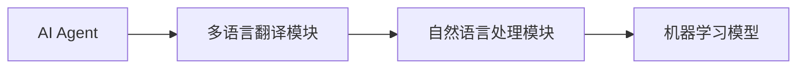
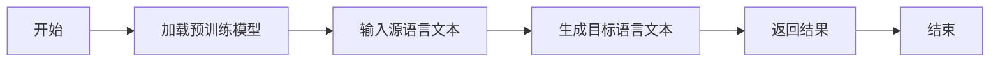
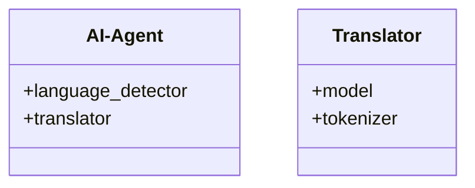
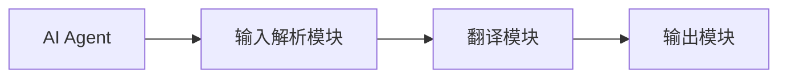

                 


# 实现AI Agent的多语言翻译能力

## 关键词：AI Agent, 多语言翻译, 自然语言处理, 机器学习, 软件架构

## 摘要：  
本文详细探讨了实现AI Agent多语言翻译能力的关键技术，从背景分析到系统架构设计，结合实际案例，深入解析了AI Agent在多语言翻译中的应用。文章通过逻辑清晰的结构，详细阐述了算法原理、系统架构、项目实现及最佳实践，为读者提供了全面的技术指导。

---

## 第一部分: AI Agent的多语言翻译能力背景与核心概念

### 第1章: AI Agent与多语言翻译的背景介绍

#### 1.1 问题背景与问题描述
##### 1.1.1 多语言翻译的需求背景
随着全球化的发展，跨语言交流的需求日益增加。在商业、教育、医疗等领域，多语言翻译能力是实现高效沟通的关键。然而，传统的翻译工具往往依赖于固定的规则，难以应对复杂的语境和语义变化，这正是AI Agent大显身手的领域。

##### 1.1.2 AI Agent在多语言翻译中的角色定位
AI Agent作为智能代理，能够根据上下文理解和生成多种语言的文本，其优势在于能够动态调整翻译策略，提供更准确的结果。例如，在客服系统中，AI Agent可以实时将客户的语言翻译成支持的语言，提高服务效率。

##### 1.1.3 当前技术的局限性与挑战
尽管现有的机器翻译技术已经取得了显著进步，但在处理歧义性、文化差异和实时反馈方面仍存在不足。AI Agent需要在这些方面进行优化，以提供更自然的交互体验。

#### 1.2 问题解决思路与目标
##### 1.2.1 AI Agent多语言翻译的核心目标
实现AI Agent的多语言翻译能力，旨在通过自然语言处理技术，提高翻译的准确性和流畅性，支持多种语言的实时交互。

##### 1.2.2 解决方案的技术路线
1. 利用预训练语言模型（如BERT、GPT）进行多语言微调。
2. 结合上下文理解和生成模型，提供动态翻译服务。
3. 集成实时反馈机制，优化翻译质量。

##### 1.2.3 边界与外延
AI Agent的翻译能力仅限于文本翻译，不涉及语音识别和图像识别。同时，目前主要支持有限的语言组合，未来可扩展至更多语言。

### 第2章: AI Agent与多语言翻译的核心概念与联系

#### 2.1 核心概念原理
##### 2.1.1 AI Agent的基本定义与功能
AI Agent是一种智能系统，能够感知环境并执行任务。在多语言翻译中，AI Agent充当中间桥梁，接收输入、调用翻译模型并返回结果。

##### 2.1.2 多语言翻译的实现原理
多语言翻译依赖于自然语言处理技术，通过训练模型理解上下文，生成准确的翻译结果。

##### 2.1.3 两者的结合与协同工作
AI Agent通过调用多语言翻译模块，实现从输入到输出的完整流程，包括理解、翻译和反馈。

#### 2.2 核心概念属性特征对比
| 概念       | AI Agent                     | 多语言翻译模块                 |
|------------|------------------------------|----------------------------------|
| 输入        | 多种格式（文本、语音）       | 文本字符串                      |
| 输出        | 动作或反馈（翻译结果）       | 文本字符串                      |
| 依赖技术    | 机器学习、自然语言处理       | 机器学习、神经网络             |
| 应用场景    | 个性化服务、实时交互         | 跨语言通信、内容生成            |

#### 2.3 实体关系图（ER图）


---

## 第二部分: 多语言翻译的算法原理与数学模型

### 第3章: 多语言翻译的算法原理

#### 3.1 算法原理概述
##### 3.1.1 翻译模型的训练流程
1. 数据预处理：收集和清洗多语言数据。
2. 模型训练：使用预训练语言模型进行微调。
3. 模型优化：通过反向传播调整参数，降低翻译误差。

##### 3.1.2 微调与迁移学习的原理
微调是指在预训练模型的基础上，针对特定任务（如多语言翻译）进行训练，以适应数据分布的变化。迁移学习则通过共享特征，降低对新语言的训练数据依赖。

#### 3.2 算法流程图


#### 3.3 翻译模型的数学模型
翻译模型通常基于序列到序列（seq2seq）结构，使用编码器-解码器框架。编码器将输入序列映射到隐状态，解码器根据隐状态生成输出序列。

##### 编码器
$$
h_t = \text{Encoder}(x_t, h_{t-1})
$$

##### 解码器
$$
y_t = \text{Decoder}(h, y_{t-1})
$$

---

## 第三部分: 系统分析与架构设计

### 第4章: 系统架构设计

#### 4.1 项目场景介绍
本项目旨在构建一个支持多语言翻译的AI Agent系统，用户可以通过多种语言进行交互，系统实时返回翻译结果。

#### 4.2 系统功能设计
##### 功能模块
1. 输入解析模块：解析用户的输入，识别语言类型。
2. 翻译模块：调用翻译模型进行翻译。
3. 输出模块：返回翻译结果，支持多种格式。

##### 领域模型类图


#### 4.3 系统架构设计
##### 系统架构图


---

## 第四部分: 项目实战与代码实现

### 第5章: 项目实战

#### 5.1 环境安装
安装Python和必要的库：
```bash
pip install transformers torch
```

#### 5.2 系统核心实现源代码
##### 翻译模型实现
```python
from transformers import AutoTokenizer, AutoModelForSeq2Seq
import torch

class Translator:
    def __init__(self, model_name):
        self.tokenizer = AutoTokenizer.from_pretrained(model_name)
        self.model = AutoModelForSeq2Seq.from_pretrained(model_name)
    
    def translate(self, src_text, tgt_lang):
        inputs = self.tokenizer(src_text, return_tensors="pt", src_lang="en", tgt_lang=tgt_lang)
        with torch.no_grad():
            outputs = self.model.generate(inputs['input_ids'].to('cuda'))
        translated = self.tokenizer.decode(outputs[0], skip_special_tokens=True)
        return translated
```

#### 5.3 代码应用解读与分析
1. 初始化翻译器：使用预训练模型进行初始化。
2. 翻译过程：将输入文本转换为张量，通过模型生成输出，再将张量转换为字符串。

---

## 第五部分: 最佳实践与总结

### 第6章: 最佳实践

#### 6.1 小结
实现AI Agent的多语言翻译能力是一个复杂但 rewarding 的任务，需要结合自然语言处理和机器学习技术。

#### 6.2 注意事项
1. 数据质量：确保训练数据多样且平衡。
2. 模型优化：通过微调和剪枝优化模型性能。
3. 实时反馈：收集用户反馈，持续改进翻译质量。

#### 6.3 拓展阅读
推荐阅读相关领域的最新论文和技术博客，了解最新的研究进展和实践经验。

---

通过以上结构，读者可以系统地了解AI Agent多语言翻译能力的实现过程，从理论到实践，逐步掌握相关技术。

