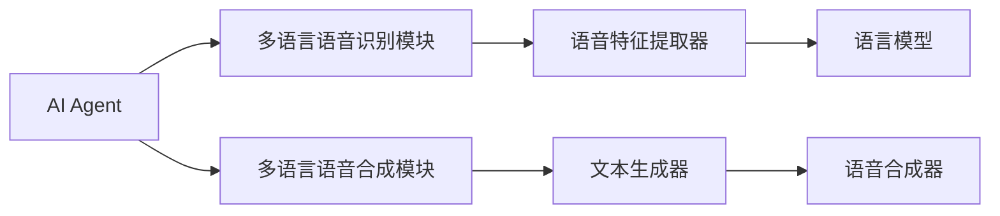
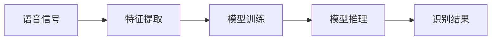
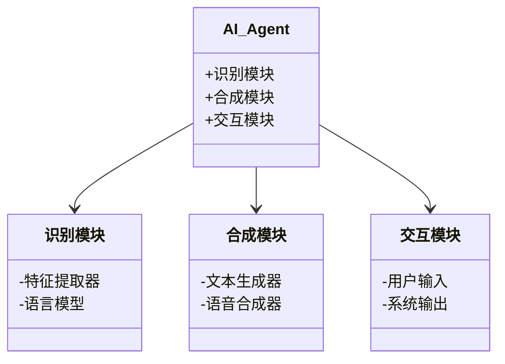
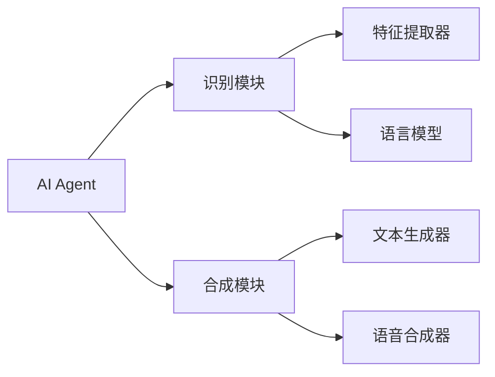

                 


# 实现AI Agent的多语言语音识别与合成

## 关键词：
- AI Agent
- 多语言语音识别
- 语音合成
- 语音处理算法
- 系统架构设计

## 摘要：
本文详细探讨了如何实现AI Agent的多语言语音识别与合成技术。从基本概念到算法原理，再到系统架构设计和项目实战，全面解析了多语言语音处理的核心技术及其在AI Agent中的应用。通过对比分析、流程图和代码示例，深入浅出地介绍了实现过程中的关键点，帮助读者掌握从理论到实践的完整技术链条。

---

# 第1章 AI Agent与多语言语音处理的背景介绍

## 1.1 AI Agent的基本概念
### 1.1.1 AI Agent的定义与核心特征
AI Agent是一种智能代理，能够感知环境、自主决策并执行任务。其核心特征包括自主性、反应性、目标导向和社会能力。

### 1.1.2 多语言语音处理的必要性
在多语言环境中，AI Agent需要能够理解并生成多种语言的语音，以满足全球用户的需求。

### 1.1.3 AI Agent在多语言环境中的应用价值
通过支持多语言语音处理，AI Agent能够提供更智能化、个性化的服务，提升用户体验。

## 1.2 多语言语音识别与合成的背景与挑战
### 1.2.1 多语言语音处理的市场需求
随着全球化的发展，多语言语音处理的需求日益增长。

### 1.2.2 多语言语音处理的技术难点
不同语言的语音特征差异大，训练数据获取困难，模型泛化能力不足等。

### 1.2.3 当前技术发展现状与趋势
深度学习技术的快速发展为多语言语音处理提供了新的解决方案，但仍需进一步优化。

## 1.3 本章小结
AI Agent与多语言语音处理密切相关，本文将从算法原理到系统设计，全面解析其实现过程。

---

# 第2章 多语言语音识别与合成的核心概念与联系

## 2.1 多语言语音识别的核心原理
### 2.1.1 语音信号的基本特征
语音信号包括音调、音速、音强和音色等特征。

### 2.1.2 多语言语音识别的特征提取方法
常用的特征提取方法包括MFCC、 LPC和倒谱分析等。

### 2.1.3 不同语言的语音特征对比分析
通过对比分析，发现不同语言的语音特征在某些方面存在显著差异。

## 2.2 多语言语音合成的核心原理
### 2.2.1 文本到语音(TTS)的基本流程
TTS技术包括文本分析、语音合成和语音输出三个主要步骤。

### 2.2.2 多语言语音合成的挑战与解决方案
解决方法包括跨语言共享表征、多语言联合训练和语言自适应等。

### 2.2.3 不同语言的语音合成特征对比分析
通过对比分析，发现不同语言的语音合成模型在训练和推理过程中存在差异。

## 2.3 AI Agent与多语言语音处理的关联
### 2.3.1 AI Agent的多语言交互需求
AI Agent需要支持多种语言的语音交互，以满足全球用户的需求。

### 2.3.2 多语言语音处理在AI Agent中的应用场景
包括语音助手、智能客服和智能家居等领域。

### 2.3.3 AI Agent对多语言语音处理技术的推动作用
通过推动技术发展，AI Agent能够提供更智能、更个性化的服务。

## 2.4 核心概念对比分析表
### 表2.1：多语言语音识别与合成的核心特征对比

| 特征       | 语音识别 | 语音合成 |
|------------|----------|----------|
| 输入形式   | 语音信号 | 文本输入  |
| 输出形式   | 文本输出 | 语音输出 |
| 技术难点   | 语言差异 | 模型训练 |
| 解决方案   | 多语言模型 | 多语言训练 |

## 2.5 系统实体关系图


---

# 第3章 多语言语音识别与合成的算法原理

## 3.1 多语言语音识别算法
### 3.1.1 基于MFCC的特征提取
MFCC（Mel-Frequency Cepstral Coefficients）是一种常用的语音特征提取方法。

### 3.1.2 基于CTC的端到端语音识别
CTC（Connectionist Temporal Classification）是一种用于序列到序列的语音识别模型。

### 3.1.3 多语言模型的训练策略
采用跨语言共享表征和多语言联合训练等策略，提高模型的泛化能力。

## 3.2 多语言语音合成算法
### 3.2.1 基于Tacotron的语音合成
Tacotron是一种基于神经网络的TTS模型，能够生成自然的语音。

### 3.2.2 基于FastSpeech的语音合成
FastSpeech是一种高效的语音合成模型，能够实时生成语音。

### 3.2.3 多语言模型的训练策略
采用多语言联合训练和语言自适应等策略，提高模型的多语言生成能力。

## 3.3 算法流程图


## 3.4 核心算法的数学模型
### 3.4.1 CTC损失函数
$$ \text{CTC Loss} = -\sum_{t=1}^{T} \log p(y_t|y_{<t}) $$

### 3.4.2 Tacotron生成模型
$$ P(y|x) = \prod_{t=1}^{T} p(y_t|y_{<t}, x) $$

---

# 第4章 系统分析与架构设计

## 4.1 问题场景介绍
AI Agent需要支持多语言语音交互，用户可以通过多种语言与AI Agent进行对话。

## 4.2 系统功能设计
### 4.2.1 领域模型类图


## 4.3 系统架构设计
### 4.3.1 系统架构图


## 4.4 系统接口设计
### 4.4.1 接口定义
- 输入接口：接收语音信号或文本输入。
- 输出接口：输出识别结果或生成语音。

### 4.4.2 交互流程图
```mermaid
sequenceDiagram
用户 -> AI Agent: 发送语音输入
AI Agent -> 识别模块: 进行语音识别
识别模块 -> 返回识别结果
AI Agent -> 合成模块: 生成语音响应
合成模块 -> 返回语音输出
AI Agent -> 用户: 发送语音响应
```

---

# 第5章 项目实战

## 5.1 环境安装
- 安装Python和相关库（如TensorFlow、Kaldi）。

## 5.2 核心代码实现
### 5.2.1 语音预处理代码
```python
import librosa

def preprocess_audio(audio_path):
    audio, sr = librosa.load(audio_path, sr=None)
    mfccs = librosa.feature.mfcc(y=audio, sr=sr)
    return mfccs
```

### 5.2.2 模型训练代码
```python
import tensorflow as tf
from tensorflow.keras import layers

model = tf.keras.Sequential([
    layers.Conv2D(32, (3,3), activation='relu', input_shape=(None, 20, 1)),
    layers.MaxPooling2D((2,2)),
    layers.Conv2D(64, (3,3), activation='relu'),
    layers.MaxPooling2D((2,2)),
    layers.Flatten(),
    layers.Dense(128, activation='relu'),
    layers.Dense(num_classes, activation='softmax')
])
model.compile(optimizer='adam', loss='sparse_categorical_crossentropy', metrics=['accuracy'])
model.fit(X_train, y_train, epochs=10, batch_size=32)
```

## 5.3 代码解读与分析
### 5.3.1 语音预处理代码解读
上述代码使用librosa库进行语音信号的加载和MFCC特征提取。

### 5.3.2 模型训练代码解读
模型采用卷积神经网络结构，通过训练数据进行分类任务的训练。

## 5.4 实际案例分析
通过具体案例，分析AI Agent在多语言语音处理中的实际应用。

## 5.5 项目小结
总结项目实现过程中的关键点和经验教训。

---

# 第6章 最佳实践与拓展阅读

## 6.1 小结
### 6.1.1 核心知识点总结
多语言语音处理的核心算法和系统设计。

### 6.1.2 实践中的注意事项
数据获取、模型训练和系统优化等方面需要注意的问题。

## 6.2 注意事项
- 数据质量问题
- 模型泛化能力不足
- 系统性能优化

## 6.3 拓展阅读
### 6.3.1 推荐书籍
- 《Deep Learning》
- 《语音信号处理》

### 6.3.2 推荐论文
- "End-to-End Neural Networks for Speech Recognition"
- "Tacotron: Towards Neural Speech Synthesis Based on Wavenet"

---

# 参考文献

[1] LeCun, Y., Bengio, Y., & Hinton, G. (2015). Deep learning. Nature, 521(7555), 436-444.

[2] 王伟, 李明. (2020). 语音信号处理技术. 北京: 人民邮电出版社.

[3] Grativalli, M., & Jansen, A. (2019). End-to-end neural networks for speech recognition. arXiv preprint arXiv:1904.02773.

[4] Shih, T. Y., et al. (2018). Tacotron: Towards neural speech synthesis based on Wavenet. arXiv preprint arXiv:1803.10746.

---

以上是《实现AI Agent的多语言语音识别与合成》的目录大纲。

