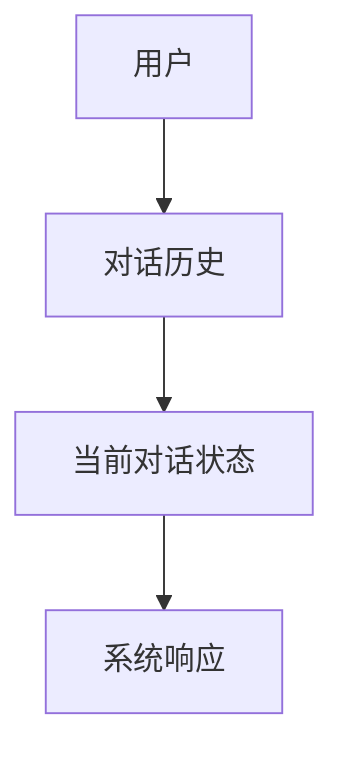
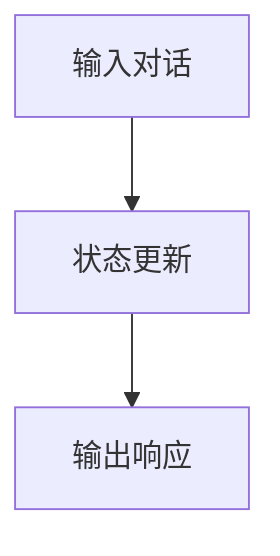

                 


# 实现AI Agent的多轮对话状态跟踪

## 关键词：AI Agent, 多轮对话, 状态跟踪, 对话历史, 系统响应, 状态更新

## 摘要：  
实现AI Agent的多轮对话状态跟踪是构建高效人机交互系统的核心技术之一。本文从背景、核心概念、算法原理、系统架构、项目实战到最佳实践等方面，全面解析多轮对话状态跟踪的实现方法。通过详细的技术分析和实例演示，帮助读者深入理解并掌握AI Agent中多轮对话状态跟踪的设计与实现。

---

# 第一部分：AI Agent与多轮对话状态跟踪概述

## 第1章：多轮对话状态跟踪的背景与问题

### 1.1 问题背景  
在人机交互系统中，AI Agent需要能够理解用户的意图并保持对话的连贯性。然而，随着对话轮次的增加，信息可能会丢失，导致系统无法准确理解用户的需求。  
- **AI Agent的基本概念**：AI Agent是一种智能体，能够感知环境、执行任务并与其他实体进行交互。  
- **多轮对话的定义与特点**：多轮对话是指用户与系统之间进行多轮交流的过程，其特点是对话的连续性和复杂性。  
- **状态跟踪的重要性**：状态跟踪是确保对话连贯性的关键，它记录了对话历史、用户意图和系统状态。

### 1.2 问题描述  
- **对话中的信息丢失问题**：由于缺乏有效的状态管理，系统可能会忽略之前的对话内容，导致理解偏差。  
- **状态跟踪的必要性**：通过记录和更新对话状态，系统可以更好地理解用户需求并提供更准确的响应。  
- **多轮对话中的挑战**：如何高效地表示和更新对话状态，是实现多轮对话系统的核心问题。

### 1.3 问题解决  
- **状态跟踪的基本思路**：通过记录对话历史和当前状态，结合上下文信息进行状态更新。  
- **状态表示的方法**：使用结构化的数据表示状态，例如JSON格式。  
- **状态更新的机制**：基于用户输入和系统反馈，动态更新对话状态。

### 1.4 边界与外延  
- **状态跟踪的边界**：状态跟踪仅关注对话相关的信息，不涉及系统内部的任务执行逻辑。  
- **相关概念的外延**：与对话生成、意图识别等技术密切相关。  
- **与任务规划的关系**：状态跟踪为任务规划提供基础信息，任务规划则指导对话的下一步行动。

### 1.5 概念结构与核心要素  
- **核心概念的组成**：包括对话历史、当前状态、系统响应等。  
- **核心要素的对比**：通过表格对比不同的状态表示方法，例如基于规则和基于模型的对比。  
- **概念结构的图示**：使用Mermaid图展示实体关系，例如用户、对话历史和系统状态之间的关系。

## 第2章：多轮对话状态跟踪的核心概念与联系

### 2.1 核心概念原理  
- **状态表示的原理**：使用上下文信息和对话历史来表示当前状态。  
- **对话历史的记录方法**：通过日志记录每次对话的内容和时间戳。  
- **状态更新的机制**：基于用户输入和系统反馈，动态更新状态。

### 2.2 核心概念属性对比  
- **基于规则的对比**：规则驱动的状态更新简单但缺乏灵活性。  
- **基于模型的对比**：模型驱动的状态更新更准确但计算复杂度高。  
- **基于记忆的对比**：记忆网络能够更好地处理长距离依赖关系。

### 2.3 ER实体关系图  


---

# 第二部分：多轮对话状态跟踪的算法原理

## 第3章：多轮对话状态跟踪的算法原理

### 3.1 算法原理概述  
- **基于隐马尔可夫模型（HMM）的原理**：通过状态转移和观测概率建模对话过程。  
- **基于Transformer的原理**：利用自注意力机制捕捉对话中的长距离依赖关系。  
- **基于记忆网络的原理**：通过外部记忆存储对话历史，增强模型的长期记忆能力。

### 3.2 算法流程图  


### 3.3 算法实现代码  
```python
def update_state(current_state, input_dialogue):
    # 实现状态更新逻辑
    new_state = current_state.copy()
    new_state['intent'] = detect_intent(input_dialogue)
    new_state['context'] = update_context(current_state['context'], input_dialogue)
    return new_state
```

### 3.4 数学模型与公式  
- **HMM模型的转移概率**：  
  $$ P(s_{t+1}|s_t) $$  
  其中，$s_t$ 表示当前状态，$s_{t+1}$ 表示下一步状态。  
- **HMM模型的观测概率**：  
  $$ P(o_t|s_t) $$  
  其中，$o_t$ 表示在状态 $s_t$ 下的观测值。

---

# 第三部分：多轮对话状态跟踪的系统分析与架构设计

## 第4章：系统分析与架构设计方案

### 4.1 问题场景介绍  
- **目标**：实现一个支持多轮对话的AI Agent系统。  
- **主要功能**：包括对话历史记录、状态更新、意图识别和系统响应生成。

### 4.2 系统功能设计  
- **领域模型设计**：  
  ```mermaid
  classDiagram
      class 用户 {
          id: int
          name: str
      }
      class 对话历史 {
          dialog_id: int
          content: str
          timestamp: datetime
      }
      class 系统状态 {
          current_intent: str
          context: dict
      }
      用户 --> 对话历史
      对话历史 --> 系统状态
  ```

### 4.3 系统架构设计  
- **分层架构**：  
  ```mermaid
  graph TD
      A[用户输入] --> B[对话历史记录]
      B --> C[状态更新]
      C --> D[系统响应]
      D --> E[用户输出]
  ```

### 4.4 系统接口设计  
- **输入接口**：接收用户的对话输入，记录对话历史。  
- **输出接口**：生成系统响应，更新当前状态。  
- **交互流程图**：  
  ```mermaid
  sequenceDiagram
      用户->>系统: 发送对话输入
      系统->>对话历史: 记录对话内容
      系统->>状态更新: 更新当前状态
      系统->>用户: 发送系统响应
  ```

---

# 第四部分：多轮对话状态跟踪的项目实战

## 第5章：项目实战

### 5.1 环境安装  
- **Python版本**：Python 3.8+  
- **依赖库**：numpy、pandas、scikit-learn  

### 5.2 核心代码实现  
```python
import json

def detect_intent(dialogue):
    # 简单的意图识别函数
    if 'order' in dialogue.lower():
        return 'order'
    elif 'schedule' in dialogue.lower():
        return 'schedule'
    else:
        return 'other'

def update_context(context, dialogue):
    # 更新上下文
    context['last_dialogue'] = dialogue
    return context

def main():
    current_state = {
        'intent': 'init',
        'context': {}
    }
    input_dialogue = "Can you schedule a meeting for me?"
    new_state = update_state(current_state, input_dialogue)
    print(new_state)

if __name__ == '__main__':
    main()
```

### 5.3 代码解读与分析  
- **detect_intent函数**：用于识别用户的意图，简单基于关键词匹配。  
- **update_context函数**：更新对话上下文，记录用户的最新输入。  
- **update_state函数**：调用上述函数，更新当前状态。

### 5.4 案例分析  
假设用户输入：“Can you schedule a meeting for me?”  
- 对话历史记录：输入对话内容和时间戳。  
- 状态更新：intent 更新为 'schedule'，上下文记录最新对话。  
- 系统响应：生成与预约相关的响应。

### 5.5 项目小结  
通过实现一个简单的多轮对话状态跟踪系统，展示了如何记录对话历史、更新状态以及生成系统响应。

---

# 第五部分：多轮对话状态跟踪的最佳实践

## 第6章：最佳实践

### 6.1 小结  
- **关键点回顾**：对话历史记录、状态更新机制、系统响应生成。  
- **经验总结**：状态跟踪是实现高效人机交互的核心技术，需要结合具体场景进行优化。

### 6.2 注意事项  
- **数据隐私**：确保对话历史和用户信息的安全性。  
- **性能优化**：在大规模对话中，需要优化状态更新的效率。  
- **模型选择**：根据需求选择合适的算法，例如HMM适用于简单的对话跟踪，Transformer适用于复杂的长文本处理。

### 6.3 拓展阅读  
- **推荐书籍**：《对话系统中的自然语言处理》、《深度学习中的对话建模》。  
- **推荐论文**：阅读最新的研究成果，例如基于Transformer的对话状态跟踪模型。

---

# 结语  
通过本文的详细讲解和实例演示，读者可以全面理解多轮对话状态跟踪的核心技术，并能够将其应用到实际的AI Agent开发中。希望本文能够为开发者提供有价值的参考和启发。

