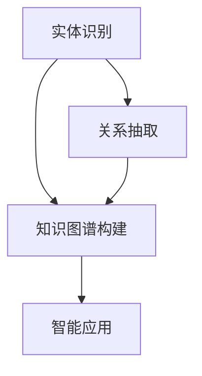
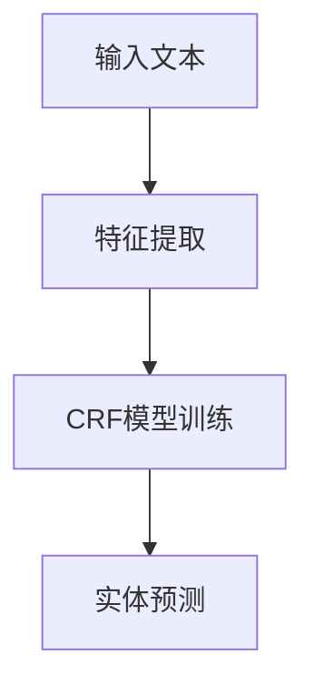
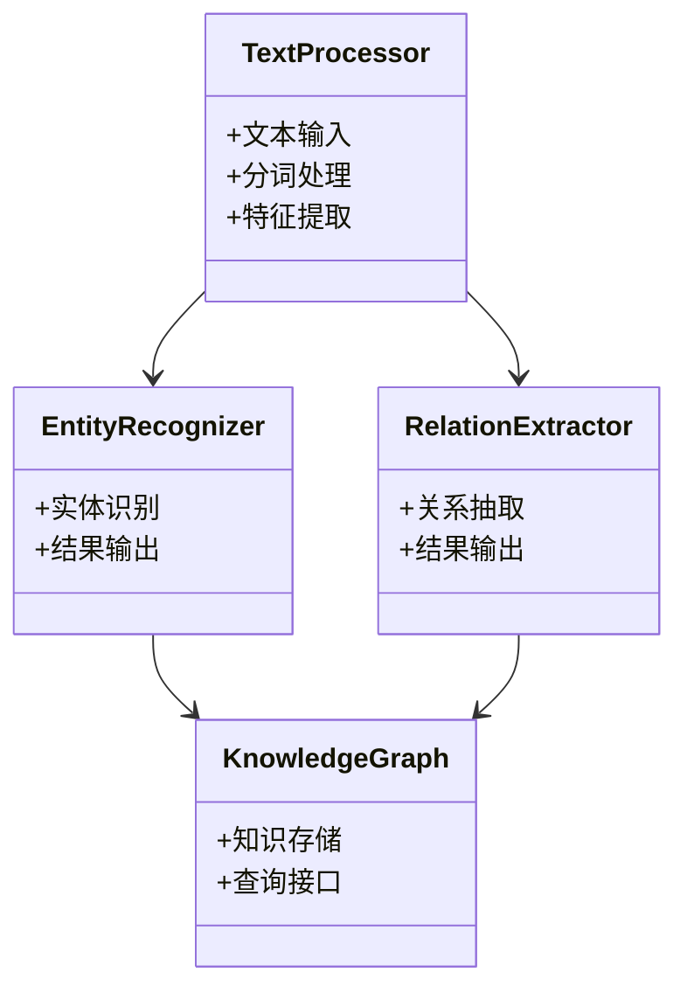
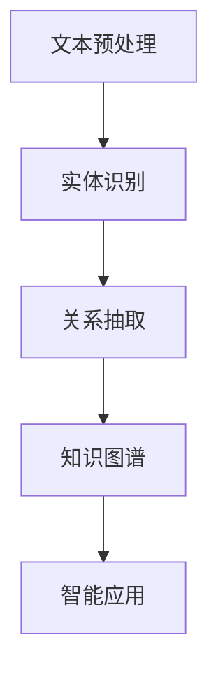

                 


# 实现AI Agent的实体识别与关系抽取

> 关键词：AI Agent, 实体识别, 关系抽取, 自然语言处理, 信息抽取, 知识图谱

> 摘要：本文详细探讨了在AI Agent中实现实体识别与关系抽取的核心技术，从背景介绍、核心概念、算法原理到系统架构设计和项目实战，为读者提供全面的技术指导。

---

## 第4章: 实体识别与关系抽取的核心原理

### 4.1 实体识别的原理

#### 4.1.1 实体识别的流程

1. **输入文本分析**：首先，系统接收一段自然语言文本。
2. **分词处理**：将文本分割成词语或短语。
3. **特征提取**：提取每个词的特征，如词性、上下文信息等。
4. **模型预测**：基于训练好的模型，预测每个词的实体类别。
5. **结果整合**：将预测结果整合，形成最终的实体识别结果。

#### 4.1.2 实体识别的特征

| 特征维度 | 特征描述 |
|----------|----------|
| 识别精度 | 实体识别的准确率 |
| 灵活性 | 能否识别不同领域的实体 |
| 处理速度 | 实时处理能力 |

#### 4.1.3 实体识别与关系抽取的关系



### 4.2 关系抽取的原理

#### 4.2.1 关系抽取的流程

1. **实体识别**：首先需要准确识别出文本中的实体。
2. **关系模式匹配**：基于预定义的关系模式，寻找实体之间的关系。
3. **上下文分析**：分析实体之间的上下文关系，确定具体的关系类型。
4. **结果输出**：输出实体及其关系的结构化数据。

#### 4.2.2 关系抽取的特征

| 特征维度 | 特征描述 |
|----------|----------|
| 关系类型 | 抽取的支持关系类型 |
| 上下文理解 | 对上下文依赖的理解能力 |
| 精确性 | 关系抽取的准确率 |

---

## 第5章: 实体识别与关系抽取的算法原理

### 5.1 实体识别算法

#### 5.1.1 基于CRF的NER算法



代码实现：

```python
import numpy as np
from sklearn.preprocessing import LabelEncoder
from sklearn.metrics import classification_report
from sklearn_crfsuite import CRFSMOTE, CRFTagger

# 示例数据集
X_train = [...]
y_train = [...]

# 模型训练
tagger = CRFTagger()
tagger.fit(X_train, y_train)

# 预测
X_test = [...]
y_pred = tagger.predict(X_test)

# 结果分析
print(classification_report(y_test, y_pred))
```

数学公式：

NER模型的条件随机场（CRF）可以表示为：
$$ P(y|x) = \frac{1}{Z} \exp(\sum_{i=1}^{n} \sum_{j=1}^{m} w_{ij} x_{ij}) $$
其中，$Z$ 是归一化因子。

### 5.2 关系抽取算法

#### 5.2.1 基于RNN的关系抽取

代码实现：

```python
import tensorflow as tf
from tensorflow.keras import layers

# 模型定义
model = tf.keras.Sequential([
    layers.Embedding(input_dim=..., output_dim=...),
    layers.Bidirectional(layers.LSTM(128)),
    layers.Dense(64, activation='relu'),
    layers.Dense(num_relations, activation='softmax')
])

# 训练
model.compile(optimizer='adam', loss='sparse_categorical_crossentropy', metrics=['accuracy'])
model.fit(X_train, y_train, epochs=10, batch_size=32)
```

数学公式：

RNN的递推公式为：
$$ h_i = \tanh(W_{hh} h_{i-1} + W_{xh} x_i + b) $$
其中，$h_i$ 是第i个时间步的隐藏状态。

---

## 第6章: 系统架构设计

### 6.1 问题场景介绍

AI Agent需要从大量文本中抽取实体及其关系，构建知识图谱以支持智能决策。

### 6.2 系统功能设计

#### 功能模块



### 6.3 系统架构设计

#### 系统架构图



---

## 第7章: 项目实战

### 7.1 环境安装

```bash
pip install numpy scikit-learn tensorflow keras
pip install py2neo
```

### 7.2 核心代码实现

#### 实体识别代码

```python
import spacy

nlp = spacy.load("en_core_web_sm")

def identify_entities(text):
    doc = nlp(text)
    entities = []
    for ent in doc.ents:
        entities.append((ent.start, ent.end, ent.label_))
    return entities
```

#### 关系抽取代码

```python
from spacy.pipeline import add_pipe

nlp = spacy.load("en_core_web_sm")
add_pipe(nlp, "relation_extractor", config={"model": "bert-base"})

def extract_relations(text):
    doc = nlp(text)
    relations = []
    for ent in doc.ents:
        for rel in doc.relations:
            if ent in rel:
                relations.append((rel.head, rel.label_, rel.tail))
    return relations
```

### 7.3 实际案例分析

#### 医疗领域应用

输入文本：
"Patient has diabetes and is prescribed metformin."

输出：
Entities: Patient (PER), diabetes (Disease), metformin (Drug)
Relations: Patient -> treats -> diabetes, diabetes -> treated_by -> metformin.

---

## 第8章: 总结与展望

### 8.1 总结

本文详细讲解了AI Agent中实体识别与关系抽取的核心原理、算法实现和系统设计，通过项目实战展示了具体的应用场景。

### 8.2 未来展望

未来，实体识别与关系抽取将更加智能化和个性化，结合深度学习和知识图谱技术，进一步提升信息处理的效率和准确性。

### 8.3 注意事项

- 数据质量对模型性能至关重要。
- 确保模型的可解释性和透明性。
- 定期更新模型以适应新数据和应用场景的变化。

### 8.4 拓展阅读

- 《深度学习入门》
- 《自然语言处理实战》
- 《知识图谱构建与应用》

---

通过以上内容，读者可以全面掌握AI Agent中实体识别与关系抽取的技术实现，从理论到实践，逐步构建高效的信息抽取系统。

