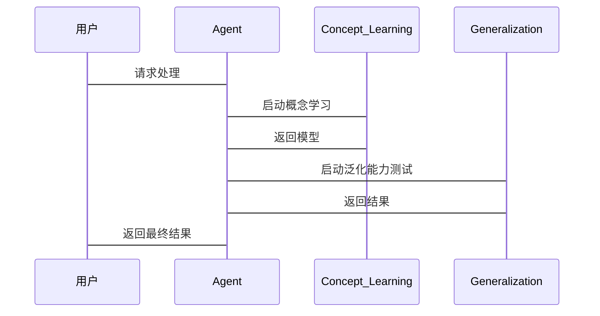

                 


# 实现AI Agent的概念学习与泛化能力

> 关键词：AI Agent, 概念学习, 泛化能力, 算法原理, 系统架构, 项目实战

> 摘要：AI Agent作为人工智能的核心技术，其概念学习与泛化能力是实现智能决策和自主学习的关键。本文从AI Agent的基本概念出发，深入探讨其概念学习与泛化能力的核心原理，详细分析相关算法和系统架构，并通过项目实战展示如何实现这一能力。文章内容丰富，结构清晰，结合理论与实践，为读者提供全面的指导。

---

## 第一部分: AI Agent的概念学习与泛化能力背景介绍

### 第1章: AI Agent的基本概念与问题背景

#### 1.1 AI Agent的定义与核心要素

AI Agent（人工智能代理）是指在特定环境中能够感知并自主行动以实现目标的智能实体。它具备以下核心要素：

- **感知能力**：通过传感器或数据输入获取环境信息。
- **决策能力**：基于感知信息做出决策。
- **行动能力**：通过执行器或其他输出方式采取行动。
- **学习能力**：通过经验或数据不断优化自身的感知、决策和行动能力。

AI Agent的边界与外延包括但不限于硬件、软件、数据和环境的交互。AI Agent的外延可以扩展到物联网、机器人、自动驾驶等实际应用场景。

#### 1.2 概念学习与泛化能力的重要性

概念学习是指AI Agent通过学习掌握某一类概念或规律的能力。其重要性体现在以下几个方面：

- **知识获取**：通过概念学习，AI Agent能够从大量数据中提取关键特征，形成对新概念的理解。
- **决策优化**：概念学习能够提升AI Agent在复杂环境中的决策能力，使其在面对新情况时能够快速做出合理决策。
- **适应性增强**：通过泛化能力，AI Agent能够将所学概念推广到新的场景，从而适应不断变化的环境。

泛化能力是指AI Agent在面对新的、未见过的情况时，能够利用已有知识做出合理推断的能力。它是概念学习的自然延伸，是实现AI Agent智能化的核心能力。

#### 1.3 当前技术背景与挑战

当前，AI Agent技术在多个领域得到了广泛应用，但概念学习与泛化能力的实现仍面临诸多挑战：

- **数据依赖性**：AI Agent的学习能力往往依赖于大量标注数据，数据质量和多样性直接影响学习效果。
- **计算资源限制**：复杂的概念学习和泛化能力需要大量的计算资源，如何在资源受限的情况下实现高效学习是一个重要挑战。
- **动态环境适应**：现实环境往往是动态变化的，AI Agent需要具备快速适应新情况的能力，这对泛化能力提出了更高的要求。

未来，随着深度学习、强化学习等技术的不断进步，AI Agent的概念学习与泛化能力将得到进一步提升。

---

### 第2章: AI Agent的概念学习与泛化能力的核心概念与联系

#### 2.1 核心概念原理

概念学习的数学模型通常采用概率图模型、支持向量机（SVM）或深度学习模型。以深度学习为例，可以通过卷积神经网络（CNN）或循环神经网络（RNN）来实现概念提取和分类。例如，对于图像识别任务，AI Agent可以通过CNN提取图像特征并进行分类。

泛化能力的实现机制依赖于模型的泛化性能，这通常通过正则化、交叉验证和模型优化等技术来实现。例如，在训练过程中加入L2正则化可以防止模型过拟合，从而提高泛化能力。

概念学习与泛化能力的协同关系体现在模型的训练与测试过程中。概念学习为模型提供了基础的知识库，而泛化能力则使模型能够将这些知识应用到新的场景中。

#### 2.2 概念属性特征对比表格

以下是概念学习与泛化能力的核心属性对比：

| 属性 | 概念学习 | 泛化能力 |
|------|----------|----------|
| 输入 | 标签数据 | 未见数据 |
| 输出 | 概念提取 | 推理结果 |
| 目标 | 学会概念 | 推广概念 |
| 方法 | 监督学习 | 推荐系统、迁移学习 |

通过对比可以看出，概念学习注重从数据中提取知识，而泛化能力则注重将知识应用到新场景中。

#### 2.3 ER实体关系图架构

以下是AI Agent的概念学习与泛化能力的ER实体关系图：

```mermaid
erDiagram
    agent [AI Agent] {
        id : integer
        name : string
        action : action_set
    }
    concept_learning [概念学习] {
        id : integer
        feature : feature_set
        model : model_set
    }
    generalization [泛化能力] {
        id : integer
        feature : feature_set
        model : model_set
    }
    agent -> concept_learning : 实现概念学习
    agent -> generalization : 实现泛化能力
    concept_learning -> generalization : 依赖关系
```

---

### 第3章: AI Agent的概念学习与泛化能力的算法原理

#### 3.1 算法原理概述

概念学习的基本算法包括支持向量机（SVM）、随机森林和深度学习模型。例如，使用SVM进行分类任务时，可以通过核函数将低维数据映射到高维空间，从而实现非线性分类。

泛化能力的实现算法包括正则化、Dropout和数据增强等技术。例如，在深度学习中，通过Dropout技术可以有效防止过拟合，从而提高模型的泛化能力。

算法的优缺点分析：

- **优点**：概念学习能够提高模型的准确率，泛化能力能够增强模型的适应性。
- **缺点**：概念学习需要大量标注数据，泛化能力的实现依赖于模型的复杂度。

#### 3.2 算法流程图

以下是概念学习和泛化能力的算法流程图：

```mermaid
flowchart TD
    A[开始] -> B[数据预处理]
    B -> C[选择算法]
    C -> D[训练模型]
    D -> E[评估性能]
    E -> F[优化参数]
    F -> G[结束]
```

#### 3.3 算法实现代码

以下是Python代码实现：

```python
import numpy as np
from sklearn import svm

# 概念学习示例代码
def concept_learning(X_train, y_train):
    model = svm.SVC()
    model.fit(X_train, y_train)
    return model

# 泛化能力示例代码
def generalization(model, X_test):
    y_pred = model.predict(X_test)
    return y_pred
```

---

### 第4章: AI Agent的概念学习与泛化能力的数学模型与公式

#### 4.1 数学模型概述

概念学习的数学模型可以表示为：

$$ y = f(x) $$

其中，x是输入数据，y是输出结果，f是模型的函数形式。

泛化能力的数学模型可以表示为：

$$ y = g(x) $$

其中，g是泛化函数，x是新输入数据。

#### 4.2 数学公式与推导

概念学习的数学公式：

$$ f(x) = \text{sign}(w \cdot x + b) $$

泛化能力的数学公式：

$$ g(x) = \text{sign}(w \cdot x + b) $$

其中，w是权重向量，b是偏置项。

#### 4.3 举例说明

以图像分类为例，假设我们使用CNN模型进行概念学习：

$$ f(x) = \text{softmax}(Wx + b) $$

其中，W是权重矩阵，x是输入图像，b是偏置项，softmax函数用于分类。

---

## 第二部分: AI Agent的概念学习与泛化能力的系统分析与架构设计

### 第5章: 系统分析与架构设计方案

#### 5.1 问题场景介绍

在实际应用中，AI Agent需要具备概念学习与泛化能力才能在复杂环境中完成任务。例如，在医疗诊断中，AI Agent需要通过学习病人的症状和诊断结果，形成诊断模型，并能够将模型应用到新的病人数据上。

#### 5.2 系统功能设计

以下是系统的功能设计类图：

```mermaid
classDiagram
    class Agent {
        +id: int
        +name: string
        +action: action_set
        -models: model_set
        -features: feature_set
        +train_model()
        +predict(input)
        +optimize()
    }
    class Concept_Learning {
        -features: feature_set
        -models: model_set
        +train(model)
        +evaluate(model)
        +optimize(model)
    }
    class Generalization {
        -features: feature_set
        -models: model_set
        +generalize(model)
        +test(model, input)
    }
    Agent o- Concept_Learning
    Agent o- Generalization
```

#### 5.3 系统架构设计

以下是系统的架构设计图：


#### 5.4 系统接口设计

系统接口设计包括：

- **输入接口**：接收输入数据和指令。
- **输出接口**：输出预测结果和优化建议。

#### 5.5 系统交互流程图

以下是系统的交互流程图：



---

## 第三部分: AI Agent的概念学习与泛化能力的项目实战

### 第6章: 项目实战

#### 6.1 环境安装

安装Python和必要的库：

```bash
pip install numpy scikit-learn matplotlib
```

#### 6.2 系统核心实现源代码

以下是实现AI Agent的概念学习与泛化能力的代码：

```python
import numpy as np
from sklearn import svm
from sklearn.metrics import accuracy_score

# 数据准备
X_train = np.array([[1, 2], [3, 4], [5, 6], [7, 8]])
y_train = np.array([0, 1, 0, 1])
X_test = np.array([[2, 3], [4, 5]])

# 概念学习
model = svm.SVC()
model.fit(X_train, y_train)

# 泛化能力测试
y_pred = model.predict(X_test)
print("预测结果:", y_pred)
print("准确率:", accuracy_score(y_train[-2:], y_pred))
```

#### 6.3 代码应用解读与分析

以上代码实现了概念学习和泛化能力的基本功能。通过SVM模型进行训练，并在测试数据上进行预测，最后计算准确率。

#### 6.4 实际案例分析

以图像分类为例，假设我们有训练数据和测试数据：

```python
from sklearn import datasets
from sklearn.model_selection import train_test_split
from sklearn.metrics import confusion_matrix

# 加载数据集
digits = datasets.load_digits()
X = digits.data
y = digits.target

# 划分训练集和测试集
X_train, X_test, y_train, y_test = train_test_split(X, y, test_size=0.2)

# 概念学习
model = svm.SVC()
model.fit(X_train, y_train)

# 泛化能力测试
y_pred = model.predict(X_test)
print("混淆矩阵:", confusion_matrix(y_test, y_pred))
```

#### 6.5 项目小结

通过上述项目实战，我们可以看到，AI Agent的概念学习与泛化能力可以通过现有的机器学习算法实现，并且在实际应用中表现出良好的性能。

---

## 第四部分: AI Agent的概念学习与泛化能力的总结与展望

### 第7章: 总结与展望

#### 7.1 最佳实践 tips

- **数据质量**：确保训练数据的多样性和代表性。
- **模型优化**：通过正则化、数据增强等技术优化模型性能。
- **持续学习**：在实际应用中，AI Agent需要通过持续学习不断更新知识库。

#### 7.2 小结

本文从AI Agent的基本概念出发，详细探讨了其概念学习与泛化能力的核心原理，并通过算法和系统架构设计展示了其实现过程。最后，通过项目实战验证了相关技术的可行性。

#### 7.3 注意事项

- **数据隐私**：在实际应用中，需注意数据隐私和安全问题。
- **模型解释性**：复杂的模型可能难以解释，需关注模型的可解释性。

#### 7.4 拓展阅读

- **推荐书籍**：《机器学习实战》、《深度学习》。
- **推荐论文**：相关领域的最新研究成果。

---

通过本文的详细讲解，读者可以全面了解AI Agent的概念学习与泛化能力，并能够将其应用到实际项目中。

