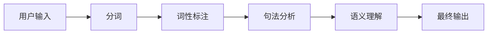

                 


# 实现AI Agent的自然语言理解能力

## 关键词：AI Agent，自然语言理解，NLP，深度学习，机器学习，自然语言处理

## 摘要：本文详细探讨了实现AI Agent的自然语言理解能力的关键技术与方法。从基础概念到算法原理，再到系统设计和项目实战，全面解析如何构建高效的自然语言理解系统，帮助AI Agent更好地理解和处理人类语言输入。

---

## 第一部分: AI Agent与自然语言理解概述

### 第1章: AI Agent与自然语言理解的背景介绍

#### 1.1 AI Agent的基本概念

- **1.1.1 什么是AI Agent**
  AI Agent（智能体）是能够感知环境、自主决策并执行任务的智能系统。它可以是一个软件程序，也可以是一个物理机器人，其核心目标是通过与环境交互来实现特定目标。

- **1.1.2 AI Agent的分类与特点**
  AI Agent可以分为简单反射型、基于模型的反射型、目标驱动型和效用驱动型。其特点是自主性、反应性、主动性、社会性和社会性。

- **1.1.3 自然语言理解在AI Agent中的重要性**
  自然语言理解（NLU）是AI Agent能够理解和处理人类语言输入的关键能力，使AI Agent能够与人类进行有效交互。

#### 1.2 自然语言理解的核心概念

- **1.2.1 自然语言理解的定义**
  自然语言理解是指计算机能够理解人类自然语言的能力，包括文本分析、语义理解等。

- **1.2.2 自然语言理解的关键问题**
  自然语言理解的关键问题包括文本表示、语义解析、上下文理解等。

- **1.2.3 自然语言理解的应用场景**
  自然语言理解广泛应用于聊天机器人、智能助手、情感分析、信息抽取等领域。

#### 1.3 本章小结
本章介绍了AI Agent的基本概念和自然语言理解的核心概念，强调了自然语言理解在AI Agent中的重要性。

---

## 第二部分: 自然语言理解的核心原理

### 第2章: 自然语言理解的核心概念与联系

#### 2.1 自然语言理解的原理

- **2.1.1 从输入到输出的基本流程**
  自然语言理解的基本流程包括分词、词性标注、句法分析、语义理解等步骤。

- **2.1.2 自然语言理解的关键技术**
  关键技术包括分词、实体识别、语义解析、意图识别等。

- **2.1.3 自然语言理解的数学模型**
  自然语言理解的数学模型包括概率模型、向量空间模型等。

#### 2.2 核心概念对比分析

- **2.2.1 基于规则的模型与基于统计的模型对比**
  基于规则的模型依赖于专家制定的规则，而基于统计的模型依赖于数据统计和概率计算。

- **2.2.2 传统NLP与深度学习NLP的对比**
  传统NLP依赖于特征工程，而深度学习NLP依赖于神经网络和深度学习模型。

- **2.2.3 词向量与句向量的对比**
  词向量表示词语的语义信息，而句向量表示整个句子的语义信息。

#### 2.3 ER实体关系图


#### 2.4 本章小结
本章详细讲解了自然语言理解的核心概念和原理，并通过ER实体关系图展示了自然语言理解的基本流程。

---

## 第三部分: 自然语言理解的算法原理

### 第3章: 自然语言理解的主流算法

#### 3.1 基于规则的自然语言理解算法

- **3.1.1 基于规则的分词算法**
  基于规则的分词算法依赖于预定义的词汇表和分词规则，例如最大匹配法。

- **3.1.2 基于规则的句法分析**
  基于规则的句法分析依赖于预定义的句法规则，例如基于上下文无关文法（CFG）的句法分析。

- **3.1.3 基于规则的语义理解**
  基于规则的语义理解依赖于预定义的语义规则，例如基于语义角色标注（SRL）的语义分析。

#### 3.2 基于统计的自然语言理解算法

- **3.2.1 TF-IDF算法**
  TF-IDF（Term Frequency-Inverse Document Frequency）是一种用于文本关键词提取的统计方法，公式为：
  $$TF-IDF(t, D) = TF(t, D) \times \log\left(\frac{N}{DF(t)}\right)$$
  其中，$TF(t, D)$是词语$t$在文档$D$中的词频，$DF(t)$是词语$t$在所有文档中的文档频次，$N$是文档总数。

- **3.2.2 Word2Vec算法**
  Word2Vec是一种基于神经网络的词向量表示方法，包括CBOW和Skip-Gram两种模型。

- **3.2.3 BERT模型**
  BERT（Bidirectional Encoder Representations from Transformers）是一种基于Transformer的预训练语言模型，广泛应用于自然语言理解任务。

#### 3.3 深度学习算法

- **3.3.1 LSTM网络**
  LSTM（Long Short-Term Memory）是一种基于循环神经网络的变体，用于处理序列数据。

- **3.3.2 Transformer模型**
  Transformer是一种基于自注意力机制的神经网络架构，广泛应用于机器翻译和自然语言理解任务。

- **3.3.3 GPT系列模型**
  GPT（Generative Pre-trained Transformer）是一种基于Transformer的预训练语言模型，广泛应用于生成任务。

#### 3.4 算法对比与选择

- **3.4.1 各种算法的优缺点对比**
  | 算法 | 优点 | 缺点 |
  |------|------|------|
  | 基于规则的模型 | 易解释，适用于特定领域 | 需要大量人工规则，难以处理复杂语义 |
  | TF-IDF | 简单易实现，适用于关键词提取 | 无法处理语义信息 |
  | Word2Vec | 词向量表示，适用于语义相似度计算 | 无法处理句法信息 |
  | BERT | 预训练模型，语义理解能力强 | 计算资源需求高 |
  | LSTM | 适合序列数据，捕捉时序信息 | 易受梯度消失问题影响 |
  | Transformer | 并行计算，全局依赖关系 | 易受计算资源限制 |

- **3.4.2 如何选择合适的算法**
  选择合适的算法需要考虑任务需求、数据规模、计算资源等因素。例如，对于小数据集，可以选择基于规则的模型或TF-IDF；对于大数据集，可以选择深度学习模型如BERT或Transformer。

#### 3.5 本章小结
本章详细介绍了自然语言理解的主流算法，包括基于规则的模型、基于统计的模型和深度学习模型，并通过对比分析帮助读者选择合适的算法。

---

## 第四部分: 自然语言理解的系统分析与架构设计

### 第4章: 自然语言理解系统的分析与设计

#### 4.1 问题场景介绍

- **4.1.1 AI Agent的自然语言理解需求**
  AI Agent需要能够理解和处理用户的自然语言输入，例如用户的查询、指令或对话。

- **4.1.2 系统的目标与范围**
  系统的目标是实现自然语言理解功能，范围包括分词、词性标注、句法分析、语义理解等。

- **4.1.3 系统的约束与假设**
  约束包括数据格式、性能要求等，假设包括数据质量、模型训练时间等。

#### 4.2 系统功能设计

- **4.2.1 领域模型设计**
  ```mermaid
  classDiagram
  class User {
      +string input
      +string output
  }
  class NLPProcessor {
      +string input
      +string output
      -int

  }

  User --> NLPProcessor
  ```

- **4.2.2 系统架构设计**
  ```mermaid
  graph LR
  A[用户] --> B[输入层]
  B --> C[分词层]
  C --> D[词性标注层]
  D --> E[句法分析层]
  E --> F[语义理解层]
  F --> G[输出层]
  G --> H[AI Agent]
  ```

- **4.2.3 系统接口设计**
  系统接口包括输入接口（如API）和输出接口（如文本输出）。

- **4.2.4 系统交互设计**
  ```mermaid
  sequenceDiagram
  participant User
  participant AI Agent
  participant NLPProcessor
  User -> AI Agent: 发送自然语言输入
  AI Agent -> NLPProcessor: 请求处理
  NLPProcessor -> AI Agent: 返回处理结果
  AI Agent -> User: 发送输出结果
  ```

#### 4.3 本章小结
本章详细分析了自然语言理解系统的功能设计、架构设计和交互设计，为后续的系统实现奠定了基础。

---

## 第五部分: 自然语言理解的项目实战

### 第5章: 自然语言理解的项目实战

#### 5.1 环境安装

- 安装Python和必要的库（如TensorFlow、Keras、NLTK、spaCy等）。
- 安装Jupyter Notebook或其他IDE用于开发。

#### 5.2 核心代码实现

- **5.2.1 分词代码实现**
  ```python
  import jieba
  def word_segmentation(text):
      return jieba.lcut(text)
  ```

- **5.2.2 词性标注代码实现**
  ```python
  import nltk
  def pos_tagging(words):
      return nltk.pos_tag(words)
  ```

- **5.2.3 句法分析代码实现**
  ```python
  from spacy.lang.zh import Chinese
  nlp = Chinese()
  def syntactic_analysis(text):
      doc = nlp(text)
      return doc
  ```

- **5.2.4 语义理解代码实现**
  ```python
  import transformers
  from transformers import BertTokenizer, BertModel
  tokenizer = BertTokenizer.from_pretrained('bert-base-chinese')
  model = BertModel.from_pretrained('bert-base-chinese')
  def semantic_understanding(text):
      inputs = tokenizer.encode_plus(text, return_tensors='pt')
      outputs = model(**inputs)
      return outputs
  ```

#### 5.3 案例分析与详细解读

- **5.3.1 案例分析**
  以用户输入“我今天天气怎么样？”为例，展示分词、词性标注、句法分析和语义理解的整个流程。

- **5.3.2 代码实现与结果分析**
  展示上述代码的具体实现和运行结果，解释每一步的作用和意义。

#### 5.4 项目小结
本章通过实际项目展示了自然语言理解的实现过程，包括环境安装、代码实现和案例分析，帮助读者更好地理解和掌握自然语言理解技术。

---

## 第六部分: 自然语言理解的最佳实践

### 第6章: 自然语言理解的最佳实践

#### 6.1 优化与调优

- **6.1.1 数据预处理技巧**
  包括文本清洗、分词、去停用词等。
  
- **6.1.2 模型调优技巧**
  包括调整学习率、选择合适的模型参数等。

- **6.1.3 系统性能优化**
  包括并行计算、优化算法选择等。

#### 6.2 注意事项与常见问题

- **6.2.1 数据质量问题**
  数据清洗的重要性，如何处理噪声数据。

- **6.2.2 模型泛化能力**
  如何避免过拟合和欠拟合，选择合适的正则化方法。

- **6.2.3 系统性能瓶颈**
  如何优化系统性能，例如使用缓存技术、分布式计算等。

#### 6.3 拓展阅读

- 推荐一些经典的自然语言处理书籍和论文，如《自然语言处理入门》、《Effective Python》等。

#### 6.4 本章小结
本章总结了自然语言理解的最佳实践，包括优化技巧、注意事项和拓展阅读等内容，帮助读者进一步提升自己的技术水平。

---

## 结语

通过本文的详细讲解，读者可以系统地了解实现AI Agent的自然语言理解能力的关键技术和方法。从基础概念到算法原理，再到系统设计和项目实战，全面掌握自然语言理解的核心知识。希望本文能为读者在自然语言处理领域提供有价值的参考和指导。

