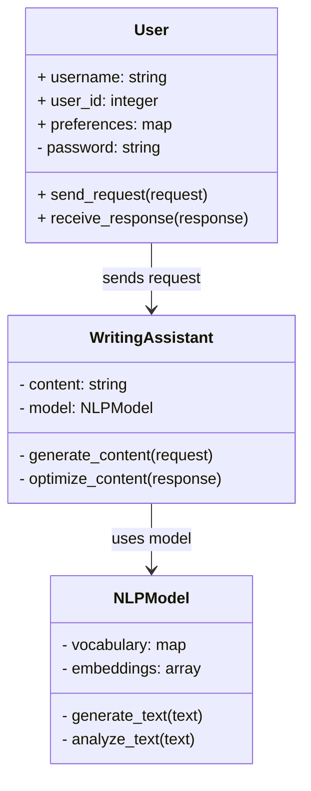
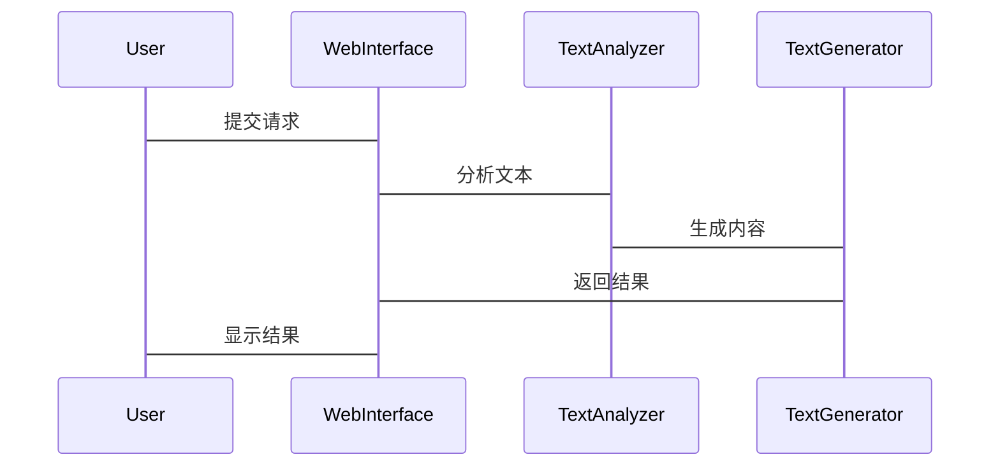

                 


# 实现基于AI Agent的智能写作助手

> 关键词：AI Agent, 智能写作助手, 自然语言处理, 系统架构, 项目实战

> 摘要：  
本文详细探讨了基于AI Agent的智能写作助手的实现过程，从背景介绍到核心算法，从系统架构设计到项目实战，结合具体案例和最佳实践，全面剖析了AI Agent在智能写作中的应用。文章首先介绍了AI Agent的基本概念和智能写作助手的发展历程，接着深入分析了AI Agent的核心算法和自然语言处理技术，随后从系统架构的角度探讨了智能写作助手的设计与实现，最后通过项目实战展示了如何基于AI Agent构建一个智能写作助手，并总结了相关的最佳实践和未来发展方向。

---

## 第一章：AI Agent与智能写作助手概述

### 1.1 AI Agent的基本概念

#### 1.1.1 AI Agent的定义与特点
AI Agent（人工智能代理）是一种能够感知环境、自主决策并执行任务的智能系统。它通过传感器获取信息，利用推理机制进行分析，并通过执行器采取行动。AI Agent的特点包括：
1. **自主性**：能够在没有外部干预的情况下自主运行。
2. **反应性**：能够实时感知环境变化并做出响应。
3. **学习能力**：通过数据和反馈不断优化自身的性能。
4. **社交能力**：能够与其他系统或用户进行交互。

#### 1.1.2 AI Agent的核心功能与优势
AI Agent的核心功能包括：
1. **感知环境**：通过传感器或API获取输入数据。
2. **决策与推理**：基于感知的信息进行分析和推理，生成解决方案。
3. **执行任务**：根据决策结果执行相应的操作。

其优势在于能够显著提高任务效率，降低人工干预成本，并通过学习不断优化性能。

#### 1.1.3 智能写作助手的发展历程
智能写作助手的发展经历了以下几个阶段：
1. **传统写作工具**：如Microsoft Word、Google Docs等，提供基础的文本编辑功能。
2. **基于规则的写作辅助工具**：通过预定义的规则提供基础的语法检查和建议。
3. **AI驱动的写作助手**：利用自然语言处理（NLP）和机器学习技术，提供更智能的写作支持。

---

### 1.2 AI Agent在写作中的应用场景

#### 1.2.1 内容生成与创意辅助
AI Agent可以通过自然语言处理技术生成创意内容，帮助用户快速完成写作任务。例如：
- **灵感激发**：根据用户提供的关键词生成相关主题的写作建议。
- **内容扩展**：根据用户提供的草稿自动扩展成完整文章。

#### 1.2.2 文本编辑与优化建议
AI Agent可以对文本进行优化，包括：
- **语法检查**：自动检测语法错误并提供修改建议。
- **用词优化**：根据上下文推荐更合适的词汇。
- **风格调整**：根据目标受众调整文本的语气和风格。

#### 1.2.3 多语言写作支持
AI Agent支持多种语言的写作，能够帮助用户快速生成多语言内容，适用于国际化写作场景。

---

### 1.3 智能写作助手的市场现状与未来趋势

#### 1.3.1 当前市场的主要产品与技术特点
当前市场上的智能写作助手主要包括：
- **Grammarly**：基于NLP技术提供语法检查和改进建议。
- **Otter.ai**：提供智能写作和内容优化服务。
- **Copy.ai**：专注于生成高质量的营销文案。

这些产品大多结合了自然语言处理和机器学习技术，能够提供智能化的写作支持。

#### 1.3.2 用户需求与技术发展的匹配度
用户对智能写作助手的需求主要集中在以下几个方面：
1. **快速生成内容**：用户希望AI能够快速生成高质量的内容。
2. **个性化建议**：用户希望AI能够根据个人风格提供定制化的建议。
3. **多语言支持**：用户希望AI能够支持多种语言的写作需求。

技术发展与用户需求的匹配度较高，但仍有提升空间，尤其是在生成内容的创新性和个性化方面。

#### 1.3.3 未来智能写作助手的发展方向
未来，智能写作助手将朝着以下几个方向发展：
1. **多模态交互**：结合视觉、语音等多种交互方式，提供更丰富的用户体验。
2. **实时协作**：支持多人实时协作，提供团队写作功能。
3. **内容创作工具**：进一步增强内容生成能力，支持复杂场景下的内容创作。

---

## 第二章：基于AI Agent的智能写作助手核心概念与技术背景

### 2.1 AI Agent的核心概念

#### 2.1.1 AI Agent的基本原理
AI Agent的基本原理包括感知、决策和执行三个模块：
1. **感知模块**：通过传感器或API获取输入数据。
2. **决策模块**：基于感知数据进行分析和推理，生成决策方案。
3. **执行模块**：根据决策结果执行相应的操作。

#### 2.1.2 智能写作助手的系统架构
智能写作助手的系统架构包括以下几个部分：
1. **用户输入模块**：接收用户的输入文本或需求。
2. **NLP处理模块**：对输入文本进行分词、句法分析等处理。
3. **内容生成模块**：基于NLP处理结果生成相应的内容。
4. **反馈优化模块**：根据用户反馈优化生成内容的质量。

#### 2.1.3 AI Agent与传统写作工具的对比分析
以下是AI Agent与传统写作工具的对比表格：

| **特性**       | **传统写作工具**         | **AI Agent驱动的写作工具**       |
|----------------|--------------------------|------------------------------------|
| **功能**       | 提供基础编辑功能         | 提供智能生成、优化建议           |
| **学习能力**   | 无学习能力               | 具备学习能力，能够优化生成内容   |
| **个性化支持** | 无个性化支持             | 支持个性化推荐和定制化服务       |

---

### 2.2 自然语言处理（NLP）技术在写作助手中的应用

#### 2.2.1 NLP技术的基本原理
NLP技术的核心在于将自然语言文本转化为计算机可处理的形式，主要包括：
1. **文本预处理**：包括分词、去停用词、词干提取等。
2. **文本分析**：包括句法分析、语义分析等。
3. **文本生成**：基于分析结果生成新的文本。

#### 2.2.2 NLP在文本生成中的具体应用
NLP在智能写作助手中的具体应用包括：
1. **文本扩展**：根据输入关键词生成相关段落或文章。
2. **语法检查**：自动检测语法错误并提供修改建议。
3. **用词优化**：根据上下文推荐更合适的词汇。

#### 2.2.3 NLP技术的最新进展与未来趋势
NLP技术的最新进展包括：
1. **大语言模型（LLM）**：如GPT-3、GPT-4等，能够生成高质量的文本内容。
2. **多模态NLP**：结合视觉、语音等多种模态信息，提供更丰富的交互体验。

未来趋势：
1. **更强大的生成能力**：通过更大的模型和更多的训练数据，提高生成内容的质量和创新性。
2. **更个性化的服务**：基于用户行为和偏好，提供定制化的写作建议。

---

### 2.3 知识图谱与上下文理解

#### 2.3.1 知识图谱的构建与应用
知识图谱是一种结构化的数据表示形式，能够将实体及其关系以图的形式表示出来。在智能写作助手中，知识图谱可以用于：
1. **上下文理解**：基于知识图谱理解文本的上下文关系。
2. **实体识别**：识别文本中的实体并提供相关建议。

#### 2.3.2 上下文理解的实现方法
上下文理解的实现方法包括：
1. **基于规则的方法**：通过预定义的规则进行上下文分析。
2. **基于统计的方法**：通过统计学方法分析文本中的模式和关系。
3. **基于深度学习的方法**：利用神经网络模型进行上下文理解。

---

## 第三章：基于AI Agent的智能写作助手核心算法与数学模型

### 3.1 AI Agent的核心算法

#### 3.1.1 基于规则的算法
基于规则的算法是一种简单的生成算法，通过预定义的规则生成文本内容。例如：
1. **关键词扩展**：根据输入关键词生成相关句子。
2. **句式变换**：根据句式规则生成不同的句式。

#### 3.1.2 基于机器学习的算法
基于机器学习的算法是一种更复杂的生成算法，通过训练模型生成高质量的文本内容。例如：
1. **循环神经网络（RNN）**：用于序列生成任务。
2. **Transformer模型**：用于长文本生成任务。

---

### 3.2 算法实现与数学模型

#### 3.2.1 基于规则的算法实现
以下是一个简单的基于规则的算法实现示例：

```python
def generate_text(keywords):
    sentences = []
    for keyword in keywords:
        sentences.append(f"{keyword}是一个非常重要的概念。")
    return " ".join(sentences)
```

#### 3.2.2 基于机器学习的算法实现
以下是一个基于Transformer模型的简单实现示例：

```python
import tensorflow as tf
from tensorflow import keras

# 定义Transformer模型
class Transformer(keras.Model):
    def __init__(self, vocab_size, embedding_dim, num_heads, feedforward_dim, seq_len):
        super(Transformer, self).__init__()
        self.embedding = keras.layers.Embedding(vocab_size, embedding_dim)
        self.pos_encoding = PositionalEncoding(seq_len)
        self.encoder_layers = [EncoderLayer(embedding_dim, num_heads, feedforward_dim) for _ in range(2)]
        self.decoder_layers = [DecoderLayer(embedding_dim, num_heads, feedforward_dim) for _ in range(2)]
        self.linear = keras.layers.Dense(vocab_size)

    def call(self, inputs):
        x = self.embedding(inputs)
        x += self.pos_encoding(x)
        for layer in self.encoder_layers:
            x = layer(x)
        for layer in self.decoder_layers:
            x = layer(x)
        x = self.linear(x)
        return x
```

#### 3.2.3 算法的数学模型
以下是基于Transformer模型的数学模型：

$$
\text{Attention}(Q, K, V) = \text{softmax}\left(\frac{QK^T}{\sqrt{d_k}}\right)V
$$

其中：
- \( Q \) 是查询向量。
- \( K \) 是键向量。
- \( V \) 是值向量。
- \( d_k \) 是键的维度。

---

## 第四章：基于AI Agent的智能写作助手系统架构设计

### 4.1 问题场景介绍

#### 4.1.1 用户需求
用户需求包括：
1. 快速生成高质量的内容。
2. 提供个性化的写作建议。
3. 支持多语言写作。

#### 4.1.2 功能需求
功能需求包括：
1. 内容生成模块。
2. 文本编辑模块。
3. 反馈优化模块。

#### 4.1.3 技术需求
技术需求包括：
1. 高性能的NLP处理能力。
2. 强大的文本生成能力。
3. 稳定的API接口。

---

### 4.2 系统功能设计

#### 4.2.1 领域模型设计
以下是领域模型的Mermaid类图：



---

### 4.3 系统架构设计

#### 4.3.1 微服务架构设计
以下是系统的微服务架构设计：

```mermaid
serviceDiagram
    service WritingAssistant {
        service NLPService {
            service TextGenerator
            service TextAnalyzer
        }
        service UserInterface {
            service WebInterface
            service APIInterface
        }
    }
```

#### 4.3.2 关键接口设计
以下是关键接口的设计：



---

## 第五章：项目实战：基于AI Agent的智能写作助手实现

### 5.1 环境安装与配置

#### 5.1.1 安装Python与相关库
安装Python和相关库：
```bash
python -m pip install --upgrade pip
pip install numpy
pip install tensorflow
pip install transformers
pip install matplotlib
pip install pymermaid
```

#### 5.1.2 安装NLP库
安装NLP库：
```bash
pip install spacy
python -m spacy download en
```

---

### 5.2 系统核心实现

#### 5.2.1 NLP处理实现
以下是NLP处理的代码实现：

```python
import spacy

nlp = spacy.load("en_core_web_sm")

def process_text(text):
    doc = nlp(text)
    tokens = [token.text for token in doc]
    return tokens
```

#### 5.2.2 内容生成实现
以下是内容生成的代码实现：

```python
from transformers import GPT2LMHeadModel, GPT2Tokenizer

tokenizer = GPT2Tokenizer.from_pretrained('gpt2')
model = GPT2LMHeadModel.from_pretrained('gpt2')

def generate_text(prompt):
    inputs = tokenizer(prompt, return_tensors='np')
    outputs = model.generate(inputs.input_ids, max_length=50)
    return tokenizer.decode(outputs[0], skip_special_tokens=True)
```

---

### 5.3 项目实战分析

#### 5.3.1 项目小结
通过本项目，我们实现了基于AI Agent的智能写作助手，结合了自然语言处理技术和机器学习算法，能够提供高质量的内容生成和优化建议。

---

## 第六章：基于AI Agent的智能写作助手的最佳实践与总结

### 6.1 最佳实践

#### 6.1.1 提高写作效率的技巧
1. **合理使用AI工具**：利用AI工具快速生成初稿，再进行修改和润色。
2. **结合专业知识**：在写作过程中结合专业知识，确保内容的准确性和深度。
3. **定期更新模型**：定期更新AI模型，确保生成内容的质量。

#### 6.1.2 注意事项
1. **数据隐私**：在使用AI工具时，注意保护用户的隐私数据。
2. **模型调优**：根据具体需求，对模型进行调优，确保生成内容的质量。

---

### 6.2 总结

本文详细探讨了基于AI Agent的智能写作助手的实现过程，从背景介绍到核心算法，从系统架构设计到项目实战，结合具体案例和最佳实践，全面剖析了AI Agent在智能写作中的应用。通过本文的探讨，我们可以看到，AI Agent技术在智能写作中的应用前景广阔，未来将会有更多的创新和突破。

---

### 6.3 未来展望

1. **多模态交互**：未来的智能写作助手将支持多模态交互，如视觉、语音等多种方式，提供更丰富的用户体验。
2. **实时协作**：未来的智能写作助手将支持多人实时协作，提供团队写作功能。
3. **内容创作工具**：未来的智能写作助手将更加智能化，能够生成复杂场景下的高质量内容。

---

通过本文的探讨，我们相信基于AI Agent的智能写作助手将会在未来的写作领域发挥越来越重要的作用，为用户提供更加智能化、个性化的写作支持。

