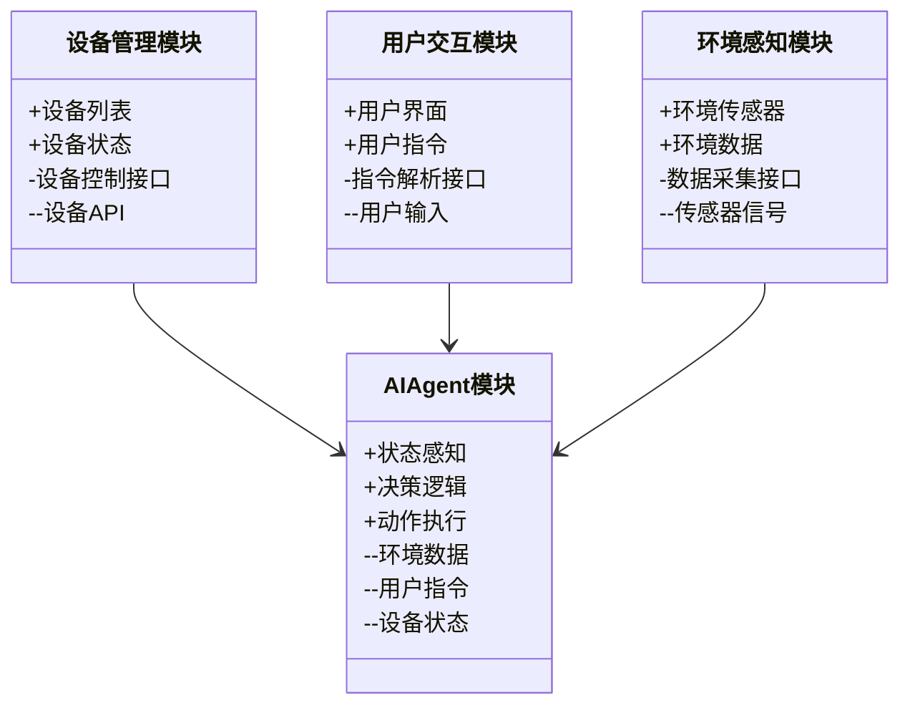
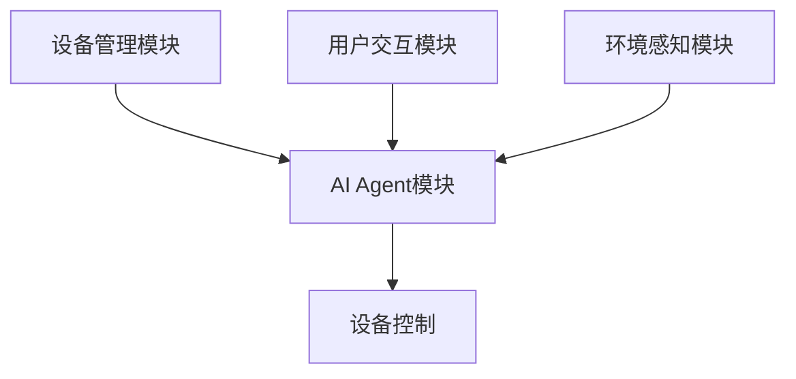
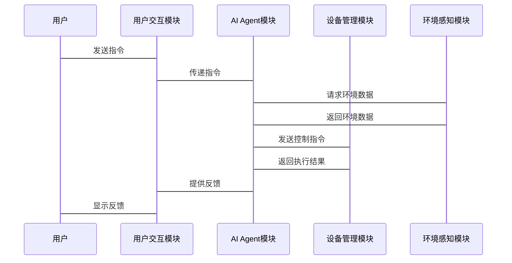

                 


# 实现基于AI Agent的智能家居控制系统

> 关键词：AI Agent, 智能家居, 系统设计, 算法实现, 项目实战

> 摘要：本文将详细介绍如何基于AI Agent实现智能家居控制系统。通过背景介绍、核心概念、算法原理、系统架构设计、项目实战以及总结与展望等部分，系统性地阐述了AI Agent在智能家居中的应用。文章结合理论与实践，为读者提供从概念到实现的完整指南。

---

# 第一章：背景介绍与问题背景

## 1.1 AI Agent与智能家居的结合

### 1.1.1 AI Agent的基本概念

AI Agent（人工智能代理）是指能够感知环境、自主决策并执行任务的智能实体。AI Agent具备以下核心特征：

- **自主性**：能够在没有外部干预的情况下独立运行。
- **反应性**：能够根据环境的变化实时调整行为。
- **主动性**：主动采取行动以实现目标。
- **社交能力**：能够与其他系统或用户进行交互。

### 1.1.2 智能家居的定义与现状

智能家居是指通过物联网（IoT）技术将家中的设备（如灯光、空调、安防设备等）连接到一个系统中，实现智能化管理的居住环境。智能家居的目标是提高居住舒适度、安全性和能源效率。

智能家居的发展现状包括以下几个方面：

- **设备互联互通**：通过Wi-Fi、蓝牙、ZigBee等协议实现设备间的通信。
- **场景化控制**：用户可以通过手机APP或语音助手（如Alexa、Google Assistant）设置多种场景模式（如离家模式、回家模式）。
- **数据采集与分析**：通过传感器采集环境数据（如温度、湿度、光照强度）并进行分析，以优化设备运行策略。

### 1.1.3 问题背景与挑战

尽管智能家居技术已经取得了显著进展，但其智能化水平仍然有限。传统的智能家居系统主要依赖预设的规则和场景，缺乏动态适应环境变化的能力。用户的需求也日益多样化，例如：

- **个性化需求**：每个家庭成员的生活习惯不同，需要更加个性化的控制策略。
- **动态环境适应**：智能家居系统需要能够实时感知环境变化并自动调整设备状态。
- **多设备协同**：复杂的家庭环境中存在多种设备和品牌，需要实现高效协同。

AI Agent的引入为解决这些问题提供了新的思路。通过AI Agent的感知、决策和执行能力，智能家居系统可以更加智能地响应用户需求和环境变化。

---

## 1.2 问题描述与目标

### 1.2.1 智能家居系统的需求分析

智能家居系统的核心需求包括：

1. **设备联动控制**：实现设备间的联动，例如当检测到有人入侵时，联动打开灯光和报警系统。
2. **个性化场景设置**：支持用户自定义多种场景模式，例如“观影模式”（关闭大灯、开启影视灯光、调节空调温度）。
3. **动态环境适应**：根据环境数据（如光照强度、温度、湿度）自动调整设备状态。
4. **多设备协同**：支持多种设备品牌和协议，实现无缝协同。

### 1.2.2 AI Agent在智能家居中的应用价值

AI Agent能够为智能家居系统带来以下价值：

1. **智能化决策**：通过学习用户习惯和环境数据，AI Agent可以制定更加智能的控制策略。
2. **动态适应能力**：AI Agent能够实时感知环境变化并动态调整设备状态。
3. **多设备协同优化**：AI Agent可以协调多个设备的工作，优化资源利用效率。

### 1.2.3 系统设计的目标与边界

系统设计的目标是打造一个基于AI Agent的智能家居控制系统，实现设备的智能化管理和动态控制。系统设计的边界包括：

- **设备范围**：支持主流智能家居设备（如灯光、空调、安防设备等）。
- **用户接口**：提供友好的用户界面或API接口，方便用户设置和控制。
- **环境感知**：通过传感器采集环境数据，作为AI Agent决策的依据。
- **安全与隐私**：确保系统数据的安全性和用户隐私的保护。

---

# 第二章：核心概念与原理分析

## 2.1 AI Agent的核心概念

### 2.1.1 AI Agent的定义与特点

AI Agent是一种智能实体，能够通过感知环境、自主决策并执行任务。AI Agent的特点包括：

- **感知能力**：通过传感器、摄像头等设备感知环境。
- **决策能力**：基于感知数据和目标函数进行决策。
- **执行能力**：通过执行器（如继电器、电机）实现决策结果。

### 2.1.2 AI Agent的类型与应用场景

AI Agent可以根据智能水平分为以下几类：

1. **反应式AI Agent**：基于当前感知数据进行实时决策，适用于需要快速响应的场景。
2. **认知式AI Agent**：具备复杂的推理和规划能力，适用于需要长期目标规划的场景。

AI Agent在智能家居中的应用场景包括：

- **设备联动控制**：通过AI Agent实现设备间的联动，例如联动灯光和空调。
- **个性化服务**：根据用户习惯提供个性化服务，例如根据用户的作息时间自动调节灯光和温度。
- **环境优化**：根据环境数据优化设备运行策略，例如在高温天气自动开启空调。

### 2.1.3 AI Agent与传统控制系统的区别

与传统控制系统相比，AI Agent具有以下优势：

- **自主性**：AI Agent能够自主决策，而传统控制系统通常需要依赖预设规则。
- **动态适应性**：AI Agent能够实时调整控制策略，而传统控制系统通常基于固定的规则。
- **学习能力**：AI Agent可以通过机器学习不断优化控制策略。

---

## 2.2 智能家居系统架构

### 2.2.1 智能家居的系统组成

智能家居系统通常由以下部分组成：

- **设备层**：包括各种智能家居设备（如灯光、空调、安防设备）。
- **通信层**：包括设备间的通信协议（如Wi-Fi、蓝牙、ZigBee）。
- **控制层**：包括智能家居控制中心，负责接收用户指令并协调设备运行。
- **用户层**：包括用户界面（如手机APP、语音助手）。

### 2.2.2 智能家居的通信协议

智能家居系统中常用的通信协议包括：

- **Wi-Fi**：基于无线局域网的通信协议，适合长距离传输。
- **蓝牙**：低功耗、短距离的通信协议，适合近距离设备连接。
- **ZigBee**：低功耗、低带宽的通信协议，适合多设备组网。

### 2.2.3 AI Agent与智能家居设备的结合

AI Agent在智能家居系统中的作用：

1. **设备管理**：AI Agent负责管理智能家居设备的状态和运行模式。
2. **设备控制**：AI Agent根据感知数据和用户指令控制设备运行。
3. **设备协同**：AI Agent协调多个设备的运行，实现联动控制。

---

## 2.3 AI Agent与智能家居的结合

### 2.3.1 AI Agent在智能家居中的角色

AI Agent在智能家居系统中扮演以下几个角色：

- **感知者**：通过传感器感知环境数据。
- **决策者**：基于感知数据和用户需求制定控制策略。
- **执行者**：通过执行器控制设备运行。

### 2.3.2 AI Agent与智能家居设备的交互机制

AI Agent与智能家居设备之间的交互机制包括：

1. **数据采集**：AI Agent通过传感器采集环境数据。
2. **指令发送**：AI Agent根据感知数据和用户需求向设备发送控制指令。
3. **反馈接收**：设备执行指令后向AI Agent反馈执行结果。

### 2.3.3 AI Agent在智能家居中的功能实现

AI Agent在智能家居中的功能实现包括：

- **设备联动控制**：根据用户指令或环境数据联动控制多个设备。
- **个性化服务**：根据用户习惯提供个性化服务。
- **环境优化**：根据环境数据优化设备运行策略。

---

# 第三章：算法原理与数学模型

## 3.1 AI Agent的核心算法

### 3.1.1 状态表示与感知

AI Agent的状态表示包括：

- **环境状态**：例如温度、湿度、光照强度。
- **设备状态**：例如灯光开关状态、空调运行模式。

### 3.1.2 决策与规划算法

常用的决策与规划算法包括：

1. **Q-learning算法**：一种基于强化学习的算法，通过试错学习优化决策策略。
2. **遗传算法**：通过模拟自然选择和遗传变异优化决策策略。

### 3.1.3 执行与反馈机制

执行与反馈机制包括：

1. **动作选择**：AI Agent根据当前状态选择最优动作。
2. **动作执行**：AI Agent通过执行器执行选择的动作。
3. **反馈接收**：AI Agent接收执行结果并更新状态。

---

## 3.2 数学模型与公式

### 3.2.1 状态空间表示

状态空间表示为：

$$ S = \{ s_1, s_2, \ldots, s_n \} $$

其中，$s_i$ 表示状态空间中的一个状态。

### 3.2.2 动作空间表示

动作空间表示为：

$$ A = \{ a_1, a_2, \ldots, a_m \} $$

其中，$a_j$ 表示动作空间中的一个动作。

### 3.2.3 奖励函数与策略优化

奖励函数表示为：

$$ R(s, a) $$

策略优化目标是最优化期望奖励：

$$ \theta = \arg \max_{\theta} \mathbb{E}[R] $$

---

## 3.3 算法实现与案例分析

### 3.3.1 算法实现步骤

1. **状态感知**：通过传感器采集环境数据。
2. **状态表示**：将环境数据转换为状态表示。
3. **动作选择**：基于当前状态选择最优动作。
4. **动作执行**：通过执行器执行选择的动作。
5. **反馈接收**：接收执行结果并更新状态。

### 3.3.2 典型案例分析

例如，AI Agent可以根据室温自动调节空调运行模式：

- **感知温度**：AI Agent通过温度传感器获取当前室温。
- **决策控制**：根据当前室温和设定温度，AI Agent决定是否开启空调或调节温度。
- **执行控制**：AI Agent通过空调控制器执行决策。

---

# 第四章：系统分析与架构设计

## 4.1 系统功能设计

### 4.1.1 系统功能模块划分

智能家居控制系统的主要功能模块包括：

1. **设备管理模块**：负责设备的状态监控和设备控制。
2. **用户交互模块**：提供用户与系统交互的界面。
3. **环境感知模块**：负责采集环境数据。
4. **AI Agent模块**：负责系统的智能化决策和控制。

### 4.1.2 功能模块的交互流程

功能模块的交互流程如下：

1. **用户指令**：用户通过手机APP或语音助手发送指令。
2. **指令接收**：系统接收用户指令并解析。
3. **环境感知**：AI Agent通过传感器采集环境数据。
4. **决策控制**：AI Agent根据用户指令和环境数据制定控制策略。
5. **设备控制**：AI Agent通过设备管理模块控制设备运行。
6. **反馈接收**：系统接收设备执行结果并更新状态。

### 4.1.3 功能模块的实现方式

功能模块的实现方式包括：

1. **设备管理模块**：通过设备API实现设备控制。
2. **用户交互模块**：通过手机APP或语音助手实现用户交互。
3. **环境感知模块**：通过传感器采集环境数据。
4. **AI Agent模块**：通过机器学习算法实现智能化决策。

---

## 4.2 系统架构设计

### 4.2.1 问题场景介绍

智能家居系统需要解决以下问题：

1. **设备互联互通**：支持多种设备品牌和协议。
2. **动态环境适应**：根据环境数据动态调整设备状态。
3. **多设备协同**：协调多个设备的运行。

### 4.2.2 项目介绍

本项目旨在设计一个基于AI Agent的智能家居控制系统，实现设备的智能化管理和动态控制。

### 4.2.3 领域模型

领域模型表示为：



### 4.2.4 系统架构设计

系统架构设计表示为：



### 4.2.5 系统接口设计

系统接口设计包括：

1. **设备管理接口**：提供设备状态查询和设备控制接口。
2. **用户交互接口**：提供用户指令接收和指令解析接口。
3. **环境感知接口**：提供环境数据采集和数据传输接口。

### 4.2.6 系统交互流程

系统交互流程表示为：



---

## 4.3 系统实现细节

### 4.3.1 环境数据采集与处理

环境数据采集与处理包括：

1. **传感器数据采集**：通过传感器采集环境数据。
2. **数据预处理**：对采集到的数据进行清洗和归一化处理。
3. **数据存储**：将处理后的数据存储到数据库中。

### 4.3.2 设备控制与反馈

设备控制与反馈包括：

1. **设备控制**：通过设备API实现设备控制。
2. **反馈接收**：接收设备执行结果并更新系统状态。

### 4.3.3 系统优化

系统优化包括：

1. **算法优化**：优化AI Agent的决策算法，提高系统响应速度和准确性。
2. **系统调优**：优化系统架构，提高系统的稳定性和扩展性。

---

# 第五章：项目实战

## 5.1 环境安装与配置

### 5.1.1 安装Python环境

```bash
# 安装Python
python --version
```

### 5.1.2 安装依赖库

```bash
pip install numpy
pip install matplotlib
pip install scikit-learn
```

## 5.2 系统核心实现

### 5.2.1 AI Agent实现

```python
class AI_Agent:
    def __init__(self):
        self.sensors = []
        self.devices = []
    
    def add_sensor(self, sensor):
        self.sensors.append(sensor)
    
    def add_device(self, device):
        self.devices.append(device)
    
    def perceive_environment(self):
        # 获取环境数据
        return [s感知环境数据 for s in self.sensors]
    
    def decide_action(self, state):
        # 根据状态选择动作
        pass
    
    def execute_action(self, action, device):
        # 执行动作
        pass
```

### 5.2.2 设备管理实现

```python
class DeviceManager:
    def __init__(self):
        self.devices = []
    
    def add_device(self, device):
        self.devices.append(device)
    
    def remove_device(self, device):
        self.devices.remove(device)
    
    def control_device(self, device_id, action):
        # 控制设备
        pass
```

### 5.2.3 用户交互实现

```python
class UI:
    def __init__(self):
        self.agent = None
    
    def set_agent(self, agent):
        self.agent = agent
    
    def get_user_command(self):
        # 获取用户指令
        pass
    
    def display_feedback(self, feedback):
        # 显示反馈
        pass
```

## 5.3 代码应用解读与分析

### 5.3.1 代码结构分析

代码结构分析包括：

1. **AI Agent类**：负责感知环境、决策和执行。
2. **设备管理类**：负责设备的添加、删除和控制。
3. **用户交互类**：负责接收用户指令和显示反馈。

### 5.3.2 功能实现分析

功能实现分析包括：

1. **设备联动控制**：AI Agent可以根据用户指令联动控制多个设备。
2. **个性化服务**：AI Agent可以根据用户习惯提供个性化服务。
3. **环境优化**：AI Agent可以根据环境数据优化设备运行策略。

## 5.4 实际案例分析

### 5.4.1 案例介绍

例如，AI Agent可以根据室温自动调节空调运行模式。

### 5.4.2 案例实现

```python
class ThermostatAgent(AI_Agent):
    def __init__(self):
        super().__init__()
        self.target_temperature = 25
    
    def decide_action(self, state):
        current_temp = state['temperature']
        if current_temp > self.target_temperature:
            return '降温'
        elif current_temp < self.target_temperature:
            return '升温'
        else:
            return '保持'
```

### 5.4.3 案例分析

案例分析包括：

1. **感知环境**：AI Agent通过温度传感器获取当前室温。
2. **决策控制**：AI Agent根据当前室温和目标温度决定是否需要调节温度。
3. **执行控制**：AI Agent通过空调控制器执行温度调节。

## 5.5 项目小结

项目小结包括：

1. **项目目标**：实现一个基于AI Agent的智能家居控制系统。
2. **项目成果**：通过项目实战，读者可以掌握AI Agent在智能家居中的实现方法。
3. **项目意义**：本项目展示了AI Agent在智能家居系统中的应用潜力。

---

# 第六章：总结与展望

## 6.1 总结

本章对全文进行总结，回顾了基于AI Agent的智能家居控制系统的核心概念、算法原理和系统实现。通过理论与实践的结合，展示了AI Agent在智能家居系统中的广泛应用前景。

## 6.2 展望

随着AI技术的不断发展，智能家居系统将更加智能化和个性化。未来的研究方向包括：

1. **AI Agent的优化**：进一步优化AI Agent的算法，提高系统的智能化水平。
2. **多设备协同优化**：研究如何实现多个设备的高效协同。
3. **用户隐私保护**：加强对用户隐私的保护，确保系统的安全性。

---

# 附录：参考文献与扩展阅读

1. Russell, S., & Norvig, P. (2010). Artificial Intelligence: A Modern Approach.
2. 王伟, 李明. (2020). 智能家居系统设计与实现.
3. OpenAI. (2023). GPT-4 Technical Paper.

---

通过以上内容，您可以逐步构建一个基于AI Agent的智能家居控制系统，实现设备的智能化管理和动态控制。

