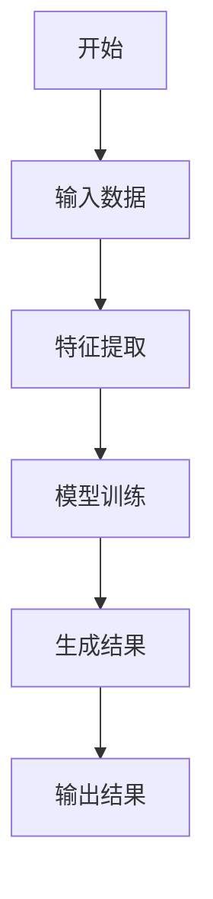
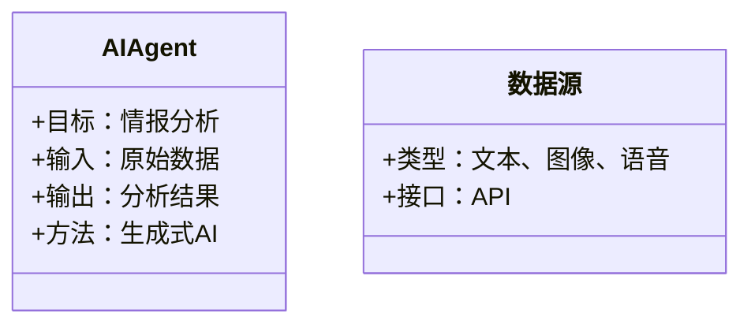
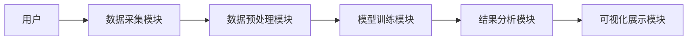

                 


# 实现基于AI Agent的智能情报分析系统

> 关键词：AI Agent，智能情报分析，生成式AI，大语言模型，强化学习，系统架构设计

> 摘要：本文详细介绍了基于AI Agent的智能情报分析系统的实现过程，从核心概念、算法原理到系统架构设计，再到项目实战，全面解析了该系统的构建方法。通过实际案例分析，展示了如何利用AI技术提升情报分析的效率和准确性。

---

# 第一部分：核心概念与原理

## 第1章：AI Agent的基本概念与特征

### 1.1 AI Agent的定义
AI Agent（人工智能代理）是指能够感知环境、自主决策并执行任务的智能实体。它具备以下核心特征：
1. **自主性**：能够在没有外部干预的情况下独立运行。
2. **反应性**：能够实时感知环境并做出响应。
3. **目标导向**：具备明确的目标，能够为实现目标而采取行动。
4. **学习能力**：能够通过经验改进自身的性能。

### 1.2 AI Agent与传统AI的区别
| 比较维度 | AI Agent | 传统AI |
|----------|----------|--------|
| 自主性   | 高       | 低     |
| 环境感知 | 强       | 弱     |
| 决策能力 | 高       | 低     |
| 学习能力 | 强       | 一般   |

### 1.3 AI Agent在情报分析中的作用
AI Agent能够通过以下方式提升情报分析的效率和准确性：
1. **实时数据处理**：快速分析海量数据，提取关键信息。
2. **自主决策**：根据分析结果自动执行下一步操作。
3. **学习与优化**：通过反馈机制不断优化分析模型。

---

## 第2章：生成式AI与大语言模型的原理

### 2.1 生成式AI的基本原理
生成式AI通过深度学习模型（如GPT）生成文本、图像等内容。其核心在于：
1. **概率分布建模**：通过大量数据训练，模型能够学习数据的分布特性。
2. **生成过程**：通过解码器生成输出，逐步优化生成结果。

### 2.2 大语言模型的数学模型
大语言模型通常采用Transformer架构，其关键公式如下：
$$P(y|x) = \frac{P(x,y)}{P(x)}$$
其中，$P(y|x)$表示在给定输入$x$的情况下，输出$y$的概率。

### 2.3 强化学习的应用场景
强化学习通过奖励机制训练AI Agent，使其在复杂环境中做出最优决策。其核心在于：
1. **状态空间**：定义系统的当前状态。
2. **动作空间**：定义系统可执行的操作。
3. **奖励函数**：定义系统行为的优劣。

---

## 第3章：AI Agent的算法实现

### 3.1 算法实现流程


### 3.2 算法实现细节
1. **数据预处理**：对原始数据进行清洗、归一化等处理。
2. **模型训练**：采用生成式AI模型进行训练，优化损失函数。
3. **结果分析**：对生成结果进行评估，计算准确率、召回率等指标。

### 3.3 数学模型与公式
1. **损失函数**：交叉熵损失函数
$$L = -\sum_{i=1}^{n} y_i \log(p_i)$$
2. **优化算法**：Adam优化器
$$\theta_{t+1} = \theta_t - \eta \frac{\partial L}{\partial \theta_t}$$

---

# 第二部分：系统分析与架构设计

## 第4章：系统功能设计

### 4.1 系统功能模块
| 功能模块 | 功能描述 |
|----------|----------|
| 数据采集 | 采集多源情报数据 |
| 数据预处理 | 对数据进行清洗、归一化等处理 |
| 模型训练 | 训练生成式AI模型 |
| 结果分析 | 对生成结果进行评估与优化 |
| 可视化展示 | 展示分析结果 |

### 4.2 领域模型设计


### 4.3 系统架构设计


### 4.4 接口设计与交互流程
1. **接口设计**：
    - 数据输入接口：接收原始数据。
    - 模型训练接口：调用生成式AI模型。
    - 结果输出接口：返回分析结果。
2. **交互流程**：
    - 用户输入数据。
    - 系统处理数据并生成结果。
    - 用户查看结果并提供反馈。

---

## 第5章：项目实战

### 5.1 项目背景
以网络舆情分析为例，利用AI Agent对社交媒体数据进行实时监控与分析。

### 5.2 环境配置
1. **工具安装**：
    - Python 3.8+
    - PyTorch 1.9+
    - Transformers库
2. **依赖安装**：
    ```bash
    pip install torch transformers
    ```

### 5.3 核心代码实现
```python
from transformers import GPT2LMHeadModel, GPT2Tokenizer

# 初始化模型
model = GPT2LMHeadModel.from_pretrained('gpt2')
tokenizer = GPT2Tokenizer.from_pretrained('gpt2')

# 数据预处理
input_text = "最新舆情：..."
inputs = tokenizer(input_text, return_tensors='pt')

# 模型推理
outputs = model.generate(inputs.input_ids, max_length=100, num_beams=5)
result = tokenizer.decode(outputs[0], skip_special_tokens=True)
```

### 5.4 实际案例分析
1. **数据准备**：收集社交媒体上的舆情数据。
2. **模型训练**：利用收集的数据训练生成式AI模型。
3. **结果分析**：分析生成结果，提取关键信息。
4. **可视化展示**：将分析结果以图表形式展示。

### 5.5 项目小结
通过实际案例分析，展示了基于AI Agent的智能情报分析系统的实现过程，验证了系统的有效性和实用性。

---

## 第6章：总结与展望

### 6.1 核心知识点回顾
- AI Agent的基本概念与特征
- 生成式AI与大语言模型的原理
- 系统架构设计与实现

### 6.2 最佳实践 tips
1. **数据质量**：确保数据的准确性和完整性。
2. **模型优化**：通过调整超参数提升模型性能。
3. **结果验证**：定期验证模型的准确率和召回率。

### 6.3 注意事项
- 确保数据安全，避免隐私泄露。
- 定期更新模型，适应数据分布的变化。
- 优化系统性能，提升用户体验。

### 6.4 拓展阅读
- 探索AI Agent在其他领域的应用。
- 深入研究生成式AI的最新技术。

---

通过本文的详细讲解，读者可以全面理解基于AI Agent的智能情报分析系统的实现过程，并能够将其应用于实际项目中。

