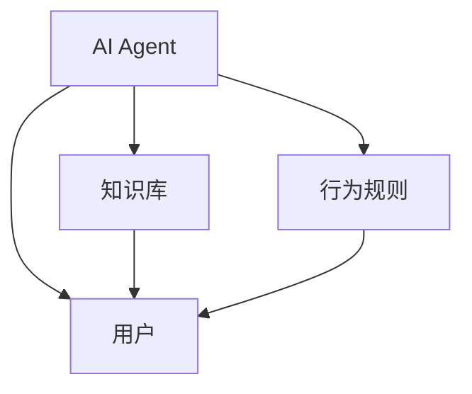
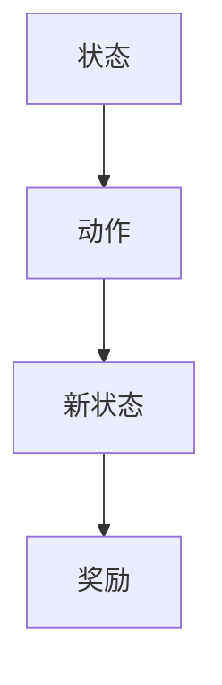
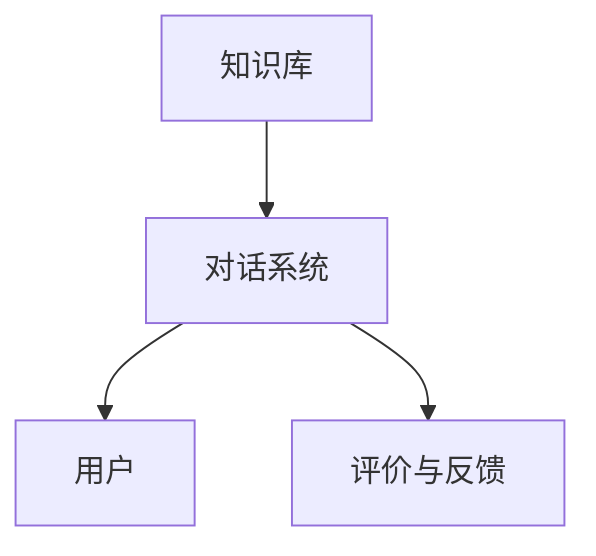

                 

---

# 实现基于AI Agent的智能虚拟教师

## 关键词：AI Agent, 智能虚拟教师, 教育技术, 人工智能, 自适应学习

## 摘要：本文深入探讨了基于AI Agent的智能虚拟教师的实现方法，从理论基础到实际应用，详细分析了其在教育领域的潜力与挑战。文章首先介绍了AI Agent的基本概念及其在教育中的重要性，接着分析了其核心原理与算法，随后通过系统架构设计展示了如何构建智能虚拟教师，最后通过项目实战与最佳实践提供了实现的具体指导。

---

# 第一部分: AI Agent与智能虚拟教师的背景与概念

# 第1章: AI Agent与智能虚拟教师的背景介绍

## 1.1 AI Agent的基本概念

### 1.1.1 什么是AI Agent

AI Agent，即人工智能代理，是一种能够感知环境、自主决策并采取行动的智能体。它可以理解为一种能够执行特定任务的计算机程序，具备学习、推理和自适应的能力。

### 1.1.2 AI Agent的核心特征

- **自主性**：能够在没有外部干预的情况下独立运作。
- **反应性**：能够实时感知环境并做出反应。
- **目标导向**：有明确的目标，并采取行动以实现这些目标。
- **学习能力**：能够通过经验优化自身的行为。

### 1.1.3 AI Agent与传统AI的区别

AI Agent不仅仅是一个静态的程序，而是一个动态的、能够与环境交互的实体。它具备更强的适应性和主动性，能够根据反馈不断优化自己的行为。

## 1.2 智能虚拟教师的定义与特点

### 1.2.1 智能虚拟教师的定义

智能虚拟教师是一种基于AI Agent的教育工具，能够通过自然语言处理、机器学习等技术，为学生提供个性化的教学支持。

### 1.2.2 智能虚拟教师的核心功能

- **知识传授**：通过对话形式向学生讲解知识点。
- **个性化辅导**：根据学生的学习情况提供定制化的学习建议。
- **情感支持**：通过情感识别，给予学生情感上的支持。

### 1.2.3 智能虚拟教师与传统教学工具的区别

智能虚拟教师具备更强的互动性和适应性，能够根据学生的需求动态调整教学策略。

## 1.3 AI Agent在教育领域的应用背景

### 1.3.1 教育智能化的现状

随着人工智能技术的发展，教育领域的智能化需求日益增长。AI Agent在教育中的应用正在逐步普及。

### 1.3.2 AI Agent在教育中的潜在价值

- **提高教学效率**：通过自动化的方式处理重复性工作。
- **个性化学习**：为每个学生提供定制化的学习方案。
- **24/7可用性**：智能虚拟教师可以全天候为学生提供帮助。

### 1.3.3 当前AI Agent在教育中的应用挑战

- **技术限制**：现有技术在复杂场景下的应用仍有限制。
- **数据隐私**：学生数据的安全性和隐私保护是重要问题。
- **用户体验**：如何提高AI Agent的自然交互能力是关键。

## 1.4 本章小结

本章介绍了AI Agent的基本概念及其在教育中的应用背景，分析了智能虚拟教师的核心功能及其与传统教学工具的区别。

---

# 第二部分: AI Agent的核心概念与原理

# 第2章: AI Agent的核心概念与原理

## 2.1 AI Agent的感知与决策机制

### 2.1.1 感知层: 数据采集与处理

AI Agent通过传感器或API接口获取环境中的数据，例如文本、图像或语音信息。

### 2.1.2 决策层: 策略选择与优化

基于感知到的数据，AI Agent通过算法选择最优的行动策略。

### 2.1.3 执行层: 动作输出与反馈

根据决策结果，AI Agent采取具体行动，并通过反馈机制优化后续行为。

## 2.2 AI Agent的多智能体协作

### 2.2.1 多智能体系统的基本概念

多智能体系统是由多个相互协作的智能体组成的系统，能够共同完成复杂任务。

### 2.2.2 多智能体协作的挑战与解决方案

- **通信与协调**：智能体之间需要高效的通信机制。
- **冲突与协调**：解决协作中的冲突问题。

## 2.3 AI Agent的学习与进化

### 2.3.1 强化学习的基本原理

强化学习是一种通过试错机制优化决策的算法，常用于AI Agent的训练。

### 2.3.2 监督学习与无监督学习在AI Agent中的应用

- **监督学习**：基于标注数据进行训练。
- **无监督学习**：从无标注数据中发现模式。

### 2.3.3 迁移学习与自适应学习的实现

通过迁移学习，AI Agent能够将已有的知识应用到新的场景中。

## 2.4 AI Agent的实体关系与概念模型

### 2.4.1 ER实体关系图

### 2.4.2 概念属性对比表

| 概念 | 属性 | 描述 |
|------|------|------|
| AI Agent | 智能性 | 具备自主决策能力 |
|        | 学习性 | 能够通过数据优化自身 |
|        | 社交性 | 能够与用户进行交互 |

## 2.5 本章小结

本章详细讲解了AI Agent的核心概念与原理，分析了其在教育中的应用潜力。

---

# 第三部分: AI Agent在智能虚拟教师中的应用

# 第3章: AI Agent在智能虚拟教师中的应用

## 3.1 智能虚拟教师的知识库构建

### 3.1.1 知识库的基本结构

知识库包含课程内容、教学策略等信息。

### 3.1.2 知识库的更新与维护

通过机器学习算法自动更新知识库内容。

## 3.2 智能虚拟教师的对话系统

### 3.2.1 对话系统的实现原理

基于自然语言处理技术，理解并生成对话内容。

### 3.2.2 对话系统的优化

通过用户反馈不断优化对话质量。

## 3.3 智能虚拟教师的评价与反馈

### 3.3.1 学生表现的评价方法

通过数据分析评价学生的学习效果。

### 3.3.2 教学效果的反馈机制

根据反馈结果调整教学策略。

## 3.4 本章小结

本章分析了智能虚拟教师的核心组件及其实现方法。

---

# 第四部分: AI Agent的算法实现

# 第4章: AI Agent的算法实现

## 4.1 强化学习算法

### 4.1.1 Q-learning算法

Q-learning是一种常用的强化学习算法，通过更新Q值表来优化决策。

### 4.1.2 Q-learning的数学模型

$$ Q(s, a) = Q(s, a) + \alpha (r + \gamma \max Q(s', a') - Q(s, a)) $$

## 4.2 监督学习算法

### 4.2.1 线性回归算法

线性回归是一种简单的监督学习算法，用于预测连续型变量。

$$ y = \beta x + \epsilon $$

### 4.2.2 支持向量机算法

支持向量机用于分类问题，通过构建超平面实现。

## 4.3 聚类算法

### 4.3.1 K-means算法

K-means是一种常用的无监督学习算法，用于数据分群。

$$ \min_{\textbf{c}_j} \sum_{i=1}^n \min_{j} (distance(\textbf{x}_i, \textbf{c}_j)^2) $$

## 4.4 本章小结

本章介绍了几种常用的AI Agent算法，分析了其在智能虚拟教师中的应用。

---

# 第五部分: 智能虚拟教师的系统设计与实现

# 第5章: 智能虚拟教师的系统设计与实现

## 5.1 系统功能设计

### 5.1.1 知识库管理模块

负责知识库的构建与维护。

### 5.1.2 对话系统模块

实现与用户的自然语言交互。

### 5.1.3 评价与反馈模块

评估学生的学习效果并提供反馈。

## 5.2 系统架构设计

### 5.2.1 系统架构图

### 5.2.2 接口设计

定义API接口，实现各模块之间的通信。

## 5.3 系统实现

### 5.3.1 环境安装

安装必要的开发工具和库，如Python、TensorFlow等。

### 5.3.2 核心代码实现

实现知识库管理、对话系统等核心功能。

## 5.4 本章小结

本章详细描述了智能虚拟教师的系统设计与实现过程。

---

# 第六部分: 项目实战与最佳实践

# 第6章: 项目实战与最佳实践

## 6.1 项目实战

### 6.1.1 项目环境安装

安装Python、TensorFlow等开发工具。

### 6.1.2 核心代码实现

实现智能虚拟教师的核心功能，如知识库管理、对话系统等。

### 6.1.3 代码解读与分析

详细解读代码实现，分析其实现原理。

## 6.2 实际案例分析

### 6.2.1 案例背景

介绍项目的实际应用场景。

### 6.2.2 案例分析

分析项目在实际应用中的表现与效果。

## 6.3 最佳实践

### 6.3.1 小结

总结项目实现的关键点和经验教训。

### 6.3.2 注意事项

提醒读者在开发过程中需要注意的问题。

### 6.3.3 拓展阅读

推荐相关领域的进一步学习资料。

## 6.4 本章小结

本章通过项目实战展示了智能虚拟教师的实现过程，并提出了相关的最佳实践建议。

---

# 第七部分: 总结与展望

# 第7章: 总结与展望

## 7.1 本文总结

总结全文的核心内容和主要观点。

## 7.2 未来展望

展望AI Agent在教育领域的未来发展方向。

## 7.3 本章小结

本章总结了全文内容，并提出了对未来发展的看法。

---

# 参考文献

（此处列出相关参考文献）

---

通过以上目录大纲，我们可以系统地了解《实现基于AI Agent的智能虚拟教师》的核心内容与实现方法，从理论到实践，层层深入，为读者提供全面的知识和指导。

