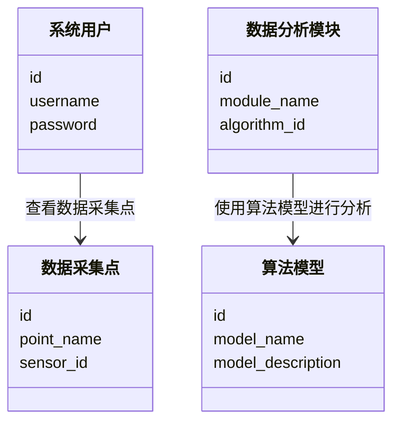
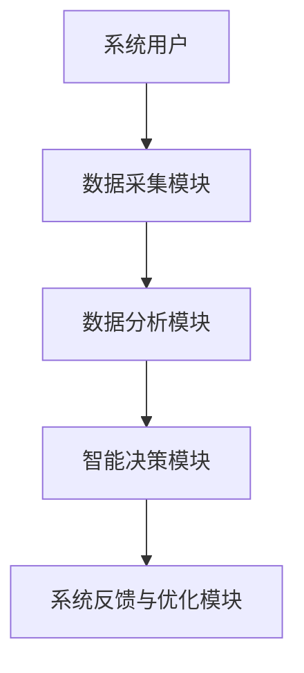
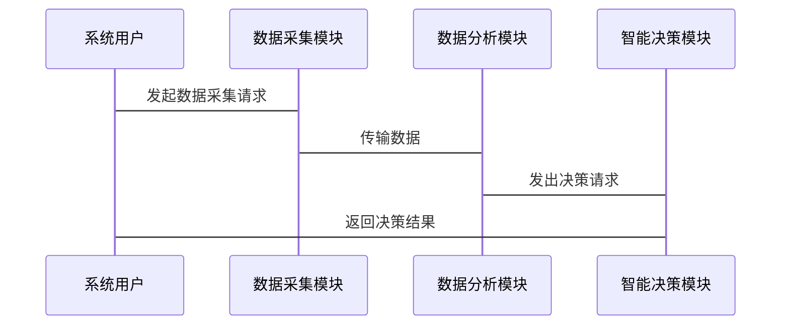

                 


# 实现基于AI Agent的智能质量控制系统

> 关键词：AI Agent, 智能质量控制, 质量管理系统, 质量管理, 人工智能

> 摘要：  
本文探讨了基于AI Agent的智能质量控制系统的实现方法，从概念解析、算法原理到系统架构设计，逐步展开分析。通过详细阐述AI Agent在质量管理中的应用，结合实际案例，帮助读者理解如何利用人工智能技术提升质量控制的效率和准确性。文章最后总结了实现该系统的要点，并展望了未来的发展方向。

---

## 第一部分: 基于AI Agent的智能质量控制系统背景与概念

### 第1章: AI Agent与智能质量控制概述

#### 1.1 AI Agent的基本概念
##### 1.1.1 什么是AI Agent
人工智能代理（AI Agent）是一种能够感知环境、自主决策并执行任务的智能实体。它具备以下核心特征：
- **自主性**：能够在没有外部干预的情况下独立运行。
- **反应性**：能够根据环境变化实时调整行为。
- **目标导向性**：以实现特定目标为导向进行决策和行动。
- **学习能力**：通过数据和经验不断优化自身的性能。

AI Agent可以分为**简单反射型代理**、**基于模型的反射型代理**、**目标驱动型代理**和**效用驱动型代理**四种类型，每种类型在质量管理中的应用场景有所不同。

##### 1.1.2 AI Agent的特点与分类
- **特点**：
  - **分布式**：能够与其他系统或代理协作。
  - **适应性**：能够适应动态变化的环境。
  - **可扩展性**：可以根据需求进行功能扩展。
- **分类**：
  1. **反应式代理**：基于当前感知做出实时反应。
  2. **基于模型的代理**：利用内部模型进行规划和决策。
  3. **目标驱动代理**：以特定目标为导向进行行动。
  4. **效用驱动代理**：通过最大化效用函数实现最优决策。

##### 1.1.3 AI Agent在质量管理中的应用潜力
AI Agent在质量管理中的应用潜力主要体现在以下几个方面：
- **实时监控**：通过实时数据采集和分析，快速发现和解决问题。
- **预测性维护**：基于历史数据和模型预测，提前发现潜在的质量问题。
- **优化决策**：通过数据分析和优化算法，提高质量控制的效率和准确性。

#### 1.2 智能质量控制的背景与意义
##### 1.2.1 质量管理的传统模式与挑战
传统的质量管理模式主要依赖人工检查和统计分析，存在以下问题：
- **效率低下**：人工检查耗时长，容易出错。
- **响应迟缓**：发现问题时，往往已经造成了损失。
- **数据孤岛**：各部门之间的数据难以有效整合。

##### 1.2.2 AI技术如何赋能质量管理
AI技术通过以下方式赋能质量管理：
- **数据驱动的决策**：利用机器学习算法分析海量数据，提高决策的准确性。
- **实时监控与反馈**：通过物联网设备实时采集数据，实现对生产过程的实时监控。
- **预测性维护**：基于历史数据和模型预测，提前发现潜在问题。

##### 1.2.3 智能质量控制的定义与目标
智能质量控制（Intelligent Quality Control，IQC）是指利用人工智能技术，通过实时数据采集、分析和决策，实现对产品质量的智能化监控和优化。其目标是：
- **提高质量控制的效率和准确性**。
- **降低质量控制的成本**。
- **实现从被动响应到主动预防的转变**。

#### 1.3 本章小结
- AI Agent作为智能质量控制的核心组件，具备自主性、反应性和目标导向性等特性。
- 智能质量控制通过AI技术的赋能，能够显著提高质量管理的效率和准确性。
- 本文后续将详细探讨AI Agent在智能质量控制中的具体实现方法。

---

### 第2章: AI Agent与智能质量控制的核心概念

#### 2.1 AI Agent的原理与实现机制
##### 2.1.1 AI Agent的基本原理
AI Agent的实现过程可以分为以下几个步骤：
1. **感知环境**：通过传感器或API获取环境数据。
2. **信息处理**：对获取的数据进行分析和处理，提取有用信息。
3. **决策制定**：基于处理后的信息，利用算法或模型制定决策。
4. **执行行动**：根据决策结果执行相应的动作。
5. **反馈优化**：根据执行结果调整自身行为，优化未来决策。

##### 2.1.2 AI Agent的感知与决策机制
- **感知机制**：通过多种传感器或数据源获取环境信息。
- **决策机制**：基于感知信息，结合内部模型或算法进行决策。

##### 2.1.3 AI Agent的执行与反馈机制
- **执行机制**：通过执行器或API将决策转化为具体行动。
- **反馈机制**：根据执行结果调整自身行为，优化未来决策。

#### 2.2 智能质量控制系统的组成与功能
##### 2.2.1 数据采集模块
- **功能**：实时采集生产过程中的各类数据，如温度、湿度、压力等。
- **输入**：传感器数据。
- **输出**：标准化的数据流。

##### 2.2.2 数据分析模块
- **功能**：对采集的数据进行分析，识别潜在质量问题。
- **输入**：标准化数据流。
- **输出**：质量问题报告。

##### 2.2.3 智能决策模块
- **功能**：基于数据分析结果，制定质量控制决策。
- **输入**：质量问题报告。
- **输出**：优化后的决策方案。

##### 2.2.4 系统反馈与优化模块
- **功能**：根据执行结果优化系统参数和模型。
- **输入**：执行结果反馈。
- **输出**：优化后的系统参数。

#### 2.3 AI Agent与智能质量控制的关联分析
##### 2.3.1 AI Agent在质量控制中的角色定位
- **数据采集**：作为感知层，实时采集生产数据。
- **数据分析**：作为分析层，识别潜在质量问题。
- **决策制定**：作为决策层，优化质量控制策略。
- **系统优化**：作为优化层，提升系统整体性能。

##### 2.3.2 智能质量控制对AI Agent的需求分析
- **实时性**：需要快速响应和处理数据。
- **准确性**：需要高精度的分析和决策能力。
- **可扩展性**：需要能够适应不同规模和复杂度的质量控制需求。

##### 2.3.3 两者的协同工作模式
- **协同流程**：
  1. 数据采集模块实时采集生产数据。
  2. 数据分析模块对数据进行分析，识别潜在质量问题。
  3. 智能决策模块基于分析结果制定质量控制决策。
  4. 系统反馈与优化模块根据执行结果优化系统参数和模型。

#### 2.4 智能质量控制系统的核心要素对比
##### 2.4.1 核心要素属性对比表

| 要素       | 特性                       | 传统质量管理                | 智能质量管理                |
|------------|----------------------------|-----------------------------|-----------------------------|
| 数据采集   | 是否实时                   | 非实时                     | 实时                       |
| 数据分析   | 分析方法                   | 统计分析                   | 机器学习、深度学习         |
| 决策制定   | 决策依据                   | 人工经验                   | 数据驱动                   |
| 系统优化   | 优化方式                   | 事后调整                   | 实时反馈                   |

##### 2.4.2 ER实体关系图

```mermaid
erd
  title 实体关系图
  系统用户
    id: int
    username: varchar
    password: varchar
  系统配置
    id: int
    config_name: varchar
    config_value: varchar
  数据采集点
    id: int
    point_name: varchar
    sensor_id: int
  数据分析模块
    id: int
    module_name: varchar
    algorithm_id: int
  算法模型
    id: int
    model_name: varchar
    model_description: varchar
```

---

## 第三部分: 智能质量控制系统的算法原理

### 第3章: 智能质量控制系统的算法原理

#### 3.1 基于AI Agent的质量控制算法概述
##### 3.1.1 算法的基本流程
1. **数据预处理**：对采集到的数据进行清洗和标准化。
2. **模型训练**：利用机器学习算法训练质量预测模型。
3. **模型推理**：基于训练好的模型进行质量预测。
4. **决策制定**：根据预测结果制定质量控制决策。

##### 3.1.2 算法的核心模块
- **数据预处理模块**：负责数据的清洗和标准化。
- **模型训练模块**：负责模型的训练和优化。
- **模型推理模块**：负责基于模型进行预测和决策。

##### 3.1.3 算法的输入输出定义
- **输入**：
  - 原始数据：如温度、湿度、压力等传感器数据。
  - 系统配置：如模型参数、决策规则等。
- **输出**：
  - 质量预测结果：如合格、不合格。
  - 质量控制决策：如调整参数、停止生产等。

#### 3.2 算法实现的详细步骤
##### 3.2.1 数据预处理
- **数据清洗**：去除噪声数据和异常值。
- **数据标准化**：将数据归一化到统一的范围。

##### 3.2.2 模型训练
- **选择算法**：如随机森林、支持向量机（SVM）、神经网络等。
- **训练模型**：利用训练数据训练模型，得到最优参数。

##### 3.2.3 模型推理与决策
- **预测质量**：基于训练好的模型，对实时数据进行预测。
- **制定决策**：根据预测结果，制定质量控制决策。

##### 3.2.4 系统反馈与优化
- **反馈优化**：根据执行结果优化系统参数和模型。
- **持续学习**：通过不断学习新数据，提升模型的预测精度。

#### 3.3 算法的数学模型与公式
##### 3.3.1 数据

$$
\text{数据} = \{x_1, x_2, ..., x_n\}
$$

##### 3.3.2 模型训练

$$
\text{损失函数} = \sum_{i=1}^{n} (y_i - \hat{y_i})^2
$$

其中：
- $y_i$ 是真实标签。
- $\hat{y_i}$ 是模型预测值。

##### 3.3.3 模型推理

$$
\text{预测值} = f(x)
$$

其中：
- $f$ 是训练好的模型。
- $x$ 是输入数据。

##### 3.3.4 决策规则

$$
\text{决策} = \begin{cases}
\text{合格} & \text{if } f(x) > 0.5 \\
\text{不合格} & \text{otherwise}
\end{cases}
$$

---

## 第四部分: 系统分析与架构设计

### 第4章: 系统分析与架构设计

#### 4.1 问题场景介绍
- **背景**：某制造企业希望利用AI技术提升产品质量。
- **目标**：实现基于AI Agent的智能质量控制系统。
- **范围**：覆盖生产过程中的实时监控和质量预测。

#### 4.2 系统功能设计
##### 4.2.1 领域模型设计



##### 4.2.2 系统架构设计



##### 4.2.3 系统接口设计
- **输入接口**：传感器数据接口、用户操作接口。
- **输出接口**：质量预测结果接口、质量控制决策接口。

##### 4.2.4 系统交互设计



---

## 第五部分: 项目实战

### 第5章: 项目实战

#### 5.1 环境安装
- **硬件要求**：具备高性能计算能力的服务器或云平台。
- **软件要求**：安装Python、TensorFlow、Kafka、Prometheus等工具。

#### 5.2 核心代码实现
##### 5.2.1 数据采集模块

```python
import kafka

# 生产者
producer = kafka.KafkaProducer(bootstrap_servers=['localhost:9092'])
for data in sensor_data:
    producer.send('quality_control', value=data)
```

##### 5.2.2 数据分析模块

```python
import tensorflow as tf

model = tf.keras.models.load_model('quality_model.h5')
 predictions = model.predict(new_data)
```

##### 5.2.3 智能决策模块

```python
def make_decision(predictions):
    if predictions > 0.5:
        return '合格'
    else:
        return '不合格'
```

##### 5.2.4 系统反馈与优化模块

```python
def optimize_model(feedback):
    # 更新模型参数
    pass
```

#### 5.3 案例分析
##### 5.3.1 数据采集与分析
- **数据采集**：实时采集生产线上的温度、湿度等数据。
- **数据分析**：利用机器学习模型预测产品质量。

##### 5.3.2 决策制定与执行
- **决策制定**：根据预测结果，制定质量控制决策。
- **执行结果**：记录执行结果并反馈优化系统。

#### 5.4 项目小结
- **实现过程**：详细描述了各模块的实现步骤。
- **关键点**：强调了数据采集、模型训练和决策优化的重要性。
- **注意事项**：提醒读者注意数据隐私和系统安全问题。

---

## 第六部分: 扩展与优化

### 第6章: 扩展与优化

#### 6.1 当前研究热点
- **实时性优化**：如何进一步提升系统的实时响应能力。
- **模型优化**：如何设计更高效的机器学习模型。
- **多模态数据融合**：如何将多种类型的数据进行有效融合。

#### 6.2 未来趋势
- **边缘计算**：将AI Agent部署在边缘设备上，进一步提升实时性。
- **联邦学习**：在保护数据隐私的前提下，实现跨企业的质量数据共享和模型优化。
- **强化学习**：通过强化学习进一步优化质量控制决策。

---

## 第七部分: 总结与展望

### 第7章: 总结与展望

#### 7.1 全文总结
- **核心内容**：详细介绍了基于AI Agent的智能质量控制系统的实现方法。
- **关键点**：强调了AI Agent在质量控制中的重要作用，以及系统的整体架构和实现细节。

#### 7.2 未来展望
- **技术进步**：随着AI技术的不断发展，智能质量控制系统将更加智能化和自动化。
- **应用场景拓展**：未来将有更多的行业应用基于AI Agent的智能质量控制系统。

---

## 附录

### 附录A: 术语解释
- **AI Agent**：人工智能代理。
- **IQC**：智能质量控制。
- **ER图**：实体关系图。
- **Mermaid**：图表绘制工具。

### 附录B: 工具安装指南
- **Python**：https://www.python.org/
- **TensorFlow**：https://tensorflow.org/
- **Kafka**：https://kafka.apache.org/
- **Prometheus**：https://prometheus.io/

---

## 参考文献
1. Russell, S. and Norvig, P. (2010). *Artificial Intelligence: A Modern Approach*.
2. LeCun, Y., Bengio, Y., and Hinton, G. (2015). *Deep Learning*.
3. 刘洋, 等. (2020). *基于AI的智能质量控制系统研究*.

---

通过以上思考步骤，我们逐步构建了基于AI Agent的智能质量控制系统，并详细阐述了其实现方法和应用场景。

