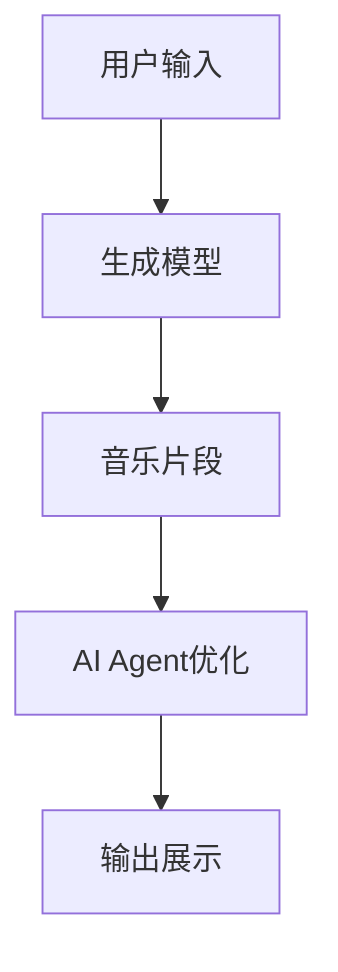
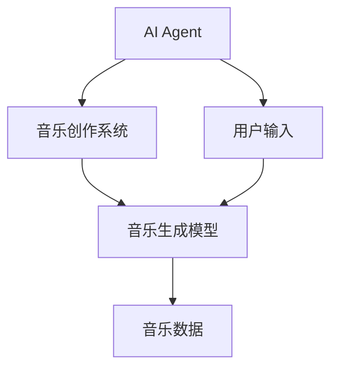
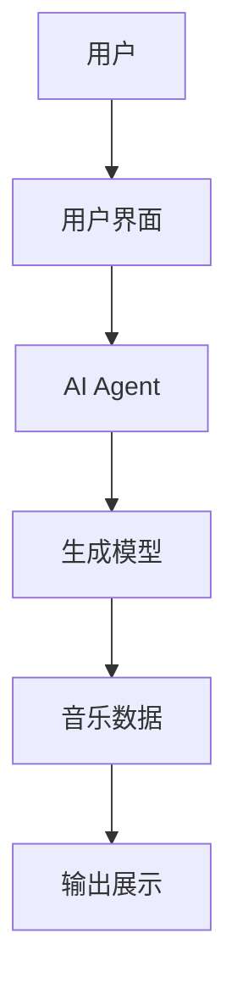
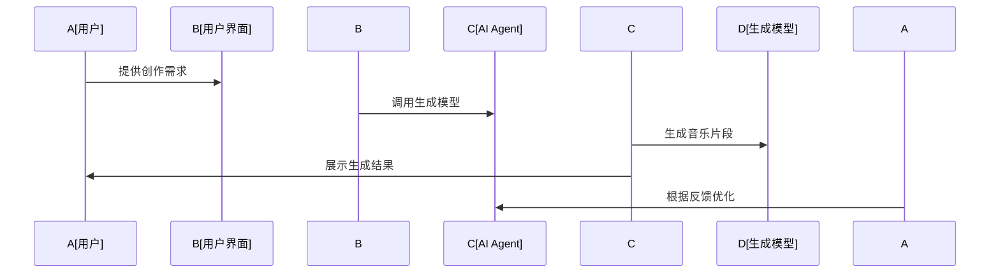

                 


# 实现基于AI Agent的智能音乐创作系统

> 关键词：AI Agent，智能音乐创作，深度学习，生成模型，强化学习

> 摘要：本文详细探讨了基于AI Agent的智能音乐创作系统的实现方法，涵盖系统背景、核心概念、算法原理、系统架构设计及项目实战。通过分析AI Agent在音乐创作中的角色，结合生成模型和强化学习算法，提出了一个完整的音乐创作系统设计方案。文章还提供了实际的代码实现和案例分析，为读者提供了从理论到实践的全面指导。

---

# 第一部分：背景与核心概念

## 第1章：问题背景与需求分析

### 1.1 问题背景介绍

#### 1.1.1 当前音乐创作面临的挑战
音乐创作是一项复杂且高度创造性的工作，传统音乐创作依赖于人类作曲家的灵感和专业知识。然而，随着音乐需求的快速增长，人类作曲家难以满足市场对多样化、高质量音乐的海量需求。此外，音乐创作的门槛较高，普通用户难以参与其中。

#### 1.1.2 AI技术在音乐创作中的潜力
人工智能技术，尤其是深度学习和强化学习，为音乐创作提供了新的可能性。通过训练大规模音乐数据集，AI模型可以生成符合特定风格、情感和结构的音乐作品。AI Agent（智能体）能够通过与用户的交互，实时调整音乐创作的方向，满足用户的个性化需求。

#### 1.1.3 系统设计的目标
基于AI Agent的智能音乐创作系统的目的是通过AI技术辅助音乐创作，降低创作门槛，提高创作效率，并为用户提供个性化的音乐创作体验。

### 1.2 问题描述与解决思路

#### 1.2.1 音乐创作的复杂性分析
音乐创作涉及多个方面，包括旋律、和声、节奏、编曲等。每个方面都需要专业知识和经验，普通用户难以独立完成高质量的音乐作品。

#### 1.2.2 AI Agent在音乐创作中的角色定位
AI Agent作为智能音乐创作系统的核心，负责接收用户输入、调用生成模型、优化音乐创作结果，并与用户进行实时交互。通过AI Agent，用户可以以更简单的方式参与音乐创作，而系统则负责处理复杂的计算和优化任务。

#### 1.2.3 系统设计的核心问题与解决方案
系统设计的核心问题包括：
1. 如何实现AI Agent与音乐生成模型的高效交互。
2. 如何设计用户友好的交互界面。
3. 如何保证音乐生成的质量和多样性。

解决方案包括：
1. 基于生成模型（如Transformer、LSTM）构建音乐生成模块。
2. 使用强化学习优化生成结果。
3. 设计直观的用户界面，降低用户的使用门槛。

### 1.3 系统边界与外延

#### 1.3.1 系统的功能边界
智能音乐创作系统的主要功能包括：
- 用户输入：接收用户的创作需求（如风格、情感、主题等）。
- 音乐生成：基于用户输入生成音乐片段。
- 优化调整：通过AI Agent优化生成的音乐，使其更符合用户需求。
- 输出展示：将生成的音乐以可视化或可播放的形式展示给用户。

#### 1.3.2 系统的适用场景与限制
适用场景：
- 初级音乐创作者的辅助工具。
- 教育领域中的音乐教学辅助。
- 个性化音乐生成服务。

限制：
- 生成音乐的质量依赖于训练数据的质量和多样性。
- 系统对实时性要求较高，可能需要较高的计算资源。

#### 1.3.3 系统与其他系统的交互关系
智能音乐创作系统可以与其他系统（如音乐播放器、音乐编辑软件）进行交互，形成完整的音乐创作与播放生态。

### 1.4 核心概念与结构

#### 1.4.1 AI Agent的基本概念
AI Agent是一种智能实体，能够感知环境、自主决策并执行任务。在音乐创作系统中，AI Agent负责接收用户输入、调用生成模型、优化结果并反馈给用户。

#### 1.4.2 智能音乐创作系统的组成要素
- 用户输入模块：接收用户的创作需求。
- 生成模型：基于输入生成音乐片段。
- AI Agent：协调各个模块，优化生成结果。
- 用户界面：展示生成的音乐并允许用户进行调整。

#### 1.4.3 系统的核心功能模块与交互流程


## 第2章：AI Agent与音乐创作的核心概念

### 2.1 AI Agent的基本原理

#### 2.1.1 AI Agent的定义与分类
AI Agent可以根据智能水平分为简单反射Agent和复杂推理Agent。在音乐创作系统中，AI Agent通常是一个复杂推理Agent，能够根据上下文做出决策。

#### 2.1.2 基于强化学习的AI Agent
强化学习通过奖励机制训练AI Agent，使其在与环境的交互中不断优化行为。

#### 2.1.3 基于生成模型的AI Agent
生成模型（如GPT、Transformer）可以用于生成音乐片段，AI Agent负责协调生成过程。

### 2.2 音乐创作的AI化特征

#### 2.2.1 音乐创作的数学模型与特征提取
音乐可以表示为序列数据，特征包括音符、节奏、和声等。

#### 2.2.2 基于深度学习的音乐生成模型
常用的音乐生成模型包括RNN、LSTM、Transformer等。

#### 2.2.3 音乐创作的多模态交互特征
音乐创作可以结合视觉、听觉等多种模态进行交互。

### 2.3 AI Agent与音乐创作的实体关系图



---

## 第3章：基于AI Agent的音乐创作算法原理

### 3.1 基于生成模型的音乐创作

#### 3.1.1 变量与条件概率
音乐生成可以看作是一个条件概率问题，给定输入条件，生成音乐片段的概率分布。

$$P(y|x) = \text{模型生成的概率分布}$$

#### 3.1.2 生成模型的实现
使用Transformer模型进行音乐生成的示例代码：

```python
def generate_music(conditional_input):
    model = MusicGenerator()
    output = model(conditional_input)
    return output
```

### 3.2 基于强化学习的音乐创作

#### 3.2.1 强化学习的基本原理
通过奖励机制训练AI Agent，使其在音乐创作过程中不断优化生成结果。

$$R = \sum_{t=1}^{T} r_t$$

#### 3.2.2 强化学习的实现
使用强化学习训练AI Agent的示例代码：

```python
def train_agent():
    agent = AI_Agent()
    for episode in range(num_episodes):
        state = get_state()
        action = agent.act(state)
        reward = get_reward(action)
        agent.learn(state, action, reward)
```

### 3.3 算法实现的数学模型

#### 3.3.1 生成模型的损失函数
$$L = -\sum_{i=1}^{n} \log P(y_i|x_i)$$

#### 3.3.2 强化学习的奖励机制
$$R = \sum_{t=1}^{T} r_t$$

---

## 第4章：系统分析与架构设计

### 4.1 项目背景与目标

#### 4.1.1 项目背景介绍
随着AI技术的发展，音乐创作的智能化需求日益增长。

#### 4.1.2 项目目标与核心问题
目标：构建一个基于AI Agent的智能音乐创作系统。
核心问题：如何实现AI Agent与生成模型的高效交互。

### 4.2 系统功能设计

#### 4.2.1 功能模块划分
- 用户输入模块：接收用户的创作需求。
- 生成模型模块：生成音乐片段。
- AI Agent模块：优化生成结果。
- 输出展示模块：展示生成的音乐。

#### 4.2.2 功能模块的交互流程


### 4.3 系统架构设计

#### 4.3.1 系统架构图


### 4.4 系统接口设计

#### 4.4.1 接口定义
- 用户输入接口：接收用户的创作需求。
- 生成模型接口：调用生成模型生成音乐片段。
- 输出展示接口：将生成的音乐展示给用户。

### 4.5 系统交互设计

#### 4.5.1 交互流程


---

## 第5章：项目实战

### 5.1 环境安装与配置

#### 5.1.1 环境需求
- Python 3.8+
- PyTorch或Keras等深度学习框架
- 其他依赖库

### 5.2 系统核心实现

#### 5.2.1 生成模型的实现
```python
class MusicGenerator:
    def __init__(self):
        # 初始化生成模型
        pass
    
    def generate(self, conditional_input):
        # 生成音乐片段
        return music_output
```

#### 5.2.2 AI Agent的实现
```python
class AI_Agent:
    def __init__(self):
        # 初始化AI Agent
        pass
    
    def act(self, state):
        # 根据状态生成动作
        return action
    
    def learn(self, state, action, reward):
        # 学习更新策略
        pass
```

### 5.3 代码应用解读与分析

#### 5.3.1 生成模型的代码解读
- 初始化生成模型：加载预训练好的音乐生成模型。
- 生成音乐片段：根据用户输入生成音乐。

#### 5.3.2 AI Agent的代码解读
- 初始化AI Agent：设置初始策略。
- 根据状态生成动作：基于当前状态做出决策。
- 学习更新策略：通过强化学习优化策略。

### 5.4 实际案例分析

#### 5.4.1 案例分析
用户输入创作需求（如“悲伤的钢琴曲”），系统生成音乐片段并展示给用户。用户可以进行反馈，AI Agent根据反馈优化生成结果。

#### 5.4.2 代码实现分析
通过代码实现生成模型和AI Agent的交互，展示生成音乐的过程和结果。

### 5.5 项目小结

---

## 第6章：最佳实践与总结

### 6.1 最佳实践 tips
- 确保生成模型的训练数据多样且高质量。
- 设计直观的用户界面，降低用户使用门槛。
- 使用高效的计算资源，保证系统的实时性。

### 6.2 小结
本文详细介绍了基于AI Agent的智能音乐创作系统的实现方法，涵盖了系统背景、核心概念、算法原理、系统架构设计及项目实战。通过理论与实践的结合，为读者提供了一个完整的音乐创作系统设计方案。

### 6.3 注意事项
- 系统的性能依赖于硬件资源。
- 数据隐私和版权问题需要注意。

### 6.4 拓展阅读
- 深度学习在音乐生成中的应用。
- 强化学习在音乐创作中的优化策略。

--- 

通过以上内容，我们已经详细探讨了基于AI Agent的智能音乐创作系统的实现方法，为后续的研究和实践提供了理论基础和实践指导。

