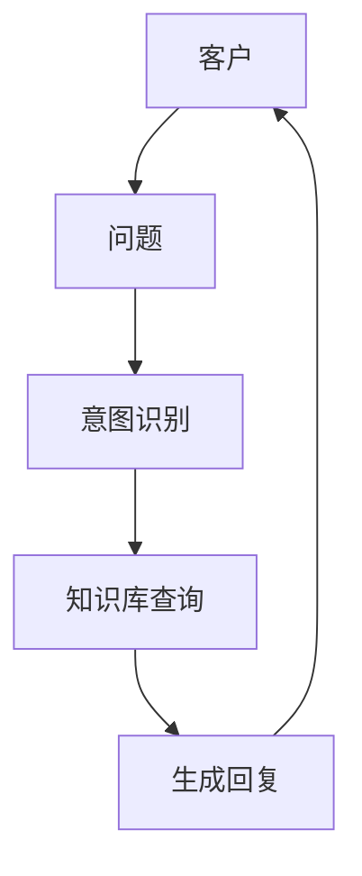
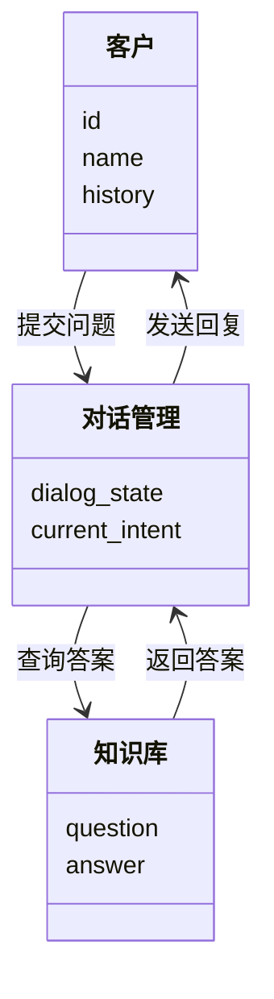
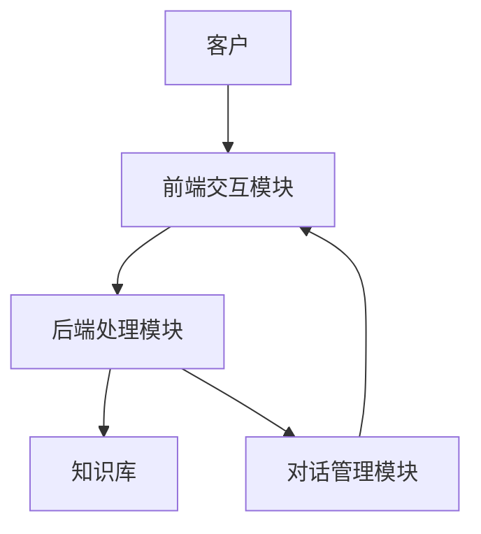
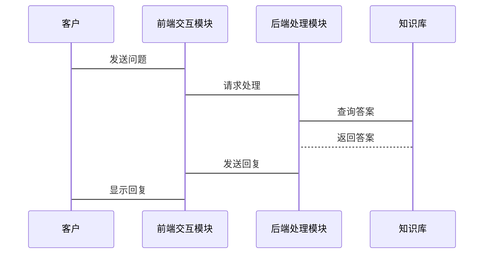

                 


# 客户服务 AI Agent：24/7 全天候的 LLM 驱动智能客服

> 关键词：智能客服，大语言模型（LLM），24/7 全天候，LLM 应用，智能对话系统

> 摘要：本文深入探讨了基于大语言模型（LLM）的智能客服系统——客户服务 AI Agent，分析了其在24/7全天候服务中的应用价值、技术实现和系统架构。文章从背景、核心概念、算法原理、系统架构到项目实战，详细阐述了如何利用LLM构建高效、智能的客服系统，为技术开发者和企业提供了实践指导。

---

## 第一部分：客户服务 AI Agent 背景与核心概念

### 第1章：客户服务 AI Agent 的背景与问题描述

#### 1.1 客户服务 AI Agent 的背景

##### 1.1.1 传统客户服务的痛点
传统客户服务系统主要依赖人工坐席，存在以下痛点：
- **服务时间限制**：人工坐席无法实现24/7全天候服务，节假日或深夜时段无法覆盖。
- **效率低下**：人工坐席处理大量重复性问题，效率低，成本高。
- **服务质量不稳定**：人员素质参差不齐，服务质量难以保证。
- **缺乏个性化**：难以根据客户需求提供个性化服务。

##### 1.1.2 AI技术在客户服务中的应用潜力
人工智能技术，尤其是大语言模型（LLM），为智能客服带来了革命性的变化：
- **全天候服务**：AI客服可以7x24小时不间断工作，无需休息。
- **高效率**：通过自然语言处理（NLP）技术快速理解并解决问题。
- **个性化服务**：根据客户历史数据和偏好提供定制化服务。

##### 1.1.3 LLM驱动的智能客服发展现状
目前，基于LLM的智能客服系统已在多个行业得到广泛应用，如电商、银行、医疗等。这些系统通过自然语言处理技术，能够理解和生成人类语言，实现智能化的客户服务。

#### 1.2 客户服务 AI Agent 的问题描述

##### 1.2.1 客户服务需求的多样化与复杂性
现代客户服务需求呈现多样化和复杂化的趋势，客户不仅需要解决问题，还希望获得个性化、智能化的体验。

##### 1.2.2 传统客服系统的技术局限性
传统客服系统主要依赖关键词匹配和规则引擎，难以应对复杂的问题和多样化的客户需求。

##### 1.2.3 LLM在智能客服中的应用价值
LLM能够通过深度学习和自然语言处理技术，准确理解客户意图，并生成符合上下文的回复，从而实现智能化的客户服务。

#### 1.3 客户服务 AI Agent 的目标与边界

##### 1.3.1 目标：实现24/7全天候智能服务
通过LLM技术，实现客户问题的实时响应和处理，提供全天候的智能服务。

##### 1.3.2 边界：明确服务范围与限制
虽然LLM能够处理多种问题，但其能力受限于训练数据和模型设计，无法完全覆盖所有场景。

##### 1.3.3 外延：与其他系统的协同工作
智能客服系统需要与其他系统（如CRM、知识库）协同工作，才能更好地满足客户需求。

#### 1.4 核心概念与系统架构

##### 1.4.1 客户服务 AI Agent 的核心要素
- **自然语言处理（NLP）**：用于理解和生成人类语言。
- **对话管理**：负责对话的上下文理解和生成。
- **知识库**：存储产品信息、FAQ等，用于回答客户问题。

##### 1.4.2 系统架构的模块划分
- **前端交互模块**：负责与客户进行交互，接收输入并显示输出。
- **后端处理模块**：包括NLP处理、对话管理和知识库查询。
- **数据存储与管理**：存储客户数据、对话记录等。

##### 1.4.3 核心概念的实体关系图



---

## 第2章：LLM驱动的智能客服系统

### 2.1 大语言模型（LLM）的基本原理

#### 2.1.1 LLM的定义与特点
大语言模型是一种基于深度学习的自然语言处理模型，具有以下特点：
- **大规模训练数据**：通常使用 billions of parameters。
- **通用性**：能够处理多种语言和任务。
- **上下文理解**：能够理解对话的上下文。

#### 2.1.2 LLM的核心技术：Transformer架构
Transformer架构通过自注意力机制（Self-attention）和前馈网络（FFN）实现高效的文本处理。

#### 2.1.3 LLM的训练与优化
- **监督微调（Fine-tuning）**：在特定任务上进行微调。
- **强化学习（Reinforcement Learning）**：通过强化学习优化生成结果。

### 2.2 LLM在客户服务中的应用

#### 2.2.1 自然语言理解（NLU）与生成
- **NLU**：识别客户意图，如“查询订单状态”。
- **文本生成**：根据意图生成回复。

#### 2.2.2 客户意图识别与响应
通过LLM理解客户意图并生成相应的回复，实现智能化的对话。

#### 2.2.3 多轮对话的实现
通过记忆和上下文理解，实现连续对话的连贯性。

### 2.3 客户服务 AI Agent 的核心功能

#### 2.3.1 智能问答系统
- **FAQ匹配**：根据客户问题匹配知识库中的答案。
- **意图识别**：准确识别客户意图。

#### 2.3.2 自动文本生成
- **回复生成**：根据客户需求生成个性化的回复。
- **多轮对话**：保持对话的连贯性。

#### 2.3.3 实时语境理解
- **上下文记忆**：记住对话的上下文，提供连贯的服务。
- **动态调整**：根据对话进展动态调整回复策略。

---

## 第3章：LLM驱动的智能客服系统架构

### 3.1 系统整体架构设计

#### 3.1.1 前端交互模块
- **用户界面**：Web或移动端界面，接收客户输入。
- **对话历史**：记录对话历史，提供上下文支持。

#### 3.1.2 后端处理模块
- **NLP处理**：包括分词、实体识别、意图识别等。
- **知识库查询**：根据意图查询知识库，获取答案。
- **回复生成**：根据查询结果生成回复。

#### 3.1.3 数据存储与管理
- **客户数据**：存储客户信息，如联系方式、历史问题等。
- **对话记录**：记录所有对话内容，用于分析和优化。

### 3.2 核心模块实现

#### 3.2.1 自然语言处理模块
- **文本预处理**：如分词、去除停用词等。
- **意图识别**：基于机器学习或深度学习模型识别客户意图。
- **实体识别**：识别文本中的关键实体，如日期、地点等。

#### 3.2.2 对话管理模块
- **对话状态管理**：维护对话的上下文和状态。
- **回复生成**：根据对话历史和意图生成回复。
- **对话策略**：制定对话的策略，如优先回答常见问题。

#### 3.2.3 知识库管理模块
- **知识库构建**：整理和存储专业知识，如产品说明、FAQ等。
- **知识库查询**：根据意图快速查询相关知识。
- **知识更新**：定期更新知识库，保持信息的准确性。

### 3.3 系统接口与交互流程

#### 3.3.1 用户请求的接收与解析
- **接收请求**：通过API接收用户的文本输入。
- **解析请求**：使用NLP技术解析客户意图和实体。

#### 3.3.2 系统响应的生成与反馈
- **生成响应**：根据解析结果生成回复。
- **反馈响应**：将回复返回给用户。

#### 3.3.3 系统状态的监控与优化
- **监控性能**：实时监控系统性能，如响应时间、准确率等。
- **优化模型**：根据反馈优化模型，提高准确率和用户体验。

---

## 第4章：LLM驱动的智能客服算法原理

### 4.1 大语言模型的训练与优化

#### 4.1.1 监督微调（Fine-tuning）
- **定义**：在特定任务上对模型进行微调。
- **过程**：使用标注数据，通过反向传播优化模型参数。

#### 4.1.2 强化学习（Reinforcement Learning）
- **定义**：通过奖励机制优化模型的生成结果。
- **过程**：定义奖励函数，根据生成结果给予奖励或惩罚。

#### 4.1.3 模型压缩与优化
- **模型压缩**：通过剪枝、量化等技术减少模型大小。
- **优化**：提高模型的推理速度和准确性。

### 4.2 对话生成的算法实现

#### 4.2.1 基于Transformer的生成模型
- **Transformer架构**：包括编码器和解码器，用于生成回复。
- **自注意力机制**：捕捉文本中的长距离依赖关系。

#### 4.2.2 解码策略
- **贪心解码**：逐词生成，选择概率最高的词。
- **束搜索**：生成多个候选回复，选择最优解。

#### 4.2.3 奖励模型
- **定义**：用于强化学习，衡量生成回复的质量。
- **实现**：通过人类评价或自动指标（如困惑度）衡量回复质量。

### 4.3 数学模型与公式

#### 4.3.1 Transformer的自注意力机制
$$
\text{Attention}(Q, K, V) = \text{softmax}\left(\frac{QK^T}{\sqrt{d_k}}\right)V
$$
其中，\( Q \)、\( K \)、\( V \)分别为查询、键和值向量，\( d_k \)为向量的维度。

#### 4.3.2 交叉熵损失函数
$$
\text{Loss} = -\sum_{i=1}^{n} y_i \log p(y_i)
$$
其中，\( y_i \)为真实标签，\( p(y_i) \)为模型预测的概率。

---

## 第5章：系统分析与架构设计方案

### 5.1 问题场景介绍
- **场景1**：客户咨询产品信息。
- **场景2**：客户投诉问题处理。

### 5.2 项目介绍
- **项目目标**：构建一个基于LLM的智能客服系统。
- **项目范围**：支持多轮对话、意图识别、知识库查询等功能。

### 5.3 系统功能设计

#### 5.3.1 领域模型设计


#### 5.3.2 系统架构设计


#### 5.3.3 系统接口设计
- **API接口**：提供RESTful API，供前端调用。
- **数据接口**：与CRM、知识库等系统对接。

#### 5.3.4 系统交互流程


---

## 第6章：项目实战

### 6.1 环境安装
- **安装Python**：确保Python版本为3.8以上。
- **安装依赖**：使用pip安装所需的库，如`transformers`、`numpy`等。

### 6.2 系统核心实现源代码

#### 6.2.1 初始化模型
```python
from transformers import AutoTokenizer, AutoModelForCausalLM

tokenizer = AutoTokenizer.from_pretrained('facebook/bart-large')
model = AutoModelForCausalLM.from_pretrained('facebook/bart-large')
```

#### 6.2.2 对话生成
```python
def generate_response(input_text):
    inputs = tokenizer.encode(input_text, return_tensors='pt')
    outputs = model.generate(inputs, max_length=50, num_beams=5)
    response = tokenizer.decode(outputs[0], skip_special_tokens=True)
    return response
```

#### 6.2.3 知识库查询
```python
def query_knowledge_base(question):
    # 假设知识库为一个字典，key为问题，value为答案
    return knowledge_base.get(question, '抱歉，我暂时无法回答您的问题。')
```

### 6.3 代码应用解读与分析
- **模型初始化**：加载预训练的LLM模型和分词器。
- **对话生成**：根据输入生成回复，使用 Bart 模型进行生成。
- **知识库查询**：从知识库中查询答案，如果未找到则返回默认回复。

### 6.4 实际案例分析
- **案例1**：客户咨询产品信息。
  - **输入**：'请问这个产品的保修期是多久？'
  - **输出**：'产品的保修期通常为12个月。'

- **案例2**：客户投诉问题处理。
  - **输入**：'我收到的商品有破损。'
  - **输出**：'抱歉给您带来不便。请提供订单号，我们将尽快为您处理。'

### 6.5 项目小结
通过本项目，我们成功实现了基于LLM的智能客服系统，能够处理多种客户问题，提供24/7全天候服务。

---

## 第7章：最佳实践

### 7.1 小结
- **核心价值**：LLM驱动的智能客服系统能够提高服务效率和客户满意度。
- **技术优势**：支持多轮对话、个性化服务、24/7全天候服务。

### 7.2 注意事项
- **数据安全**：确保客户数据的安全性和隐私性。
- **模型优化**：定期优化模型，提高生成质量。
- **系统监控**：实时监控系统性能，及时发现和解决问题。

### 7.3 拓展阅读
- **推荐书籍**：《Large Language Models for NLP》
- **推荐论文**：《Attention Is All You Need》
- **推荐工具**：Hugging Face的Transformers库

---

通过本文的详细讲解，我们深入探讨了基于LLM的智能客服系统——客户服务 AI Agent 的技术实现和应用价值。希望本文能够为技术开发者和企业提供宝贵的实践指导，推动智能客服系统的进一步发展。

