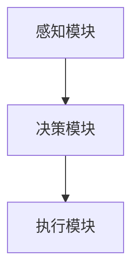
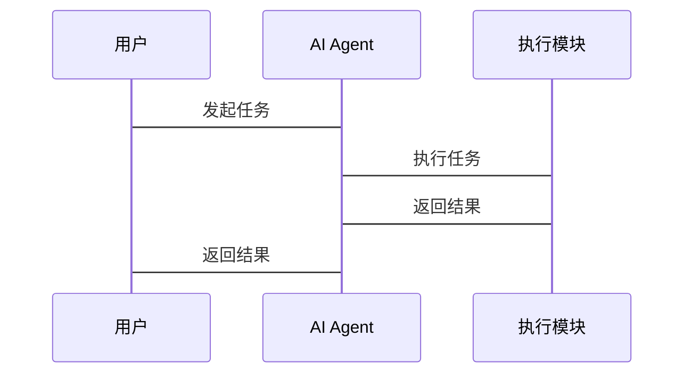

                 


# 容器化部署：简化AI Agent的运维管理

---

## 关键词：容器化部署、AI Agent、运维管理、Kubernetes、Docker、自动化运维

---

## 摘要：  
在AI Agent快速发展的背景下，容器化部署成为简化运维管理的关键技术。本文详细探讨容器化部署的核心概念、实现原理、系统架构设计以及实际应用案例。通过分析容器运行时与编排工具的工作机制，结合AI Agent的特点，提出高效的容器化部署方案。文章还提供了一个完整的实战项目，从环境搭建到部署实现，详细解读每一步骤，并总结最佳实践和未来发展趋势，帮助读者全面掌握容器化部署的技术要点。

---

# 第1章: 容器化部署与AI Agent概述

## 1.1 容器化部署的背景与意义

### 1.1.1 传统AI Agent运维的挑战

AI Agent作为人工智能领域的关键组件，通常运行在动态变化的环境中，面临以下挑战：

- **高可用性需求**：AI Agent需要7x24小时不间断运行，传统虚拟机部署方式可能导致资源浪费和维护复杂。
- **资源隔离与复用**：传统部署方式难以快速扩展和收缩资源，容器化技术能够有效解决这一问题。
- **版本迭代频繁**：AI Agent的更新迭代速度快，容器化部署能够快速实现版本迭代和回滚。

### 1.1.2 容器化技术的兴起与优势

容器化技术以轻量、高效、 portable 的特点，成为简化AI Agent运维的核心技术。容器化部署的优势包括：

- **资源利用率高**：容器共享宿主机的操作系统，相比虚拟机节省资源。
- **部署快速**：容器启动时间短，能够快速响应业务需求。
- **环境一致性**：容器化部署确保开发、测试和生产环境一致，减少因环境差异导致的问题。

### 1.1.3 容器化部署在AI Agent中的应用价值

容器化部署能够显著提升AI Agent的运维效率，降低运维成本，并提高系统的稳定性和可扩展性。具体体现在：

- **快速部署与扩展**：容器化部署支持快速部署新版本，并通过容器编排工具实现弹性扩展。
- **简化环境管理**：容器镜像包含所有运行环境，避免环境依赖问题。
- **支持微服务架构**：AI Agent可以通过容器化实现微服务化，提高系统的可维护性和扩展性。

---

## 1.2 AI Agent的基本概念与特点

### 1.2.1 AI Agent的定义与核心功能

AI Agent是一种智能体，能够感知环境、执行任务并做出决策。其核心功能包括：

- **感知环境**：通过传感器或API获取环境信息。
- **决策制定**：基于感知信息进行推理和决策。
- **执行操作**：根据决策执行具体操作。

### 1.2.2 AI Agent与传统软件的区别

AI Agent与传统软件的区别主要体现在以下几个方面：

- **自主性**：AI Agent能够自主决策，而传统软件需要明确的指令。
- **学习能力**：AI Agent能够通过数据学习和优化，传统软件则不具备此能力。
- **动态适应性**：AI Agent能够根据环境变化动态调整行为，传统软件则相对固定。

### 1.2.3 AI Agent的典型应用场景

AI Agent的应用场景包括：

- **智能助手**：如智能客服、语音助手等。
- **自动驾驶**：如自动驾驶汽车中的决策系统。
- **工业自动化**：如智能制造中的设备控制。

---

## 1.3 容器化部署的核心概念

### 1.3.1 容器化技术的基本原理

容器化技术通过操作系统级的虚拟化，将应用及其依赖打包成一个镜像，确保在不同环境中一致运行。其基本原理包括：

- **容器隔离**：容器通过Namespace和Cgroups实现进程隔离和资源限制。
- **镜像管理**：容器镜像包含运行环境和依赖，确保环境一致性。
- **容器运行时**：容器运行时负责启动和管理容器，如Docker、CRI-O等。

### 1.3.2 容器运行时与容器编排工具

容器运行时负责容器的启动和管理，而容器编排工具负责编排和调度多个容器。常见的容器运行时有Docker、CRI-O，编排工具包括Kubernetes、Docker Swarm等。

### 1.3.3 容器化部署的流程与优势

容器化部署流程包括：

1. **环境准备**：安装容器运行时和编排工具。
2. **容器化封装**：将AI Agent打包成镜像。
3. **编排配置**：编写YAML文件配置容器的运行方式。
4. **部署与运行**：通过编排工具部署容器。

容器化部署的优势包括：

- **快速部署**：容器镜像可以快速拉起。
- **弹性扩展**：通过编排工具实现自动扩缩容。
- **环境一致性**：确保开发、测试和生产环境一致。

---

## 1.4 本章小结

本章介绍了容器化部署的背景与意义，详细阐述了AI Agent的基本概念与特点，并分析了容器化部署的核心概念。容器化部署为AI Agent的运维管理提供了高效、可靠的解决方案，能够显著提升系统的稳定性和可扩展性。

---

# 第2章: 容器运行时与编排工具

## 2.1 容器运行时的原理与实现

### 2.1.1 容器运行时的架构

容器运行时架构包括以下几个部分：

1. **Runtime Engine**：负责容器的启动和管理。
2. **OCI（Open Container Initiative）**：定义容器镜像和运行时的标准。
3. **Cgroups**：用于资源限制和隔离。

### 2.1.2 容器隔离机制的实现

容器通过Namespace实现隔离：

- **PID Namespace**：隔离进程ID。
- **Mount Namespace**：隔离挂载点。
- **Network Namespace**：隔离网络接口。
- **UTS Namespace**：隔离 hostname。

### 2.1.3 容器资源管理策略

容器运行时通过Cgroups实现资源限制：

- **CPU配额**：限制容器使用的CPU时间。
- **内存限制**：限制容器使用的内存大小。
- **IO限制**：限制容器的输入输出带宽。

---

## 2.2 容器编排工具的核心原理

### 2.2.1 容器编排工具的功能模块

容器编排工具主要包括以下几个功能模块：

- **调度器**：负责任务的分配和调度。
- **资源管理**：管理容器的资源分配。
- **服务发现**：实现容器之间的通信和发现。

### 2.2.2 容器编排工具的工作流程

容器编排工具的工作流程包括：

1. **任务接收**：接收用户的部署请求。
2. **资源分配**：根据资源情况分配节点。
3. **任务调度**：将任务调度到指定节点。
4. **状态监控**：监控任务运行状态。
5. **自动恢复**：在任务失败时自动恢复。

### 2.2.3 容器编排工具的优缺点对比

常见容器编排工具对比：

| 工具    | 优点                | 缺点                |
|---------|---------------------|--------------------|
| Kubernetes | 功能强大，支持复杂场景 | 学习曲线陡峭        |
| Docker Swarm | 简单易用            | 功能相对简单        |
| Apache Mesos | 支持多种资源类型     | 配置复杂            |

---

## 2.3 容器编排工具的使用场景

### 2.3.1 Kubernetes在AI Agent中的应用

Kubernetes适用于复杂的AI Agent部署场景，支持多节点、多服务的部署。

### 2.3.2 Docker Swarm的适用场景

Docker Swarm适用于简单的部署场景，适合小型项目或对复杂性要求不高的场景。

### 2.3.3 其他编排工具的对比分析

根据具体需求选择合适的编排工具，Kubernetes适合大中型项目，Docker Swarm适合小型项目。

---

## 2.4 本章小结

本章详细介绍了容器运行时和编排工具的核心原理，分析了不同编排工具的特点和适用场景。容器编排工具的选择对AI Agent的部署效率和系统稳定性有着重要影响。

---

# 第3章: AI Agent的容器化部署流程

## 3.1 AI Agent的容器化部署步骤

### 3.1.1 环境准备与工具安装

环境准备包括：

- **安装Docker**：确保系统支持容器运行时。
- **安装Kubernetes**：搭建容器编排环境。
- **安装依赖工具**：如Docker Compose、Kubectl等。

### 3.1.2 AI Agent服务的容器化封装

将AI Agent打包成Docker镜像：

1. **编写Dockerfile**：定义镜像结构。
2. **构建镜像**：使用Docker build命令构建镜像。
3. **镜像优化**：去除不必要的依赖，减小镜像体积。

### 3.1.3 容器编排配置与部署

编写Kubernetes manifest文件：

1. **定义Deployment**：指定容器镜像、端口映射等。
2. **定义Service**：暴露服务接口。
3. **部署到Kubernetes集群**：使用Kubectl apply命令部署。

---

## 3.2 容器化部署的配套方案

### 3.2.1 容器网络配置

使用Kubernetes的网络插件（如Weave、Flannel）实现容器间的通信。

### 3.2.2 容器存储管理

通过持久化存储（如PVC）管理AI Agent的数据。

### 3.2.3 容器日志收集与监控

使用Kubernetes的Heapster或Prometheus实现日志收集和性能监控。

---

## 3.3 本章小结

本章详细描述了AI Agent的容器化部署流程，从环境准备到镜像构建，再到编排部署，每一步都进行了详细说明。同时，还介绍了容器网络、存储和日志管理的配套方案，确保部署的完整性和可靠性。

---

# 第4章: 系统架构与实现

## 4.1 系统架构设计

### 4.1.1 系统功能模块

AI Agent系统包括以下几个模块：

- **感知模块**：负责环境感知。
- **决策模块**：负责决策制定。
- **执行模块**：负责执行操作。

### 4.1.2 系统架构图

以下是系统的架构图：



---

## 4.2 系统功能设计

### 4.2.1 领域模型设计

领域模型设计包括：

- **实体**：如用户、任务等。
- **关系**：如用户发起任务，任务由AI Agent执行。

### 4.2.2 系统交互流程

以下是系统交互流程图：



---

## 4.3 本章小结

本章详细描述了AI Agent系统的架构设计和功能模块，通过领域模型和系统交互图展示了系统的运行流程。系统设计确保了各模块的职责分明，提高了系统的可维护性和扩展性。

---

# 第5章: 项目实战与优化

## 5.1 项目实战

### 5.1.1 环境安装与配置

安装Docker和Kubernetes，配置网络和存储。

### 5.1.2 核心代码实现

以下是核心代码实现：

```python
import subprocess

def build_image():
    subprocess.run("docker build -t ai-agent .", shell=True)

def deploy():
    subprocess.run("kubectl apply -f deployment.yaml", shell=True)

if __name__ == "__main__":
    build_image()
    deploy()
```

### 5.1.3 测试与优化

通过测试发现系统性能瓶颈，进行优化。

---

## 5.2 优化方案

### 5.2.1 镜像优化

优化Docker镜像，去除不必要的依赖。

### 5.2.2 资源限制

通过Cgroups限制容器资源使用。

### 5.2.3 自动扩缩容

使用Kubernetes的自动扩缩功能，根据负载自动调整容器数量。

---

## 5.3 本章小结

本章通过实战项目详细讲解了AI Agent的容器化部署过程，并提出了优化方案，确保系统的高效运行和稳定性。

---

# 第6章: 总结与展望

## 6.1 本章总结

容器化部署为AI Agent的运维管理提供了高效、可靠的解决方案。通过容器化部署，能够显著提升系统的稳定性和可扩展性，降低运维成本。

## 6.2 未来展望

随着AI技术的不断发展，容器化部署将更加智能化和自动化。未来的AI Agent将更加依赖容器化技术，实现更高效的运维管理。

---

# 第7章: 最佳实践与注意事项

## 7.1 最佳实践

### 7.1.1 镜像优化

- 移除不必要的依赖。
- 使用多阶段构建，减小镜像体积。

### 7.1.2 资源管理

- 合理分配资源，避免资源争抢。
- 使用弹性伸缩，根据负载自动调整资源。

### 7.1.3 安全管理

- 定期更新容器镜像。
- 配置安全策略，防止容器逃逸。

## 7.2 注意事项

- 容器化部署虽然方便，但需要对环境和资源进行合理规划。
- 注意容器编排工具的学习曲线，选择适合的工具。
- 定期监控系统运行状态，及时发现和解决问题。

---

## 7.3 本章小结

本章总结了容器化部署中的最佳实践和注意事项，帮助读者在实际应用中避免常见问题，确保系统的高效运行和稳定性。

---

# 结语

容器化部署是简化AI Agent运维管理的关键技术，通过本文的详细讲解，读者可以全面掌握容器化部署的核心概念和实现方法。未来，随着技术的不断发展，容器化部署将在AI Agent领域发挥更大的作用。

--- 

（本文完）

