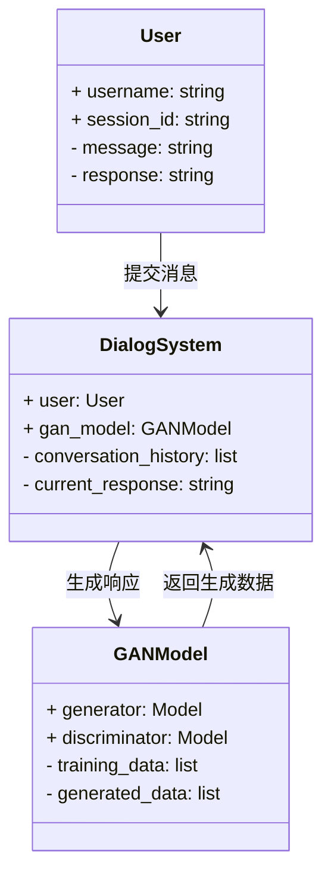
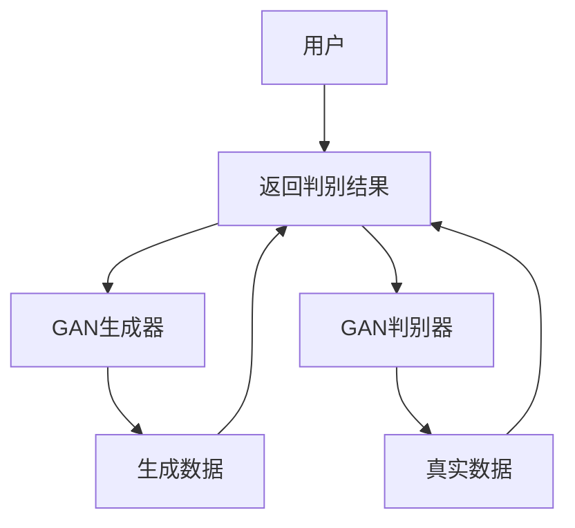
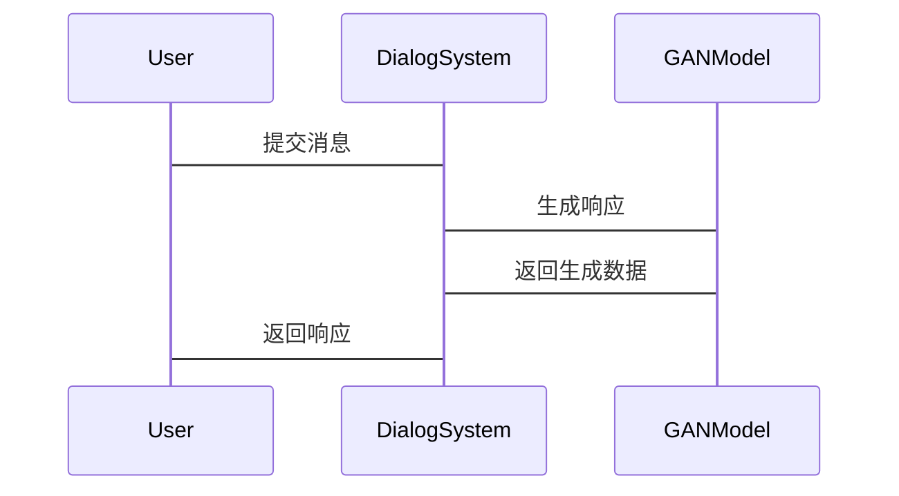

                 


# 对抗生成网络在AI Agent开发中的应用

## 关键词：对抗生成网络，AI Agent，生成对抗网络，深度学习，人机交互

## 摘要：本文深入探讨了对抗生成网络（GANs）在AI Agent开发中的应用。首先介绍了GANs的基本原理和AI Agent的核心概念，然后分析了GANs在数据生成、对话系统、游戏AI和推荐系统等领域的具体应用。接着详细阐述了GANs在AI Agent系统设计中的算法实现、系统架构和接口设计。最后通过实际项目案例展示了GANs在AI Agent开发中的实战应用，并总结了开发经验与未来研究方向。

---

# 第1章 对抗生成网络与AI Agent概述

## 1.1 对抗生成网络的基本概念

### 1.1.1 生成对抗网络的定义
生成对抗网络（GANs）是一种深度学习模型，由Ian Goodfellow等人提出，由生成器和判别器两个神经网络组成。生成器的目标是生成逼真的数据，而判别器的目标是区分真实数据和生成数据。两者通过对抗训练不断优化，最终生成器能够生成高质量的数据。

### 1.1.2 GAN的核心组成部分
- **生成器（Generator）**：负责生成数据，通常使用卷积生成器或全连接网络。
- **判别器（Discriminator）**：负责区分真实数据和生成数据，通常使用卷积神经网络。
- **损失函数**：GAN的损失函数定义了生成器和判别器的对抗目标。

### 1.1.3 GAN与AI Agent的结合
AI Agent需要与环境交互，完成特定任务。GAN可以用于生成训练数据、优化决策策略或增强交互能力。GAN与AI Agent的结合能够提升AI Agent的智能性和适应性。

## 1.2 AI Agent的基本概念

### 1.2.1 AI Agent的定义
AI Agent是一种智能体，能够在环境中感知、推理、规划和执行任务，以实现目标。AI Agent可以是软件程序，也可以是硬件设备。

### 1.2.2 AI Agent的分类
- **简单反射型Agent**：基于当前感知直接执行预定义动作。
- **基于模型的反射型Agent**：维护环境模型，基于模型推理和决策。
- **目标驱动型Agent**：基于目标进行规划和决策。

### 1.2.3 AI Agent的应用场景
- **智能助手**：如Siri、Alexa等。
- **游戏AI**：如自动驾驶汽车。
- **推荐系统**：如Netflix的推荐算法。

## 1.3 GAN在AI Agent中的应用前景

### 1.3.1 GAN的优势与特点
- **数据生成能力**：GAN可以生成大量高质量的数据，用于训练AI Agent。
- **对抗训练**：GAN的对抗训练机制可以模拟真实环境中的对抗性场景。
- **自适应能力**：GAN能够自适应地生成多样化的数据，提升AI Agent的鲁棒性。

### 1.3.2 GAN在AI Agent中的潜在应用
- **数据增强**：生成更多的训练数据，提升AI Agent的学习能力。
- **对话生成**：生成自然的对话内容，提升人机交互的流畅性。
- **行为决策**：生成多种决策策略，优化AI Agent的决策能力。

### 1.3.3 GAN与AI Agent结合的挑战
- **计算资源需求**：GAN的训练需要大量的计算资源。
- **模型稳定性**：GAN的训练过程中容易出现不稳定现象，如模式坍缩。
- **伦理与安全问题**：生成的数据可能引发伦理和安全问题。

## 1.4 本章小结
本章介绍了GAN的基本概念和AI Agent的核心概念，探讨了GAN在AI Agent中的应用前景。接下来的章节将深入分析GAN的原理、AI Agent的体系结构以及GAN在AI Agent中的具体应用。

---

# 第2章 生成对抗网络的原理与数学模型

## 2.1 GAN的基本原理

### 2.1.1 生成器与判别器的对抗过程
生成器通过最大化生成数据被误判为真实数据的概率，而判别器则通过最大化区分真实数据和生成数据的能力。两个网络在对抗过程中不断优化。

### 2.1.2 GAN的损失函数
生成器的损失函数为：
$$ L_G = -\log(P(D(G(z))=1)) $$
判别器的损失函数为：
$$ L_D = -\log(P(D(x)=1)) - \log(1-P(D(G(z))=1)) $$$

### 2.1.3 GAN的训练过程
1. 初始化生成器和判别器的参数。
2. 训练判别器，使其能够区分真实数据和生成数据。
3. 训练生成器，使其生成的数据能够被判别器误判为真实数据。
4. 重复训练过程，直到生成器和判别器达到平衡。

## 2.2 GAN的数学模型

### 2.2.1 生成器的数学表达
生成器通常使用多层感知机（MLP）或卷积神经网络（CNN）进行数据生成。生成器的输出为：
$$ G(z) = \sigma(W_2 \sigma(W_1 z + b_1) + b_2) $$$
其中，$z$是输入噪声，$\sigma$是激活函数，$W_1$和$W_2$是权重矩阵，$b_1$和$b_2$是偏置项。

### 2.2.2 判别器的数学表达
判别器通常使用卷积神经网络（CNN）进行分类。判别器的输出为：
$$ D(x) = \sigma(W_3 h(x) + b_3) $$
其中，$h(x)$是卷积层的输出，$\sigma$是sigmoid函数，$W_3$是权重矩阵，$b_3$是偏置项。

### 2.2.3 GAN的联合优化问题
GAN的优化目标是同时优化生成器和判别器的参数，使得生成器生成的数据能够欺骗判别器。数学表达为：
$$ \min_{G} \max_{D} \mathbb{E}_{x \sim P_r}[\log D(x)] + \mathbb{E}_{z \sim P_z}[\log (1-D(G(z)))] $$

## 2.3 GAN的变体与改进

### 2.3.1 WGAN的原理与优势
 Wasserstein GAN（WGAN）通过引入Wasserstein距离，解决了传统GAN的训练不稳定问题。WGAN的损失函数为：
$$ \mathcal{L}_{WGAN} = \mathbb{E}_{x \sim P_r} [D(x)] - \mathbb{E}_{z \sim P_z} [D(G(z))] $$$

### 2.3.2 GAN的其他改进方法
- **LSGAN**：通过平方损失函数改进GAN的训练稳定性。
- **CycleGAN**：用于无监督图像转换任务。
- **StyleGAN**：用于生成高质量的图像。

## 2.4 本章小结
本章详细介绍了GAN的基本原理和数学模型，并探讨了GAN的变体与改进方法。接下来的章节将分析AI Agent的体系结构和GAN在AI Agent中的具体应用。

---

# 第3章 AI Agent的体系结构与功能

## 3.1 AI Agent的基本体系结构

### 3.1.1 知识表示层
知识表示层负责将环境中的信息表示为可处理的形式，如知识图谱或向量表示。

### 3.1.2 行为决策层
行为决策层负责基于知识表示和目标，制定决策策略。

### 3.1.3 交互接口层
交互接口层负责与环境和用户进行交互，接收输入并输出结果。

## 3.2 AI Agent的功能模块

### 3.2.1 感知与理解模块
感知与理解模块负责感知环境信息，如视觉、听觉、触觉等。

### 3.2.2 计划与推理模块
计划与推理模块负责基于感知信息，制定行动计划并进行推理。

### 3.2.3 执行与反馈模块
执行与反馈模块负责执行行动计划，并根据反馈调整策略。

## 3.3 GAN在AI Agent功能模块中的应用

### 3.3.1 数据生成与增强
GAN可以用于生成大量多样化的训练数据，提升AI Agent的学习能力。

### 3.3.2 对话生成与交互
GAN可以用于生成自然的对话内容，提升人机交互的流畅性。

### 3.3.3 行为决策优化
GAN可以用于生成多种决策策略，优化AI Agent的决策能力。

## 3.4 本章小结
本章分析了AI Agent的体系结构和功能模块，并探讨了GAN在各个模块中的应用。接下来的章节将详细分析GAN在AI Agent开发中的具体应用。

---

# 第4章 GAN在AI Agent开发中的具体应用

## 4.1 数据生成与增强

### 4.1.1 数据生成的基本原理
GAN可以生成逼真的数据，如图像、文本、语音等。

### 4.1.2 数据增强的方法与案例
通过GAN生成数据，可以丰富训练数据集，提升模型的泛化能力。

### 4.1.3 数据质量的评估与优化
通过评估生成数据的质量，可以优化GAN的训练过程，提升数据生成的效果。

## 4.2 对话生成与交互

### 4.2.1 对话生成的挑战与解决方案
对话生成需要考虑语境、情感、意图等因素，GAN可以通过生成对抗训练生成多样化的对话内容。

### 4.2.2 GAN在对话生成中的应用案例
例如，使用GAN生成自然的对话内容，提升智能客服的交互能力。

### 4.2.3 对话系统的优化与改进
通过GAN的对抗训练，可以不断优化对话系统的生成能力。

## 4.3 游戏AI与推荐系统

### 4.3.1 游戏AI的挑战与解决方案
游戏AI需要具备多样化的决策能力，GAN可以通过生成对抗训练生成多种策略。

### 4.3.2 GAN在推荐系统中的应用案例
例如，使用GAN生成多样化的推荐内容，提升用户体验。

### 4.3.3 系统优化与性能提升
通过GAN的生成能力，可以优化推荐系统的性能，提升用户满意度。

## 4.4 本章小结
本章详细分析了GAN在AI Agent开发中的具体应用，包括数据生成、对话生成、游戏AI和推荐系统等领域。

---

# 第5章 系统设计与项目实战

## 5.1 项目介绍与需求分析

### 5.1.1 项目背景
本项目旨在开发一个基于GAN的AI Agent，用于生成自然的对话内容。

### 5.1.2 项目目标
通过GAN生成多样化的对话内容，提升人机交互的流畅性。

### 5.1.3 项目需求
- **生成器**：能够生成自然的对话内容。
- **判别器**：能够区分真实对话和生成对话。
- **对话系统**：能够与用户进行流畅的对话交互。

## 5.2 系统功能设计

### 5.2.1 领域模型设计
使用Mermaid绘制领域模型类图：



### 5.2.2 系统架构设计
使用Mermaid绘制系统架构图：



### 5.2.3 系统接口设计
系统接口包括：
- 用户输入接口
- 系统输出接口
- GAN模型接口

### 5.2.4 系统交互流程图
使用Mermaid绘制交互流程图：



## 5.3 项目实现与代码分析

### 5.3.1 环境安装
需要安装以下Python库：
- TensorFlow或PyTorch
- Keras
- Scikit-learn
- Matplotlib

### 5.3.2 核心实现代码

#### 生成器代码
```python
import tensorflow as tf
from tensorflow.keras.layers import Dense, LeakyReLU

def build_generator(input_dim, output_dim):
    model = tf.keras.Sequential()
    model.add(Dense(256, input_dim))
    model.add(LeakyReLU(alpha=0.2))
    model.add(Dense(output_dim, activation='sigmoid'))
    return model
```

#### 判别器代码
```python
import tensorflow as tf
from tensorflow.keras.layers import Dense, LeakyReLU

def build_discriminator(input_dim):
    model = tf.keras.Sequential()
    model.add(Dense(256, input_dim))
    model.add(LeakyReLU(alpha=0.2))
    model.add(Dense(1, activation='sigmoid'))
    return model
```

#### GAN训练代码
```python
import numpy as np

def train_gan(generator, discriminator, input_shape, epochs=100):
    discriminator.compile(loss='binary_crossentropy', optimizer='adam')
    generator.compile(loss='binary_crossentropy', optimizer='adam')
    
    for epoch in range(epochs):
        # 生成假数据
        noise = np.random.randn(100, input_shape)
        generated_data = generator.predict(noise)
        
        # 训练判别器
        real_data = np.random.randint(0, 1, 100)
        loss_disc = discriminator.train_on_batch(real_data, np.ones(100)) + discriminator.train_on_batch(generated_data, np.zeros(100))
        
        # 训练生成器
        noise = np.random.randn(100, input_shape)
        generated_data = generator.predict(noise)
        loss_gen = generator.train_on_batch(noise, np.ones(100))
        
        print(f"Epoch {epoch}, Discriminator Loss: {loss_disc}, Generator Loss: {loss_gen}")
```

## 5.4 实际案例分析与代码解读
通过实际案例分析，展示GAN在AI Agent开发中的应用效果。代码解读部分详细分析了生成器、判别器和训练过程的实现细节。

## 5.5 项目小结
本章通过实际项目展示了GAN在AI Agent开发中的具体应用，包括系统设计、代码实现和案例分析。接下来的章节将总结开发经验与未来研究方向。

---

# 第6章 最佳实践与未来展望

## 6.1 开发经验总结

### 6.1.1 数据质量的重要性
生成的数据质量直接影响AI Agent的性能，需要通过多次训练和优化。

### 6.1.2 系统设计的关键点
系统设计需要考虑模块化、可扩展性和可维护性。

### 6.1.3 模型优化的技巧
通过调整超参数、使用更复杂的网络结构和优化训练策略，可以提升模型性能。

## 6.2 未来研究方向

### 6.2.1 更高效的GAN算法
研究更高效的GAN算法，如WGAN、StyleGAN等。

### 6.2.2 多模态生成
研究多模态生成，如同时生成文本、图像和语音。

### 6.2.3 GAN的安全与伦理问题
研究GAN的安全与伦理问题，避免生成有害内容。

## 6.3 本章小结
本章总结了开发经验，并展望了未来的研究方向。通过不断的研究和实践，GAN在AI Agent开发中的应用将更加广泛和深入。

---

# 结语

对抗生成网络（GANs）在AI Agent开发中的应用前景广阔。通过生成高质量的数据、优化决策策略和提升交互能力，GAN能够显著提升AI Agent的智能性和适应性。随着GAN技术的不断发展，其在AI Agent开发中的应用将更加深入，推动人工智能技术的进步。

---

# 参考文献

（此处列出相关的参考文献和进一步阅读的资料）

