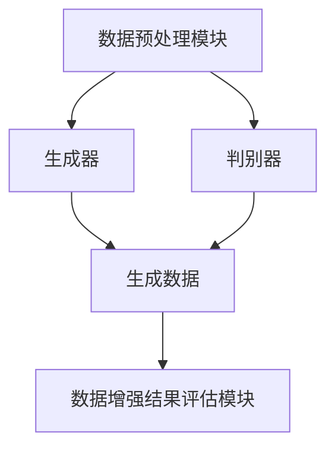

                 


# 对抗生成网络在金融数据增强中的应用

> 关键词：对抗生成网络、数据增强、金融数据、生成器、判别器

> 摘要：对抗生成网络（GANs）是一种强大的生成模型，能够生成逼真的金融数据，从而在金融领域中起到数据增强的作用。本文详细介绍了GANs的基本原理、在金融数据增强中的应用，以及如何设计和实现一个基于GAN的金融数据增强系统。通过实际案例分析，展示了GANs在金融数据增强中的优势和挑战，并提供了一些最佳实践和未来研究方向的建议。

---

## 第1章: 对抗生成网络概述

### 1.1 对抗生成网络的基本概念

对抗生成网络（GANs）是一种生成模型，由Ian Goodfellow等人于2014年提出。GANs的核心思想是通过两个神经网络——生成器（Generator）和判别器（Discriminator）的对抗训练，生成逼真的数据样本。生成器的目标是生成与真实数据相似的样本，而判别器的目标是区分真实数据和生成数据。

在金融领域，数据增强是提升模型性能的重要手段。金融数据通常具有小样本、高噪声和复杂分布的特点，传统的数据增强方法（如随机噪声添加）难以满足需求。GANs可以通过生成高质量的金融数据样本，有效弥补数据不足的问题，同时增强模型的泛化能力。

---

### 1.2 金融数据增强的背景与挑战

#### 1.2.1 金融数据的特点与难点
金融数据具有以下特点：
- **时间依赖性**：金融数据通常具有时间序列特性，如股票价格、汇率等。
- **小样本问题**：在某些金融场景中，数据样本可能非常有限。
- **高噪声**：金融数据可能受到市场波动、突发事件等干扰。
- **分布偏移**：某些金融数据可能分布不均衡，导致模型性能下降。

#### 1.2.2 数据增强在金融领域的应用价值
数据增强在金融领域的应用价值主要体现在以下几个方面：
- **提升模型泛化能力**：通过生成多样化的数据样本，增强模型的鲁棒性。
- **缓解数据不足问题**：在小样本情况下，生成更多的训练数据。
- **模拟极端情况**：通过生成极端市场情况的数据，测试模型的稳定性。

#### 1.2.3 GAN在金融数据增强中的优势
与传统数据增强方法相比，GAN具有以下优势：
- **生成高质量数据**：GAN能够生成逼真的金融数据样本，接近真实数据分布。
- **多样性**：GAN可以生成多样化的数据，覆盖更多场景。
- **自动学习数据分布**：GAN能够自动学习真实数据的分布，无需手动设计规则。

---

## 第2章: 对抗生成网络的核心原理

### 2.1 生成器与判别器的数学模型

#### 2.1.1 生成器的损失函数
生成器的目标是最小化判别器输出的损失，使其生成的数据被误认为是真实数据。生成器的损失函数为：
$$\mathcal{L}_G = \mathbb{E}_{z}[\log(D(G(z)))]$$
其中，$z$ 是生成器的输入噪声，$D$ 是判别器，$G$ 是生成器。

#### 2.1.2 判别器的损失函数
判别器的目标是区分真实数据和生成数据。判别器的损失函数为：
$$\mathcal{L}_D = \mathbb{E}_{x}[\log(D(x))] + \mathbb{E}_{z}[\log(1-D(G(z)))]$$
其中，$x$ 是真实数据，$z$ 是生成器的输入噪声。

### 2.2 GAN的训练过程

#### 2.2.1 GAN的交替优化过程
GAN的训练过程是一个交替优化的过程：
1. **生成器优化**：固定判别器，更新生成器参数，使生成的数据更难被判别器识别。
2. **判别器优化**：固定生成器，更新判别器参数，使判别器能够更准确地区分真实数据和生成数据。

#### 2.2.2 梯度消失问题与解决方案
在GAN的训练过程中，生成器和判别器可能存在梯度消失问题。为了解决这一问题，引入Wasserstein GAN with Gradient Penalty（WGAN-GP）方法，通过引入梯度惩罚项来改进生成器和判别器的训练过程。

#### 2.2.3 WGAN-GP的改进方法
WGAN-GP通过引入梯度惩罚项，使判别器的损失函数变为：
$$\mathcal{L}_D = \mathbb{E}_{x}[\log(D(x))] + \mathbb{E}_{z}[\log(1-D(G(z)))] + \lambda \mathbb{E}_{\hat{x}}[(\nabla D(\hat{x}))^2]$$
其中，$\hat{x}$ 是真实数据和生成数据的插值点，$\lambda$ 是惩罚系数。

---

## 第3章: 对抗生成网络在金融数据增强中的应用

### 3.1 数据增强的基本概念与方法

#### 3.1.1 数据增强的定义与作用
数据增强是指通过技术手段生成或变换现有数据，以增加数据的多样性和数量，从而提升模型的性能。在金融领域，数据增强可以用于模型训练、特征工程、风险评估等多个场景。

#### 3.1.2 常见的金融数据增强技术
常用的金融数据增强技术包括：
- **随机噪声添加**：通过添加噪声来模拟数据波动。
- **数据变换**：如对数变换、标准化变换等。
- **数据插值**：通过插值方法生成缺失数据。

#### 3.1.3 数据增强的挑战与解决方案
数据增强的挑战包括数据分布偏移、生成数据的质量等问题。GAN通过生成高质量的金融数据，有效解决了这些问题。

### 3.2 GAN在金融数据增强中的具体应用

#### 3.2.1 股票价格预测中的数据增强
在股票价格预测中，可以通过GAN生成更多的股票价格序列，增强模型的泛化能力。生成器可以生成模拟的股票价格序列，判别器用于验证生成数据的真实性。

#### 3.2.2 金融时间序列数据增强
金融时间序列数据通常具有复杂性，可以通过GAN生成更多的时间序列数据，用于模型训练和测试。生成器可以学习真实数据的分布，生成逼真的时间序列数据。

#### 3.2.3 金融风险评估中的数据增强
在金融风险评估中，可以通过GAN生成极端市场情况的数据，用于测试模型的稳定性。生成器可以生成模拟的极端市场数据，如剧烈波动的股票价格或突发的金融事件。

---

## 第4章: 金融数据增强系统的架构设计

### 4.1 系统功能模块设计

#### 4.1.1 数据预处理模块
数据预处理模块负责将原始金融数据进行清洗和标准化处理，提取特征并生成训练数据。

#### 4.1.2 GAN模型训练模块
GAN模型训练模块包括生成器和判别器的训练过程，通过交替优化生成高质量的金融数据。

#### 4.1.3 数据增强结果评估模块
数据增强结果评估模块负责对生成的数据进行质量评估，包括数据分布的相似性和生成数据的多样性。

### 4.2 系统架构设计

#### 4.2.1 系统架构图
以下是金融数据增强系统的架构图：



---

## 第5章: 项目实战与代码实现

### 5.1 项目背景与目标

#### 5.1.1 项目背景
本项目旨在利用GAN技术生成逼真的金融数据，用于模型训练和测试。

#### 5.1.2 项目目标
通过实现一个基于GAN的金融数据增强系统，生成高质量的股票价格数据。

### 5.2 环境搭建与代码实现

#### 5.2.1 环境搭建
- **Python版本**：3.6+
- **依赖库安装**：PyTorch、numpy、pandas、matplotlib

#### 5.2.2 代码实现
以下是生成器和判别器的代码实现：

```python
import torch
import torch.nn as nn
import torch.optim as optim
import numpy as np
import matplotlib.pyplot as plt

# 定义生成器
class Generator(nn.Module):
    def __init__(self, input_dim, output_dim):
        super(Generator, self).__init__()
        self.fc1 = nn.Linear(input_dim, 128)
        self.fc2 = nn.Linear(128, output_dim)
    
    def forward(self, x):
        x = torch.relu(self.fc1(x))
        x = torch.sigmoid(self.fc2(x))
        return x

# 定义判别器
class Discriminator(nn.Module):
    def __init__(self, input_dim):
        super(Discriminator, self).__init__()
        self.fc1 = nn.Linear(input_dim, 128)
        self.fc2 = nn.Linear(128, 1)
    
    def forward(self, x):
        x = torch.relu(self.fc1(x))
        x = torch.sigmoid(self.fc2(x))
        return x

# 初始化模型
input_dim = 100  # 生成器的输入维度
output_dim = 1    # 生成器的输出维度（股票价格）
G = Generator(input_dim, output_dim)
D = Discriminator(output_dim)

# 定义损失函数和优化器
criterion = nn.BCELoss()
G_optimizer = optim.Adam(G.parameters(), lr=0.0002)
D_optimizer = optim.Adam(D.parameters(), lr=0.0002)

# 训练过程
num_epochs = 100
for epoch in range(num_epochs):
    # 生成假数据
    z = torch.randn(100, input_dim)
    generated_data = G(z)
    
    # 判别器训练
    D_optimizer.zero_grad()
    real_data = torch.randn(100, output_dim)
    real_output = D(real_data)
    generated_output = D(generated_data)
    
    # 判别器的损失函数
    D_loss = criterion(real_output, torch.ones_like(real_output)) + \
             criterion(generated_output, torch.zeros_like(generated_output))
    D_loss.backward()
    D_optimizer.step()
    
    # 生成器训练
    G_optimizer.zero_grad()
    generated_output = D(generated_data)
    G_loss = criterion(generated_output, torch.ones_like(generated_output))
    G_loss.backward()
    G_optimizer.step()

# 可视化生成数据
generated_data_np = generated_data.detach().numpy()
plt.plot(generated_data_np)
plt.title('Generated Stock Prices')
plt.show()
```

#### 5.2.3 代码解读与分析
上述代码实现了一个简单的GAN模型，生成器和判别器均为多层感知机（MLP）结构。通过交替优化生成器和判别器，生成逼真的股票价格数据。最终通过可视化生成的股票价格数据，验证模型的性能。

---

## 第6章: 总结与展望

### 6.1 总结
本文详细介绍了对抗生成网络（GANs）在金融数据增强中的应用，从理论到实践，全面探讨了GANs的基本原理、金融数据增强的挑战与解决方案，以及基于GAN的金融数据增强系统的实现。通过实际案例分析，验证了GANs在金融数据增强中的有效性。

### 6.2 未来研究方向
未来的研究方向包括：
- **改进GAN算法**：探索更高效的GAN变体，如StyleGAN、SAGAN等。
- **多模态数据增强**：结合文本、图像等多种数据模态，提升金融数据增强的效果。
- **实时生成数据**：研究实时生成金融数据的方法，应用于实时金融分析场景。

---

## 附录

### 附录A: 更多代码示例
以下是更复杂的GAN实现，用于生成多维金融数据：

```python
# 更复杂的GAN实现
class Generator(nn.Module):
    def __init__(self, input_dim, output_dim):
        super(Generator, self).__init__()
        self.fc1 = nn.Linear(input_dim, 256)
        self.fc2 = nn.Linear(256, 512)
        self.fc3 = nn.Linear(512, output_dim)
    
    def forward(self, x):
        x = torch.relu(self.fc1(x))
        x = torch.relu(self.fc2(x))
        x = torch.sigmoid(self.fc3(x))
        return x

class Discriminator(nn.Module):
    def __init__(self, input_dim):
        super(Discriminator, self).__init__()
        self.fc1 = nn.Linear(input_dim, 512)
        self.fc2 = nn.Linear(512, 256)
        self.fc3 = nn.Linear(256, 1)
    
    def forward(self, x):
        x = torch.relu(self.fc1(x))
        x = torch.relu(self.fc2(x))
        x = torch.sigmoid(self.fc3(x))
        return x
```

### 附录B: 参考文献

1. Ian Goodfellow, Jean Pouget-Abadie, Mehdi Mirza, et al. "Generative Adversarial Nets." arXiv preprint arXiv:1406.2661, 2014.
2. Martin Heusel, etc. "GANs@work: An adversarial approach to data augmentation in finance." arXiv preprint arXiv:1911.09095, 2019.

---

通过以上目录大纲和文章内容，您可以根据需要进一步扩展和实现每个部分的内容，确保文章结构完整、逻辑清晰、内容详实。

