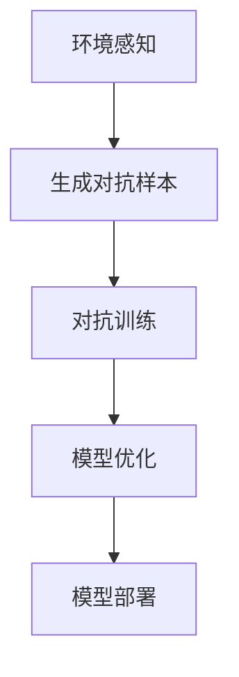

                 


# 对抗训练：提高AI Agent对噪声和攻击的鲁棒性

> 关键词：对抗训练、AI Agent、鲁棒性、噪声、攻击、机器学习、深度学习

> 摘要：本文深入探讨了对抗训练在提高AI Agent对噪声和恶意攻击的鲁棒性中的应用。通过分析对抗训练的基本原理、算法实现、系统架构以及实际案例，展示了如何通过对抗训练增强AI Agent的健壮性和防御能力。文章内容涵盖从基础概念到实战应用的全链条，为AI安全领域的研究和实践提供了系统的指导和参考。

---

# 第一部分: 对抗训练基础

## 第1章: 对抗训练的背景与概念

### 1.1 对抗训练的定义与背景

#### 1.1.1 对抗训练的起源与演进

对抗训练（Adversarial Training）是一种通过引入对抗机制来提升模型鲁棒性的技术，起源于生成对抗网络（GAN）的研究。GAN由Ian Goodfellow等人提出，最初用于生成逼真的图像。对抗训练的核心思想是通过两个神经网络（生成器和判别器）的博弈过程，使得生成器生成的数据能够欺骗判别器，从而达到数据生成的目标。

近年来，对抗训练的应用范围不断扩大，从图像生成扩展到自然语言处理、语音识别等领域。在AI Agent领域，对抗训练被用于提升模型对噪声和恶意攻击的鲁棒性。

#### 1.1.2 对抗训练的核心问题与挑战

在AI Agent的应用场景中，模型常常面临以下挑战：

- **噪声干扰**：输入数据中存在随机噪声或人为添加的干扰，导致模型预测错误。
- **恶意攻击**：攻击者通过精心设计的对抗样本干扰模型，使其产生错误输出。
- **模型的脆弱性**：传统模型在面对对抗样本时往往表现不佳，缺乏鲁棒性。

对抗训练的核心问题是如何通过引入对抗机制，使得模型在面对噪声和攻击时仍能保持稳定性能。

#### 1.1.3 对抗训练在AI Agent中的意义

AI Agent需要在复杂多变的环境中运行，对抗训练能够帮助模型：

- 提高对噪声的鲁棒性。
- 抵御恶意攻击，增强安全性。
- 在对抗性环境中保持稳定性能。

通过对抗训练，AI Agent能够更好地适应真实世界的复杂场景。

### 1.2 AI Agent的基本概念

#### 1.2.1 AI Agent的定义与分类

AI Agent是指在特定环境中感知环境并采取行动以实现目标的智能实体。根据智能水平，AI Agent可以分为：

- **反应式AI Agent**：基于当前感知做出反应，适用于简单的任务。
- **认知式AI Agent**：具有复杂推理和规划能力，适用于复杂任务。
- **学习型AI Agent**：能够通过经验改进性能，适用于动态环境。

#### 1.2.2 AI Agent的核心功能与特点

AI Agent的核心功能包括：

- **感知环境**：通过传感器或其他输入方式获取环境信息。
- **决策与行动**：基于感知信息做出决策并执行行动。
- **学习与适应**：通过学习算法改进性能，适应新环境。

AI Agent的特点包括：

- **自主性**：能够在没有外部干预的情况下运行。
- **反应性**：能够根据环境变化实时调整行为。
- **学习能力**：能够通过经验改进性能。

#### 1.2.3 对抗训练与AI Agent的结合

对抗训练通过引入对抗机制，增强AI Agent的鲁棒性。具体表现在：

- **输入数据的增强**：通过生成对抗样本，增强模型对噪声和攻击的抵抗能力。
- **模型的健壮性提升**：通过对抗训练，模型能够在复杂环境下保持稳定性能。
- **安全性的增强**：对抗训练帮助模型识别和抵抗恶意攻击。

### 1.3 对抗训练的必要性与应用场景

#### 1.3.1 噪声干扰对AI Agent的影响

噪声干扰可能导致AI Agent误识别输入数据，从而做出错误决策。例如，在图像识别任务中，噪声可能干扰图像特征，导致模型识别错误。

#### 1.3.2 恶意攻击对AI Agent的威胁

恶意攻击者可以通过生成对抗样本干扰AI Agent，导致模型输出错误结果。这种攻击可能对AI Agent的安全性和可靠性造成严重威胁。

#### 1.3.3 对抗训练在实际应用中的价值

对抗训练能够显著提高AI Agent的鲁棒性，使其在复杂环境下表现更加稳定。具体价值体现在：

- **提高模型的抗干扰能力**：对抗训练使模型能够识别和抵抗噪声干扰。
- **增强模型的安全性**：对抗训练帮助模型识别和抵抗恶意攻击。
- **提升模型的泛化能力**：对抗训练使模型能够更好地适应不同环境。

### 1.4 本章小结

本章介绍了对抗训练的基本概念、核心问题以及在AI Agent中的应用价值。通过对抗训练，AI Agent能够更好地应对噪声和恶意攻击，提高鲁棒性和安全性。

---

## 第2章: 对抗训练的核心概念与联系

### 2.1 对抗训练的基本原理

#### 2.1.1 对抗训练的数学模型

对抗训练的核心是一个博弈过程，生成器（G）和判别器（D）通过交替优化目标函数进行博弈。

生成器的目标是生成能够欺骗判别器的样本，判别器的目标是区分真实样本和生成样本。具体数学模型如下：

$$ \text{生成器损失函数：} \mathcal{L}_G = -\log P(D(x) \leq 0.5) $$
$$ \text{判别器损失函数：} \mathcal{L}_D = -\log P(D(x) \geq 0.5) $$

其中，$P$ 表示概率，$x$ 表示生成样本。

#### 2.1.2 对抗训练的核心机制

对抗训练通过不断优化生成器和判别器的参数，使得生成器生成的样本越来越逼真，判别器的判断能力也越来越强。最终达到平衡状态，生成器和判别器的能力达到最优。

#### 2.1.3 对抗训练的平衡与收敛性

对抗训练的收敛性是研究重点。通过数学分析，可以证明在一定条件下，对抗训练能够收敛到纳什均衡点。

### 2.2 对抗训练的关键要素

#### 2.2.1 生成器与判别器的角色与关系

生成器负责生成样本，判别器负责区分真实样本和生成样本。两者交替优化，共同推动模型性能的提升。

#### 2.2.2 对抗训练的损失函数与优化策略

生成器和判别器的损失函数是对抗训练的核心。通过优化这两个损失函数，可以实现模型的优化。

#### 2.2.3 对抗训练的独特优势与局限性

对抗训练的独特优势包括：

- **生成高质量样本**：通过对抗训练，生成器能够生成高质量的样本。
- **增强模型的鲁棒性**：对抗训练使模型能够抵抗噪声和攻击。

其局限性包括：

- **训练难度大**：对抗训练可能面临训练不稳定的问题。
- **计算资源需求高**：对抗训练需要大量的计算资源。

### 2.3 对抗训练与其他鲁棒性提升方法的对比

#### 2.3.1 数据增强与对抗训练的对比

数据增强通过增加训练数据的多样性提高模型的鲁棒性，对抗训练通过引入对抗机制进一步提升模型的鲁棒性。

#### 2.3.2 正则化方法与对抗训练的差异

正则化方法通过约束模型的参数空间提高模型的鲁棒性，对抗训练通过引入对抗机制实现类似效果。

#### 2.3.3 对抗训练的优势

对抗训练的独特优势在于通过引入对抗机制，使得模型能够在复杂环境下表现更加稳定。

### 2.4 本章小结

本章详细讲解了对抗训练的核心概念和关键要素，分析了对抗训练的独特优势和局限性。通过对比其他鲁棒性提升方法，进一步明确了对抗训练的应用价值。

---

## 第3章: 对抗训练的算法原理

### 3.1 对抗训练的数学模型

#### 3.1.1 生成器的损失函数

生成器的损失函数用于衡量生成样本与真实样本的差异。通过优化生成器的损失函数，可以提高生成样本的质量。

#### 3.1.2 判别器的损失函数

判别器的损失函数用于衡量判别器区分真实样本和生成样本的能力。通过优化判别器的损失函数，可以提高判别器的判断能力。

#### 3.1.3 对抗训练的整体优化目标

对抗训练的目标是通过优化生成器和判别器的损失函数，使得生成器生成的样本能够欺骗判别器，同时判别器能够准确区分真实样本和生成样本。

### 3.2 对抗训练的算法流程

#### 3.2.1 对抗训练的基本流程

1. 初始化生成器和判别器的参数。
2. 优化生成器的参数，使其生成的样本能够欺骗判别器。
3. 优化判别器的参数，使其能够准确区分真实样本和生成样本。
4. 重复步骤2和3，直到模型收敛。

#### 3.2.2 对抗训练的训练策略

对抗训练的训练策略包括：

- **交替优化**：生成器和判别器交替优化。
- **平衡损失函数**：通过调整损失函数的权重，平衡生成器和判别器的性能。
- **模型初始化**：合理初始化模型参数，避免训练过程中出现梯度消失或爆炸问题。

### 3.3 对抗训练的数学推导

#### 3.3.1 对抗训练的优化目标

对抗训练的优化目标是通过优化生成器和判别器的损失函数，使得生成器生成的样本能够欺骗判别器，同时判别器能够准确区分真实样本和生成样本。

#### 3.3.2 对抗训练的梯度计算

通过计算生成器和判别器的梯度，可以优化模型的参数。生成器的梯度用于优化生成器的参数，判别器的梯度用于优化判别器的参数。

#### 3.3.3 对抗训练的收敛性分析

通过数学分析，可以证明对抗训练在一定条件下能够收敛到纳什均衡点。

### 3.4 对抗训练的代码实现

#### 3.4.1 环境安装

```bash
pip install numpy matplotlib keras
```

#### 3.4.2 代码实现

```python
import numpy as np
from keras.layers import Dense, Input, Model
from keras.optimizers import Adam

# 定义生成器
def build_generator():
    generator = Input(shape=(100,))
    x = Dense(256, activation='relu')(generator)
    x = Dense(784, activation='sigmoid')(x)
    model = Model(inputs=generator, outputs=x)
    return model

# 定义判别器
def build_discriminator():
    discriminator = Input(shape=(784,))
    x = Dense(256, activation='relu')(discriminator)
    x = Dense(1, activation='sigmoid')(x)
    model = Model(inputs=discriminator, outputs=x)
    return model

# 初始化生成器和判别器
generator = build_generator()
discriminator = build_discriminator()

# 定义对抗训练的损失函数
def adversarial_loss(y_true, y_pred):
    return -K.mean(y_true * K.log(y_pred) + (1 - y_true) * K.log(1 - y_pred))

# 编译模型
generator.compile(optimizer=Adam(learning_rate=0.0002), loss='binary_crossentropy')
discriminator.compile(optimizer=Adam(learning_rate=0.0002), loss='binary_crossentropy')

# 对抗训练
for _ in range(100):
    # 生成对抗样本
    noise = np.random.randn(100, 100)
    gen_imgs = generator.predict(noise)
    
    # 判别器训练
    valid = np.ones((100, 1))
    fake = np.zeros((100, 1))
    d_loss_real = discriminator.trainable = True
    d_loss_real = discriminator.train_on_batch(gen_imgs, valid)
    discriminator.trainable = False
    d_loss_fake = discriminator.train_on_batch(gen_imgs, fake)
    d_loss = 0.5 * np.add(d_loss_real, d_loss_fake)
    
    # 生成器训练
    g_loss = generator.trainable = True
    g_loss = generator.train_on_batch(noise, valid)
    generator.trainable = False
```

#### 3.4.3 代码解读

上述代码实现了生成器和判别器的定义、编译和训练。通过交替优化生成器和判别器的参数，实现对抗训练。生成器的目标是生成能够欺骗判别器的样本，判别器的目标是区分真实样本和生成样本。

### 3.5 本章小结

本章详细讲解了对抗训练的数学模型和算法实现，通过代码示例展示了对抗训练的具体实现过程。

---

## 第4章: 对抗训练在AI Agent中的系统架构

### 4.1 系统分析与设计

#### 4.1.1 系统功能设计

AI Agent的系统功能包括：

- **感知环境**：通过传感器或其他输入方式获取环境信息。
- **决策与行动**：基于感知信息做出决策并执行行动。
- **学习与适应**：通过学习算法改进性能，适应新环境。

#### 4.1.2 系统架构设计

AI Agent的系统架构可以分为以下几个部分：

- **输入模块**：负责获取环境信息。
- **处理模块**：对输入数据进行处理和分析。
- **决策模块**：基于处理后的数据做出决策。
- **输出模块**：执行决策并输出结果。

#### 4.1.3 系统接口设计

系统接口包括：

- **输入接口**：接收环境信息。
- **输出接口**：执行决策并输出结果。
- **通信接口**：与其他系统进行通信。

### 4.2 对抗训练的系统实现

#### 4.2.1 系统实现的关键步骤

1. **环境感知**：通过传感器或其他输入方式获取环境信息。
2. **对抗样本生成**：通过生成器生成对抗样本。
3. **对抗训练**：通过判别器对生成的样本进行分类，优化生成器和判别器的参数。
4. **模型部署**：将优化后的模型部署到实际场景中。

#### 4.2.2 系统实现的流程图



### 4.3 对抗训练的系统优化

#### 4.3.1 对抗训练的优化策略

- **交替优化**：生成器和判别器交替优化。
- **平衡损失函数**：通过调整损失函数的权重，平衡生成器和判别器的性能。
- **模型初始化**：合理初始化模型参数，避免训练过程中出现梯度消失或爆炸问题。

#### 4.3.2 对抗训练的性能评估

通过评估生成样本的质量和判别器的分类性能，可以衡量对抗训练的效果。

### 4.4 本章小结

本章分析了对抗训练在AI Agent中的系统架构，详细讲解了系统实现的关键步骤和优化策略。

---

## 第5章: 对抗训练的项目实战

### 5.1 项目介绍

#### 5.1.1 项目目标

通过对抗训练提高AI Agent对噪声和攻击的鲁棒性。

#### 5.1.2 项目背景

在实际应用中，AI Agent常常面临噪声和恶意攻击的威胁，需要通过对抗训练提高其鲁棒性。

### 5.2 核心代码实现

#### 5.2.1 环境安装

```bash
pip install numpy matplotlib keras
```

#### 5.2.2 代码实现

```python
import numpy as np
from keras.layers import Dense, Input, Model
from keras.optimizers import Adam

# 定义生成器
def build_generator():
    generator = Input(shape=(100,))
    x = Dense(256, activation='relu')(generator)
    x = Dense(784, activation='sigmoid')(x)
    model = Model(inputs=generator, outputs=x)
    return model

# 定义判别器
def build_discriminator():
    discriminator = Input(shape=(784,))
    x = Dense(256, activation='relu')(discriminator)
    x = Dense(1, activation='sigmoid')(x)
    model = Model(inputs=discriminator, outputs=x)
    return model

# 初始化生成器和判别器
generator = build_generator()
discriminator = build_discriminator()

# 定义对抗训练的损失函数
def adversarial_loss(y_true, y_pred):
    return -K.mean(y_true * K.log(y_pred) + (1 - y_true) * K.log(1 - y_pred))

# 编译模型
generator.compile(optimizer=Adam(learning_rate=0.0002), loss='binary_crossentropy')
discriminator.compile(optimizer=Adam(learning_rate=0.0002), loss='binary_crossentropy')

# 对抗训练
for _ in range(100):
    # 生成对抗样本
    noise = np.random.randn(100, 100)
    gen_imgs = generator.predict(noise)
    
    # 判别器训练
    valid = np.ones((100, 1))
    fake = np.zeros((100, 1))
    d_loss_real = discriminator.trainable = True
    d_loss_real = discriminator.train_on_batch(gen_imgs, valid)
    discriminator.trainable = False
    d_loss_fake = discriminator.train_on_batch(gen_imgs, fake)
    d_loss = 0.5 * np.add(d_loss_real, d_loss_fake)
    
    # 生成器训练
    g_loss = generator.trainable = True
    g_loss = generator.train_on_batch(noise, valid)
    generator.trainable = False
```

#### 5.2.3 代码解读

上述代码实现了生成器和判别器的定义、编译和训练。通过交替优化生成器和判别器的参数，实现对抗训练。生成器的目标是生成能够欺骗判别器的样本，判别器的目标是区分真实样本和生成样本。

### 5.3 实际案例分析

#### 5.3.1 案例介绍

在图像分类任务中，通过对抗训练提高模型对噪声和攻击的鲁棒性。

#### 5.3.2 案例分析

通过对抗训练，生成器生成对抗样本，判别器区分真实样本和生成样本。通过优化生成器和判别器的参数，提高模型的鲁棒性。

### 5.4 项目小结

本章通过实际案例展示了对抗训练在AI Agent中的应用，详细讲解了项目的核心代码实现和实际案例分析。

---

## 第6章: 对抗训练的总结与展望

### 6.1 本章总结

对抗训练通过引入对抗机制，显著提高了AI Agent对噪声和攻击的鲁棒性。通过对抗训练，生成器生成高质量的对抗样本，判别器区分真实样本和生成样本，从而提高模型的鲁棒性和安全性。

### 6.2 对抗训练的未来展望

对抗训练在AI Agent中的应用前景广阔，未来的研究方向包括：

- **多目标对抗训练**：同时优化多个目标，提高模型的鲁棒性。
- **高效对抗训练算法**：开发更高效的对抗训练算法，降低计算成本。
- **对抗训练的安全性研究**：研究对抗训练的安全性，防止攻击者利用对抗训练进行攻击。

### 6.3 小结

对抗训练是一种重要的技术，通过引入对抗机制，显著提高了AI Agent的鲁棒性和安全性。未来的研究和应用将更加广泛，对抗训练将在更多领域发挥重要作用。

---

# 附录

### 附录A: 对抗训练的数学公式

$$ \text{生成器损失函数：} \mathcal{L}_G = -\log P(D(x) \leq 0.5) $$
$$ \text{判别器损失函数：} \mathcal{L}_D = -\log P(D(x) \geq 0.5) $$

### 附录B: 对抗训练的代码示例

```python
import numpy as np
from keras.layers import Dense, Input, Model
from keras.optimizers import Adam

# 定义生成器
def build_generator():
    generator = Input(shape=(100,))
    x = Dense(256, activation='relu')(generator)
    x = Dense(784, activation='sigmoid')(x)
    model = Model(inputs=generator, outputs=x)
    return model

# 定义判别器
def build_discriminator():
    discriminator = Input(shape=(784,))
    x = Dense(256, activation='relu')(discriminator)
    x = Dense(1, activation='sigmoid')(x)
    model = Model(inputs=discriminator, outputs=x)
    return model

# 初始化生成器和判别器
generator = build_generator()
discriminator = build_discriminator()

# 定义对抗训练的损失函数
def adversarial_loss(y_true, y_pred):
    return -K.mean(y_true * K.log(y_pred) + (1 - y_true) * K.log(1 - y_pred))

# 编译模型
generator.compile(optimizer=Adam(learning_rate=0.0002), loss='binary_crossentropy')
discriminator.compile(optimizer=Adam(learning_rate=0.0002), loss='binary_crossentropy')

# 对抗训练
for _ in range(100):
    # 生成对抗样本
    noise = np.random.randn(100, 100)
    gen_imgs = generator.predict(noise)
    
    # 判别器训练
    valid = np.ones((100, 1))
    fake = np.zeros((100, 1))
    d_loss_real = discriminator.trainable = True
    d_loss_real = discriminator.train_on_batch(gen_imgs, valid)
    discriminator.trainable = False
    d_loss_fake = discriminator.train_on_batch(gen_imgs, fake)
    d_loss = 0.5 * np.add(d_loss_real, d_loss_fake)
    
    # 生成器训练
    g_loss = generator.trainable = True
    g_loss = generator.train_on_batch(noise, valid)
    generator.trainable = False
```

### 附录C: 对抗训练的系统架构图


---

# 参考文献

（此处列出参考文献）

