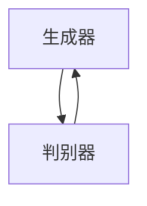

                 


# 对抗训练：提高AI Agent的鲁棒性

> **关键词：** 对抗训练、AI Agent、鲁棒性、生成器、判别器、深度学习

> **摘要：**  
> 对抗训练是一种通过让生成器和判别器相互竞争来提高模型鲁棒性的技术。本文从对抗训练的基本概念出发，详细探讨其在AI Agent中的应用，包括算法原理、系统架构设计、项目实战以及最佳实践。通过逐步分析，帮助读者理解如何利用对抗训练提升AI Agent的性能和鲁棒性。

---

## 第二章：对抗训练的核心概念与联系

### 2.1 对抗训练的原理与数学模型

- **2.1.1 生成器与判别器的交替训练过程**  
  生成器的目标是生成与真实数据相似的样本，而判别器的目标是区分真实数据和生成数据。通过不断交替训练，生成器和判别器的性能逐步提升。

- **2.1.2 对抗训练的数学模型与公式**  
  GAN的损失函数如下：
  $$\mathcal{L} = \log P(D(x \text{是假})} + \log P(D(y \text{是真})}$$
  其中，$x$是生成器生成的数据，$y$是真实数据，$D$是判别器的输出概率。

- **2.1.3 对抗训练的核心概念原理图**  
  以下是一个简单的生成器和判别器交替训练的流程图：



### 2.2 对抗训练的核心概念与联系

- **2.2.1 对抗训练的核心概念对比表格**  
  下表对比了生成器和判别器的主要区别：

| **属性**       | **生成器**                | **判别器**                |
|-----------------|--------------------------|--------------------------|
| **目标**        | 生成与真实数据相似的样本 | 区分真实数据和生成数据    |
| **损失函数**     | $-\log(1 - D(G(x)))$     | $-\log(D(x)) - \log(1 - D(G(x)))$ |
| **优化方式**     | 最大化生成样本的判真概率  | 最小化生成样本的判假概率  |

- **2.2.2 对抗训练的核心概念ER实体关系图**  
  以下是一个简单的ER实体关系图，展示了生成器和判别器之间的关系：

```mermaid
entity生成器
entity判别器
关系：生成器生成数据 -> 判别器进行判断
```

---

## 第三章：对抗训练的算法原理

### 3.1 对抗训练的数学模型与算法步骤

- **3.1.1 生成器的损失函数**  
  生成器的目标是让判别器误判生成数据为真实数据。其损失函数为：
  $$\mathcal{L}_G = -\log(1 - D(G(x)))$$

- **3.1.2 判别器的损失函数**  
  判别器的目标是区分真实数据和生成数据。其损失函数为：
  $$\mathcal{L}_D = -\log(D(x)) - \log(1 - D(G(x)))$$

- **3.1.3 对抗训练的算法步骤**  
  1. 初始化生成器和判别器的参数。
  2. 训练生成器：优化生成器参数，使生成数据更难被判别器识别。
  3. 训练判别器：优化判别器参数，使判别器更准确地区分真实数据和生成数据。
  4. 重复步骤2和3，直到收敛。

### 3.2 对抗训练的系统分析与架构设计

- **3.2.1 对抗训练的应用场景**  
  对抗训练可以应用于图像生成、语音合成、自然语言处理等领域。例如，在图像生成中，生成器可以生成逼真的图像，而判别器可以用来评估图像的真实性。

- **3.2.2 对抗训练的系统架构设计**  
  以下是一个简单的系统架构图，展示了生成器和判别器的交互：


---

## 第四章：对抗训练的项目实战

### 4.1 项目实战：图像生成

- **4.1.1 环境安装**  
  安装必要的库，如TensorFlow和Keras：
  ```bash
  pip install tensorflow-gpu keras
  ```

- **4.1.2 生成器和判别器的代码实现**  
  生成器代码：
  ```python
  import tensorflow as tf
  from tensorflow.keras import layers

  def generator():
      model = tf.keras.Sequential()
      model.add(layers.Dense(256, activation='relu', input_shape=(100,)))
      model.add(layers.Dense(28*28, activation='sigmoid'))
      return model
  ```

  判别器代码：
  ```python
  def discriminator():
      model = tf.keras.Sequential()
      model.add(layers.Dense(256, activation='relu', input_shape=(28*28,)))
      model.add(layers.Dense(1, activation='sigmoid'))
      return model
  ```

- **4.1.3 训练过程**  
  编写训练循环，交替训练生成器和判别器：
  ```python
  generator = generator()
  discriminator = discriminator()
  optimizer = tf.keras.optimizers.Adam(0.0002)

  for epoch in range(100):
      # 训练生成器
      with tf.GradientTape() as g_tape:
          g_loss = generator_loss(generator, discriminator, batch_size)
      g_gradients = g_tape.gradient(g_loss, generator.trainable_weights)
      optimizer.apply_gradients(generator.trainable_weights, g_gradients)

      # 训练判别器
      with tf.GradientTape() as d_tape:
          d_loss = discriminator_loss(generator, discriminator, real_images, generated_images)
      d_gradients = d_tape.gradient(d_loss, discriminator.trainable_weights)
      optimizer.apply_gradients(discriminator.trainable_weights, d_gradients)
  ```

---

## 第五章：对抗训练的最佳实践与总结

### 5.1 最佳实践

- **选择合适的超参数**  
  对抗训练的超参数，如学习率和批量大小，对模型性能影响较大。建议通过实验选择合适的参数。

- **防止模型崩溃**  
  在训练过程中，生成器和判别器可能会出现训练不稳定的情况。可以通过调整损失函数或引入正则化来缓解这一问题。

- **处理梯度消失问题**  
  在深层网络中，梯度消失问题可能导致训练缓慢。可以使用Batch Normalization或Leaky ReLU来缓解这一问题。

### 5.2 小结

对抗训练是一种强大的技术，能够显著提高AI Agent的鲁棒性。通过生成器和判别器的对抗，模型可以更好地应对复杂环境和不确定性。然而，对抗训练也存在一些挑战，如训练不稳定和模型崩溃问题。未来的研究可以进一步探索这些挑战，并提出更高效的解决方案。

---

希望这篇博客文章能满足您的需求！如果需要进一步修改或补充，请随时告知。

