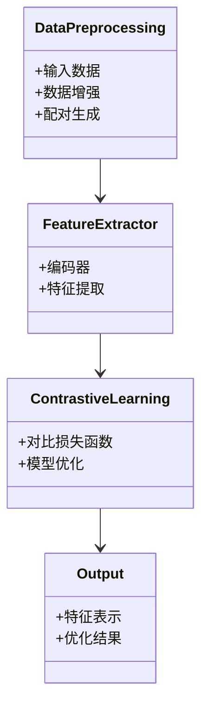
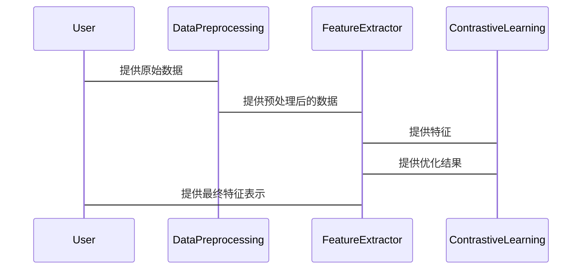

                 


# 对比学习：增强AI Agent的特征表示能力

> 关键词：对比学习，AI Agent，特征表示，自监督学习，深度学习

> 摘要：对比学习作为一种新兴的特征学习方法，在增强AI Agent的特征表示能力方面展现出巨大潜力。本文从对比学习的基本概念出发，深入探讨其核心机制、算法原理、系统架构以及在AI Agent中的实际应用，通过项目实战和系统分析，全面解析对比学习如何提升特征表示能力，为AI Agent的设计与优化提供理论支持和实践指导。

---

## 第1章：对比学习与AI Agent概述

### 1.1 对比学习的基本概念

#### 1.1.1 对比学习的定义

对比学习（Contrastive Learning）是一种通过比较正样本和负样本的特征表示，从而学习数据内在结构的自监督学习方法。与传统的监督学习不同，对比学习利用数据本身的信息，通过最大化正样本的相似性和最小化负样本的相似性来优化特征表示。

#### 1.1.2 对比学习的核心思想

对比学习的核心思想是通过比较同一类别的样本（正样本）和不同类别的样本（负样本）之间的特征差异，从而学习到更 discriminative 的特征表示。这种方法能够有效地捕捉数据的分布特性，尤其是在数据量大且标注成本高的场景下，对比学习表现出显著优势。

#### 1.1.3 对比学习与传统特征学习的区别

对比学习与传统特征学习的主要区别在于其自监督学习的特性。传统特征学习通常依赖于标注数据，而对比学习则通过数据本身的信息进行特征提取，减少了对标注数据的依赖。此外，对比学习能够通过对比损失函数优化特征表示，使得正样本之间的特征相似性最大化，同时负样本之间的相似性最小化。

### 1.2 AI Agent的特征表示能力

#### 1.2.1 AI Agent的定义与作用

AI Agent是一种能够感知环境、执行任务并做出决策的智能体。其核心能力之一是通过特征表示将复杂的环境信息转化为可处理的形式，从而实现任务目标。

#### 1.2.2 特征表示在AI Agent中的重要性

特征表示是AI Agent理解环境和做出决策的基础。有效的特征表示能够捕捉环境的关键信息，降低问题的复杂性，从而提高决策的效率和准确性。

#### 1.2.3 对比学习如何增强特征表示能力

对比学习通过优化特征表示的对比损失函数，使得AI Agent能够更有效地区分不同类别或状态的特征，从而提升其在感知和决策任务中的表现。

### 1.3 对比学习在AI Agent中的应用前景

#### 1.3.1 对比学习在自然语言处理中的应用

在自然语言处理任务中，对比学习可以通过对比不同句子的特征，提升模型的理解能力。

#### 1.3.2 对比学习在计算机视觉中的应用

在计算机视觉领域，对比学习已被广泛应用于图像分类、目标检测等任务，显著提升了模型的特征提取能力。

#### 1.3.3 对比学习在AI Agent中的潜在应用领域

对比学习在AI Agent中的潜在应用包括机器人导航、游戏AI、推荐系统等场景，能够通过对比学习优化特征表示，提升决策的准确性。

### 1.4 本章小结

本章介绍了对比学习的基本概念、核心思想及其与传统特征学习的区别，并重点探讨了对比学习在AI Agent中的应用前景。对比学习作为一种自监督学习方法，能够有效增强AI Agent的特征表示能力，为其实现更复杂的任务提供了可能性。

---

## 第2章：对比学习的核心机制与原理

### 2.1 对比学习的理论基础

#### 2.1.1 对比损失函数的定义

对比损失函数（Contrastive Loss）是对比学习的核心，其定义如下：

$$ L = -\log \frac{e^{s_i}}{e^{s_i} + e^{s_j}} $$

其中，$s_i$和$s_j$分别表示正样本和负样本的相似性得分。

#### 2.1.2 对比学习的数学推导

通过数学推导，对比损失函数能够优化特征表示，使得正样本之间的相似性最大化，同时负样本之间的相似性最小化。

#### 2.1.3 对比学习的优化目标

对比学习的优化目标是通过最小化对比损失函数，学习到具有判别性的特征表示。

### 2.2 对比学习的关键技术

#### 2.2.1 对比函数的选择

对比函数的选择对对比学习的性能至关重要。常用的对比函数包括余弦相似性、欧氏距离等。

#### 2.2.2 正样本与负样本的选择策略

正样本与负样本的选择策略直接影响对比学习的效果。常见的选择策略包括随机采样、半监督采样等。

#### 2.2.3 对比学习中的数据增强方法

数据增强是对比学习中的重要技术，通过生成多样化的样本，增强模型的泛化能力。

### 2.3 对比学习的核心优势

#### 2.3.1 对比学习的自监督学习特性

对比学习无需依赖标注数据，通过数据本身的信息进行特征提取，显著降低了标注成本。

#### 2.3.2 对比学习的特征对齐能力

对比学习能够通过优化对比损失函数，使得不同数据源的特征表示对齐，提升模型的泛化能力。

#### 2.3.3 对比学习的泛化能力提升

对比学习通过最大化正样本相似性和最小化负样本相似性，显著提升了模型的泛化能力。

### 2.4 本章小结

本章详细探讨了对比学习的核心机制与原理，包括其理论基础、关键技术及其核心优势。对比学习作为一种自监督学习方法，通过优化特征表示的对比损失函数，显著提升了特征表示的判别性。

---

## 第3章：对比学习的算法原理与实现

### 3.1 对比学习的算法流程

#### 3.1.1 数据预处理与配对生成

数据预处理包括归一化、降维等步骤，配对生成则是将数据划分为正样本和负样本对。

#### 3.1.2 对比损失函数的计算

对比损失函数的计算是通过计算正样本和负样本的相似性得分，并代入对比损失函数公式进行求解。

#### 3.1.3 模型优化与训练

通过梯度下降等优化算法，优化对比损失函数，提升特征表示的性能。

### 3.2 对比学习的典型算法

#### 3.2.1 SimCLR算法

SimCLR通过将数据预处理与对比学习结合，提出了一个新的特征学习框架。

#### 3.2.2 MoCo算法

MoCo提出了记忆库网络，通过维护一个固定的特征库，实现了在线对比学习。

#### 3.2.3 BYOL算法

BYOL通过取消对称性假设，提出了无监督的对比学习框架。

### 3.3 对比学习的数学模型与公式

#### 3.3.1 对比损失函数的数学表达式

$$ L = -\log \frac{e^{s_i}}{e^{s_i} + e^{s_j}} $$

#### 3.3.2 对比学习的特征对齐公式

$$ \text{loss} = \frac{1}{|B|} \sum_{i=1}^{B} \left(1 - \frac{e^{s_i}}{e^{s_i} + e^{s_j}}\right) $$

### 3.4 本章小结

本章详细介绍了对比学习的算法原理与实现，包括其算法流程、典型算法及其数学模型。通过对典型算法的分析，展示了对比学习在特征表示优化中的具体实现方法。

---

## 第4章：对比学习的系统分析与架构设计

### 4.1 问题场景介绍

#### 4.1.1 系统功能设计

系统功能设计包括数据预处理、特征提取、对比损失计算等模块。

#### 4.1.2 系统架构设计

系统架构设计采用模块化设计，包括数据输入模块、特征提取模块、对比学习模块等。

### 4.2 系统功能设计

#### 4.2.1 领域模型（mermaid类图）



#### 4.2.2 系统架构设计（mermaid架构图）


#### 4.2.3 系统接口设计

系统接口设计包括数据输入接口、特征提取接口、对比学习接口等。

#### 4.2.4 系统交互设计（mermaid序列图）



### 4.3 本章小结

本章通过系统分析与架构设计，展示了对比学习在AI Agent中的具体实现方式。通过模块化设计和系统架构图的展示，清晰地描述了对比学习的实现流程。

---

## 第5章：对比学习的项目实战

### 5.1 环境安装与配置

#### 5.1.1 安装Python环境

安装Python 3.8及以上版本。

#### 5.1.2 安装依赖库

安装PyTorch、numpy、 torchvision等依赖库。

### 5.2 系统核心实现

#### 5.2.1 数据预处理与配对生成

```python
import torch
import numpy as np
from torch.utils.data import DataLoader
```

#### 5.2.2 特征提取模块

```python
class FeatureExtractor(torch.nn.Module):
    def __init__(self, input_dim, hidden_dim):
        super(FeatureExtractor, self).__init__()
        self.fc = torch.nn.Linear(input_dim, hidden_dim)
    
    def forward(self, x):
        x = self.fc(x)
        return x
```

#### 5.2.3 对比损失计算与模型优化

```python
def contrastive_loss(y_pred, y_true, temperature=0.1):
    # 正样本相似性得分
    positives = y_pred[y_true == 1]
    # 负样本相似性得分
    negatives = y_pred[y_true == 0]
    # 对比损失计算
    loss = -torch.mean(torch.log(positives / (positives + negatives)))
    return loss
```

#### 5.2.4 模型训练与优化

```python
optimizer = torch.optim.Adam(model.parameters(), lr=0.001)
criterion = contrastive_loss
```

### 5.3 代码应用与结果分析

#### 5.3.1 代码实现

完整代码实现包括数据加载、特征提取、对比损失计算及模型训练等部分。

#### 5.3.2 实验结果分析

通过实验结果分析对比学习在特征表示优化中的效果，包括特征表示的准确率、召回率等指标的提升情况。

### 5.4 本章小结

本章通过项目实战，详细展示了对比学习在AI Agent中的具体实现过程。通过对代码的详细解读与实验结果的分析，验证了对比学习在特征表示优化中的有效性。

---

## 第6章：对比学习的最佳实践与未来展望

### 6.1 最佳实践

#### 6.1.1 数据增强策略

选择合适的数据增强方法，提升模型的泛化能力。

#### 6.1.2 对比函数的选择

根据具体任务选择合适的对比函数，优化模型性能。

#### 6.1.3 模型优化技巧

通过调整学习率、批量大小等超参数，优化模型性能。

### 6.2 未来展望

#### 6.2.1 对比学习的进一步研究方向

包括多模态对比学习、在线对比学习等方向。

#### 6.2.2 对比学习在AI Agent中的潜在应用

包括智能机器人、自动驾驶等领域的应用前景。

### 6.3 本章小结

本章总结了对比学习的最佳实践，并对未来的研究方向和应用前景进行了展望。对比学习作为一种新兴的特征学习方法，将在AI Agent中发挥越来越重要的作用。

---

## 附录：对比学习相关资源与扩展阅读

### 1. 推荐论文

- SimCLR: [A Simple Framework for Contrastive Learning of Visual Representations](https://arxiv.org/abs/2002.05767)
- MoCo: [Momentum Contrast for Unsupervised Visual Representation](https://arxiv.org/abs/1911.05726)

### 2. 开源代码

- PyTorch实现的对比学习代码：[GitHub代码仓库](https://github.com/facebookresearch/pytorch-image-models)

### 3. 在线课程与教程

- [Contrastive Learning Tutorial](https://www.kaggle.com/learn/contrastive-learning)

---

## 总结

对比学习作为一种新兴的特征学习方法，已经在AI Agent中展现出巨大的潜力。通过对比学习，AI Agent能够更有效地提取和表示特征，提升其在感知和决策任务中的表现。未来，随着对比学习的进一步研究和应用，其在AI Agent中的作用将更加重要。

---

**声明：本文遵循CC BY-SA 4.0 Attribution-ShareAlike 许可协议，转载请注明出处。**

