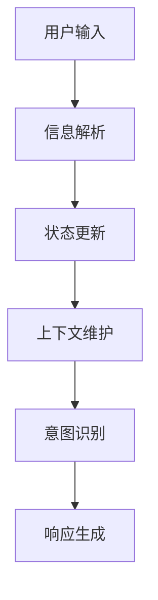
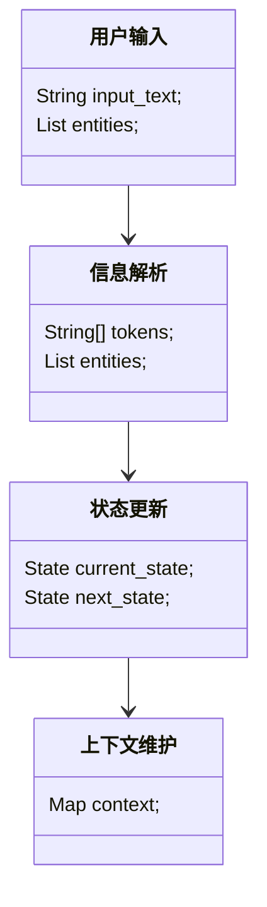
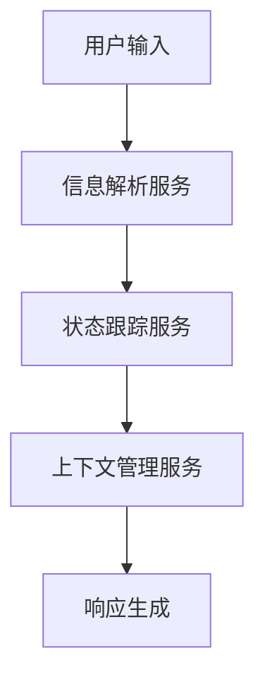
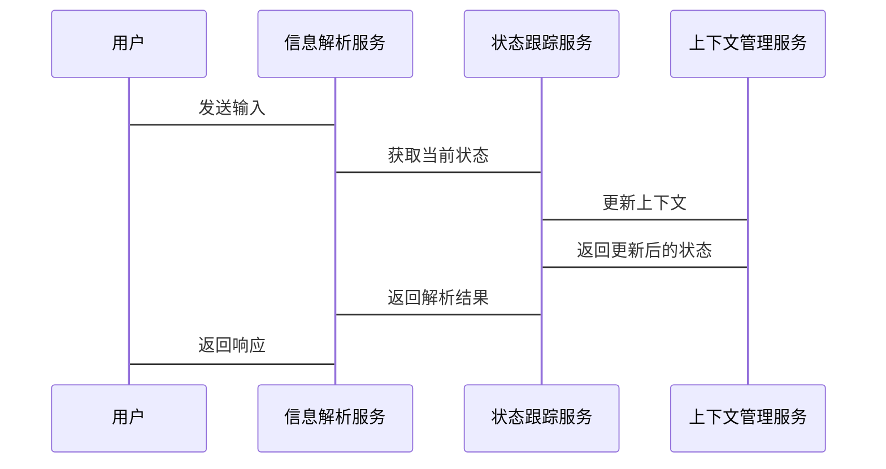

                 


```markdown
# 对话式AI Agent的上下文管理技巧

> 关键词：对话式AI，上下文管理，自然语言处理，算法原理，系统架构，项目实战

> 摘要：本文将详细探讨对话式AI Agent中的上下文管理技巧，涵盖背景介绍、核心概念、算法原理、系统架构设计、项目实战以及最佳实践等内容，帮助读者深入理解上下文管理的技术细节和实际应用。

---

# 第一部分：背景介绍

## 第1章：上下文管理的基本概念

### 1.1 什么是上下文管理
- 上下文管理的定义
- 对话式AI Agent中上下文管理的重要性
- 上下文管理的核心要素：信息存储、状态跟踪、关联性分析

### 1.2 问题背景与目标
- 对话式AI Agent的发展现状
- 上下文管理在对话中的问题与挑战
- 问题解决的目标与意义

### 1.3 边界与外延
- 上下文管理的边界：输入范围、处理范围、输出范围
- 相关概念的对比：上下文管理 vs 会话管理
- 上下文管理的外延与应用场景

## 第2章：上下文管理的核心要素

### 2.1 核心概念解析
- 信息存储机制：文本、结构化数据、知识图谱
- 状态跟踪：对话历史、当前状态、意图识别
- 关联性分析：实体识别、关系抽取、语义理解

### 2.2 上下文管理的结构
- 概念层次分析：输入层、处理层、输出层
- 核心要素的动态变化：信息更新、状态转移、关联调整

### 2.3 实例分析
- 典型场景：电商客服、智能助手、社交对话
- 上下文管理在不同场景中的应用特点

---

# 第二部分：核心概念与联系

## 第3章：上下文管理的核心原理

### 3.1 信息存储与状态跟踪
- 信息存储机制：短时记忆、长时记忆
- 状态跟踪的实现方式：基于规则、基于模型
- 信息关联性分析：实体识别、意图识别、情感分析

### 3.2 上下文的动态更新与维护
- 动态更新的触发条件：新信息输入、用户反馈、对话中断
- 状态更新的实现方式：基于规则的更新、基于模型的预测
- 关联性调整：实体消解、意图修正、情感调整

### 3.3 上下文管理的优化策略
- 信息冗余的处理：去噪、压缩、归一化
- 状态冲突的解决：优先级排序、冲突检测、自动修正
- 关联性优化：语义扩展、知识推理、上下文记忆增强

---

## 第4章：核心概念对比与联系

### 4.1 上下文管理与相关概念对比
| 概念         | 定义                                                                 | 区别                                                                 |
|--------------|--------------------------------------------------------------------|----------------------------------------------------------------------|
| 会话管理      | 对话过程中的会话状态管理                                           | 侧重于对话的流程控制，不涉及具体信息的深度处理                                   |
| 对话跟踪      | 对话过程中的信息记录与分析                                         | 强调信息的记录和回溯，不涉及实时的状态更新                                       |
| 知识管理      | 对知识库的管理和应用                                               | 侧重于静态知识的组织与检索，不涉及动态信息的处理                                 |

### 4.2 上下文管理的实体关系图


---

# 第三部分：算法原理

## 第5章：上下文管理的算法实现

### 5.1 基于HMM的对话状态跟踪
- HMM（隐马尔可夫模型）的原理
- 对话状态的建模：状态转移、观测概率
- 示例代码：使用Python实现简单的HMM模型

```python
import numpy as np

# 示例：HMM模型参数
states = ['S0', 'S1', 'S2']
observations = ['O0', 'O1']

# 初始概率
pi = np.array([0.6, 0.3, 0.1])

# 转移概率矩阵
A = np.array([
    [0.7, 0.2, 0.1],
    [0.1, 0.6, 0.3],
    [0.2, 0.3, 0.5]
])

# 发射概率矩阵
B = np.array([
    [0.9, 0.1],
    [0.4, 0.6],
    [0.3, 0.7]
])
```

### 5.2 基于DAG的上下文关联分析
- DAG（有向无环图）的构建原理
- 关联关系的表示：节点表示实体，边表示关系
- 示例代码：使用networkx构建DAG

```python
import networkx as nx

G = nx.DiGraph()
G.add_nodes_from(['User', 'Order', 'Payment'])
G.add_edges_from([('User', 'Order'), ('Order', 'Payment')])
```

### 5.3 算法的数学模型与公式
- HMM的状态转移公式：$$ P(s_t | s_{t-1}) $$
- 发射概率公式：$$ P(o_t | s_t) $$
- 上下文关联的权重计算公式：$$ w_{i,j} = \frac{count(i,j)}{count(i)} $$

---

## 第6章：算法优化与实现

### 6.1 基于动态规划的上下文管理
- 动态规划的原理与应用
- 示例代码：使用动态规划优化上下文关联计算

```python
def dynamic_programming(context):
    # 示例：上下文关联计算
    dp = {}
    for i in range(len(context)):
        for j in range(i+1, len(context)):
            dp[(i,j)] = count(context[i], context[j])
    return dp
```

### 6.2 基于神经网络的上下文建模
- 神经网络的原理与应用
- 示例代码：使用LSTM建模上下文

```python
import tensorflow as tf

model = tf.keras.Sequential([
    tf.keras.layers.LSTM(64, return_sequences=True),
    tf.keras.layers.Dense(2, activation='softmax')
])
```

### 6.3 算法性能分析
- 时间复杂度：O(n^2)
- 空间复杂度：O(n^2)
- 算法优化策略：并行计算、分布式处理、模型剪枝

---

# 第四部分：系统架构设计

## 第7章：系统分析与架构设计方案

### 7.1 问题场景介绍
- 对话式AI Agent的应用场景：智能客服、智能助手、教育机器人
- 上下文管理的系统目标：高效、准确、实时

### 7.2 系统功能设计
- 领域模型设计：用户输入、信息解析、状态更新、上下文维护
- 功能模块划分：输入处理、状态跟踪、上下文管理、响应生成



### 7.3 系统架构设计
- 分层架构：数据层、业务逻辑层、控制层
- 模块间交互：上下文管理服务、状态跟踪服务、信息解析服务



### 7.4 系统接口设计
- 接口定义：REST API
- 数据格式：JSON
- 接口调用流程：请求-响应模式

### 7.5 系统交互序列图


---

# 第五部分：项目实战

## 第8章：项目实战与案例分析

### 8.1 环境安装与配置
- 开发环境：Python 3.8+
- 框架选择：TensorFlow、PyTorch
- 依赖管理：pip install numpy, networkx, mermaid

### 8.2 核心代码实现
- 信息解析模块：NLP工具链（jieba、spaCy）
- 状态跟踪模块：HMM实现
- 上下文管理模块：DAG构建与关联分析

```python
from jieba import tokenize

def tokenize_sentence(sentence):
    return list(tokenize(sentence))
```

### 8.3 代码解读与分析
- 信息解析：分词、实体识别、意图识别
- 状态跟踪：HMM模型训练与预测
- 上下文管理：DAG构建与关联权重计算

### 8.4 案例分析
- 实际案例：智能客服对话中的上下文管理
- 案例解析：对话过程中的上下文更新与应用

### 8.5 优化与总结
- 代码优化：性能优化、代码复用
- 经验总结：常见问题与解决方案

---

# 第六部分：最佳实践

## 第9章：最佳实践与小结

### 9.1 最佳实践
- 代码规范：PEP8
- 设计原则：单一职责、依赖倒置
- 开发流程：敏捷开发、版本控制、单元测试

### 9.2 小结
- 本文总结了对话式AI Agent上下文管理的核心概念与实现技巧
- 提供了完整的系统架构设计与项目实战经验
- 展望了未来的研究方向与应用场景

### 9.3 注意事项
- 数据安全：保护用户隐私
- 系统性能：优化响应速度
- 错误处理：异常捕获与恢复

### 9.4 拓展阅读
- 推荐书籍：《深度学习入门》、《自然语言处理实战》
- 推荐博客：知名技术博客推荐
- 推荐课程：在线课程推荐

---

# 结语

通过本文的详细讲解，读者可以全面掌握对话式AI Agent上下文管理的核心技巧，从理论到实践，从算法到系统架构，为后续的研究与应用提供坚实的基础。
```

