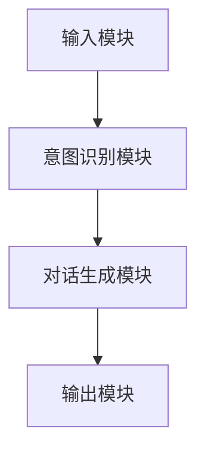
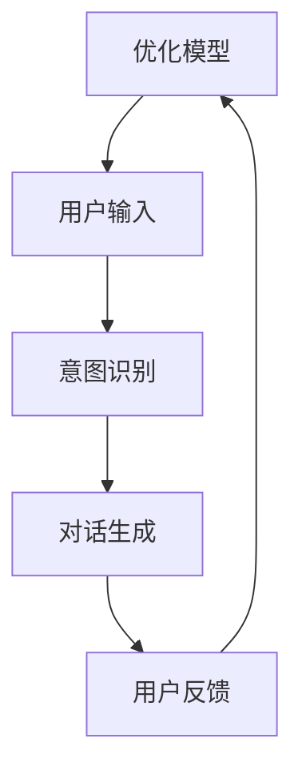
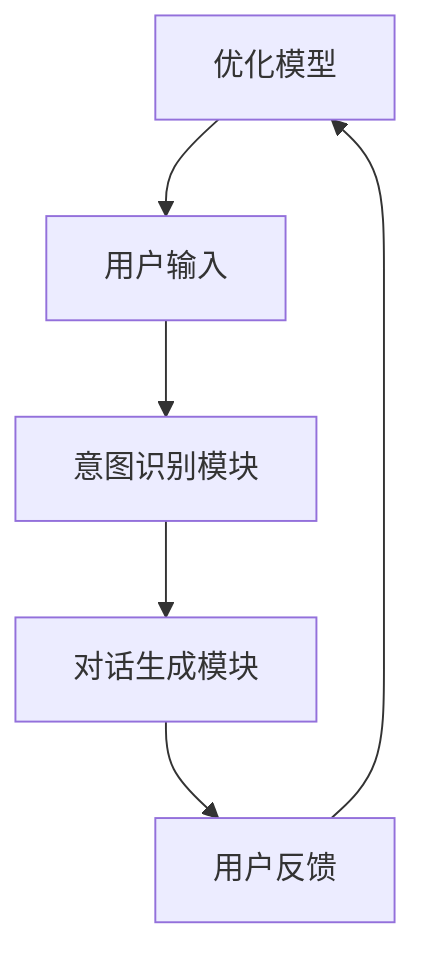
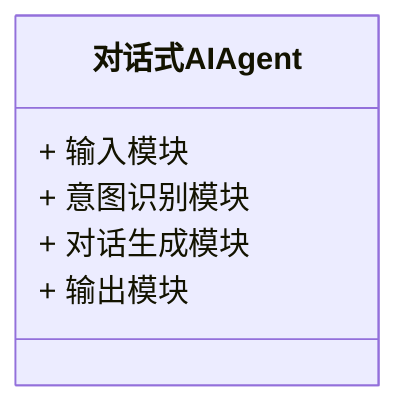
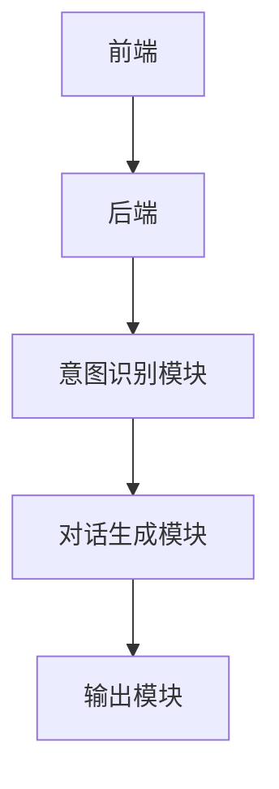
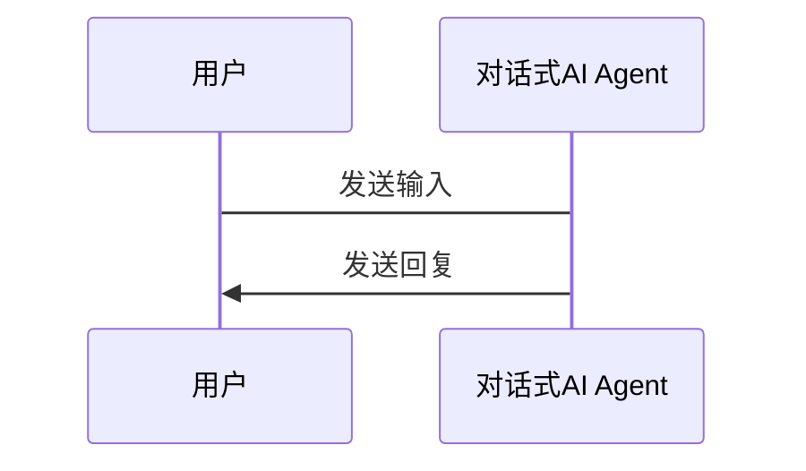

                 


# 对话式AI Agent：提升用户交互体验

## 关键词：对话式AI Agent, 人机交互, 自然语言处理, 对话生成模型, 系统架构设计, 交互体验优化

## 摘要：对话式AI Agent作为人机交互的重要形式，通过自然语言处理和对话生成模型的结合，显著提升了用户体验。本文系统地介绍了对话式AI Agent的核心概念、算法原理、系统架构设计以及实际项目实现，旨在为读者提供从理论到实践的全面指导。

---

# 第一部分：对话式AI Agent基础

## 第1章：对话式AI Agent的背景与概念

### 1.1 问题背景与问题描述

#### 1.1.1 当前人机交互的主要挑战
传统的交互方式（如按钮、菜单等）在信息量和灵活性上存在局限性，难以满足复杂场景下的用户需求。用户在使用传统交互方式时，常常需要多次操作才能完成目标，体验较差。

#### 1.1.2 对话式交互的需求与优势
随着自然语言处理技术的发展，用户希望通过对话的方式与系统交互，这不仅提高了交互的效率，还使得用户体验更加自然和便捷。对话式交互能够支持复杂场景下的多轮对话，帮助用户更高效地完成任务。

#### 1.1.3 对话式AI Agent的定义与目标
对话式AI Agent是一种能够理解用户意图、通过自然语言进行交互的智能系统。其目标是通过模拟人类对话的方式，为用户提供高效、自然的交互体验。

---

### 1.2 问题解决与边界外延

#### 1.2.1 对话式AI Agent的核心问题解决思路
对话式AI Agent需要解决的核心问题包括：
1. **意图识别**：准确理解用户的输入内容。
2. **对话生成**：基于意图生成符合语境的回复。
3. **上下文管理**：保持对话的连贯性。

#### 1.2.2 对话式交互的边界与适用场景
对话式交互适用于多种场景，如客服咨询、信息查询、任务执行等。然而，其应用也存在边界，例如在处理复杂任务或需要实时传感器数据时，可能不如传统交互方式高效。

#### 1.2.3 对话式AI Agent的外延与扩展性
对话式AI Agent可以通过集成其他技术（如视觉识别、知识图谱）进一步扩展其能力，提升用户体验。

---

### 1.3 概念结构与核心要素

#### 1.3.1 对话式AI Agent的构成要素
对话式AI Agent主要由以下要素构成：
1. **输入模块**：接收用户的自然语言输入。
2. **意图识别模块**：分析用户的输入内容，提取意图。
3. **对话生成模块**：根据意图生成回复内容。
4. **输出模块**：将生成的回复返回给用户。

#### 1.3.2 核心要素之间的关系
各要素之间的关系可以通过以下流程图表示：



#### 1.3.3 对话式AI Agent的系统架构
对话式AI Agent的系统架构可以分为前端和后端两部分：
- **前端**：负责接收用户输入并显示系统回复。
- **后端**：负责意图识别和对话生成。

---

## 第2章：对话式AI Agent的核心概念与联系

### 2.1 核心概念原理

#### 2.1.1 自然语言处理在对话式交互中的作用
自然语言处理（NLP）技术在对话式交互中用于理解用户意图、生成回复内容。

#### 2.1.2 对话生成模型的原理
对话生成模型基于预训练的语言模型，通过条件概率生成回复内容。

#### 2.1.3 对话上下文的理解与管理
对话上下文的理解与管理是对话式交互的关键，确保对话的连贯性。

---

### 2.2 核心概念属性对比表

| 概念       | 属性         | 描述                                         |
|------------|--------------|--------------------------------------------|
| 对话式AI Agent | 输入方式     | 文本/语音输入                               |
|              | 输出方式     | 文本/语音输出                               |
|              | 理解能力     | 上下文理解与意图识别                         |
|              | 学习能力     | 增量学习与自适应优化                         |

---

### 2.3 实体关系图（Mermaid流程图）



---

## 第3章：对话式AI Agent的算法原理

### 3.1 对话生成模型的算法流程

#### 3.1.1 基于规则的对话生成
基于规则的对话生成方法通过预定义的规则来生成回复内容。

#### 3.1.2 基于统计模型的对话生成
基于统计模型的对话生成方法通过统计用户输入的概率分布来生成回复内容。

#### 3.1.3 基于深度学习的对话生成
基于深度学习的对话生成方法通过预训练的语言模型生成回复内容。

---

### 3.2 算法实现代码示例

```python
def generate_response(user_input, context):
    # 意图识别
    intent = identify_intent(user_input)
    # 对话生成
    response = generate_reply(intent, context)
    return response
```

---

### 3.3 数学模型与公式

#### 3.3.1 概率模型
$$ P(word|context) = \frac{P(word, context)}{P(context)} $$

#### 3.3.2 基于Transformer的注意力机制
$$ \text{Attention}(Q,K,V) = \text{softmax}(\frac{QK^T}{\sqrt{d_k}})V $$

---

## 第4章：系统分析与架构设计

### 4.1 问题场景介绍

#### 4.1.1 对话式AI Agent的应用场景
对话式AI Agent适用于多种场景，如客服咨询、信息查询、任务执行等。

#### 4.1.2 系统功能需求分析
系统需要支持多轮对话、意图识别、上下文理解和自适应优化。

#### 4.1.3 系统架构设计



---

### 4.2 系统架构设计

#### 4.2.1 系统功能设计（领域模型）



#### 4.2.2 系统架构设计（Mermaid架构图）



#### 4.2.3 系统接口设计
系统接口包括用户输入接口和系统输出接口。

#### 4.2.4 系统交互（Mermaid序列图）



---

## 第5章：项目实战

### 5.1 环境安装

```bash
pip install transformers
pip install torch
```

### 5.2 系统核心实现源代码

```python
import torch
from transformers import AutoTokenizer, AutoModelForSeq2Seq

tokenizer = AutoTokenizer.from_pretrained("facebook/bart-large")
model = AutoModelForSeq2Seq.from_pretrained("facebook/bart-large")

def generate_response(user_input):
    inputs = tokenizer(user_input, return_tensors="pt")
    outputs = model.generate(inputs.input_ids, max_length=50)
    response = tokenizer.decode(outputs[0], skip_special_tokens=True)
    return response
```

---

### 5.3 代码应用解读与分析

#### 5.3.1 代码实现细节
代码基于预训练的语言模型生成回复内容。

#### 5.3.2 代码运行结果
运行代码后，系统会根据用户输入生成相应的回复内容。

#### 5.3.3 代码案例分析
通过具体案例分析，展示对话式AI Agent在实际场景中的应用。

---

## 第6章：总结与展望

### 6.1 最佳实践tips
- 定期优化模型以提升对话质量。
- 提供多语言支持以扩大应用范围。

### 6.2 小结
对话式AI Agent通过自然语言处理和对话生成模型的结合，显著提升了用户体验。

### 6.3 注意事项
在实际应用中，需注意数据隐私和模型的可解释性问题。

### 6.4 拓展阅读
推荐读者进一步阅读关于对话式AI Agent的前沿研究和实际应用案例。

---

# 结语

通过本文的系统介绍，读者可以全面了解对话式AI Agent的核心概念、算法原理、系统架构设计以及实际项目实现。对话式AI Agent作为人机交互的重要形式，未来将在更多领域发挥重要作用。

