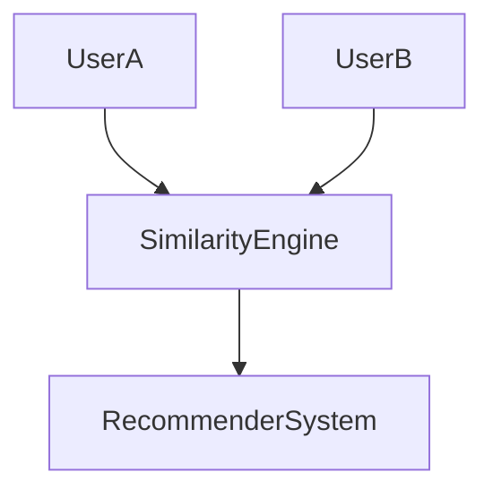
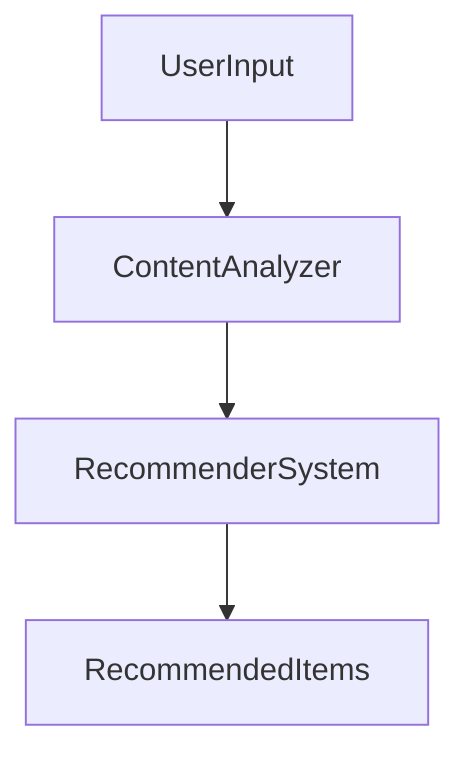
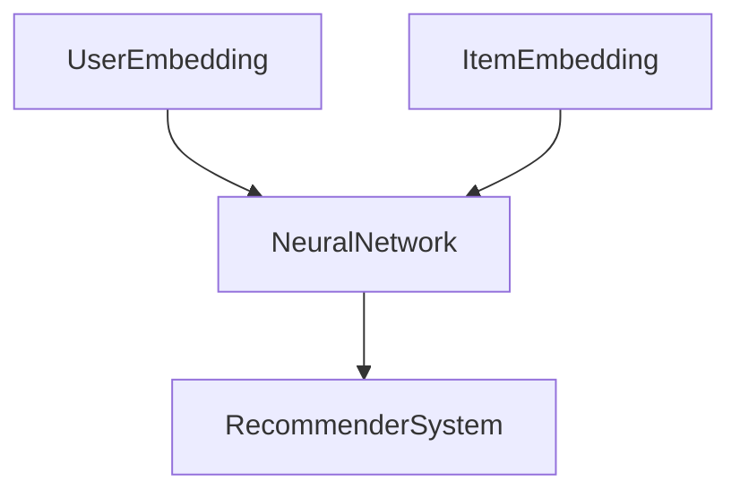
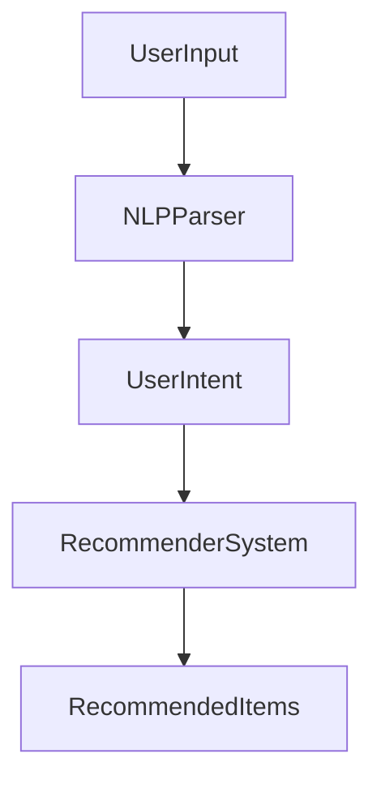
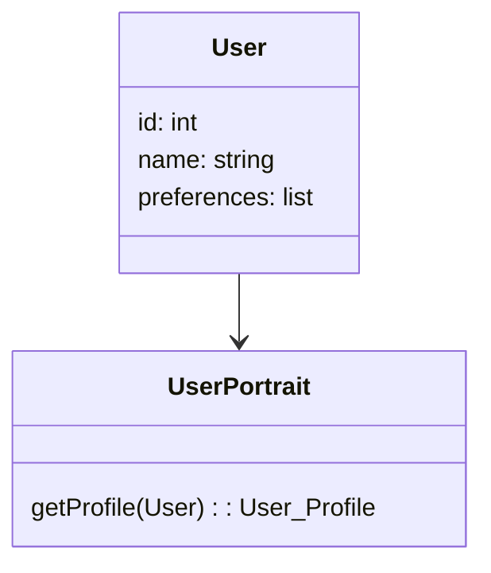
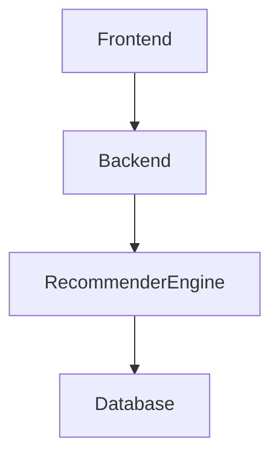

                 


# 对话式推荐：个性化AI Agent的建议

## 关键词：对话式推荐，个性化AI Agent，协同过滤，深度学习，推荐系统，自然语言处理

## 摘要：对话式推荐是一种结合了自然语言处理和推荐系统的新兴技术，旨在通过与用户的对话交互提供个性化的推荐服务。本文将从对话式推荐的背景、核心概念、算法原理、系统架构到项目实战，全面分析个性化AI Agent的设计与实现，探讨其在实际应用中的优缺点及未来发展方向。

---

## 第1章：对话式推荐的背景与问题背景

### 1.1 对话式推荐的背景

对话式推荐是一种基于自然语言处理（NLP）和推荐系统结合的技术，通过与用户进行对话交互，理解用户需求并实时生成个性化推荐内容。传统推荐系统通常基于用户的点击、浏览或购买行为，而对话式推荐则通过实时对话获取更精准的用户意图，从而提供更个性化的服务。

#### 1.1.1 从传统推荐到对话式推荐的演进

传统推荐系统通常基于协同过滤、基于内容的推荐或混合推荐方法。然而，这些方法难以实时捕捉用户的动态需求，也无法通过交互式的方式与用户进行反馈。随着NLP和深度学习技术的发展，对话式推荐逐渐成为可能，通过实时对话理解用户需求，动态调整推荐策略。

#### 1.1.2 对话式推荐的定义与特点

对话式推荐是一种动态、交互式的推荐方式，通过与用户进行多轮对话，实时理解用户需求并生成推荐内容。其特点包括：

1. **实时性**：通过对话实时获取用户反馈，动态调整推荐结果。
2. **个性化**：基于对话内容精准匹配用户需求。
3. **交互性**：通过多轮对话优化推荐结果。

#### 1.1.3 对话式推荐的核心问题与目标

对话式推荐的核心问题在于如何通过对话获取用户的实时需求，并将其转化为推荐系统的输入。目标是通过对话交互，提供更精准、更个性化的推荐服务。

---

### 1.2 个性化AI Agent的定义与特点

个性化AI Agent是一种能够根据用户需求和行为提供个性化服务的智能代理。它结合了NLP、机器学习和推荐系统，能够通过对话与用户交互，理解用户需求并提供相应的服务。

#### 1.2.1 AI Agent的基本概念

AI Agent是一种智能代理，能够感知环境、理解用户需求，并通过执行任务或提供服务来满足用户需求。个性化AI Agent则进一步结合了用户的个性化特征，提供定制化服务。

#### 1.2.2 个性化AI Agent的核心特征

个性化AI Agent的核心特征包括：

1. **个性化**：根据用户特征和行为提供定制化服务。
2. **实时性**：能够实时感知用户需求并做出响应。
3. **智能性**：通过学习和推理优化服务。

#### 1.2.3 对话式推荐在AI Agent中的作用

对话式推荐是个性化AI Agent的重要组成部分，通过对话交互理解用户需求并生成推荐内容，帮助AI Agent更好地满足用户需求。

---

### 1.3 对话式推荐与个性化AI Agent的关系

对话式推荐是个性化AI Agent实现个性化服务的核心技术之一。通过对话式推荐，AI Agent能够实时理解用户需求并动态调整推荐策略。

---

## 第2章：对话式推荐的核心概念与联系

### 2.1 对话式推荐的核心概念

对话式推荐的核心概念包括用户、内容和对话。用户是推荐的目标，内容是推荐的对象，对话是推荐的交互方式。

#### 2.1.1 对话式推荐的三要素：用户、内容、对话

1. **用户**：推荐的目标，具有个性化特征。
2. **内容**：推荐的对象，可以是商品、服务、文章等。
3. **对话**：推荐的交互方式，通过对话理解用户需求。

#### 2.1.2 个性化推荐的数学模型

个性化推荐通常基于用户特征和内容特征，通过数学模型计算用户对内容的偏好。常见的模型包括协同过滤、基于内容的推荐和混合推荐。

#### 2.1.3 对话式推荐的流程与阶段

对话式推荐的流程通常包括用户输入、意图解析、推荐生成和结果反馈。

---

### 2.2 对话式推荐与个性化AI Agent的关系

对话式推荐通过实时对话理解用户需求，个性化AI Agent基于用户需求提供定制化服务。两者结合能够实现更精准的个性化推荐。

---

### 2.3 对话式推荐的核心要素对比

#### 2.3.1 对比表格：传统推荐 vs 对话式推荐

| 特性             | 传统推荐                  | 对话式推荐                  |
|------------------|--------------------------|-----------------------------|
| 交互方式         | 单向推荐                  | 实时对话                   |
| 用户反馈         | 离线反馈                  | 实时反馈                   |
| 精准度           | 较低                     | 较高                       |

#### 2.3.2 对比表格：个性化AI Agent vs 传统推荐系统

| 特性             | 个性化AI Agent          | 传统推荐系统                |
|------------------|-------------------------|-----------------------------|
| 个性化能力       | 强                     | 弱                         |
| 交互方式         | 对话式                  | 单向                      |
| 智能性           | 高                     | 低                         |

---

## 第3章：对话式推荐的算法原理

### 3.1 对话式推荐的核心算法

对话式推荐的算法包括协同过滤、基于内容的推荐和深度学习模型。

#### 3.1.1 基于协同过滤的推荐算法

协同过滤是一种基于用户行为相似性推荐的算法。其核心思想是，如果用户A和用户B的行为相似，那么用户A可能喜欢用户B喜欢的内容。

##### 协同过滤的数学模型

$$ 相似度 = \frac{\sum_{i=1}^{n} (r_{u,i} - \bar{r}_u)(r_{v,i} - \bar{r}_v)}{\sqrt{\sum_{i=1}^{n} (r_{u,i} - \bar{r}_u)^2} \cdot \sqrt{\sum_{i=1}^{n} (r_{v,i} - \bar{r}_v)^2}} } $$

其中，$r_{u,i}$ 表示用户u对物品i的评分，$\bar{r}_u$ 表示用户u的平均评分。

##### 协同过滤的mermaid流程图



---

#### 3.1.2 基于内容的推荐算法

基于内容的推荐算法通过分析物品的内容特征，推荐与用户偏好相似的内容。

##### 基于内容的推荐流程图



---

#### 3.1.3 基于深度学习的推荐算法

深度学习模型（如神经网络）可以捕捉用户和物品的高维特征，推荐效果更优。

##### 基于神经网络的推荐流程图



---

### 3.2 对话式推荐的流程图



---

## 第4章：对话式推荐的系统架构设计

### 4.1 对话式推荐的系统功能设计

对话式推荐系统通常包括用户画像、对话管理、推荐引擎和反馈优化模块。

#### 4.1.1 用户画像模块

用户画像模块用于分析用户的特征和行为，构建用户画像。

##### 用户画像的mermaid类图



---

### 4.2 对话式推荐的系统架构

对话式推荐系统的架构通常包括前端、后端和推荐引擎。

#### 4.2.1 系统架构的mermaid图



---

## 第5章：对话式推荐的项目实战

### 5.1 电商推荐系统的实现

#### 5.1.1 环境配置

需要安装Python、TensorFlow、Keras等库。

#### 5.1.2 系统实现

实现一个基于协同过滤的推荐系统。

##### Python代码示例

```python
def user_based_recommendation(user_id, similarity_matrix):
    similar_users = similarity_matrix[user_id]
    top_users = similar_users.argsort()[-5:][::-1]
    recommended_items = []
    for user in top_users:
        recommended_items.extend(users[user].items)
    return recommended_items
```

---

## 第6章：对话式推荐的最佳实践与总结

### 6.1 对话式推荐的优缺点

优点：精准、实时；缺点：计算资源需求高。

### 6.2 实际应用中的挑战

数据隐私和计算资源需求。

### 6.3 对话式推荐的实用建议

数据预处理和模型调优。

---

## 总结

对话式推荐是一种结合了NLP和推荐系统的技术，通过对话交互提供个性化推荐服务。本文详细分析了对话式推荐的背景、核心概念、算法原理、系统架构和项目实战，探讨了其在实际应用中的优缺点及未来发展方向。

--- 

**本文使用了多个mermaid图表和数学公式，详细展示了对话式推荐的实现过程和系统架构。通过实际案例分析，深入探讨了对话式推荐在个性化AI Agent中的应用。**

