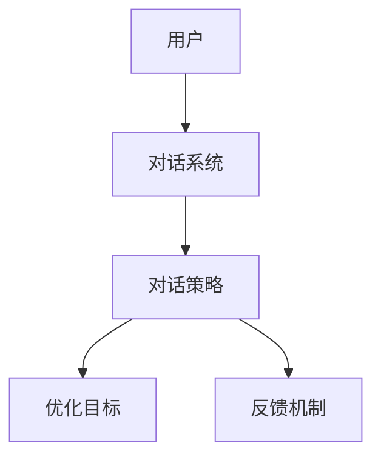
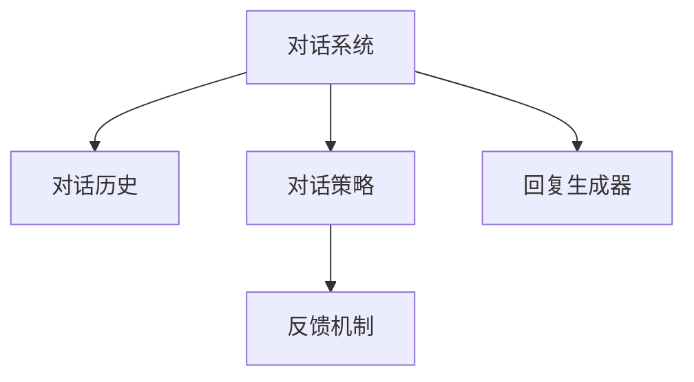
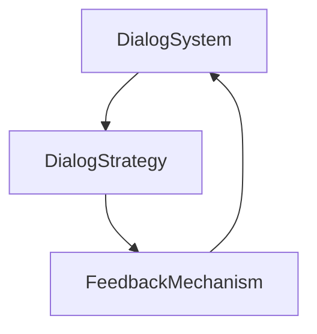
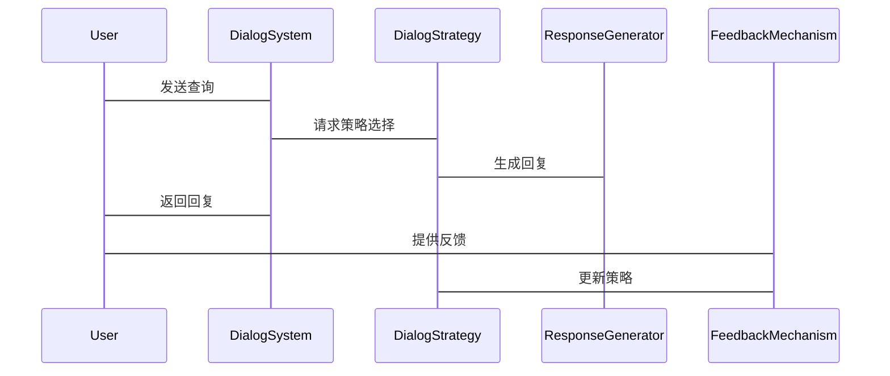
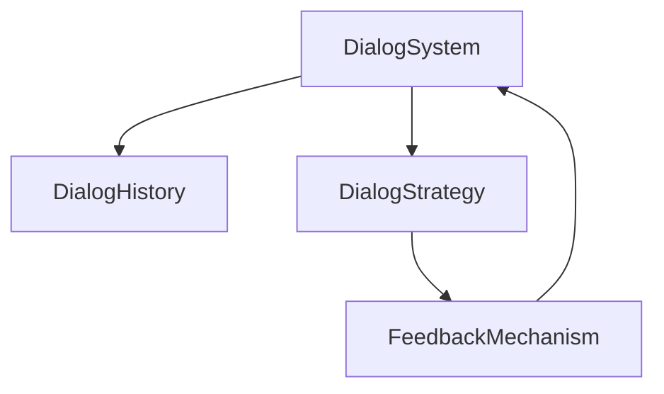

                 


# 对话策略优化：提升AI Agent的交互质量

> 关键词：对话策略优化、AI Agent、自然语言处理、强化学习、监督学习、系统架构

> 摘要：对话策略优化是提升AI Agent交互质量的关键技术。本文从背景、核心概念、算法原理、系统架构到实战应用，全面解析对话策略优化的实现方法，帮助读者掌握如何设计和优化高效的对话系统。

---

# 第1章: 对话策略优化的背景与问题背景

## 1.1 对话策略优化的背景

### 1.1.1 人工智能与自然语言处理的发展
人工智能（AI）和自然语言处理（NLP）的快速发展，使得对话系统成为人机交互的核心技术。随着深度学习的兴起，对话系统从简单的关键词匹配逐渐演变为基于上下文理解和生成的复杂系统。

### 1.1.2 对话系统在AI Agent中的重要性
AI Agent需要通过对话与用户进行交互，理解用户需求并提供有效服务。对话策略优化直接影响用户体验，决定了AI Agent的实用性。

### 1.1.3 对话策略优化的定义与目标
对话策略优化是对AI Agent在对话过程中选择适当回复的策略进行改进，目标是提升对话的流畅性、准确性和用户体验。

## 1.2 问题背景与问题描述

### 1.2.1 当前对话系统的挑战
- 对话系统的理解能力有限，难以应对复杂语义。
- 对话策略的选择不够灵活，无法适应多变的对话场景。
- 对话过程中的反馈机制不完善，难以持续优化。

### 1.2.2 对话策略优化的核心问题
- 如何在对话过程中动态调整策略，以满足用户需求。
- 如何利用上下文信息，选择最优的回复策略。
- 如何通过反馈机制不断优化对话策略。

### 1.2.3 对话策略优化的边界与外延
对话策略优化不仅关注回复内容，还包括对话流程的规划、多轮对话的协调以及与用户意图的匹配。

## 1.3 问题解决与优化目标

### 1.3.1 对话策略优化的解决思路
- 建立对话模型，理解用户意图。
- 设计策略选择算法，优化回复内容。
- 引入反馈机制，持续改进对话策略。

### 1.3.2 对话质量提升的关键因素
- 上下文理解能力。
- 策略选择的多样性。
- 反馈机制的有效性。

### 1.3.3 对话策略优化的长期与短期目标
- 长期目标：实现自然流畅的对话交互。
- 短期目标：提高对话系统的准确性和响应速度。

## 1.4 对话策略优化的核心要素

### 1.4.1 对话上下文的理解
- 分析对话历史，提取关键信息。
- 理解用户的意图和情感倾向。

### 1.4.2 对话目标的设定
- 明确对话任务。
- 设定对话目标优先级。

### 1.4.3 对话策略的执行与反馈
- 根据策略生成回复。
- 收集用户反馈，调整策略。

## 1.5 本章小结
本章介绍了对话策略优化的背景、问题背景、解决思路以及核心要素，为后续章节奠定了基础。

---

# 第2章: 对话策略优化的核心概念与联系

## 2.1 对话策略优化的核心原理

### 2.1.1 对话策略的基本概念
对话策略是指在对话过程中，AI Agent根据当前对话状态选择最优回复的规则和方法。

### 2.1.2 对话策略优化的数学模型
对话策略优化可以通过概率模型或强化学习模型来实现。例如，基于马尔可夫决策过程（MDP）的强化学习模型。

### 2.1.3 对话策略优化的算法框架
- 基于强化学习的策略优化。
- 基于监督学习的策略优化。

## 2.2 对话策略优化的核心属性对比

### 2.2.1 不同优化策略的对比分析
| 策略类型       | 基于强化学习 | 基于监督学习 |
|----------------|--------------|--------------|
| 输入数据       | 对话历史     | 标签数据     |
| 模型目标       | 最大化奖励    | 分类准确性    |
| 训练方式       | 强化学习      | 监督学习      |

### 2.2.2 对话策略优化的性能指标
- 回复准确率。
- 对话流畅度。
- 用户满意度。

### 2.2.3 对话策略优化的评估方法
- 基于人工评估。
- 基于自动评估指标（如BLEU、ROUGE）。

## 2.3 对话策略优化的ER实体关系图


## 2.4 本章小结
本章通过对比分析和实体关系图，明确了对话策略优化的核心概念和关键联系。

---

# 第3章: 对话策略优化的算法原理

## 3.1 对话策略优化的算法框架

### 3.1.1 基于强化学习的对话策略优化
- 强化学习的基本原理：通过与环境交互，学习最优策略。
- 对话策略优化的强化学习框架：
  - 状态（State）：对话历史和当前对话内容。
  - 行动（Action）：选择回复内容。
  - 奖励（Reward）：用户反馈或对话质量评分。

### 3.1.2 基于监督学习的对话策略优化
- 监督学习的基本原理：通过大量标注数据训练模型。
- 对话策略优化的监督学习框架：
  - 输入：对话历史和当前输入。
  - 输出：最佳回复。

### 3.1.3 混合策略优化方法
结合强化学习和监督学习的优点，动态调整策略选择。

## 3.2 强化学习算法的对话策略优化

### 3.2.1 强化学习的基本原理
- 状态、行动、奖励的定义。
- 策略函数：$\pi(a|s)$ 表示在状态$s$下选择行动$a$的概率。

### 3.2.2 对话策略优化的强化学习框架
- 使用策略梯度方法，优化策略函数。

### 3.2.3 基于策略梯度的对话策略优化
- 策略梯度公式：
  $$ \nabla J = \mathbb{E}_{\tau \sim \pi} [\nabla \log \pi(a|s) \cdot Q(s,a)] $$

## 3.3 监督学习算法的对话策略优化

### 3.3.1 监督学习的基本原理
- 通过大量标注数据训练分类器。

### 3.3.2 对话策略优化的监督学习框架
- 使用预训练的对话数据进行监督训练。

## 3.4 对话策略优化的数学模型

### 3.4.1 对话策略优化的目标函数
$$ J = \mathbb{E}_{\tau \sim \pi} [R(\tau)] $$

### 3.4.2 对话策略优化的梯度计算
$$ \nabla J = \mathbb{E}_{\tau \sim \pi} [\nabla \log \pi(a|s) \cdot Q(s,a)] $$

## 3.5 本章小结
本章详细介绍了对话策略优化的算法原理，包括强化学习和监督学习的实现方法。

---

# 第4章: 对话策略优化的系统分析与架构设计

## 4.1 对话策略优化的系统分析

### 4.1.1 对话系统的设计目标
- 提供高效的对话服务。
- 支持多轮对话和上下文理解。

### 4.1.2 系统功能设计
- 对话历史记录与分析。
- 多轮对话管理。
- 回复内容生成与优化。

### 4.1.3 系统架构设计


## 4.2 对话策略优化的系统架构设计

### 4.2.1 项目介绍
- 系统名称：智能对话优化系统。
- 功能模块：对话历史分析、策略选择、反馈优化。

### 4.2.2 系统功能设计
- 领域模型：
  ```mermaid
  classDiagram
      class DialogSystem {
          string dialogHistory;
          string currentUtterance;
          string response;
      }
      class DialogStrategy {
          void selectResponse(DialogSystem ds);
      }
      class FeedbackMechanism {
          void updateStrategy(DialogStrategy ds);
      }
  ```

### 4.2.3 系统架构设计


### 4.2.4 系统接口设计
- 输入接口：用户输入、对话历史。
- 输出接口：系统回复、反馈信息。

### 4.2.5 系统交互流程


## 4.3 本章小结
本章通过系统分析与架构设计，明确了对话策略优化的实现框架。

---

# 第5章: 对话策略优化的项目实战

## 5.1 项目环境安装与配置

### 5.1.1 安装Python环境
- 安装Python 3.8以上版本。
- 安装必要的库：numpy、pandas、scikit-learn、tensorflow。

### 5.1.2 安装对话系统框架
- 使用开源框架：Rasa、Dialogflow。

## 5.2 对话策略优化的核心实现

### 5.2.1 强化学习策略实现
- 使用策略梯度方法训练对话策略模型。
- 代码示例：
  ```python
  import numpy as np
  from tensorflow import keras

  def policy_gradient_model(input_dim, output_dim):
      model = keras.Sequential([
          keras.layers.Dense(64, activation='relu', input_shape=(input_dim,)),
          keras.layers.Dense(output_dim, activation='softmax')
      ])
      return model
  ```

### 5.2.2 监督学习策略实现
- 使用预训练数据训练分类器。
- 代码示例：
  ```python
  from sklearn.ensemble import RandomForestClassifier

  def train_supervised_model(X, y):
      model = RandomForestClassifier()
      model.fit(X, y)
      return model
  ```

## 5.3 项目实战应用与案例分析

### 5.3.1 案例分析
- 案例背景：用户查询酒店信息。
- 对话策略优化的过程：
  1. 理解用户需求。
  2. 选择最优回复。
  3. 收集用户反馈。
  4. 调整对话策略。

### 5.3.2 实际案例分析
- 对比优化前后的对话质量。

## 5.4 本章小结
本章通过实战项目，详细讲解了对话策略优化的实现过程。

---

# 第6章: 对话策略优化的最佳实践与小结

## 6.1 对话策略优化的最佳实践

### 6.1.1 对话策略优化的关键点
- 理解上下文。
- 设定明确的目标。
- 引入反馈机制。

### 6.1.2 对话策略优化的注意事项
- 数据质量：确保训练数据的多样性和代表性。
- 系统性能：优化算法效率，减少响应时间。

### 6.1.3 对话策略优化的常见误区
- 过度依赖算法，忽视业务需求。
- 忽略用户反馈，无法持续优化。

## 6.2 本章小结
总结对话策略优化的核心内容，强调最佳实践的重要性。

---

# 附录

## 附录A: 优化算法的数学公式总结

- 强化学习策略梯度：
  $$ \nabla J = \mathbb{E}_{\tau \sim \pi} [\nabla \log \pi(a|s) \cdot Q(s,a)] $$

- 监督学习损失函数：
  $$ L = -\sum y_i \log p(y_i|x_i) - (1-y_i)\log(1-p(y_i|x_i)) $$

## 附录B: 系统架构图


---

# 结语

对话策略优化是提升AI Agent交互质量的核心技术。通过本文的详细讲解，读者可以掌握对话策略优化的背景、核心概念、算法原理、系统架构和实战应用。希望本文能为相关领域的研究和实践提供有价值的参考。

--- 

关键词：对话策略优化、AI Agent、自然语言处理、强化学习、监督学习、系统架构

摘要：对话策略优化是提升AI Agent交互质量的关键技术。本文从背景、核心概念、算法原理、系统架构到实战应用，全面解析对话策略优化的实现方法，帮助读者掌握如何设计和优化高效的对话系统。

