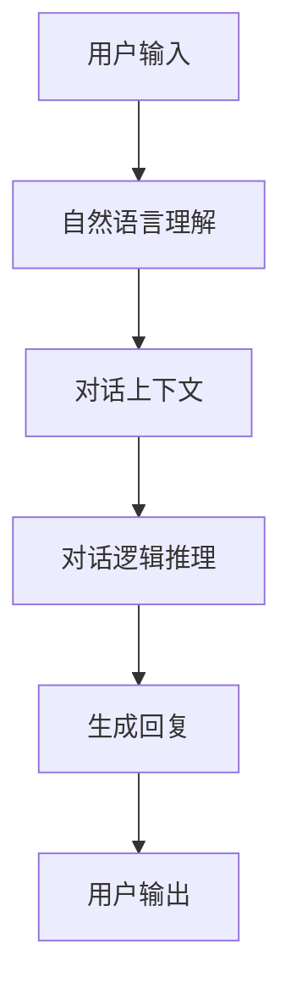
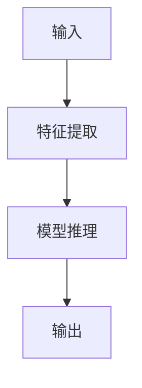
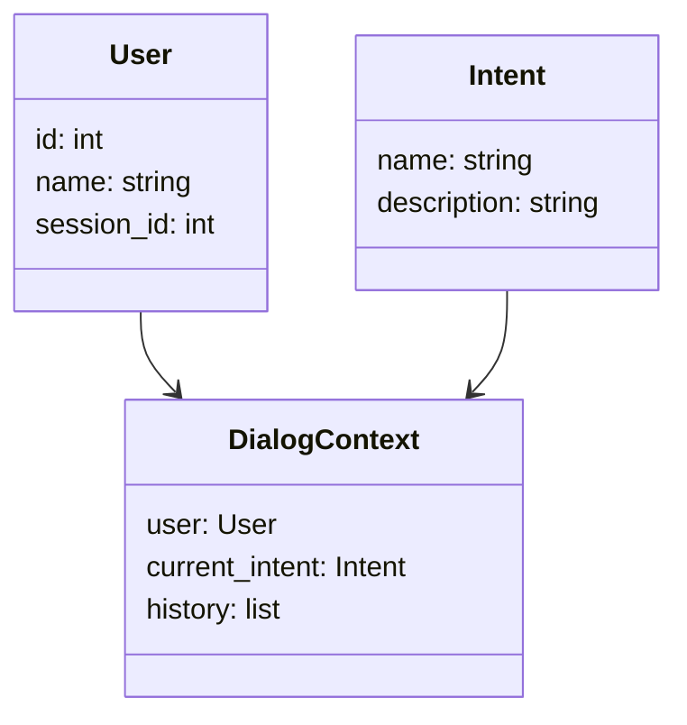
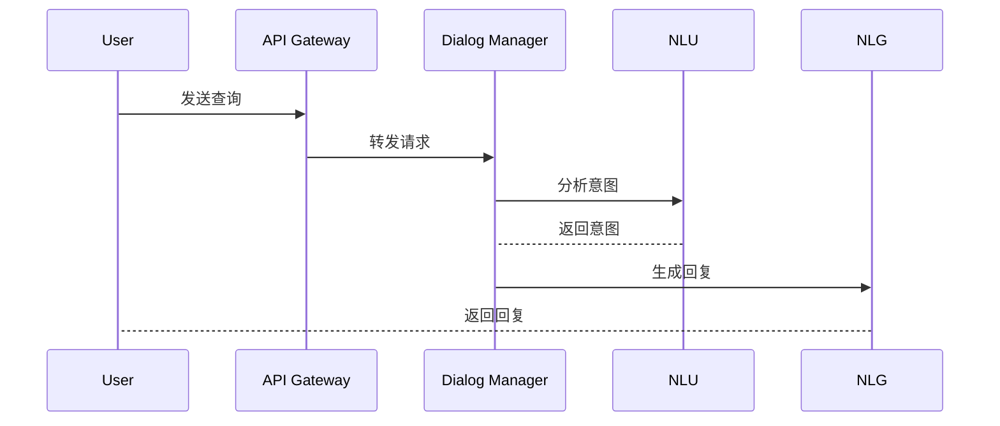

                 


# 对话管理系统：构建流畅自然的人机交互

> 关键词：对话管理、人机交互、自然语言处理、系统架构、算法原理

> 摘要：对话管理系统是实现人机交互流畅自然的核心技术，本文从背景、核心概念、算法原理、系统架构到项目实战，全面解析对话管理系统的构建过程。通过详细分析对话管理系统的数学模型、算法流程、系统设计和实际案例，帮助读者掌握构建高效对话管理系统的知识和技能。

---

## 第一部分：对话管理系统的背景与核心概念

### 第1章：对话管理系统的背景与问题背景

#### 1.1 问题背景

##### 1.1.1 人机交互的发展历程

人机交互经历了从简单命令行到图形界面，再到自然语言交互的演变。早期的交互方式依赖于固定的命令或按钮点击，用户体验受限。随着自然语言处理（NLP）和机器学习技术的进步，对话系统逐渐成为人机交互的重要形式。

##### 1.1.2 当前对话系统面临的挑战

- **语境理解不足**：对话系统需要处理多轮对话，依赖上下文信息，但现有系统在复杂场景下的理解能力有限。
- **用户意图识别困难**：用户的表达多样，系统需要准确识别意图。
- **对话流管理复杂**：多轮对话中的逻辑推理和决策需要复杂的算法支持。

##### 1.1.3 对话管理系统的必要性

对话管理系统通过整合自然语言处理、机器学习和对话逻辑推理技术，实现流畅自然的人机交互，提升用户体验，广泛应用于智能客服、智能助手等领域。

#### 1.2 问题描述

##### 1.2.1 对话系统的定义与目标

对话系统是通过自然语言与用户进行交互的系统，目标是实现高效、自然、智能的对话体验。

##### 1.2.2 用户需求与系统响应的关系

用户需求多样，系统需要准确理解并生成符合期望的响应，这需要对话管理系统在理解、推理和生成三个环节中协调工作。

##### 1.2.3 对话系统的边界与外延

对话系统的边界包括输入输出接口、上下文管理、对话策略，外延涉及用户画像、知识库等外部资源。

---

### 第2章：对话管理系统的概念与核心要素

#### 2.1 对话管理的核心概念

##### 2.1.1 多轮对话的定义与特点

多轮对话是用户与系统之间通过多条信息交互完成任务的对话形式，具有连续性、依赖性和灵活性。

##### 2.1.2 自然语言理解与生成的结合

对话系统需要结合NLU（自然语言理解）和NLG（自然语言生成）技术，准确理解用户意图并生成自然的回复。

##### 2.1.3 对话上下文的管理与维护

对话上下文包括历史对话记录、用户状态等信息，是对话系统理解和生成回复的基础。

#### 2.2 核心概念的属性特征对比

##### 2.2.1 对比表格展示

| 概念 | 特性 | 示例 |
|------|------|------|
| 多轮对话 | 连续性、依赖性 | 用户：我需要订票；系统：请问您是单程还是往返？ |
| NLU | 理解准确性 | 系统识别用户的查询意图 |
| NLG | 表达自然性 | 系统生成自然的回复 |

##### 2.2.2 Mermaid流程图展示核心概念之间的关系



---

## 第二部分：对话管理系统的算法原理

### 第3章：对话管理系统的算法基础

#### 3.1 基于规则的对话管理

##### 3.1.1 规则驱动的对话流程

基于规则的对话管理依赖预定义的规则和流程，适用于特定场景，如简单的FAQ回答。

##### 3.1.2 规则的编写与维护

规则编写涉及状态转移和条件判断，但维护成本较高，难以应对复杂场景。

##### 3.1.3 规则系统的优缺点分析

优点：简单易懂，维护成本低；缺点：灵活性差，难以应对复杂对话。

#### 3.2 基于机器学习的对话管理

##### 3.2.1 基于决策树的对话管理

决策树通过树状结构进行分类，适用于规则明确的对话场景。

##### 3.2.2 基于神经网络的对话管理

神经网络通过深度学习模型捕捉对话中的语义信息，适用于复杂场景。

##### 3.2.3 算法流程图展示



---

### 第4章：对话系统的数学模型与公式

#### 4.1 对话管理中的概率模型

##### 4.1.1 贝叶斯定理在对话管理中的应用

贝叶斯定理用于计算条件概率，帮助系统判断用户意图。

##### 4.1.2 马尔可夫链在对话流程中的应用

马尔可夫链描述对话状态的转移过程。

##### 4.1.3 示例代码实现

```python
import numpy as np

# 示例：贝叶斯定理计算条件概率
def bayes_theorem(likelihood, prior):
    return likelihood * prior / np.sum(likelihood * prior)
```

#### 4.2 对话系统的损失函数与优化

##### 4.2.1 常见损失函数的定义与应用

- **交叉熵损失**：衡量预测值与真实值的差异。
- **均方误差**：适用于数值预测任务。

##### 4.2.2 优化算法的选择与实现

常用优化算法包括随机梯度下降（SGD）和Adam优化。

##### 4.2.3 示例代码实现

```python
import tensorflow as tf

# 示例：交叉熵损失函数
loss = tf.keras.losses.sparse_categorical_crossentropy(y_true, y_pred)
```

---

## 第三部分：对话管理系统的系统架构与设计

### 第5章：对话管理系统的系统架构

#### 5.1 问题场景介绍

系统需要处理多轮对话，理解用户意图，并生成自然的回复。

#### 5.2 项目介绍

构建一个智能客服对话系统，支持用户咨询和问题解答。

#### 5.3 系统功能设计

##### 5.3.1 领域模型（Mermaid类图）



##### 5.3.2 系统架构设计（Mermaid架构图）


##### 5.3.3 系统接口设计

- **API接口**：RESTful API，提供对话上下文和用户信息。
- **交互流程**：用户输入→API Gateway→Dialog Manager→生成回复→返回用户。

##### 5.3.4 系统交互（Mermaid序列图）



---

## 第四部分：项目实战

### 第6章：对话管理系统的项目实战

#### 6.1 环境安装

安装必要的依赖：

```bash
pip install numpy tensorflow keras transformers
```

#### 6.2 系统核心实现源代码

##### 6.2.1 对话管理器实现

```python
class DialogManager:
    def __init__(self):
        self.context = {}
    
    def process_request(self, user_input):
        # 分析意图
        intent = self.nlu.predict(user_input)
        # 更新上下文
        self.context['intent'] = intent
        # 生成回复
        response = self.nlg.generate_response(intent)
        return response
```

##### 6.2.2 NLU实现

```python
class NLU:
    def predict(self, text):
        # 示例：简单的关键词匹配
        keywords = ['help', 'issue', 'problem']
        for keyword in keywords:
            if keyword in text.lower():
                return 'problem'
        return 'unknown'
```

##### 6.2.3 NLG实现

```python
class NLG:
    def generate_response(self, intent):
        responses = {
            'problem': ['I’m sorry for the issue. Let me help you solve it.', 
                        'What specific problem are you facing?']
        }
        return np.random.choice(responses[intent])
```

#### 6.3 代码应用解读与分析

- 对话管理器协调NLU和NLG，处理用户输入并生成回复。
- NLU模块负责意图识别，NLG模块负责生成回复。

#### 6.4 实际案例分析

**案例1**：用户输入“我遇到了问题”，系统识别意图并生成回复。

**案例2**：用户输入“你能帮我什么？”，系统生成欢迎信息。

#### 6.5 项目小结

通过代码实现对话管理器，展示了对话系统的核心功能，为实际应用提供了参考。

---

## 第五部分：最佳实践

### 第7章：对话管理系统的最佳实践

#### 7.1 小结

对话管理系统需要结合NLU、NLG和对话逻辑推理技术，实现流畅自然的交互。

#### 7.2 注意事项

- **数据质量**：对话训练数据需多样化，涵盖不同场景。
- **模型优化**：持续优化NLU和NLG模型，提升准确性和自然性。
- **性能优化**：优化对话流程，减少响应延迟。

#### 7.3 拓展阅读

- 《深度学习入门：基于Python的数学与实现》
- 《自然语言处理实战：基于Python的机器学习与深度学习》

---

通过本文的详细分析和实战，读者可以全面理解对话管理系统的构建过程，掌握从背景分析到系统实现的全过程，为实际应用打下坚实基础。

