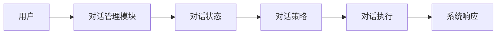
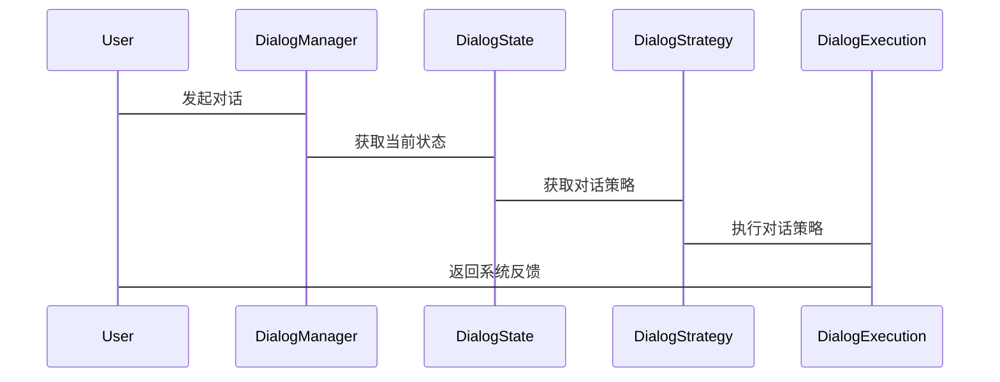

                 


# 对话管理：设计流畅的人机交互体验

## 关键词：对话管理，人机交互，自然语言处理，任务建模，对话状态，对话策略

## 摘要：  
对话管理是人机交互领域的重要组成部分，旨在通过设计流畅的对话流程，优化用户体验。本文将从对话管理的背景、核心概念、算法实现、系统架构到项目实战，全面解析对话管理的各个方面，帮助读者从理论到实践，掌握设计流畅对话体验的关键技术。

---

## 第一部分: 对话管理基础

### 第1章: 对话管理的背景与概念

#### 1.1 对话管理的定义与背景
- **1.1.1 人机交互的发展历程**  
  从命令行界面到图形界面，再到自然语言交互，人机交互技术不断演进。对话管理作为自然语言交互的核心技术，成为实现流畅人机对话的关键。

- **1.1.2 对话管理的定义与特点**  
  对话管理是对对话流程进行规划和控制的过程，其特点包括：目标驱动、状态跟踪、动态调整。

- **1.1.3 对话管理的应用场景**  
  包括智能客服、智能助手、智能音箱、聊天机器人等。

#### 1.2 对话管理的核心问题
- **1.2.1 用户需求的识别与建模**  
  用户需求可以通过意图识别、实体识别等技术提取，并通过任务建模表示为对话目标。

- **1.2.2 对话状态的跟踪与更新**  
  对话状态反映了对话的进展，包括当前任务、用户输入、系统反馈等信息。

- **1.2.3 对话策略的制定与执行**  
  对话策略是指导对话流程的规则，包括基于规则的策略和基于模型的策略。

#### 1.3 对话管理的边界与外延
- **1.3.1 对话管理的边界**  
  对话管理的边界包括输入处理、输出生成和对话控制三部分。

- **1.3.2 相关领域的区别与联系**  
  对话管理与自然语言处理、语音识别、用户界面设计等领域的区别与联系。

- **1.3.3 对话管理的未来发展趋势**  
  包括多轮对话优化、情感计算集成、个性化对话设计等。

#### 1.4 对话管理的核心要素
- **1.4.1 对话流程**  
  包括用户输入、系统理解、对话规划、系统生成、用户反馈等环节。

- **1.4.2 对话状态**  
  对话状态包括当前任务、用户输入、系统反馈等信息。

- **1.4.3 对话策略**  
  对话策略是指导对话流程的规则，包括基于规则的策略和基于模型的策略。

#### 1.5 本章小结
本章从对话管理的背景、核心问题、边界与外延、核心要素四个方面，全面介绍了对话管理的基本概念和理论基础。

---

## 第二部分: 对话管理的核心概念与技术

### 第2章: 对话管理的核心概念

#### 2.1 对话任务建模
- **2.1.1 任务建模的基本概念**  
  对话任务建模是将用户需求转化为具体任务的过程。

- **2.1.2 基于意图的对话任务建模**  
  通过意图识别技术，将用户输入转化为具体意图。

- **2.1.3 基于状态的对话任务建模**  
  通过状态机模型，将对话流程表示为状态转移的过程。

#### 2.2 对话状态管理
- **2.2.1 对话状态的表示方法**  
  包括基于变量的表示法和基于上下文的表示法。

- **2.2.2 对话状态的更新机制**  
  包括基于规则的更新和基于模型的更新。

- **2.2.3 对话状态的管理策略**  
  包括最小化更新和最大化更新两种策略。

#### 2.3 对话策略与执行
- **2.3.1 对话策略的制定原则**  
  包括简洁性、可扩展性、可解释性。

- **2.3.2 基于规则的对话策略**  
  通过预定义规则实现对话流程的控制。

- **2.3.3 基于模型的对话策略**  
  通过机器学习模型实现对话策略的自动生成。

#### 2.4 对话管理的实体关系图


#### 2.5 本章小结
本章详细介绍了对话管理的核心概念，包括任务建模、状态管理、策略制定以及实体关系图，帮助读者理解对话管理的内在逻辑。

---

## 第三部分: 对话管理的算法与实现

### 第3章: 对话管理的算法原理

#### 3.1 对话任务规划算法
- **3.1.1 基于图的最短路径算法**  
  使用Dijkstra算法规划对话路径。
  ```mermaid
  graph LR
      A[起点] --> B[中间点] --> C[终点]
  ```

- **3.1.2 基于Dijkstra算法的对话路径规划**  
  $$d(A,C) = d(A,B) + d(B,C)$$

#### 3.2 对话状态跟踪算法
- **3.2.1 基于马尔可夫链的状态转移**  
  $$P(C|B) = \frac{P(B|C)P(C)}{P(B)}$$

#### 3.3 对话策略优化算法
- **3.3.1 基于强化学习的对话策略优化**  
  使用Q-learning算法优化对话策略。
  ```python
  import numpy as np
  from collections import deque

  class QLearning:
      def __init__(self, state_space, action_space):
          self.q_table = np.zeros([state_space, action_space])

      def choose_action(self, state):
          return np.argmax(self.q_table[state])

      def update_q_table(self, current_state, action, reward, next_state):
          self.q_table[current_state, action] += reward
  ```

#### 3.4 本章小结
本章通过具体算法的实现，详细介绍了对话任务规划、状态跟踪和策略优化的算法原理，为读者提供了理论和实践的双重指导。

---

## 第四部分: 对话管理的系统架构与设计

### 第4章: 对话管理的系统架构设计

#### 4.1 问题场景介绍
- 对话管理系统的典型应用场景包括智能客服、智能助手等。

#### 4.2 系统功能设计
- 包括用户输入处理、对话状态管理、对话策略执行、系统反馈生成等功能。

#### 4.3 系统架构设计


#### 4.4 系统接口设计
- 包括用户输入接口、系统反馈接口、对话状态接口等。

#### 4.5 系统交互设计


#### 4.6 本章小结
本章通过系统架构设计和交互设计，展示了对话管理系统的整体结构和工作流程。

---

## 第五部分: 对话管理的项目实战

### 第5章: 对话管理的项目实战

#### 5.1 环境安装与配置
- 安装Python、NLTK、 SpaCy等必要的库。

#### 5.2 系统核心实现
```python
class DialogManager:
    def __init__(self):
        self.dialog_state = DialogState()
        self.dialog_strategy = DialogStrategy()

    def manage_dialog(self, user_input):
        current_state = self.dialog_state.get_current_state()
        action = self.dialog_strategy.get_next_action(current_state, user_input)
        response = self.dialog_execution.execute_action(action)
        return response
```

#### 5.3 代码应用解读与分析
- 通过具体代码实现，展示对话管理模块的核心功能。

#### 5.4 实际案例分析
- 以智能客服对话为例，分析对话管理的实际应用。

#### 5.5 项目小结
本章通过实战项目，展示了对话管理技术的实现过程和应用价值。

---

## 第六部分: 对话管理的最佳实践

### 第6章: 对话管理的最佳实践

#### 6.1 小结
- 对话管理是实现流畅人机交互的关键技术，需要从理论到实践全面掌握。

#### 6.2 注意事项
- 包括对话流程的设计、对话状态的管理、对话策略的优化等方面。

#### 6.3 拓展阅读
- 推荐相关书籍、论文和技术博客，供读者进一步学习。

---

## 附录
- 附录A: 对话管理相关工具与库
- 附录B: 常见对话管理问题与解决方案

---

## 结语
对话管理是人机交互领域的核心技术，通过本文的系统讲解，读者可以全面掌握对话管理的理论与实践，设计出流畅的对话体验。

