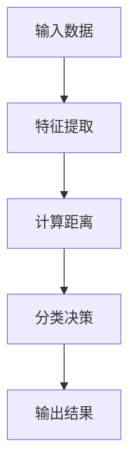
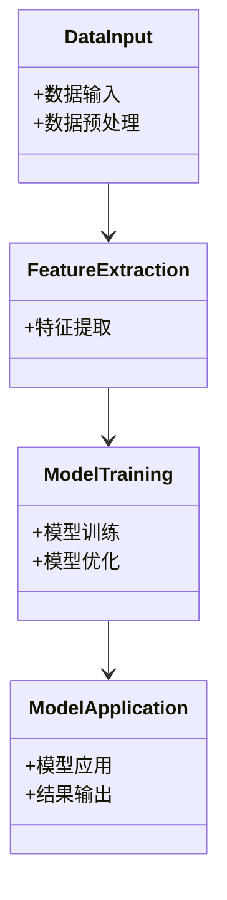

                 


# 少样本学习：在有限数据下快速适应

**关键词**：少样本学习、机器学习、数据稀缺性、模型优化、算法设计

**摘要**：  
在当今数据驱动的时代，数据量的多少直接影响着机器学习模型的性能。然而，在许多实际场景中，获取大量标注数据往往成本高昂且耗时。少样本学习（Few-shot Learning）作为一种新兴的学习范式，能够在数据稀缺的情况下快速适应新任务，成为解决这一问题的重要技术。本文将从背景、核心概念、算法原理、系统架构到项目实战，全面解析少样本学习的理论与实践，帮助读者理解其本质，并掌握在实际场景中应用的方法。

---

## 第一部分：少样本学习的背景与核心概念

### 第1章：少样本学习的背景与问题背景

#### 1.1 少样本学习的背景
在机器学习领域，数据被视为模型性能的基石。传统监督学习方法通常需要大量的标注数据来训练模型，以确保模型在测试数据上的泛化能力。然而，随着应用场景的拓展，数据获取的难度逐渐增加。例如，在医疗领域，某些疾病的样本数量可能非常有限；在企业级应用中，某些特定业务场景的数据收集成本高昂。这种数据稀缺性的问题，使得传统的数据驱动方法难以适用。

少样本学习（Few-shot Learning）正是在这样的背景下应运而生。它致力于在仅有少量样本的情况下，通过合理的算法设计，使模型能够快速适应新任务。这种技术不仅能够降低数据获取的成本，还能在实时性要求较高的场景中提供高效的解决方案。

#### 1.2 少样本学习的问题背景
少样本学习的核心问题是：如何在仅有少量标注数据的情况下，构建具有良好泛化能力的模型。具体来说，少样本学习面临以下挑战：

1. **数据不足**：传统机器学习算法通常需要成千上万的样本，而少样本学习可能仅依赖几十甚至几个样本。
2. **模型泛化能力不足**：在数据稀少的情况下，模型难以通过有限的训练样本捕获数据的分布特性。
3. **计算资源限制**：在某些场景中，计算资源的限制使得无法进行大规模的训练。

### 第2章：少样本学习的核心概念与问题描述

#### 2.1 少样本学习的核心概念
少样本学习的核心概念包括以下几个方面：

1. **少量标注数据**：少样本学习依赖于少量的标注数据进行训练，通常在几个或几十个样本的规模下完成。
2. **快速适应新任务**：通过某种形式的知识共享或模型设计，使模型能够快速适应新的任务或领域。
3. **模型的泛化能力**：在数据稀少的情况下，模型需要具备较强的泛化能力，能够在新的未见样本上表现良好。

#### 2.2 少样本学习的问题描述
少样本学习的目标是在有限的数据下，实现对新任务的快速学习和准确预测。具体来说，问题可以描述为：

- 如何利用少量标注数据，构建一个能够快速适应新任务的模型？
- 如何在数据稀少的情况下，提高模型的泛化能力？
- 如何设计高效的算法，以降低计算成本并提高模型性能？

---

## 第二部分：少样本学习的核心概念与联系

### 第3章：少样本学习的核心原理

#### 3.1 少样本学习的原理分析
少样本学习的核心原理在于通过某种形式的“知识共享”或“模型归纳”，使模型能够在有限的数据下表现出色。常见的方法包括：

1. **基于度量的方法**：通过计算样本之间的相似性，将未见样本映射到已知类别。
2. **基于生成对抗网络的方法**：通过生成更多样的样本，增加数据的多样性。
3. **基于元学习的方法**：通过预训练模型，快速适应新任务。

#### 3.2 少样本学习的核心特征对比
以下是少样本学习与其他学习范式的核心特征对比：

| 学习范式 | 数据需求 | 模型复杂度 | 泛化能力 |
|----------|----------|------------|----------|
| 监督学习  | 高        | 高          | 高        |
| 半监督学习| 中        | 中          | 中        |
| 无监督学习| 低        | 低          | 低        |
| 少样本学习| 极低      | 中          | 中到高    |

---

## 第三部分：少样本学习的算法原理

### 第4章：少样本学习的算法原理

#### 4.1 基于度量的少样本学习算法
基于度量的少样本学习算法通过计算样本之间的相似性，将未见样本映射到已知类别。以下是其实现流程：

1. **输入数据**：将输入数据进行特征提取，生成特征向量。
2. **计算距离**：计算未见样本与训练样本之间的相似性或距离。
3. **分类决策**：根据相似性或距离，将未见样本归类到最相似的类别。

以下是基于度量的算法流程图：



#### 4.2 基于度量的算法实现代码
以下是一个简单的基于度量的算法实现代码：

```python
import numpy as np

def compute_distance(x, y):
    return np.linalg.norm(x - y)

def distance_based_learning(X_train, y_train, X_test):
    # 预测类别
    y_pred = []
    for x_test in X_test:
        min_distance = float('inf')
        best_class = None
        for i in range(len(X_train)):
            distance = compute_distance(X_train[i], x_test)
            if distance < min_distance:
                min_distance = distance
                best_class = y_train[i]
        y_pred.append(best_class)
    return y_pred
```

---

## 第四部分：少样本学习的系统分析与架构设计

### 第5章：少样本学习的系统架构设计

#### 5.1 系统功能设计
以下是一个少样本学习系统的功能模块图：



---

## 第五部分：少样本学习的项目实战

### 第6章：少样本学习的项目实战

#### 6.1 环境安装
以下是项目实战所需的环境安装代码：

```bash
pip install numpy
pip install scikit-learn
pip install matplotlib
pip install pymermaid
```

#### 6.2 系统核心实现源代码
以下是基于少样本学习的分类器实现代码：

```python
from sklearn.metrics.pairwise import pairwise_distances
from sklearn.neighbors import NearestNeighbors
from sklearn.datasets import make_classification

# 生成数据
X, y = make_classification(n_samples=10, n_classes=2, n_features=2, random_state=42)

# 训练集和测试集划分
X_train, X_test = X[:5], X[5:]
y_train, y_test = y[:5], y[5:]

# 基于最近邻的方法
knn = NearestNeighbors(n_neighbors=1).fit(X_train, y_train)
distances, indices = knn.kneighbors(X_test)

# 预测类别
y_pred = [y_train[indices[i][0]] for i in range(len(X_test))]

print("预测结果：", y_pred)
print("真实结果：", y_test)
```

---

## 第六部分：少样本学习的总结与展望

### 第7章：少样本学习的总结与展望

#### 7.1 最佳实践 tips
1. 在数据稀少的情况下，优先选择基于度量的方法。
2. 对于复杂场景，可以尝试使用生成对抗网络（GAN）或元学习（Meta-Learning）的方法。
3. 在实际应用中，结合领域知识进行特征工程，能够显著提升模型性能。

#### 7.2 小结
少样本学习作为一种新兴的学习范式，在数据稀缺的情况下表现出强大的适应能力。通过合理的设计和优化，少样本学习能够在实际场景中提供高效的解决方案。

#### 7.3 注意事项
- 在数据预处理阶段，确保数据的代表性和多样性。
- 在模型选择阶段，结合实际场景选择合适的算法。
- 在模型部署阶段，注意模型的实时性和计算效率。

#### 7.4 拓展阅读
- 《Deep Learning》 - Ian Goodfellow
- 《Pattern Recognition and Machine Learning》 - Christopher M. Bishop

---

通过本文的详细讲解，读者能够全面理解少样本学习的核心概念、算法原理以及实际应用。希望本文能够为读者在实际项目中应用少样本学习提供有价值的参考和指导。

