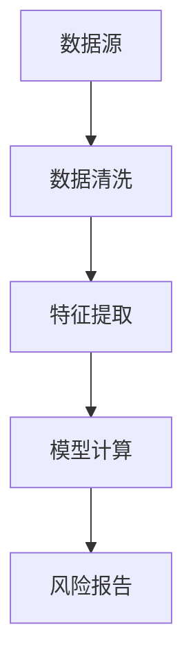
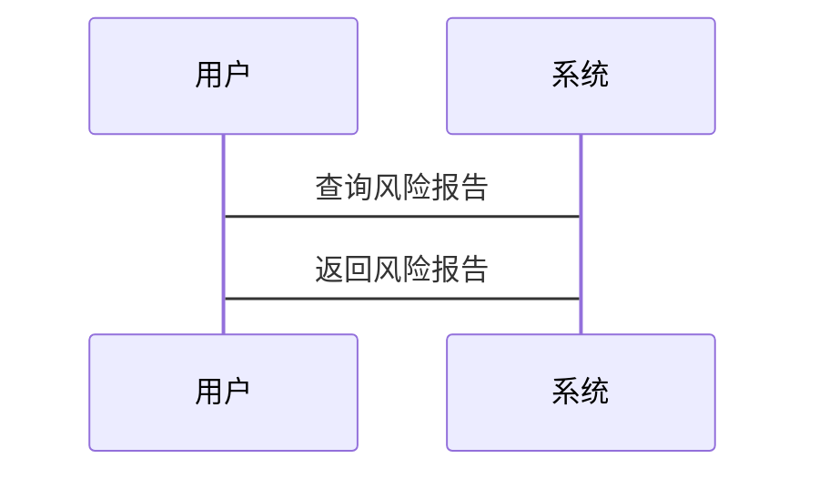

                 


# 尾部风险管理：防范极端市场事件的策略

> 关键词：尾部风险管理，极端市场事件，风险管理，VaR，CVaR，市场模型

> 摘要：尾部风险管理是防范极端市场事件的关键策略。本文系统介绍了尾部风险管理的核心概念、数学模型、算法原理、系统架构设计及实战案例，帮助读者全面理解和应用尾部风险管理。

---

# 第一部分: 尾部风险管理概述

## 第1章: 尾部风险管理的背景与概念

### 1.1 尾部风险的定义与特征

#### 1.1.1 尾部风险的定义
尾部风险（Tail Risk）指的是在概率分布的尾部区域发生的小概率、高影响的极端事件。这些事件通常超出正常市场波动的范围，可能对市场参与者造成重大损失。

#### 1.1.2 尾部风险的特征
- **小概率性**：尾部事件发生的概率较低，但影响巨大。
- **高破坏性**：尾部事件可能导致市场崩盘或系统性风险。
- **不可预测性**：尾部事件难以通过常规模型准确预测。

#### 1.1.3 尾部风险的边界与外延
尾部风险的边界通常由市场参与者的风险承受能力和市场的稳定性决定。外延则包括与市场相关的所有可能事件，如金融危机、市场操纵等。

### 1.2 尾部风险管理的必要性

#### 1.2.1 尾部风险对企业的影响
尾部事件可能导致企业资产损失、声誉受损，甚至引发企业破产。

#### 1.2.2 尾部风险对市场的冲击
尾部事件可能引发市场恐慌、流动性危机，甚至导致金融危机。

#### 1.2.3 尾部风险管理的经济意义
通过有效管理尾部风险，可以降低市场的波动性，保护投资者利益，维护金融系统的稳定。

---

## 第2章: 尾部风险管理的核心概念

### 2.1 尾部风险的数学模型

#### 2.1.1 概率分布模型
- 正态分布：常用于描述市场波动，但对极端事件的预测能力有限。
- 帕累托分布：适合描述尾部事件的概率。

#### 2.1.2 威险值（VaR）与条件威险值（CVaR）
- VaR：在给定置信水平下，可能的最大损失。
  $$ VaR = \alpha \cdot \sigma $$
- CVaR：VaR的扩展，考虑了尾部事件的平均损失。

#### 2.1.3 尾部事件的统计特征
尾部事件通常表现为厚尾现象，即实际数据中极端事件的发生频率高于正态分布的预测。

### 2.2 尾部风险与市场行为的关系

#### 2.2.1 市场参与者的行为模式
- 投资者行为：过度自信可能导致尾部事件的发生。
- 机构行为：大额交易可能放大市场波动。

#### 2.2.2 尾部事件的触发机制
- 市场恐慌：负面消息导致投资者大量抛售资产。
- 杠杆效应：高杠杆率放大了市场的波动性。

#### 2.2.3 尾部事件的传播路径
- 市场恐慌：从一只股票蔓延至整个市场。
- 系统性风险：多个市场同时发生尾部事件。

---

## 第3章: 尾部风险管理的理论基础

### 3.1 风险管理的基本框架

#### 3.1.1 风险识别与评估
- 风险识别：通过数据分析和市场监控发现潜在风险。
- 风险评估：利用VaR等模型量化风险。

#### 3.1.2 风险量化与测量
- 使用统计模型（如VaR、CVaR）量化风险。
- 通过压力测试评估极端情况下的风险敞口。

#### 3.1.3 风险控制与缓解
- 分散投资：通过多元化降低尾部风险。
- 对冲策略：利用衍生品对冲风险。

### 3.2 尾部风险管理的特殊性

#### 3.2.1 尾部事件的不可预测性
尾部事件通常难以通过历史数据预测。

#### 3.2.2 尾部风险的高破坏性
尾部事件可能导致系统性金融危机。

#### 3.2.3 尾部风险管理的复杂性
需要结合统计模型、市场行为分析和系统架构设计。

---

# 第二部分: 尾部风险管理的数学模型与算法

## 第4章: 尾部风险的统计建模

### 4.1 尾部事件的检测算法

#### 4.1.1 基于统计套利的尾部事件检测
- 使用均值回归模型检测异常波动。
- 示例代码：
  ```python
  def detect_anomaly(data, threshold):
      mean = data.mean()
      std = data.std()
      z_scores = (data - mean) / std
      return z_scores[z_scores > threshold].index
  ```

#### 4.1.2 基于机器学习的尾部事件预测
- 使用随机森林模型预测尾部事件。
- 示例代码：
  ```python
  from sklearn.ensemble import RandomForestClassifier
  model = RandomForestClassifier(n_estimators=100)
  model.fit(X_train, y_train)
  ```

#### 4.1.3 基于时间序列分析的尾部事件识别
- 使用ARIMA模型识别异常点。
- 示例代码：
  ```python
  from statsmodels.tsa.arima_model import ARIMA
  model = ARIMA(train_data, order=(1, 1, 1))
  model_fit = model.fit()
  ```

### 4.2 尾部风险的数学模型

#### 4.2.1 威险值（VaR）的计算公式
$$ VaR = \alpha \cdot \sigma $$

#### 4.2.2 条件威险值（CVaR）
$$ CVaR = \frac{1}{1 - \alpha} \int_{\alpha}^{1} VaR(t) dt $$

---

## 第5章: 尾部风险管理的系统架构设计

### 5.1 系统功能设计

#### 5.1.1 数据流与处理
- 数据源：市场数据、交易数据。
- 数据处理：清洗、转换、特征提取。

#### 5.1.2 系统架构
- 数据源模块：收集市场数据。
- 处理模块：计算VaR、CVaR等指标。
- 输出模块：生成风险报告。

### 5.2 系统架构图


### 5.3 系统接口设计

#### 5.3.1 数据接口
- 输入：市场数据。
- 输出：风险指标。

#### 5.3.2 用户接口
- 输入：用户查询。
- 输出：风险报告。

### 5.4 系统交互图


---

## 第6章: 尾部风险管理的项目实战

### 6.1 环境配置

#### 6.1.1 安装依赖
- Python：3.8+
- 库：pandas、numpy、statsmodels

### 6.2 核心实现

#### 6.2.1 数据收集
```python
import pandas as pd
data = pd.read_csv('market_data.csv')
```

#### 6.2.2 模型实现
```python
from statsmodels.tsa.arima_model import ARIMA
model = ARIMA(data, order=(1, 1, 1))
model_fit = model.fit()
```

#### 6.2.3 结果分析
```python
print(model_fit.summary())
```

### 6.3 实战案例

#### 6.3.1 股票市场案例
- 数据来源：股票价格数据。
- 分析步骤：数据清洗、模型训练、结果解读。

### 6.4 项目小结

#### 6.4.1 经验总结
- 数据清洗的重要性。
- 模型选择的影响。

#### 6.4.2 注意事项
- 数据质量：确保数据准确无误。
- 模型解释性：选择易于解释的模型。

---

# 第三部分: 尾部风险管理的最佳实践

## 第7章: 尾部风险管理的优化与改进

### 7.1 尾部风险管理的策略优化

#### 7.1.1 动态调整模型参数
- 根据市场变化调整VaR的置信水平。

#### 7.1.2 结合机器学习优化
- 使用深度学习模型捕捉复杂市场特征。

### 7.2 尾部风险管理的未来展望

#### 7.2.1 技术进步
- 大数据和人工智能在尾部风险管理中的应用。

#### 7.2.2 市场发展
- 新型金融工具的开发与应用。

---

## 第8章: 尾部风险管理的总结与注意事项

### 8.1 尾部风险管理的核心要点

#### 8.1.1 风险识别与评估
- 早期识别尾部风险。

#### 8.1.2 模型选择与优化
- 选择合适的统计模型。

### 8.2 尾部风险管理的最佳实践

#### 8.2.1 数据驱动决策
- 依赖数据分析而非直觉。

#### 8.2.2 系统化管理
- 建立完整的风险管理流程。

### 8.3 尾部风险管理的注意事项

#### 8.3.1 数据质量问题
- 确保数据准确无误。

#### 8.3.2 模型局限性
- 尾部事件的不可预测性。

---

# 总结

尾部风险管理是防范极端市场事件的关键策略。通过系统的理论学习、数学建模、算法设计和实战案例，读者可以全面掌握尾部风险管理的核心方法。未来，随着技术的进步和市场的变化，尾部风险管理将更加重要，需要我们不断创新和优化。

---

**参考文献**  
1. Johnson, N. E. (2010). Financial Risk Management.  
2. Taleb, N. N. (2007). The Black Swan: The Impact of the Highly Improbable.  
3. Campbell, J. Y., & Viceira, L. M. (2002). Strategic Asset Allocation: Portfolio Performance Under Alternative Investment Views and Risk Constraints.

