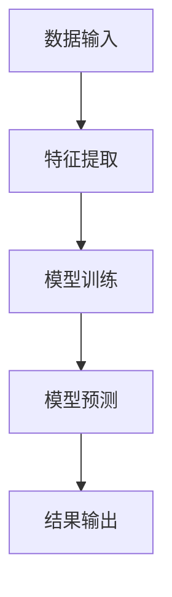
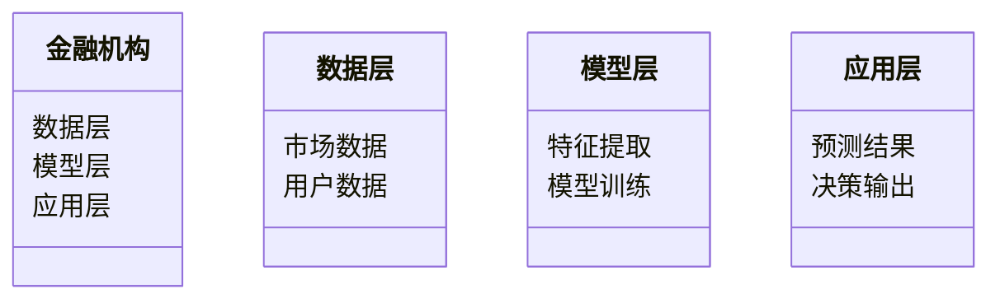
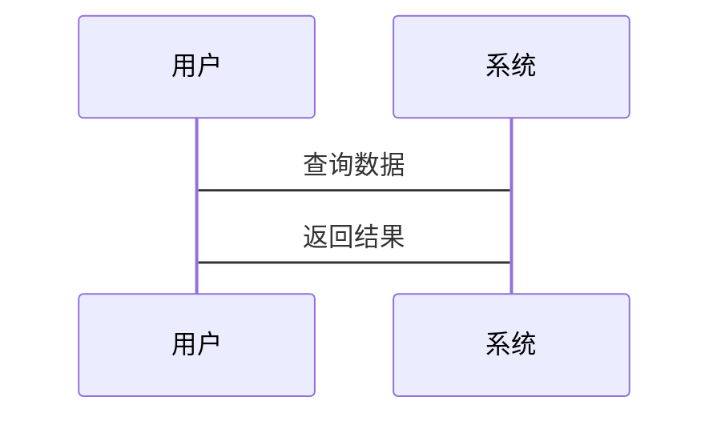

                 


# 《展望金融AI应用的未来发展趋势与挑战》

---

## 关键词：
金融AI，人工智能，风险管理，投资交易，金融创新

---

## 摘要：
随着人工智能技术的迅速发展，金融行业正在经历一场深刻的变革。本文将详细探讨金融AI的应用背景、核心概念、算法原理、系统架构以及未来发展趋势，分析其面临的挑战与机遇。通过具体案例分析和实战演示，本文旨在为读者提供一个全面的视角，帮助其理解金融AI的核心技术与应用场景，展望其未来的发展方向。

---

# 第一部分：金融AI应用的背景与基础

## 第1章：金融AI应用的背景与现状

### 1.1 金融AI的定义与核心概念

#### 1.1.1 金融AI的定义
金融AI是指利用人工智能技术（如机器学习、深度学习、自然语言处理等）对金融数据进行分析、预测和决策的过程。其核心目标是通过技术手段提升金融行业的效率、准确性和智能化水平。

#### 1.1.2 金融AI的核心概念
- **数据驱动**：金融AI依赖于大量高质量的金融数据，包括市场数据、交易数据、用户行为数据等。
- **模型训练**：通过机器学习算法对数据进行建模，生成能够预测金融市场的模型。
- **实时决策**：基于模型输出的结果，快速做出投资、风险管理等决策。

#### 1.1.3 金融AI的边界与外延
金融AI的应用范围涵盖金融市场的各个领域，包括风险管理、投资交易、客户服务等。其外延还包括与金融相关的领域，如智能投顾、金融科技（FinTech）等。

### 1.2 金融AI的发展背景

#### 1.2.1 人工智能技术的演进
人工智能技术的快速发展为金融行业带来了新的机遇。近年来，深度学习、自然语言处理等技术的突破为金融AI的应用提供了坚实的技术基础。

#### 1.2.2 金融行业的数字化转型
传统金融行业正加速向数字化转型，AI技术的应用成为这一转型的重要驱动力。金融机构通过AI技术提升服务效率、降低运营成本。

#### 1.2.3 金融AI的行业现状
当前，金融AI已在多个领域得到广泛应用，如算法交易、信用评估、 fraud detection等。然而，其应用仍面临数据隐私、模型解释性等挑战。

### 1.3 金融AI的应用场景

#### 1.3.1 金融风险管理
AI技术可以帮助金融机构识别和预测市场风险、信用风险等，从而制定更有效的风险管理策略。

#### 1.3.2 金融投资与交易
通过AI算法，投资者可以实现自动化交易、量化投资，提升投资效率和收益。

#### 1.3.3 金融客户服务
AI客服、智能投顾等技术的应用为金融机构提供了更高效、个性化的客户服务方式。

### 1.4 金融AI的未来趋势

#### 1.4.1 技术驱动的创新
AI技术的持续进步将推动金融行业的创新，如强化学习在交易策略中的应用。

#### 1.4.2 行业应用的深化
AI技术将在更多金融领域得到应用，如智能合约、DeFi（去中心化金融）等。

#### 1.4.3 金融AI的挑战与机遇
尽管AI技术为金融行业带来巨大机遇，但数据隐私、模型解释性等问题仍需克服。

## 1.5 本章小结
本章介绍了金融AI的定义、核心概念、发展背景及应用场景，为后续章节的深入分析奠定了基础。

---

## 第2章：金融AI的核心概念与联系

### 2.1 AI技术在金融中的核心概念

#### 2.1.1 数据处理与特征提取
金融AI的核心是数据，特征提取是关键步骤。通过提取有效的特征，可以提升模型的预测能力。

#### 2.1.2 模型训练与优化
基于特征的数据，利用机器学习算法进行模型训练，并通过优化算法提升模型性能。

#### 2.1.3 模型部署与应用
将训练好的模型部署到实际业务场景中，实现金融决策的自动化。

### 2.2 核心概念的属性特征对比

| 技术 | 描述 |
|------|------|
| 传统AI | 基于规则和浅层学习 |
| 深度学习 | 基于神经网络的深度学习 |


---

## 第3章：金融AI的算法原理与数学模型

### 3.1 常见算法原理

#### 3.1.1 随机森林算法
随机森林是一种基于树的集成学习方法，常用于分类和回归问题。

#### 3.1.2 神经网络算法
神经网络通过多层结构模拟人脑，适用于复杂模式识别。

#### 3.1.3 支持向量机算法
支持向量机通过构建超平面实现分类，适用于高维数据。

### 3.2 算法流程图



### 3.3 算法实现代码

```python
import numpy as np
from sklearn.ensemble import RandomForestClassifier

# 示例数据
X = np.array([[1, 2], [3, 4], [5, 6]])
y = np.array([0, 1, 0])

# 模型训练
model = RandomForestClassifier()
model.fit(X, y)

# 预测
new_data = np.array([[2, 3]])
print(model.predict(new_data))
```

### 3.4 数学模型与公式

#### 3.4.1 线性回归模型
$$ y = \beta_0 + \beta_1x + \epsilon $$

---

# 第二部分：系统分析与架构设计

## 第4章：系统分析与架构设计方案

### 4.1 问题场景介绍
金融AI系统的应用场景包括股票价格预测、信用评估等。

### 4.2 系统功能设计



### 4.3 系统架构设计


### 4.4 系统接口设计



---

## 第5章：项目实战

### 5.1 环境安装
安装必要的库，如Python、TensorFlow、Scikit-learn等。

### 5.2 核心代码实现

```python
import numpy as np
import pandas as pd
from sklearn.model_selection import train_test_split
from sklearn.ensemble import RandomForestRegressor

# 加载数据
data = pd.read_csv('stock_data.csv')
X = data[['open', 'high', 'low', 'volume']]
y = data['close']

# 数据划分
X_train, X_test, y_train, y_test = train_test_split(X, y, test_size=0.2)

# 模型训练
model = RandomForestRegressor()
model.fit(X_train, y_train)

# 预测
predictions = model.predict(X_test)
print('预测结果:', predictions)
```

### 5.3 案例分析
以股票价格预测为例，分析模型的预测精度和实际应用效果。

### 5.4 项目小结
总结项目实施过程中的经验与教训，提出改进建议。

---

## 第6章：金融AI的未来展望与挑战

### 6.1 未来发展趋势

#### 6.1.1 技术融合
AI与区块链、大数据等技术的融合将进一步推动金融创新。

#### 6.1.2 行业应用的深化
AI技术将在更多金融场景中得到应用，如智能合约、DeFi等。

#### 6.1.3 伦理与监管
随着AI在金融中的广泛应用，数据隐私、模型解释性等问题将成为监管重点。

### 6.2 挑战与应对策略

#### 6.2.1 数据隐私
通过数据脱敏和隐私计算技术保护数据隐私。

#### 6.2.2 模型解释性
通过可解释性AI（XAI）技术提升模型的透明度和可信度。

#### 6.2.3 算法偏见
通过数据清洗和模型优化减少算法偏见。

### 6.3 未来挑战与机遇
尽管面临诸多挑战，但金融AI的未来发展潜力巨大，将为金融行业带来更多的创新和变革。

---

## 《总结》

金融AI的应用正在深刻改变金融行业的运作方式。通过技术的不断进步和应用的不断深化，金融AI将在未来发挥更大的作用。然而，我们也需要关注其面临的挑战，积极寻求解决方案，推动金融AI的健康发展。

--- 

**注**：由于篇幅限制，以上内容为部分章节的概述和示例，完整文章需要根据实际需求进行扩展和详细撰写。

