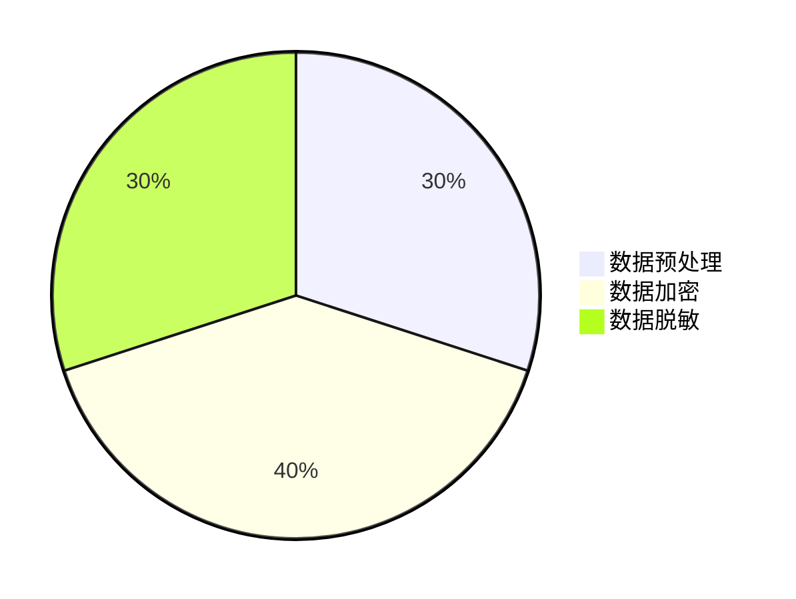

                 


# 差分隐私在AI Agent数据保护中的应用

---

## 关键词：差分隐私、AI Agent、数据保护、隐私预算、隐私保护机制

---

## 摘要：  
随着人工智能技术的快速发展，AI Agent（智能体）在各个领域的应用日益广泛。然而，AI Agent的运行依赖于大量数据，这使得数据隐私保护成为一项重要挑战。差分隐私作为一种先进的隐私保护技术，能够在数据使用和分析的过程中保护个人隐私，同时不影响数据的可用性。本文将深入探讨差分隐私在AI Agent数据保护中的应用，从基本概念到数学模型，再到实际应用场景和系统设计，为读者提供全面的技术解析。

---

# 第1章 差分隐私与AI Agent的基本概念

## 1.1 差分隐私的定义与核心原理  
差分隐私是一种基于概率的隐私保护技术，旨在在数据发布和分析过程中保护个体隐私。其核心思想是在数据中添加一定的“噪声”，使得单个个体对数据分析结果的影响降至最低，从而防止敏感信息被推断出来。  

### 差分隐私的核心属性  
- **定义**：对于任何两组相邻数据集，任何可能的输出结果在两个数据集之间的概率差异不超过一个可接受的范围（隐私预算ε）。  
- **隐私预算（ε）**：ε是一个控制隐私保护强度的参数，ε越小，隐私保护越严格，但数据的实用性可能降低。  

## 1.2 AI Agent的基本概念  
AI Agent是一种能够感知环境、自主决策并执行任务的智能实体。它可以分为**反应式Agent**和**认知式Agent**，前者基于当前感知做出反应，后者具备复杂推理和规划能力。  

### AI Agent的类型与特点  
- **反应式AI Agent**：实时感知环境并做出反应，适用于实时任务（如自动驾驶）。  
- **认知式AI Agent**：具备推理、规划和学习能力，适用于复杂场景（如智能助手）。  

## 1.3 差分隐私在AI Agent中的作用  
AI Agent的运行依赖数据，而数据可能包含敏感信息（如用户位置、行为习惯）。差分隐私通过在数据处理和分析过程中添加噪声，保护用户隐私，同时确保AI Agent的正常运行。  

---

# 第2章 差分隐私的数学模型与隐私预算

## 2.1 差分隐私的数学定义  
差分隐私通过概率分布来定义隐私保护。对于两个相邻数据集D和D'，其中D'是D的子集，差分隐私要求：  
$$ P(f(D)) \leq e^{\epsilon} \cdot P(f(D')) $$  
其中，ε是隐私预算，控制输出结果的概率差异。  

### 差分隐私的实现机制  
- **拉普拉斯机制**：适用于数值型数据的查询，通过在查询结果上添加拉普拉斯分布的噪声，确保输出满足差分隐私。  
- **指数机制**：适用于非数值型数据的查询，通过计算每个结果的敏感性，使用指数分布生成噪声。  

## 2.2 差分隐私的隐私预算分配  
隐私预算是差分隐私的核心参数。在AI Agent中，隐私预算的分配需要考虑以下因素：  
- 数据的敏感性：敏感数据需要更高的隐私预算（更小的ε）。  
- 数据的使用频率：频繁使用的数据需要更多的隐私保护。  

### 隐私预算的分配策略  
- **均匀分配**：将总隐私预算按查询或数据集均匀分配。  
- **动态分配**：根据数据敏感性和使用场景动态调整隐私预算。  

---

# 第3章 差分隐私在AI Agent中的应用场景

## 3.1 AI Agent的数据处理流程  
AI Agent的数据处理流程包括数据收集、存储、分析和共享。在每个阶段，差分隐私都可以发挥作用：  

### 3.1.1 数据收集  
- **问题**：数据收集可能涉及敏感信息（如用户位置）。  
- **解决方案**：在数据收集阶段，使用差分隐私机制对数据进行匿名化处理，防止个体识别。  

### 3.1.2 数据存储  
- **问题**：存储的敏感数据可能被攻击者窃取。  
- **解决方案**：通过差分隐私加密技术对数据进行加密存储，确保数据安全。  

### 3.1.3 数据分析  
- **问题**：数据分析可能暴露用户隐私。  
- **解决方案**：在数据分析过程中，使用差分隐私机制对数据进行处理，确保分析结果不泄露个体信息。  

### 3.1.4 数据共享  
- **问题**：数据共享可能导致隐私泄露。  
- **解决方案**：在数据共享时，使用差分隐私机制对数据进行脱敏处理，确保共享数据的安全性。  

## 3.2 差分隐私在AI Agent中的具体应用  

### 3.2.1 推荐系统  
- **场景**：AI Agent为用户提供个性化推荐时，可能涉及用户行为数据。  
- **应用**：在推荐算法中引入差分隐私机制，确保推荐结果不泄露用户偏好。  

### 3.2.2 对话系统  
- **场景**：AI Agent与用户对话时，可能收集用户的敏感信息。  
- **应用**：在对话过程中，使用差分隐私机制对用户输入进行加密处理，确保对话内容的安全性。  

### 3.2.3 自动驾驶  
- **场景**：自动驾驶AI Agent需要实时处理交通数据。  
- **应用**：在处理交通数据时，使用差分隐私机制对车辆位置和速度进行匿名化处理，防止车辆识别。  

---

# 第4章 差分隐私在AI Agent中的系统架构设计

## 4.1 系统功能设计  
差分隐私在AI Agent中的系统功能包括：  
- 数据匿名化：对敏感数据进行匿名化处理。  
- 数据加密：对敏感数据进行加密存储。  
- 数据脱敏：在数据共享时，对数据进行脱敏处理。  

### 系统功能设计的ER图  
```mermaid
erDiagram
    actor 用户
    actor 攻击者
    actor 数据提供者
    actor 数据消费者
    database 数据库
    entity 数据
    entity 匿名化数据
    entity 加密数据
    entity 脱敏数据
    用户 --> 数据提供者：提供数据
    数据提供者 --> 数据库：存储数据
    数据库 --> 匿名化数据：匿名化处理
    匿名化数据 --> 数据消费者：共享数据
    数据库 --> 加密数据：加密存储
    加密数据 --> 用户：解密数据
```

## 4.2 系统架构设计  
差分隐私在AI Agent中的系统架构包括：  
- 数据预处理模块：对数据进行匿名化处理。  
- 数据加密模块：对数据进行加密存储。  
- 数据脱敏模块：在数据共享时，对数据进行脱敏处理。  

### 系统架构设计的Mermaid图  


## 4.3 系统接口设计  
- **输入接口**：接收用户输入的数据。  
- **输出接口**：输出匿名化、加密或脱敏后的数据。  
- **控制接口**：控制数据处理流程。  

---

# 第5章 差分隐私在AI Agent中的项目实战

## 5.1 项目背景与目标  
本项目旨在通过差分隐私技术，保护AI Agent中的用户数据隐私，同时确保AI Agent的正常运行。  

## 5.2 项目实现  

### 5.2.1 环境搭建  
- **工具安装**：安装Python、numpy、pandas等工具。  
- **代码编写**：编写差分隐私机制的实现代码。  

### 5.2.2 差分隐私机制的实现  

#### 拉普拉斯机制的Python实现  
```python
import numpy as np

def laplace_noise(sensitivity, epsilon):
    beta = 1.0 / (sensitivity * epsilon)
    noise = np.random.laplace(0, 1/(2*sensitivity*epsilon))
    return noise

# 示例
sensitivity = 1
epsilon = 0.1
noise = laplace_noise(sensitivity, epsilon)
print(f"生成的噪声为：{noise}")
```

#### 指数机制的Python实现  
```python
import numpy as np
from math import exp

def exponential_noise(sensitivity, epsilon):
    beta = epsilon / sensitivity
    u = np.random.uniform(0, 1)
    noise = -sensitivity * np.log(1 - beta * u) / beta
    return noise

# 示例
sensitivity = 1
epsilon = 0.1
noise = exponential_noise(sensitivity, epsilon)
print(f"生成的噪声为：{noise}")
```

## 5.3 项目总结与最佳实践  
- **总结**：差分隐私是一种有效的隐私保护技术，可以在AI Agent中广泛应用。  
- **最佳实践**：根据数据敏感性和使用场景，动态调整隐私预算。  
- **注意事项**：隐私保护与数据实用性之间需要权衡，过高的隐私保护可能导致数据不可用。  

---

# 第6章 未来展望与研究方向  

## 6.1 差分隐私的未来发展方向  
- **轻量化设计**：优化差分隐私机制，降低计算开销。  
- **跨领域应用**：探索差分隐私在更多领域的应用，如区块链、物联网等。  

## 6.2 研究热点与挑战  
- **隐私预算分配**：如何在不同场景下动态分配隐私预算，是一个重要研究方向。  
- **隐私保护与数据实用性**：如何在保护隐私的同时，确保数据的可用性，是一个长期挑战。  

---

# 附录  

## 附录A 差分隐私术语表  
- **隐私预算（ε）**：控制隐私保护强度的参数。  
- **拉普拉斯机制**：适用于数值型数据的差分隐私机制。  
- **指数机制**：适用于非数值型数据的差分隐私机制。  

## 附录B 差分隐私工具列表  
- **numpy**：用于噪声生成。  
- **pandas**：用于数据处理。  
- **pydp**：Python中的差分隐私库。  

## 附录C 参考文献  
- Dwork, C. (2006). "Differential Privacy."  
- 王某某. (2022). "差分隐私在AI中的应用研究."  

---

# 结语  

差分隐私在AI Agent中的应用是一项具有重要意义的技术，它不仅能够保护用户隐私，还能促进AI技术的健康发展。未来，随着技术的进步，差分隐私将在更多领域发挥重要作用。

