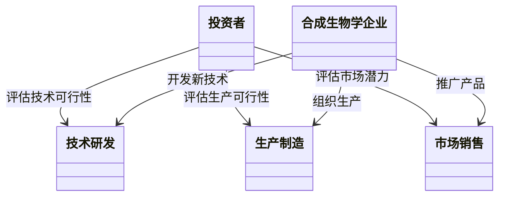
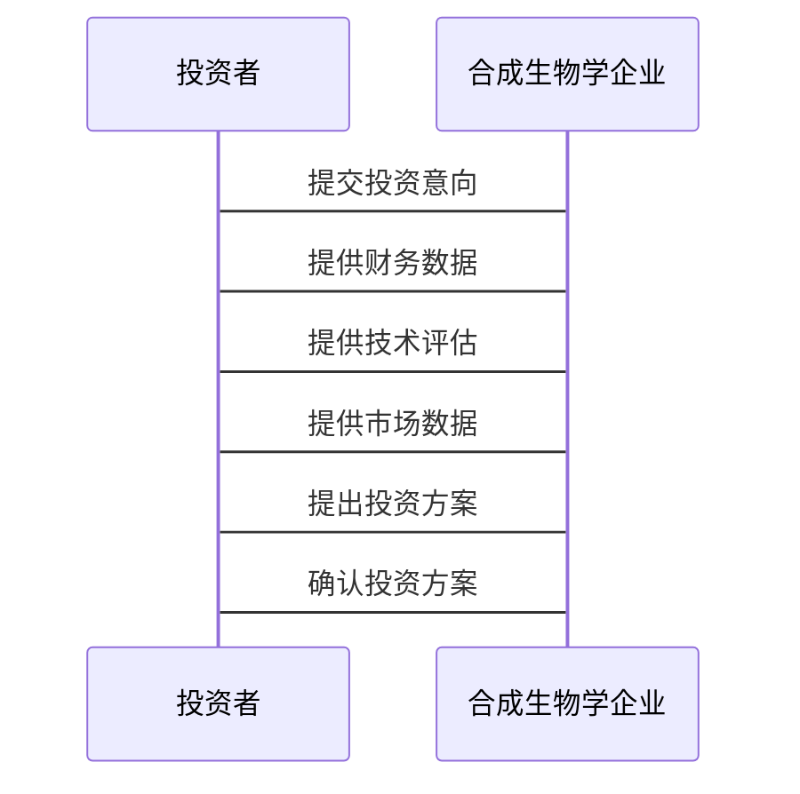

                 


# 巴菲特-芒格的合成生物学投资：生命编程的产业化

## 关键词：巴菲特, 芒格, 合成生物学, 投资, 生命编程, 产业化, 技术创新

## 摘要：本文探讨了巴菲特和芒格的投资理念如何与合成生物学这一新兴领域相结合，分析了合成生物学的技术原理、产业化趋势及其在投资中的潜在价值。通过详细的技术分析和案例研究，本文揭示了如何将生命科学与投资策略相结合，为投资者和科学家提供了独特的视角。

---

## 第一部分: 巴菲特-芒格投资理念与合成生物学的结合

### 第1章: 巴菲特-芒格投资理念概述

#### 1.1 巴菲特-芒格投资哲学

##### 1.1.1 巴菲特的价值投资理念
沃伦·巴菲特的价值投资理念强调长期持有优质资产，寻找具有持续竞争优势的企业。他注重企业的基本面分析，包括财务健康状况、盈利能力、管理层能力和行业地位。这种理念的核心在于“以合理的价格买入优秀的企业”。

##### 1.1.2 芒格的多元思维模型
查理·芒格的多元思维模型强调将各个学科的基本原理联系起来，形成一个相互关联的知识框架。他认为，投资者需要从多个角度（如心理学、经济学、生物学）理解问题，以避免认知偏差和错误决策。

##### 1.1.3 投资中的理性与长期主义
巴菲特和芒格都强调理性决策和长期投资。他们认为市场的短期波动不应影响长期投资策略，真正的投资机会来自于企业的持续价值创造。

#### 1.2 投资中的关键要素

##### 1.2.1 财务指标分析
巴菲特和芒格注重企业的财务健康状况，包括盈利能力（ROE、净利润率）、资产负债表的稳健性（低债务、高净资产）和现金流的稳定性。

##### 1.2.2 行业趋势判断
他们关注行业的长期发展趋势，选择那些具有增长潜力和竞争优势的行业。例如，芒格曾投资于烟草行业，因为他看到了行业的长期稳定性和高利润率。

##### 1.2.3 管理层能力评估
巴菲特和芒格认为，优秀的管理层是企业成功的关键。他们注重管理层的诚信、能力和战略眼光。

#### 1.3 巴菲特-芒格投资策略的演变

##### 1.3.1 从传统行业到新兴领域的扩展
巴菲特和芒格的投资策略从早期的传统行业（如保险、银行）逐渐扩展到新兴领域（如科技、生物技术）。这种扩展基于对行业趋势的深刻理解和对企业核心竞争力的判断。

##### 1.3.2 投资决策中的风险管理
芒格强调“逆向思维”，即在市场恐慌时寻找机会，在市场狂热时保持冷静。他认为，风险管理是投资成功的关键。

##### 1.3.3 长期投资与价值创造
巴菲特和芒格的投资策略始终围绕长期价值创造。他们相信，通过持有优质资产并耐心等待，可以获得超额回报。

#### 1.4 本章小结
巴菲特和芒格的投资理念以长期主义、理性决策和价值创造为核心，强调对企业基本面和行业趋势的深入分析。这些理念为合成生物学的投资提供了重要指导。

---

### 第2章: 合成生物学的基本概念与技术原理

#### 2.1 合成生物学的定义与核心概念

##### 2.1.1 合成生物学的定义
合成生物学是通过设计和构建新的生物系统或改造现有生物系统，以实现特定功能的科学。它结合了生物学、工程学和计算机科学，目标是将生命视为可以编程的系统。

##### 2.1.2 合成生物学的核心技术
合成生物学的核心技术包括基因编辑（如CRISPR）、合成基因回路、生物制造和系统生物学建模。这些技术使科学家能够设计和构建具有特定功能的生物系统。

##### 2.1.3 合成生物学与传统生物学的区别
与传统生物学注重发现和描述自然现象不同，合成生物学注重设计和构建新的生物系统。它更像是一种工程学科，强调实用性和功能性。

#### 2.2 合成生物学的关键技术

##### 2.2.1 基因编辑技术
基因编辑技术（如CRISPR-Cas9）使科学家能够精确地修改DNA序列，为合成生物学提供了强大的工具。通过基因编辑，可以设计出具有特定功能的生物系统。

##### 2.2.2 合成基因回路
合成基因回路是通过设计和构建人工基因回路，使生物系统能够执行特定功能。例如，设计一个基因回路来生产特定化合物或响应环境刺激。

##### 2.2.3 生物制造与工业化应用
合成生物学在生物制造领域的应用包括生产药品、化学品和生物燃料。通过优化生物系统，可以提高生产效率和降低成本。

#### 2.3 合成生物学的产业化趋势

##### 2.3.1 合成生物学在医药领域的应用
合成生物学在医药领域的应用包括生产药物前体、设计新型抗生素和开发个性化医疗方案。例如，合成生物学技术可以用于生产抗癌药物的关键成分。

##### 2.3.2 合成生物学在农业中的潜力
合成生物学在农业中的应用包括设计耐旱、抗病虫害的作物和提高作物产量。通过基因编辑和生物制造，可以开发出更高效的农业解决方案。

##### 2.3.3 合成生物学在能源领域的创新
合成生物学在能源领域的应用包括生产生物燃料（如乙醇、生物柴油）和设计高效的碳捕获系统。通过生物制造技术，可以实现可持续能源生产。

#### 2.4 本章小结
合成生物学是一项跨学科的技术，具有广泛的应用潜力。它的核心技术包括基因编辑、合成基因回路和生物制造，这些技术为产业化应用提供了可能性。

---

### 第3章: 巴菲特-芒格投资理念与合成生物学的结合

#### 3.1 合成生物学的商业价值

##### 3.1.1 合成生物学的估值模型
合成生物学企业的估值需要考虑技术壁垒、市场潜力和竞争优势。与传统企业相比，合成生物学企业的估值更复杂，需要考虑技术的可扩展性和商业化的可行性。

##### 3.1.2 技术壁垒与市场竞争力
合成生物学企业的核心竞争力在于其技术壁垒。高技术壁垒可以保护企业的市场地位，防止竞争对手进入。

##### 3.1.3 产业链整合与协同效应
合成生物学企业需要整合上下游产业链，形成协同效应。例如，与化工企业合作可以加速产品的商业化。

#### 3.2 巴菲特-芒格投资理念在合成生物学中的应用

##### 3.2.1 价值投资与合成生物学企业的选择
巴菲特和芒格的价值投资理念在合成生物学中的应用包括寻找具有持续竞争优势的企业和具有长期增长潜力的行业。他们注重企业的基本面分析和技术领先地位。

##### 3.2.2 多元思维模型在合成生物学领域的实践
芒格的多元思维模型在合成生物学中的实践包括从多个角度分析企业的技术、市场和管理层。例如，分析企业的技术可行性、市场需求和管理团队的能力。

##### 3.2.3 长期投资与合成生物学产业的发展
合成生物学是一个长期发展的领域，需要长期投资。巴菲特和芒格的长期投资策略与合成生物学的产业发展趋势相契合。

#### 3.3 合成生物学企业的投资风险与机会

##### 3.3.1 技术风险与不确定性
合成生物学技术的不确定性和复杂性是投资的主要风险。技术失败或商业化困难可能导致投资失败。

##### 3.3.2 市场风险与竞争压力
合成生物学企业可能面临市场竞争压力，尤其是在技术快速迭代的领域。投资者需要关注企业的市场定位和竞争优势。

##### 3.3.3 机遇与未来趋势
合成生物学的产业化应用潜力巨大，尤其是在医药、农业和能源领域。随着技术的进步和成本的降低，合成生物学的投资机会将不断增加。

#### 3.4 本章小结
巴菲特和芒格的投资理念为合成生物学的投资提供了重要指导。通过价值投资和长期投资，投资者可以在合成生物学领域获得超额回报。

---

### 第4章: 合成生物学投资的数学模型与算法原理

#### 4.1 投资决策的数学模型

##### 4.1.1 价值评估模型
价值评估模型是基于企业的基本面数据，通过财务指标分析企业的内在价值。常用的模型包括DCF模型和市盈率模型。

##### 4.1.2 市场风险分析模型
市场风险分析模型用于评估投资组合的市场风险。常用的模型包括VaR模型和夏普比率模型。

#### 4.2 合成生物学投资的算法原理

##### 4.2.1 合成生物学企业的估值算法
合成生物学企业的估值需要考虑技术壁垒、市场潜力和商业化可行性。常用的算法包括基于技术的贴现现金流模型和基于市场的相对估值模型。

##### 4.2.2抽样概率模型
抽样概率模型用于分析合成生物学企业的技术成功概率。通过概率分析，投资者可以评估技术成功的可能性和潜在回报。

#### 4.3 数学模型与算法的应用

##### 4.3.1 估值模型的实现
通过Python代码实现合成生物学企业的估值模型，包括财务数据的输入、模型计算和结果输出。

##### 4.3.2 风险分析模型的实现
通过Python代码实现合成生物学企业的风险分析模型，包括市场风险和技术创新风险的评估。

#### 4.4 本章小结
数学模型和算法为合成生物学的投资决策提供了科学依据。通过合理的模型设计和算法实现，投资者可以更准确地评估投资价值和风险。

---

### 第5章: 系统分析与架构设计方案

#### 5.1 问题场景介绍

##### 5.1.1 合成生物学企业的系统架构
合成生物学企业的系统架构包括技术研发、生产制造和市场销售三个部分。技术研发是核心，生产制造是基础，市场销售是关键。

##### 5.1.2 投资决策的系统架构
投资决策的系统架构包括数据收集、分析和决策三个部分。数据收集是基础，分析是核心，决策是关键。

#### 5.2 系统功能设计

##### 5.2.1 领域模型的 Mermaid 类图


##### 5.2.2 系统架构的 Mermaid 架构图
```mermaid
archimate
    partition 投资者系统
        component 投资者
    partition 合成生物学企业系统
        component 技术研发
        component 生产制造
        component 市场销售
    connection 投资者 --> 技术研发: 评估技术
    connection 投资者 --> 生产制造: 评估生产
    connection 投资者 --> 市场销售: 评估市场
```

##### 5.2.3 系统接口设计
系统接口设计包括投资者与合成生物学企业之间的数据交互。投资者需要获取企业的财务数据、技术数据和市场数据，以评估投资价值。

##### 5.2.4 系统交互的 Mermaid 序列图


#### 5.3 本章小结
系统分析与架构设计为合成生物学的投资提供了科学依据。通过合理的系统设计，投资者可以更准确地评估投资价值和风险。

---

### 第6章: 项目实战

#### 6.1 环境安装

##### 6.1.1 Python环境的安装与配置
安装Python和必要的库（如pandas、numpy、scipy），配置开发环境。

##### 6.1.2 投资决策工具的安装与配置
安装投资决策工具，如Excel、Python数据分析库等。

#### 6.2 核心代码实现

##### 6.2.1 合成生物学企业的估值模型实现
通过Python代码实现合成生物学企业的估值模型，包括财务数据的输入、模型计算和结果输出。

##### 6.2.2抽样概率模型的实现
通过Python代码实现抽样概率模型，评估合成生物学企业的技术成功概率。

#### 6.3 实际案例分析

##### 6.3.1 某合成生物学企业的投资分析
以某合成生物学企业为例，分析其财务数据、技术优势和市场潜力，评估其投资价值。

##### 6.3.2 投资决策的实施步骤
详细描述投资决策的实施步骤，包括数据收集、模型计算和结果分析。

#### 6.4 本章小结
通过项目实战，投资者可以更好地理解合成生物学的投资价值和风险。实际案例分析为投资决策提供了参考。

---

### 第7章: 总结与展望

#### 7.1 本章总结

##### 7.1.1 巴菲特-芒格投资理念的核心要点
巴菲特和芒格的投资理念以长期主义、理性决策和价值创造为核心，强调对企业基本面和行业趋势的深入分析。

##### 7.1.2 合成生物学的技术与产业化潜力
合成生物学是一项跨学科的技术，具有广泛的应用潜力。其核心技术包括基因编辑、合成基因回路和生物制造，这些技术为产业化应用提供了可能性。

##### 7.1.3 投资与技术的结合
通过将巴菲特和芒格的投资理念与合成生物学的技术相结合，投资者可以在新兴领域获得超额回报。

#### 7.2 未来展望

##### 7.2.1 合成生物学的未来发展趋势
合成生物学的未来发展趋势包括技术的进一步突破、产业化应用的扩展和跨学科合作的加强。

##### 7.2.2 投资与技术的进一步结合
随着合成生物学技术的不断发展，投资与技术的结合将更加紧密。投资者需要不断学习新技术，以抓住投资机会。

#### 7.3 本章小结
合成生物学的投资潜力巨大，但需要投资者具备技术和投资的双重能力。通过不断学习和实践，投资者可以在合成生物学领域获得成功。

---

## 结语

巴菲特和芒格的投资理念为合成生物学的投资提供了重要指导。通过价值投资和长期投资，投资者可以在合成生物学领域获得超额回报。随着合成生物学技术的不断发展，投资与技术的结合将更加紧密。投资者需要不断学习新技术，以抓住投资机会。

