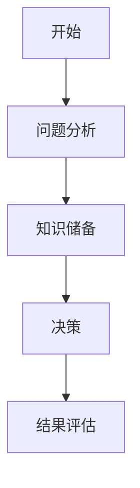

                 


# 巴菲特-芒格的新零售投资：线上线下融合的商业模式

## 关键词：巴菲特，芒格，新零售，线上线下融合，投资策略，商业模式

## 摘要：本文从巴菲特和芒格的投资哲学出发，探讨他们在新零售领域的投资策略，分析线上线下融合的商业模式，并结合实际案例，总结新零售投资的核心要素和未来趋势。

---

## 第一部分: 巴菲特与芒格的投资哲学

### 第1章: 巴菲特的价值投资与芒格的多元思维模型

#### 1.1 巴菲特的价值投资原则

- **核心概念**：巴菲特强调长期价值投资，寻找具有持续竞争优势的企业。
- **关键指标**：ROE（净资产收益率）、DCF（ discounted cash flow）模型。
- **案例分析**：可口可乐的投资案例，DCF模型的应用。
- **代码实现**：DCF模型的简单Python实现。
```python
def dcf_model(cash_flows, discount_rate, terminal_value):
    present_value = 0
    for cash_flow in cash_flows:
        present_value += cash_flow / (1 + discount_rate)**i
    present_value += terminal_value / (1 + discount_rate)**len(cash_flows)
    return present_value
```

#### 1.2 芒格的多元思维模型

- **核心概念**：芒格强调跨学科思维，将多个领域的知识结合起来。
- **关键工具**：概率思维、逆向思维。
- **案例分析**：伯克希尔 Hathaway 的投资决策过程。
- **系统架构**：用mermaid流程图展示芒格的决策过程。


#### 1.3 巴菲特与芒格投资理念的结合

- **协同效应**：巴菲特的长期价值投资与芒格的多元思维模型结合。
- **实际应用**：如何在新零售领域应用这一结合。

### 第2章: 新零售的定义与特点

#### 2.1 新零售的定义

- **线上与线下的融合**：不仅仅是销售渠道的扩展，更是用户体验的提升。
- **数据驱动的零售模式**：利用大数据分析消费者行为，优化库存管理。
- **体验驱动的零售模式**：通过线上线下互动，提升消费者体验。

#### 2.2 新零售的成功案例分析

- **亚马逊**：从在线书店到全渠道零售巨头。
- **沃尔玛**：从传统超市到数字化转型的领导者。
- **其他案例**：如盒马鲜生、拼多多等。

### 第3章: 巴菲特与芒格视角下的新零售投资策略

#### 3.1 巴菲特与芒格的投资策略

- **巴菲特的长期价值投资策略**：寻找具有持续竞争优势的企业。
- **芒格的多元化投资策略**：分散风险，利用多元思维模型进行决策。

#### 3.2 新零售领域的投资机会

- **线上零售的投资机会**：电子商务平台、物流配送等。
- **线下零售的投资机会**：实体店铺的数字化转型。
- **线上线下融合的投资机会**：整合线上线下资源，提升用户体验。

#### 3.3 巴菲特与芒格策略的现代意义

- **价值投资的现代应用**：如何在新零售领域寻找具有持续竞争优势的企业。
- **多元思维模型的实践应用**：如何利用跨学科知识进行新零售投资决策。

### 第4章: 新零售投资的数学模型与算法分析

#### 4.1 投资价值评估的数学模型

- **DCF模型**：详细解释现金流折现法，及其在新零售投资中的应用。
- **CAPM模型**：资本资产定价模型，用于评估投资风险和收益。

#### 4.2 数据分析与预测算法

- **时间序列分析**：用于预测零售市场的未来趋势。
- **聚类分析**：用于分析消费者行为，优化营销策略。

### 第5章: 新零售投资的系统架构与实现

#### 5.1 系统架构设计

- **模块划分**：数据采集、数据分析、投资决策、风险管理。
- **系统流程图**：用mermaid展示系统的整体架构。

#### 5.2 系统实现

- **数据采集**：从线上和线下渠道采集消费者行为数据。
- **数据分析**：利用Python进行数据清洗、建模分析。
- **投资决策**：基于分析结果，制定投资策略。
- **风险管理**：实时监控市场变化，调整投资组合。

### 第6章: 新零售投资的项目实战

#### 6.1 环境安装

- **工具安装**：安装Python、Pandas、Scikit-learn等工具。

#### 6.2 核心代码实现

- **数据清洗与建模**：用Python代码清洗数据，建立预测模型。
```python
import pandas as pd
from sklearn import linear_model

data = pd.read_csv('retail_data.csv')
X = data[['sales', 'cost']]
y = data['profit']

model = linear_model.LinearRegression()
model.fit(X, y)
print(model.coef_)
```

#### 6.3 案例分析

- **实际案例**：分析某新零售企业的投资价值。
- **详细解读**：从数据采集到投资决策的全过程。

### 第7章: 新零售投资的总结与展望

#### 7.1 投资总结

- **成功经验**：巴菲特和芒格的投资哲学在新零售中的应用。
- **风险管理**：如何在新零售投资中降低风险。

#### 7.2 未来展望

- **技术发展**：人工智能、大数据在新零售中的进一步应用。
- **市场趋势**：未来新零售市场的可能发展方向。

#### 7.3 最佳实践 Tips

- **长期投资**：坚持价值投资，避免短期波动。
- **多元化投资**：分散风险，利用多元思维模型进行决策。
- **持续学习**：关注市场变化，不断更新知识储备。

#### 7.4 小结

- **总结全文**：回顾文章的主要内容。
- **展望未来**：新零售投资的未来发展方向。

---

## 结论

巴菲特和芒格的投资哲学为新零售投资提供了宝贵的指导，线上线下融合的商业模式是未来零售业的发展趋势。通过数学模型和系统架构的分析，我们可以更好地理解新零售投资的核心要素，并在实际操作中应用这些策略。未来，随着技术的进步和市场的变化，新零售投资将变得更加复杂和多样化，投资者需要不断学习和适应，才能在激烈的竞争中立于不败之地。

