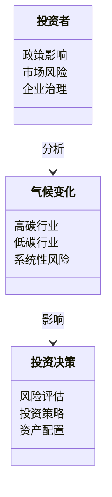
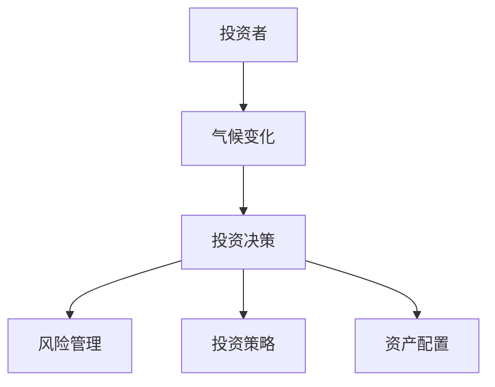

                 

# 巴菲特-芒格看气候变化：对投资决策的影响

> **关键词**：巴菲特，芒格，气候变化，投资决策，风险管理，价值投资，可持续发展

> **摘要**：本文探讨了气候变化对投资决策的影响，结合巴菲特和芒格的投资理念，分析了气候变化带来的风险与机会。通过详细分析高碳行业和低碳行业的投资策略，展示了如何在气候变化背景下优化投资组合。同时，本文还讨论了应对气候变化的投资机会，如绿色能源和技术创新，并提供了风险管理的最佳实践。

---

## 第一部分：巴菲特与芒格的投资理念

### 第1章：巴菲特与芒格的投资哲学

#### 1.1 巴菲特的价值投资理论
巴菲特的价值投资理论强调长期投资和企业基本面分析。他认为，投资应基于企业的内在价值，而非短期市场波动。这种理念在应对气候变化时尤为重要，因为气候变化的影响是长期且深远的。

#### 1.2 芒格的多元思维模型
芒格提倡多元思维模型，认为投资者应从多个角度分析问题，包括心理学、经济学和物理学等。这种思维方式帮助投资者更好地识别气候变化带来的机会和风险。

#### 1.3 两人合作的投资哲学
巴菲特和芒格的合作基于对价值投资的共同信仰和对风险管理的高度重视。他们的投资决策不仅考虑企业的盈利能力，还考虑其在长期趋势中的表现。

---

## 第二部分：气候变化的背景与影响

### 第2章：气候变化的科学背景

#### 2.1 气候变化的定义与成因
气候变化是由人类活动（如化石燃料的使用和森林砍伐）引起的全球变暖现象。这种变化对全球经济和生态系统产生深远影响。

#### 2.2 气候变化对全球经济的影响
气候变化可能导致极端天气事件增多，影响农业、能源和基础设施等行业。这些变化将影响企业的盈利能力和市场的稳定性。

#### 2.3 气候变化对企业经营的潜在风险
企业可能面临监管风险、声誉风险和财务风险。例如，高碳排放企业可能因政策变化而面临更高的合规成本。

---

## 第三部分：气候变化对投资决策的影响

### 第3章：气候变化对行业风险的影响

#### 3.1 高碳行业的风险评估
高碳行业（如煤炭和石油）面临政策风险和市场风险。随着全球转向可再生能源，这些行业的前景可能受到限制。

#### 3.2 低碳行业的投资机会
低碳行业（如太阳能和风能）具有较高的增长潜力。投资者应关注这些行业的技术创新和市场扩展。

#### 3.3 气候变化对金融市场的系统性风险
气候变化可能导致资产价格波动和市场崩盘。投资者需要评估其投资组合的韧性，以应对这些系统性风险。

---

## 第四部分：巴菲特与芒格对气候变化的视角

### 第4章：巴菲特对气候变化的看法

#### 4.1 巴菲特对传统能源行业的态度
巴菲特对传统能源行业的投资持谨慎态度。他认为，随着全球转向可再生能源，这些行业的长期前景可能不佳。

#### 4.2 巴菲特对可再生能源的投资策略
巴菲特积极投资于可再生能源项目。他认识到，可再生能源是未来能源转型的核心，具有长期增长潜力。

#### 4.3 巴菲特对气候变化的长期影响判断
巴菲特认为，气候变化将对全球经济产生深远影响。他建议投资者关注那些能够适应气候变化的企业。

### 第5章：芒格对气候变化与投资的思考

#### 5.1 芒格的长期投资视角
芒格认为，投资者应关注那些能够应对气候变化并从中获益的企业。他强调，气候变化是长期趋势，而非短期波动。

#### 5.2 芒格对气候变化与企业治理的关联
芒格认为，企业治理在应对气候变化中起着关键作用。他建议投资者关注企业的治理结构和管理层的环保意识。

#### 5.3 芒格对投资者心理与行为的影响
芒格指出，投资者在面对气候变化时，容易受到情绪影响。他建议投资者保持理性，避免盲目跟风。

---

## 第五部分：气候变化下的投资策略与风险管理

### 第6章：投资组合的重构与优化

#### 6.1 高碳资产的重新评估
投资者应重新评估其高碳资产的风险。对于那些难以适应气候变化的行业，投资者可能需要减少投资。

#### 6.2 低碳资产的投资机会
投资者应增加对低碳资产的投资。例如，可再生能源和电动汽车行业的投资具有较高的增长潜力。

#### 6.3 气候变化对资产价格的长期影响
气候变化将影响资产的长期价值。投资者应关注那些能够适应气候变化并从中获益的企业。

### 第7章：巴菲特与芒格的投资策略与实践

#### 7.1 巴菲特的投资策略

##### 7.1.1 巴菲特的选股标准
巴菲特选股注重企业的盈利能力和竞争优势。他认为，能够适应气候变化的企业更具投资价值。

##### 7.1.2 巴菲特对气候变化的应对策略
巴菲特建议投资者关注那些能够应对气候变化并从中获益的企业。他特别提到，可再生能源和绿色技术具有较高的投资潜力。

##### 7.1.3 巴菲特的经典投资案例分析
巴菲特投资于可再生能源企业，如NextEra Energy。他认为，这些企业在未来将具有较高的增长潜力。

#### 7.2 芒格的投资策略

##### 7.2.1 芒格的决策框架
芒格的决策框架基于多元思维模型。他认为，投资者应从多个角度分析问题，包括气候变化的影响。

##### 7.2.2 芒格的风险管理策略
芒格强调风险管理的重要性。他认为，投资者应避免过度集中在高风险行业，并分散投资以降低风险。

##### 7.2.3 芒格的经典投资案例分析
芒格投资于那些具有长期竞争优势的企业。例如，他投资于苹果公司，认为苹果在技术创新和市场定位方面具有竞争优势。

### 第8章：应对气候变化的投资机会

#### 8.1 可再生能源的投资机会

##### 8.1.1 太阳能与风能的投资前景
可再生能源行业具有较高的增长潜力。随着技术进步和成本下降，太阳能和风能的投资回报率将不断提高。

##### 8.1.2 气候变化对能源行业的长期影响
气候变化将推动能源行业向可再生能源转型。投资者应关注那些能够适应这一变化的企业。

#### 8.2 技术创新与可持续发展

##### 8.2.1 绿色技术的投资机会
技术创新是应对气候变化的关键。投资者应关注那些能够开发绿色技术的企业，如电动汽车和储能技术。

##### 8.2.2 可持续发展投资的潜力
可持续发展投资具有较高的社会和环境价值。投资者应关注那些能够实现可持续发展目标的企业。

---

## 第六部分：系统分析与架构设计方案

### 第9章：系统分析与架构设计方案

#### 9.1 问题场景介绍
气候变化对投资决策的影响是一个复杂的系统问题。投资者需要考虑多个因素，包括政策、市场和企业治理等。

#### 9.2 系统功能设计

##### 9.2.1 领域模型
领域模型展示了投资者在应对气候变化时需要考虑的核心要素，包括政策、市场和企业治理。

#### 9.3 系统架构设计

---

## 第七部分：项目实战与案例分析

### 第10章：项目实战与案例分析

#### 10.1 环境安装
投资者需要收集与气候变化相关的数据，包括政策、市场和企业治理信息。

#### 10.2 系统核心实现

##### 10.2.1 风险评估模型
风险评估模型用于评估气候变化对投资组合的影响。以下是一个简单的风险评估模型：

$$
\text{风险评分} = \sum_{i=1}^{n} (\text{权重}_i \times \text{风险因素}_i)
$$

##### 10.2.2 投资策略优化
投资策略优化模型用于确定最优资产配置。以下是一个优化模型：

$$
\min_{w} \sum_{i=1}^{n} w_i^2 \times \text{风险}_i
$$

##### 10.2.3 可视化工具
可视化工具用于展示气候变化对投资组合的影响。投资者可以使用图表和仪表盘来监控资产表现。

#### 10.3 案例分析

##### 10.3.1 高碳行业的风险评估
某高碳企业面临政策风险，可能导致其资产价值下降。投资者应重新评估对该企业的投资。

##### 10.3.2 低碳行业的投资机会
某可再生能源企业具有较高的增长潜力。投资者应增加对该企业的投资。

#### 10.4 项目小结
通过系统分析和案例分析，投资者可以更好地应对气候变化带来的挑战，并抓住其中的投资机会。

---

## 第八部分：最佳实践与未来展望

### 第11章：最佳实践与未来展望

#### 11.1 最佳实践 tips
- 投资者应关注气候变化的长期影响，并调整其投资策略。
- 投资者应分散投资，以降低气候变化带来的系统性风险。
- 投资者应关注那些能够适应气候变化并从中获益的企业。

#### 11.2 投资策略的未来展望
未来，气候变化将继续影响投资决策。投资者应关注那些能够实现可持续发展目标的企业，并利用技术创新应对气候变化。

#### 11.3 气候变化与投资的未来趋势
气候变化将推动全球经济向低碳转型。投资者应关注那些在这一转型中具有竞争优势的企业。

---

## 第九部分：总结

### 第12章：总结

#### 12.1 核心观点回顾
气候变化对投资决策的影响是长期且深远的。投资者应结合巴菲特和芒格的投资理念，优化其投资组合。

#### 12.2 对未来投资者的建议
投资者应关注气候变化的长期影响，并调整其投资策略。他们应分散投资，以降低气候变化带来的系统性风险，并关注那些能够适应气候变化并从中获益的企业。

#### 12.3 拓展阅读
- 巴菲特和芒格的著作
- 气候变化相关的学术研究
- 可持续发展投资的最新动态

---

通过以上分析，我们可以看到，气候变化对投资决策的影响是复杂且深远的。投资者应结合巴菲特和芒格的投资理念，优化其投资组合，并关注那些能够适应气候变化并从中获益的企业。只有这样，投资者才能在未来的市场中立于不败之地。

